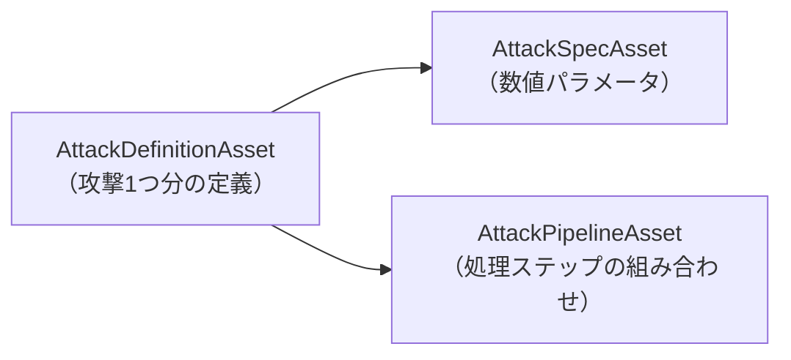
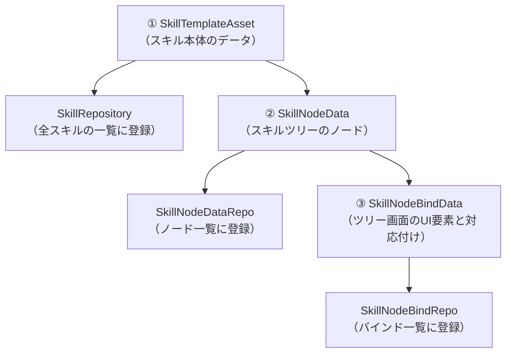

# 🎮 マスターデータ運用ガイド（プランナー向け）

> 💡 **このドキュメントについて**
> このドキュメントは、プログラマー向けの設計書とは別に、**プランナーがコードを触らずにゲームのマスターデータ（ステージ・スキル・敵・ミッション等）を追加・変更・削除する方法**をまとめたものです。Unityエディタでの操作を前提にしています。

---

## 📋 前提知識

### マスターデータとは

このゲームのステージ構成・敵の強さ・スキル内容・ミッション条件などは、**ScriptableObject**というUnityのデータアセットとして管理されています。ほとんどの調整はC#のコードを一切書かず、Unityエディタ上でこれらのアセットを作成・編集するだけで完結します。

マスターデータの実体は `Assets/Level/Data/Master/` 以下にあります。新しいアセットを作る際は、既存の近いアセットと同じフォルダに保存してください。

### アセットの作り方（共通操作）

1. Unityエディタのプロジェクトウィンドウで、保存したいフォルダを右クリック
2. `Create` メニューから、このドキュメントに記載された **メニューパス**（例: `KillChord/Mission/MissionDefinition`）を選択
3. 生成されたアセットの名前を分かりやすいものに変更する（例: `Mission_Stage05`）
4. インスペクターで各項目を設定する
5. 必要に応じて、後述の「一覧アセットへの登録」を行う

### 「プランナーメモ」欄について

多くのアセットには `プランナーメモ` という、ゲームには一切影響しないメモ欄が用意されています。仕様の意図や調整履歴を書き残す用途で自由に使ってください。

### ⚠️ 「要エンジニア」の表記について

このガイドでは、**プランナーだけで完結する作業**と、**エンジニアにコード変更を依頼する必要がある作業**を明確に分けて記載しています。後者には次のマークを付けています。

> 🔧 **要エンジニア**: プログラマーへの依頼が必要な作業です。

---

## ① ステージを増やす時

新しいステージ（バトル or シナリオ）をステージマップに追加する手順です。

### 手順

1. **ステージノードを作成する**
   - フォルダ: `Assets/Level/Data/Master/OutGame/StageSelect/Stages/`
   - メニュー: `KillChord/StageSelect/StageNodeAsset`
   - 主な設定項目:

     | 項目 | 内容 |
     | --- | --- |
     | ステージを一意に識別するID | 他のどのステージノードとも重複しない整数。**重複するとゲーム起動時にエラーで停止します** |
     | ステージの種類 | `Battle`（戦闘） or `Scenario`（会話・カットシーン） |
     | ゲーム開始時点でこのノードを解放済みにする | ツリーの起点となるステージのみオンにする |
     | 初回起動時に自動出撃するチュートリアルステージの場合はオンにします | ツリー全体で**1つのステージのみ**オンにできる（複数設定するとエラー） |
     | ステージ名 / ステージのフレーバーテキスト | マップ画面に表示される名称・説明文 |
     | 遷移先のシーン名 | 通常は`InGame`のままでよい |
     | バトルパートで遷移するステージシーン名（Battleのみ） | 背景の異なるステージシーン（`Stage_01`等）を選択。シナリオの場合は空欄 |
     | バトルパートで使用する敵Wave定義のAddressablesキー（Battleのみ） | ②で作成するWave定義アセットの**Addressableアドレス文字列**（後述） |
     | シナリオパートで再生するシナリオId（Scenarioのみ） | Scenarioモジュール側で定義したシナリオID |
     | スキル編成・強化に使用するポイント／スキル解放・パラメーター強化に使用するポイント | クリア報酬 |
     | バトルパートのミッション定義アセット（Battleのみ） | ⑤で作成する`MissionDefinitionAsset`を割り当てる |

2. **（Battleの場合）敵Wave定義を用意する** — ③を参照
3. **（Battleの場合）ミッション定義を用意する** — ⑤を参照
4. **ステージツリーへ登録する**
   - `Assets/Level/Data/Master/OutGame/StageSelect/` の `StageTreeAsset` を開く
   - 「ノード一覧」に①で作ったノードを追加
   - 前提関係がある場合は「接続情報」に「接続元のステージID」→「接続先のステージID」を追加する（解放条件のUIアニメーションに使われます）

### ⚠️ 注意点
- ステージIDの重複、チュートリアルステージの重複設定は、`StageTreeAsset`をインスペクターで編集した時点でコンソールにエラー表示されます（保存前に必ず確認してください）。
- Battleステージなのに敵Wave定義キーが空欄の場合、**ゲーム起動時に例外が発生します**（データ作成時にはエラーが出ないため見落としやすい項目です）。

### 🔧 要エンジニア
- ステージシーン（背景・地形そのもの）を新規に作る場合は、Unityシーンの作成・配置が必要なため、シーン担当のエンジニア/背景デザイナーに依頼してください（本ガイドはデータアセットの範囲のみを扱います）。

---

## ② 敵の出現（Wave）を組む・敵を調整する時

### 敵Wave定義（そのステージに何がどれだけ出るか）

- フォルダ: `Assets/Level/Data/Master/InGame/Enemy/`
- メニュー: `KillChord/Enemy/EnemyWaveDefinitionAsset`
- 構成: 「1Wave分の定義」のリストで、Waveごとに以下を設定します。

  | 項目 | 内容 |
  | --- | --- |
  | 敵種類ごとの定義 | 「敵種類」（`Infantry`歩兵 / `Artillery`砲兵の2種類のみ）と「敵の生成数」（0〜20）の組み合わせを複数設定 |
  | Waveの継続時間(秒) | 0〜1800秒。この時間が経過すると敵が残っていても次Waveへ強制的に進む |
  | Wave開始時に音楽同期で実行するステージ演出 | ⑥で作成する演出アセットをここに追加する（任意） |
  | 全Wave終了後、繰り返して生成するか／繰り返す場合の開始Index | ループ設定 |

- 作成後、このアセットに **Addressableアドレスを設定**し、そのアドレス文字列を①のステージノードの「敵Wave定義のAddressablesキー」へ入力してください（プロジェクトウィンドウでアセットを選択→インスペクター上部の「Addressable」にチェック→アドレス欄に文字列を入力）。

### 個々の敵の強さ（既存の敵タイプを調整する場合）

敵1体ごとの強さは、その敵プレハブが参照する以下のアセット群で決まります（プレハブ自体の差し替えはエンジニア/デザイナー領域です。数値調整はプランナーのみで可能）。

| アセット | メニュー | 内容 |
| --- | --- | --- |
| `CharacterDefinitionAsset` | `KillChord/Character/CharacterDefinitionAsset` | 名前、攻撃硬直時間、最大体力、基本ダメージ、使用する攻撃定義リスト |
| `EnemyMoveSpecAsset` | `KillChord/Runtime/Enemy/EnemyMoveSpecAsset` | 移動速度、最小/最大攻撃距離（**最小≦最大でないとエラー**） |
| `EnemyMusicSpecAsset` | `KillChord/Runtime/Enemy/EnemyMusicSpecAsset` | 攻撃のリズム同期タイミング（小節フラグ・拍子・拍目） |
| `ShellAttackSpecAsset`（砲兵のみ） | `KillChord/Runtime/Enemy/ShellAttackSpecAsset` | 爆発半径（0〜32のスライダー） |

攻撃そのものの中身（ダメージ量・クリティカル率等）は③「攻撃を作る・調整する」を参照してください。

### ボスの攻撃パターンを設定する

| アセット | メニュー | 内容 |
| --- | --- | --- |
| `BossAttackEntryAsset` | `KillChord/Runtime/Enemy/BossAttackEntryAsset` | ボスの攻撃種別、対応する攻撃定義のインデックス（`CharacterDefinitionAsset`の攻撃リストの何番目か）、音楽同期情報 |
| `BossAttackEntryRepo` | `KillChord/Runtime/Enemy/BossAttackEntryRepo` | 上記の集合。**空欄のスロットがあるとコンソールに警告が出ます** |

### 🔧 要エンジニア
- `Infantry`/`Artillery`以外の**新しい敵種類**を追加する場合（見た目だけでなく、AIの挙動が根本的に異なる新カテゴリを作る場合）。
- 既存の攻撃演出にない**新しい攻撃処理そのもの**を作る場合（③を参照）。

---

## ③ 攻撃・ダメージ計算を作る・調整する時

プレイヤー・敵に共通する「攻撃」は3つのアセットの組み合わせで構成されます。

| アセット | メニュー | 内容 |
| --- | --- | --- |
| `AttackSpecAsset` | `KillChord/Attack/AttackSpecAsset` | クリティカルヒットの確率、クリティカルダメージの倍率、確定ダメージ |
| `AttackPipelineAsset` | `KillChord/Attack/AttackPipelineAsset` | 「攻撃ステップ」をドロップダウンから選んで**好きな順番で組み合わせる**リスト（既存: `BeatStep`＝ビート同期ダメージ補正、`CriticalStep`＝クリティカル抽選） |
| `AttackDefinitionAsset` | `KillChord/AttackDefinitionAsset` | 攻撃名、上記2つのアセットへの参照、ジャストダメージ倍率、ビートタイプを使うか／使う場合のビートタイプ |

作成した`AttackDefinitionAsset`は、②の`CharacterDefinitionAsset`の「攻撃定義リスト」に追加することでキャラクターが使用できるようになります。

### ⚠️ 注意点
- `AttackSpecAsset`・`AttackPipelineAsset`への参照を設定し忘れると、**インスペクター上ではエラーが出ず、実行時に初めて例外が発生します**。作成したら必ず両方を割り当てたか確認してください。
- 「ビートタイプを使用する」をオンにした場合、指定するビートタイプの値が正しい範囲でないと実行時にエラーになります。

### 🔧 要エンジニア
- `BeatStep`/`CriticalStep`以外の**新しい攻撃処理の種類**（例: 「一定確率で追加攻撃が発生する」等）を追加したい場合、`IAttackStep`を実装する新しいC#クラスが必要です。一度実装されれば、それ以降はプランナーが`AttackPipelineAsset`のドロップダウンから自由に選んで組み合わせられます。

---

## ④ プレイヤーのステータス・操作性を変更する時

| アセット | メニュー | 内容 |
| --- | --- | --- |
| `CharacterDefinitionAsset`（プレイヤー用） | `KillChord/Character/CharacterDefinitionAsset` | 最大体力・基本ダメージ・攻撃硬直時間・使用する攻撃リスト（②と共通の仕組み） |
| `PlayerMoveSpecAsset` | `KillChord/InGame/PlayerMoveSpecAsset` | 通常移動速度、攻撃した際の回転速度、回避移動速度、回避継続時間、回避クールダウン時間、攻撃クールダウン時間 |

これらは既存アセットの数値を書き換えるだけで反映されます。コード変更は不要です。

### 🔧 要エンジニア
- プレイヤーの根本的な操作方法（新しいアクションボタンの追加等）を変える場合。

---

## ⑤ ミッション（クリア条件・サブミッション）を設定する時

1ステージにつき1つの`MissionDefinitionAsset`を作成します。

- フォルダ: `Assets/Level/Data/Master/OutGame/StageSelect/Mission/`
- メニュー: `KillChord/Mission/MissionDefinition`

| 項目 | 内容 |
| --- | --- |
| ミッションを一意に識別するID | 他と重複しない文字列 |
| ミッションの表示名 / ミッションHUDに表示される説明文 | UI表示用 |
| 敗北時に表示する攻略Tips一覧 | 複数登録するとランダムで1つ表示される |
| **クリア条件** | ドロップダウンから1つ選択: 「生存時間」「特定の敵の撃破数」、または「AND/OR」で複数条件を組み合わせも可能 |
| **失敗条件** | 同様にドロップダウンで選択: 「制限時間超過」「プレイヤー死亡」等 |
| **評価条件（サブミッション）** | リストに複数追加可能。既存の種類: クリアタイム、被ダメージ量、コンボ数、使用武器種類数 |

サブミッション（評価条件）は**重複ありで3件設定**すると、達成数に応じてリザルト画面でC/B/A/Sランクが算出されます（0件→C、1件→B、2件→A、3件→S）。

「特定の敵の撃破数」条件を使う場合は、`Assets/Level/Data/Master/InGame/Mission/`（対象ディレクトリが無ければ作成）に`EnemyMissionKeyAsset`を作成し、条件アセットへ割り当ててください。

### ⚠️ 注意点
- 評価条件のIDが空欄、または他の評価条件と重複していると、**ゲーム起動時にエラーで停止します**。

### 🔧 要エンジニア
- 上記以外の**新しい種類のクリア条件・失敗条件・評価条件**を作りたい場合（例: 「特定アイテムを入手する」等）、対応するC#クラスの実装が必要です。一度実装されれば、以降はプランナーがドロップダウンから選ぶだけで使えるようになります。

---

## ⑥ ステージ演出（爆発・建物倒壊等）を追加する時

Wave開始時にBGMと同期して発生する演出です。

- 対象アセット: `ExplosionStageEffectAsset`（爆発）/ `BuildingCollapseStageEffectAsset`（建物倒壊）/ `ObstacleStageEffectAsset`（障害物発生）
- 作成場所: ②の「敵Wave定義」アセットを開き、Wave単位の「Wave開始時に音楽同期で実行するステージ演出」リストへ、`+`ボタンから種類を選んで直接追加します（単独のアセットファイルとしては作らず、Wave定義の中に埋め込む形式です）。

| 項目 | 内容 |
| --- | --- |
| StageEffectView側の演出と対応するID | 演出側（VFX/Timeline等）で用意されているIDと一致させる。詳細はデザイナー/エンジニアに確認してください |
| 0は現在小節、1は次小節で実行します | 音楽同期のタイミング |
| 演出を同期する拍子 | 通常は4のままでよい |
| 小節内で演出を実行する拍 | 何拍目で発生させるか |

インスペクター上に自動生成される「設定内容の要約」欄で、現在の設定を一目で確認できます。

### ⚠️ 注意点
- 音楽同期の値（小節フラグ・拍子・拍目）が不正な組み合わせだと、実行時にエラーになります。

### 🔧 要エンジニア
- 上記3種類以外の**新しい演出の種類**を追加する場合、対応するC#クラスと実際の演出（VFX/Timeline）の実装が必要です。

---

## ⑦ スキルを作る時

スキル追加は本ガイドの中で最も工程が多く、**エンジニアの協力が必須になる場面が多い**分野です。事前によく確認してから着手してください。

### 全体像

### 手順

1. **スキル本体を作る**
   - フォルダ: `Assets/Level/Data/Master/Skill/Templates/`
   - メニュー: `Game/SkillTemplate`
   - 設定項目:

     | 項目 | 内容 |
     | --- | --- |
     | スキルID | 他と重複しない整数 |
     | 入力パターン | リズム入力コマンドの並び（`One`/`Two`/`Three`/`Four`/`Six`/`Eight`から選択） |
     | クールダウン時間（小節単位の分子・分母） | 例: 分子2, 分母1 なら「2小節」 |
     | **スキル効果の識別子** | 既存の効果（`Skill00`〜`Skill13`の一部）からドロップダウンで選択。**⚠️新しい効果を選ぶことはできません（下記参照）** |
     | スキル対象の解決ルール | `自分` / `現在のロックオン対象` / `前方エリア` / `現在ロックオン対象を含む前方直線`等、既存の中から自由に選択可（コード変更不要） |
     | スキル発動時に再生するアニメーションキー | 空欄なら通常攻撃アニメーションを使用 |

2. **スキル一覧へ登録する**
   - `Assets/Level/Data/Master/Skill/Repositories/` の `SkillRepository` を開き、①のアセットをリストに追加する

3. **スキルツリーのノードを作る**
   - フォルダ: `Assets/Level/Data/Master/OutGame/SkillTree/SkillNodeData/`
   - メニュー: `SymphonyDev/SkillTree/SkillNodeData`
   - 設定項目: ノードID（重複不可）、前提ノードID（複数可）、解放に必要な研究ポイント、ノード詳細テキスト、プレビュー動画（任意）、**このノードで解放されるスキル**（①のアセットを割り当て）
   - 作成後、`Assets/Level/Data/Master/OutGame/SkillTree/` の `SkillNodeDataRepo` へ登録する

4. **ツリー画面のUI要素と対応付ける**
   - フォルダ: `Assets/Level/Data/Master/OutGame/SkillTree/SkillNodeBindData/`
   - メニュー: `SymphonyDev/SkillTree/SkillNodeBindData`
   - 対応するUI Toolkit画面上の要素名、接続線の要素名を設定します。**この画面レイアウトは事前にUI担当が用意している必要があります**（新しいノードの見た目の配置を追加する場合は、先にUI担当へ相談してください）
   - 作成後、`SkillNodeBindRepo` へ登録する
   - 新しい階層（フェーズ）を追加する場合のみ、同様に `SkillNodePhaseBindData` を作成し `SkillNodePhaseBindDataRepo` へ登録する

### 🔧 要エンジニア（スキルで特に多いパターン）

- **新しいスキル効果を作る場合（最重要）**: 「スキル効果の識別子」は既存の登録済みリストからしか選べません。全く新しい効果（新しい弾を撃つ、新しい回復量、新しい演出）を作る場合、エンジニアが新しい効果クラスを実装し、識別子リストに登録する必要があります。**この登録が終わるまで、プランナーは新スキルの動作を確認できません。**
- **既存スキルの威力・回数などの微調整も現状は要エンジニア**: `SkillTemplateAsset`にはダメージ倍率やヒット回数などの数値項目が無く、これらは効果クラス内にプログラムの数値として直接書かれています。「このスキルをもう少し弱くしたい」といった調整も、現状はエンジニアへの依頼が必要です。
- 新しく登録したスキルをゲーム開始時点から所持・装備済みにしたい場合、初期所持リストへのID追加はコード変更が必要です。

---

## 📚 早見表: エンジニアへの依頼が必要になる主なケース

| ケース | 理由 |
| --- | --- |
| 新しい攻撃処理の種類を追加する（③） | `IAttackStep`の新規実装が必要 |
| 新しいクリア条件・失敗条件・評価条件の種類を追加する（⑤） | 対応するC#クラスの新規実装が必要 |
| 新しいステージ演出の種類を追加する（⑥） | 対応するC#クラスと演出本体の実装が必要 |
| 新しい敵の種類（歩兵・砲兵以外）を追加する（②） | AI・スポナーのコード変更が必要 |
| **新しいスキル効果を作る、または既存スキルの威力等を数値調整する（⑦）** | 効果はC#クラスとして直書きされており、現状データだけでは新規追加も微調整もできない |
| 新しく作ったスキルを初期所持・初期装備にしたい（⑦） | セーブデータの初期値がコードに直書きされている |
| スキルツリーの新しいノード配置・接続線のUIレイアウトを追加する（⑦） | UI Toolkitの画面レイアウト作業が必要 |
| 新しいステージシーン（背景）を作る（①） | シーン制作が必要 |

一方で、**既存の種類の範囲内でのアセット新規作成・数値変更・組み合わせ**（ステージ追加、ミッション条件の設定、敵の強さ調整、攻撃パラメータ調整、プレイヤーのステータス調整、演出のタイミング調整）は、すべてプランナーの操作のみで完結します。
