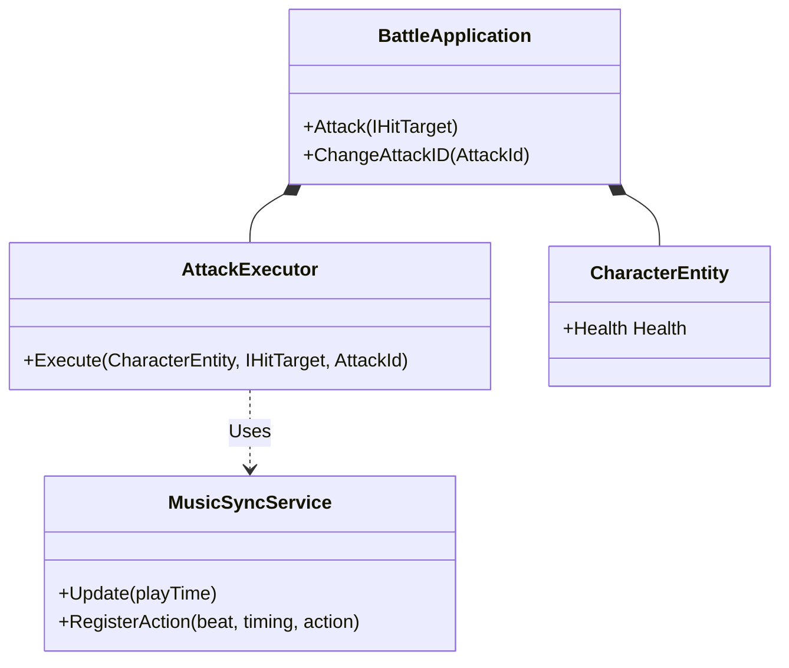

# InGame 機能構造

InGame は、ゲームプレイ中の主要なロジック（バトル、音楽同期、キャラクター制御、カメラなど）を担当します。

## レイヤー構造

### 1. Domain (コアロジック)
純粋なビジネスロジックとエンティティを定義します。Unity に依存しないコードが中心です。
- **Battle**: `AttackId`, `AttackDefinition`, `AttackResult` などの戦闘概念。
- **Character**: `CharacterEntity`, `Health`, `Damage` など。
- **Music**: `RhythmState`, `RhythmDefinition`, `ScheduledAction` など。
- **Enemy/Player**: 移動スペックやパラメータ定義。

### 2. Application (ユースケース)
Domain オブジェクトを組み合わせて具体的なユースケースを実現します。
- **Battle**: `BattleApplication`, `AttackExecutor`, `AttackPipeline`。
- **Music**: `MusicSyncService` (音ゲー要素の同期ロジック)。
- **Camera/Player/Enemy**: 移動や攻撃の具体的な実行ロジック。

### 3. Adaptor (インターフェース変換)
Application レイヤーと外部（View/Infra）を橋渡しします。
- **Controller**: 入力やイベントを受けて Application を呼び出す (`BattleController`, `PlayerController`)。
- **Presenter/ViewModel**: View に表示するためのデータを整形する (`AttackResultPresenter`, `IMusicSyncViewModel`)。

### 4. View (表示・演出)
Unity の GameObject や UI を制御します。
- **PlayerView**, **EnemyMoveView**: 3Dモデルの制御。
- **IngameHudView**, **MusicSyncView**: UI の表示。

### 5. InfraStructure (外部実装)
データの保存や特定のライブラリの実装を提供します。
- **Factory**: `CharacterFactory`, `EnemyFactory` による生成。
- **Config**: `PlayerConfig`, `CameraSystemConfig` などの ScriptableObject。

### 6. Composition (初期化・注入)
各レイヤーのオブジェクトを生成し、依存関係を注入します。
- **Initializer**: `BattleCompositionInitializer`, `MusicSyncInitializer` など。

## 構造図 (Mermaid)

### バトルと音楽同期の連携

```mermaid
graph TD
    subgraph Adaptor
        PC[PlayerController]
        BC[BattleController]
    end

    subgraph Application
        BA[BattleApplication]
        AE[AttackExecutor]
        MSS[MusicSyncService]
    end

    subgraph Domain
        CE[CharacterEntity]
        RS[RhythmState]
    end

    PC --> BC
    BC --> BA
    BA --> AE
    AE --> CE
    MSS --> RS
    AE -.-> MSS : 音楽同期の要求
```

### クラス構成の詳細 (InGame)


