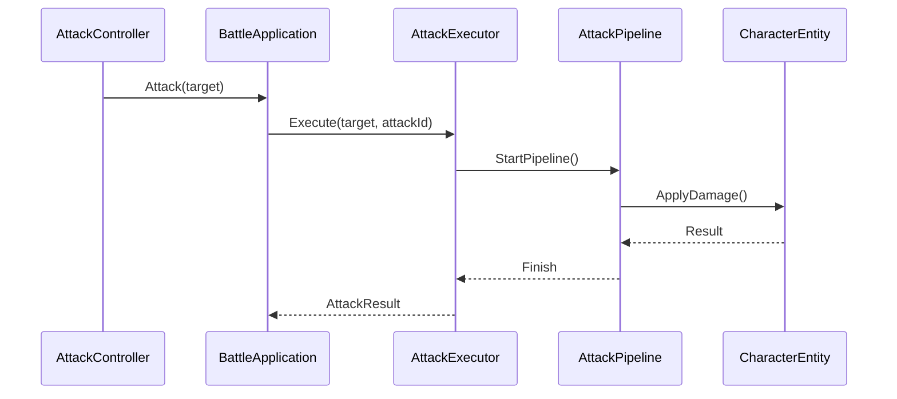

# InGame-Battle

InGame カテゴリーにおけるバトル機能のモジュール詳細。

## 構造概要

バトル機能は、攻撃の定義（AttackDefinition）、攻撃の実行（AttackExecutor）、および攻撃プロセスの制御（AttackPipeline）を中心に構成されています。

### 1. Domain
- **AttackId**: 攻撃を識別するための値。
- **AttackDefinition**: 攻撃のパラメータ（威力、範囲など）を定義するエンティティ。
- **AttackResult**: 攻撃の結果（ダメージ量、ヒットの成否など）を表す値オブジェクト。
- **IHitTarget**: 攻撃対象が実装すべきインターフェース。

### 2. Application
- **BattleApplication**: バトル関連の主要なユースケースを提供。
- **AttackExecutor**: 実際に攻撃を実行し、ダメージ計算などを行う。
- **AttackPipeline**: 攻撃の一連の流れ（予備動作、ヒット、硬直など）を制御する。
- **IAttackStep**: パイプライン内の各ステップを表すインターフェース。

### 3. Adaptor
- **BattleController**: バトルアクションの実行、状態遷移の管理。
- **AttackController**: 攻撃コマンドの受付と Application レイヤーへの委譲。
- **AttackResultPresenter**: バトル結果を View 用の DTO（AttackResultDTO）に変換。
- **AttackCommandState**: 現在の攻撃コマンドの状態を管理。

### 4. View
- **AttackResultView**: 攻撃結果（ヒット演出、ダメージ数値表示など）の描画。
- **AttackResultViewModel**: View が表示に使用するデータの保持。

### 5. InfraStructure
- **AttackDefinitionData**: ScriptableObject 等を用いた攻撃定義の実装。
- **AttackPipelineResolver**: 攻撃 ID に対応するパイプラインを解決する。

### 6. Composition
- **BattleCompositionInitializer**: バトル関連のコンポーネントの生成と依存性注入を行う。

## クラス間連携図 (Mermaid)

