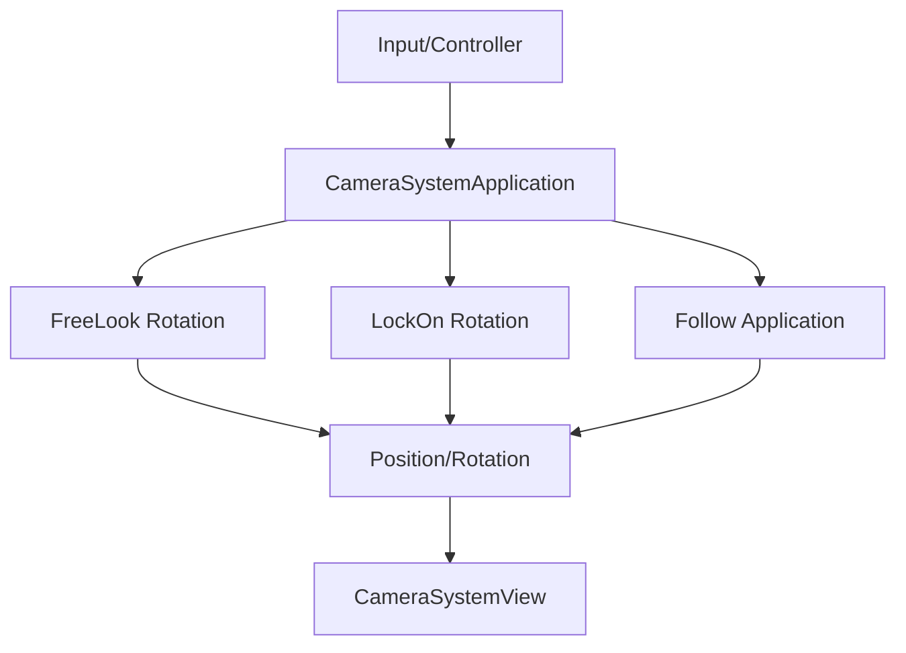

# InGame-Camera

InGame カテゴリーにおけるカメラ制御機能のモジュール詳細。

## 構造概要

カメラ機能は、複数の回転ロジックや追従ロジックを独立した Application クラスとして実装し、それらを `CameraSystemApplication` で統合・選択して実行する構造になっています。

### 1. Domain
- **CameraParameter**: 単一のカメラ設定（FOV、距離など）。
- **CameraSystemParameter**: カメラシステム全体の設定データ。

### 2. Application
- **CameraSystemApplication**: 各種カメラロジック（回転、追従）を管理し、最終的なカメラの姿勢を計算する司令塔。
- **CameraRotationApplication**: カメラの回転ロジックの基底。
- **CameraBoneFreeLookRotationApplication**: プレイヤーの入力に基づいた自由な視点回転。
- **CameraBoneLockOnRotationApplication**: 特定のターゲットを注視し続ける回転。
- **CameraFollowApplication**: ターゲットへの追従ロジック。
- **CameraFollowVelocityApplication**: 速度に基づいた追従（ラグや慣性）の計算。

### 3. Adaptor
- **CameraSystemController**: 入力（スティック操作、ターゲット切り替え）を受け取り、CameraSystemApplication へ伝達。

### 4. View
- **CameraSystemView**: 計算されたトランスフォームを実際の Unity の Camera や Cinemachine などのオブジェクトに適用する。

### 6. Composition
- **CameraSystemInitializer**: カメラシステムの各コンポーネントを組み立てる。
- **CameraSystemParameterDebug**: インスペクター等からカメラパラメータをライブ編集するためのデバッグ支援。

## カメラ計算のパイプライン (Mermaid)

