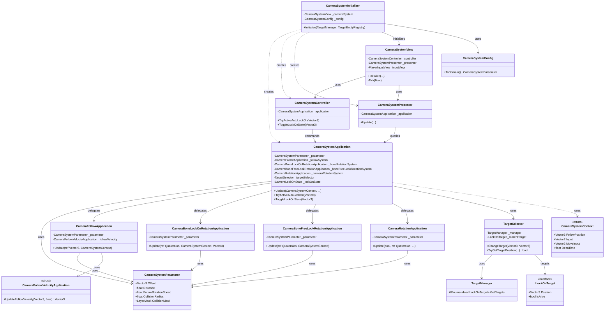

# InGame-Camera

カメラ制御モジュールです。追従、フリールック、ロックオン、遮蔽物による距離補正を `CameraSystemApplication` が統合します。

## 構造概要

### 1. Domain
- **CameraSystemParameter**: カメラの基本設定（オフセット、距離、回転速度、衝突判定設定、ピッチ角制限など）。
- **CameraLockOnState**: ロックオン状態（Free, LockOnManual, LockOnAuto）を定義する Enum。
- **ILockOnTarget**: ロックオン対象が実装すべきインターフェース。

### 2. Application
- **CameraSystemApplication**: カメラ全体のステート管理と更新フローの統合。ロックオン状態の遷移や距離補正の最終計算を行います。
- **CameraFollowApplication**: 注視対象の移動慣性に基づいた、注視点（CameraCenterOffset）の動的オフセット計算。
- **CameraFollowVelocityApplication**: 注視対象の移動速度を計算する補助構造体。
- **CameraRotationApplication**: カメラ自体の回転制御。プレイヤー位置とターゲット位置の補間などを行います。
- **CameraBoneFreeLookRotationApplication**: 非ロックオン時の入力によるボーン（方位・仰角）の回転。
- **CameraBoneLockOnRotationApplication**: ロックオン時のターゲット追従ボーン回転。遊び（Margin）を持たせた追従を行います。
- **TargetSelector**: ロックオン対象の選択ロジック（カメラ前方との角度優先、次点で距離優先）。
- **TargetManager**: 登録された全ロックオン対象のリスト管理。
- **TargetEntityRegistry**: ロックオン可能なエンティティの登録管理。
- **CameraSystemContext**: 入力、DeltaTime、現在の注従位置など、1フレームの更新に必要な文脈データ。

### 3. Adaptor
- **CameraSystemController**: View層からの要求（自動ロックオン開始、ロックオン切り替え）を Application へ伝達。
- **CameraSystemPresenter**: Application から算出された計算結果を保持し、View が参照できるようにします。
- **TargetSelectorController**: 外部からターゲットの変更を要求するためのコントローラー。
- **TargetEntityRegistryController**: ターゲットの登録・解除を制御するコントローラー。
- **LockOnTargetGateway**: `ILockOnTarget` へのアクセスをカプセル化。

### 4. View
- **CameraSystemView**: Unity の `Transform` への最終的な位置・回転の反映。
    - `PlayerInputView` からの入力を購読し、`Update`, `FixedUpdate`, `LateUpdate` のいずれかで `Tick` を実行します（`UpdateMode` で切り替え可能）。
    - 攻撃入力（`OnAttack`）時にオートロックオンを試行し、ロックオン入力（`OnLockOnInput`）時にマニュアルロックオンをトグルします。
    - インスペクターからカメラ感度（`_cameraSensitivity`）を調整可能です。

### 5. InfraStructure
- **CameraSystemConfig**: Inspector で設定可能な `ScriptableObject`。Domain 層のパラメータへ変換。

### 6. Composition
- **CameraSystemInitializer**: 各コンポーネントの生成と依存関係の注入。
- **CameraSystemParameterDebug**: 実行中に GUI でパラメータを調整し、Domain モデルへ即時反映するためのデバッグ用コンポーネント。

## クラス図

## 実装の詳細メモ

### ロックオン状態の遷移
- **LockOnAuto**: 攻撃などのアクション時に自動的にターゲットを向く状態。スティック入力（カメラ操作）または移動入力があると、即座に `Free` 状態へ遷移して操作をプレイヤーに返します。
- **LockOnManual**: プレイヤーの明示的なロックオン操作による状態。ターゲットが死亡するか、再度操作されるまで維持されます。

### 距離補正と衝突判定
- `Physics.SphereCast` を使用してカメラと注視点の間の遮蔽物を検知します。
- 衝突が検知された場合、即座に距離を短縮して壁抜けを防止します。
- 衝突が解消された際は、`Mathf.Lerp` を用いて設定された `Distance` まで滑らかに復帰します（`UpdateDistance`）。

### 入力反転
- `UNITY_STANDALONE_WIN` 環境において、垂直・水平方向の入力反転フラグ（`IsInvertVertical`, `IsInvertHorizontal`）をサポートしています。

### 動的オフセット
- `CameraFollowApplication` により、プレイヤーの移動方向と逆方向に注視点をわずかにずらす（オフセット）ことで、進行方向の視界を広く保つ動的な演出が組み込まれています。
