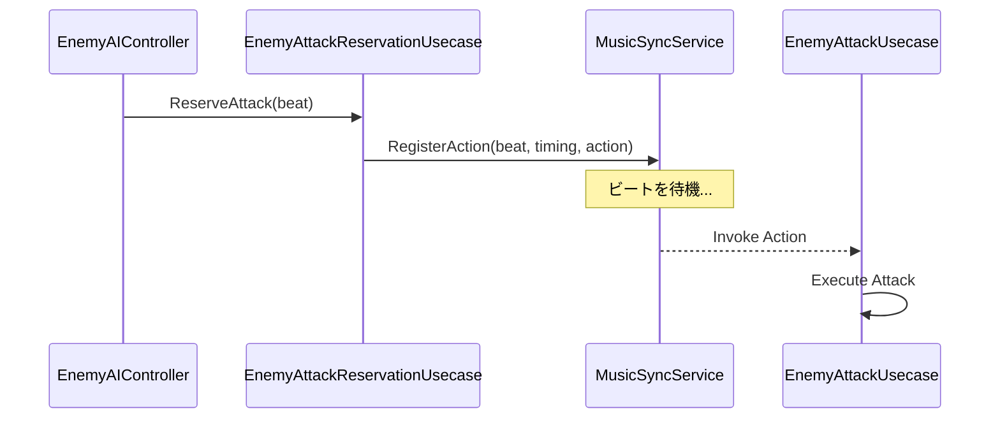

# InGame-Enemy

InGame カテゴリーにおける敵キャラクターの制御機能のモジュール詳細。

## 構造概要

敵キャラクターの機能は、AI による意思決定、移動制御、および音楽同期と連携した攻撃予約（Reservation）システムで構成されています。

### 1. Domain
- **EnemyMoveDecision**: 敵の移動先やタイミングの決定に関するデータ構造。
- **EnemyMoveSpec**: 敵の移動特性（速度、加速など）の定義。
- **EnemyMusicSpec**: 敵の行動が音楽とどのように同期すべきかの定義（攻撃タイミングなど）。
- **EnemyAttackMusicSpec**: 攻撃時のリズムパターンの定義。

### 2. Application
- **EnemyMoveUsecase**: 敵の移動指示（目的地への到達など）を処理。
- **EnemyAttackUsecase**: 敵の攻撃実行を処理。
- **EnemyAttackReservationUsecase**: **音楽同期エンジン（MusicSyncService）と連携し、特定のビートで攻撃が発生するように予約を行う。**
- **IEnemyNavigationAgent**: ナビゲーション（経路探索）機能の抽象。

### 3. Adaptor
- **EnemyAIController**: 敵の AI ロジック。状態を監視し、適切な Application のユースケースを呼び出す。
- **EnemyBattleState**: 敵の戦闘に関する現在の状態（待機、追跡、攻撃中など）を管理。
- **EnemyMoveInstruction**: 移動指令を View レイヤーに渡すための変換。

### 4. View
- **EnemyMoveView**: 敵の GameObject やアニメーターを制御し、実際の移動を視覚化する。

### 6. Composition
- **EnemyTestSpawner**: 敵の生成と初期化を担当。
- **EnemyMoveDebugInitializer**: デバッグ用の移動初期化ロジック。

## 攻撃予約のシーケンス (Mermaid)

