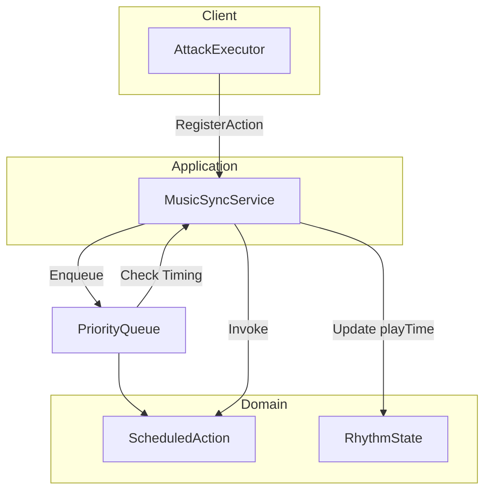

# InGame-Music

InGame カテゴリーにおける音楽同期（リズムアクション）機能のモジュール詳細。

## 構造概要

音楽同期機能は、再生中の音楽のビート（Beat）とゲーム内アクションを同期させるための中心的なロジックです。

### 1. Domain
- **RhythmDefinition**: 楽曲のBPMや拍子、ビートごとの特性を定義するデータ。
- **RhythmState**: 現在のビート数、再生時間、過去のヒット履歴などの状態を保持。
- **ScheduledAction**: 特定のビートやタイミングで実行するように予約されたアクション。
- **ExecuteRequestTiming**: アクションを実行すべき詳細なタイミング（ビートのオン/オフなど）の定義。

### 2. Application
- **MusicSyncService**: 再生時間（playTime）を監視し、予約された `ScheduledAction` を適切なタイミングで実行する。
- **IMusicSyncService**: 他の Application から音楽同期機能を利用するためのインターフェース。
- **IMusicActionScheduler**: 特定のビートでアクションを実行するためのスケジュール機能の抽象。

### 3. Adaptor
- **MusicSyncController**: ゲーム全体の再生時間の更新を管理し、MusicSyncService へ伝達。
- **MusicSchedulerAdaptor**: ビートに合わせたアクションのスケジュールを簡略化するためのアダプター。
- **IMusicSyncViewModel**: リズムの視覚化（ノーツの移動、判定表示）に必要なデータを提供するインターフェース。

### 4. View
- **MusicSyncView**: リズムバーやノーツの描画。再生時間と同期してアニメーションを制御。
- **MusicSyncViewModel**: 表示データの保持。

### 6. Composition
- **MusicSyncInitializer**: 音楽同期エンジンの構築、初期設定、および依存性の注入。

## 主要ロジック：アクション予約と実行 (Mermaid)

