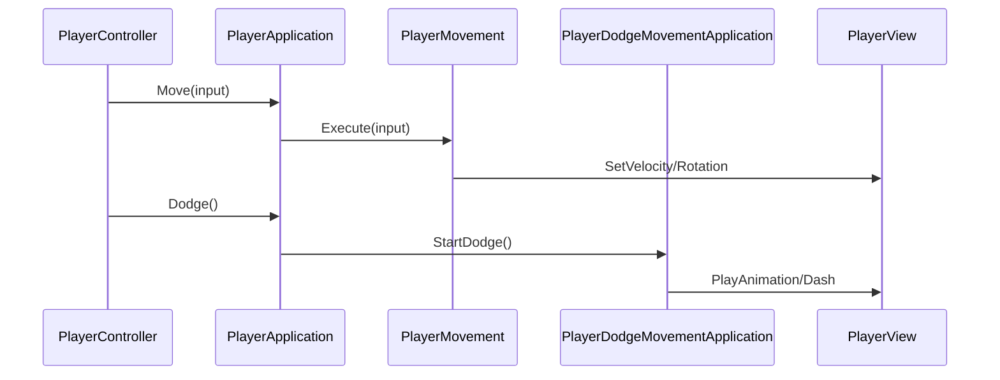

# InGame-Player

InGame カテゴリーにおけるプレイヤーキャラクターの制御機能のモジュール詳細。

## 構造概要

プレイヤーの機能は、移動（PlayerMovement）と回避（Dodge）、および入力に基づくアクション実行のユースケースで構成されています。

### 1. Domain
- **PlayerMoveParameter**: プレイヤーの移動速度、回転速度、回避距離などの特性パラメータを定義。

### 2. Application
- **PlayerApplication**: プレイヤー関連の主要なユースケース。
- **PlayerMovement**: 通常の移動（スティック入力による移動）のロジック。
- **PlayerDodgeMovementApplication**: 回避動作（ダッシュやドッジ）の制御。特定のビートやタイミングで実行。

### 3. Adaptor
- **PlayerController**: プレイヤーの入力情報を Application レイヤーに仲介。

### 4. View
- **PlayerView**: プレイヤーの 3D モデル、アニメーター、パーティクルの制御。
- **PlayerAttackInputView**: プレイヤーの攻撃入力に伴う視覚的フィードバックの管理。

### 6. Composition
- **PlayerInitializer**: プレイヤーの依存性の注入と初期化。
- **PlayerMoveParameterDebug**: デバッグ用に移動パラメータを調整。

## 移動処理フロー (Mermaid)

