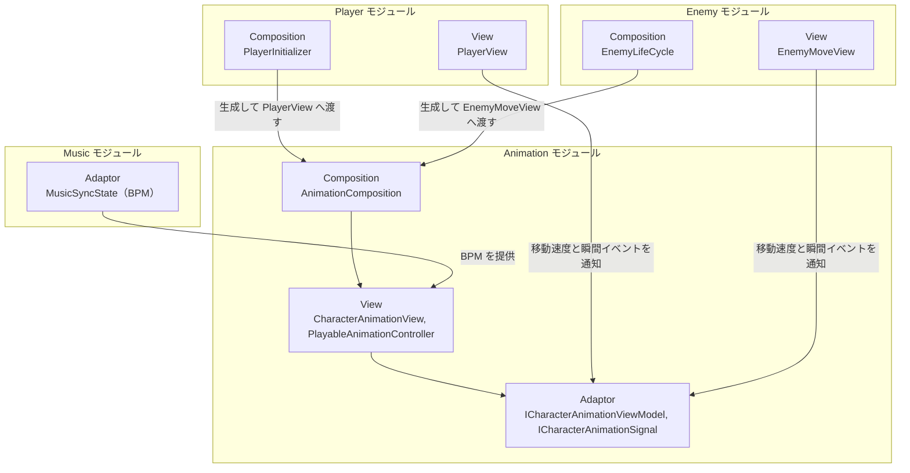
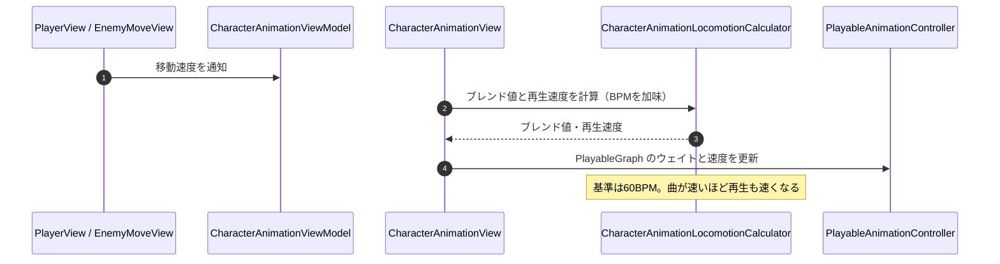
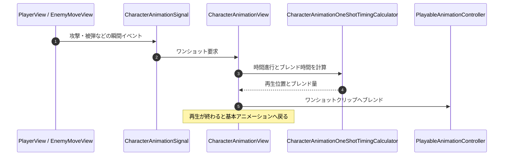

# 概要
> 💡 **モジュール概要**
> キャラクターのアニメーション再生を司るモジュールである。PlayableGraphでクリップをブレンド再生し、移動速度とBPMから再生速度を決める。プレイヤーと敵の双方が使う。

| 項目 | 内容 |
| --- | --- |
| **モジュール名** | Animation |
| **カテゴリ** | InGame |
| **ステータス** | 実装済み |
| **最終更新日** | 2026-08-17 |

---

## 🏗️ クラス

| クラス名 | レイヤー | 役割・機能 |
| --- | --- | --- |
| **`ICharacterAnimationViewModel`** | Adaptor | アニメーションの連続状態を扱う契約 |
| **`ICharacterAnimationSignal`** | Adaptor | 瞬間イベントとワンショット要求を扱う契約 |
| **`ICharacterAnimationViewContext`** | Adaptor | アニメーションに必要な依存をまとめる契約 |
| **`CharacterAnimationView`** | View | 再生と計算をView層で完結させる。当モジュールの本体 |
| **`CharacterAnimationViewModel`** | View | 連続状態（移動速度など）を保持する |
| **`CharacterAnimationSignal`** | View | 瞬間イベント（攻撃・被弾など）を伝達する |
| **`CharacterAnimationViewContext`** | View | View側の依存をまとめる |
| **`PlayableAnimationController`** | View | PlayableGraphを構築してクリップをブレンド再生する純粋クラス |
| **`CharacterAnimationLocomotionCalculator`** | View | 移動速度とBPMから基本アニメーションのブレンド値と再生速度を計算する |
| **`CharacterAnimationOneShotTimingCalculator`** | View | ワンショットアニメーションの時間進行とブレンド時間を計算する |
| **`CharacterAnimationPlaybackMap`** | View | 再生インデックスと再生時間を保持する |
| **`CharacterAnimationRequest`** | View | 内部の再生要求 |
| **`CharacterAnimationClipType`** | View | 基本アニメーションのクリップ種別 |
| **`CharacterAnimationCatalogConfig`** / **`CharacterAnimationCatalogEntry`** | View | クリップの表示設定と、その1件分 |
| **`AnimationComposition`** | Composition | アニメーションの依存関係を構築する |

> Adaptor層の3つの契約は、フォルダ名が`InGame/Animaiton`（綴り誤り）になっている。実装側は`InGame/Animation`にあるため、シンボル検索で辿ること。

### 🧩 Composition初期化情報

| 項目 | 内容 |
| --- | --- |
| **Initializerクラス** | `AnimationComposition` |
| **Order** | なし（`InGameInitializationModuleBase`を継承しないプレーンクラス） |
| **公開する ModuleContainer / ServiceLocator登録型** | なし。キャラクター単位で構築され、`PlayerInitializer`と`EnemyLifeCycle`が生成して各Viewへ渡す |

ServiceLocatorへは登録しない。アニメーションはキャラクターごとに独立した状態を持つため、キャラクターの生成に合わせて構築する。

---

## 🔗 モジュール結合

### 📥 依存しているもの

* **`Music`**
  * *依存箇所*: BPM
  * *詳細*: `CharacterAnimationLocomotionCalculator`が現在のBPMから再生速度を決める。基準は60BPMで、曲が速いほどアニメーションも速くなる

### 📤 依存されているもの

* **`Player`**
  * *参照箇所*: `CharacterAnimationView`, `AnimationComposition`
  * *詳細*: `PlayerInitializer`が構築し、`PlayerView`が移動速度と攻撃・回避の瞬間イベントを通知する
* **`Enemy`**
  * *参照箇所*: `CharacterAnimationView`, `AnimationComposition`
  * *詳細*: `EnemyLifeCycle`が構築し、`EnemyMoveView`が移動状態を通知する

---

# 詳細

## 🧅レイヤー情報

### ① Domain
当モジュールでは使用していない。
### ② Application
当モジュールでは使用していない。計算はView層の純粋クラスへ置いている。
### ③ Adaptor
連続状態・瞬間イベント・依存のまとめという3つの契約を定義する。連続状態（移動速度）と瞬間イベント（攻撃・被弾）を分けているのが特徴で、前者はブレンド値へ、後者はワンショット再生へつながる。
### ④ View
`CharacterAnimationView`が再生と計算を完結させる。`PlayableAnimationController`がPlayableGraphの構築とブレンド再生を担い、2つのCalculatorが移動アニメーションのブレンド値とワンショットの時間進行を計算する。
### ⑤ Infrastructure
当モジュールでは使用していない。クリップの設定は`CharacterAnimationCatalogConfig`がView層で保持する。
### ⑥ Composition
`AnimationComposition`がキャラクター単位で依存を構築する。初期化ライフサイクルには乗らず、キャラクターの生成側から呼ばれる。

## 🔌 拡張ポイント

| 拡張したいこと | 実装する場所 | 追加登録の要否 |
| --- | --- | --- |
| 基本アニメーションのクリップを増やしたい | `CharacterAnimationClipType`へ値を追加し、`CharacterAnimationCatalogConfig`へ対応するクリップを設定する | 必要（カタログへの設定漏れは、その種別だけ再生されない） |
| ワンショット演出を追加したい | `ICharacterAnimationSignal`経由で要求を送る。タイミングは`CharacterAnimationOneShotTimingCalculator`が扱う | 不要（既存の仕組みで再生できる） |

## 🔄処理フロー

主要な処理フローは、それぞれ子ページに分けている。

### ① 移動アニメーションのブレンドフロー（毎フレーム）

移動速度とBPMから、クリップのブレンド値と再生速度を決める。

### ② ワンショット再生のフロー（攻撃・被弾時）

瞬間イベントを受けて、基本アニメーションへ重ねて再生する。

