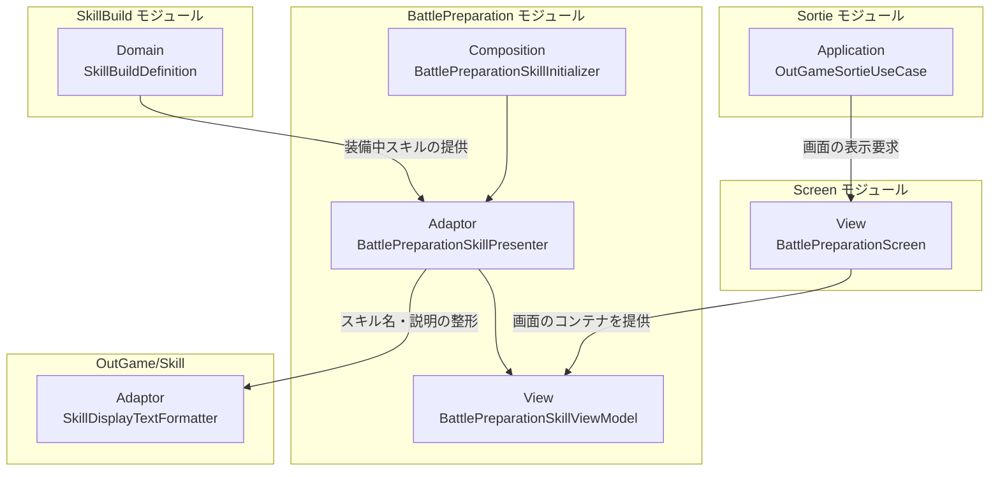
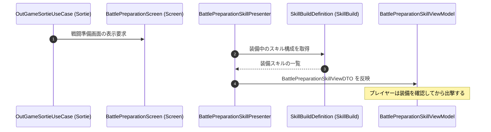

# 概要
> 💡 **モジュール概要**
> 出撃前の戦闘準備画面で、装備中のスキルを一覧表示するモジュールである。装備の変更そのものはSkillBuildモジュールが扱い、当モジュールは確認のための表示だけを担う。

| 項目 | 内容 |
| --- | --- |
| **モジュール名** | BattlePreparation |
| **カテゴリ** | アウトゲーム |
| **ステータス** | 実装済み |
| **最終更新日** | 2026-08-17 |

---

## 🏗️ クラス

| クラス名 | レイヤー | 役割・機能 |
| --- | --- | --- |
| **`BattlePreparationSkillDTO`** | Adaptor | 1スロット分のスキル情報 |
| **`BattlePreparationSkillViewDTO`** | Adaptor | 装備スキル一覧の表示データ |
| **`IBattlePreparationSkillViewModel`** | Adaptor | 装備スキル表示のViewModel契約 |
| **`BattlePreparationSkillPresenter`** | Adaptor | 装備スキルをDTOへ変換して反映する |
| **`BattlePreparationSkillViewModel`** | View | 装備スキルの表示状態を保持する |
| **`BattlePreparationSkillInitializer`** | Composition | 表示に必要な依存を解決する |

画面のコンテナ（`BattlePreparationScreen`）はScreenモジュールが持つ。当モジュールはその中身のうち、装備スキル一覧だけを構築する。

### 🧩 Composition初期化情報

| 項目 | 内容 |
| --- | --- |
| **Initializerクラス** | `BattlePreparationSkillInitializer` |
| **公開する ModuleContainer / ServiceLocator登録型** | なし |

---

## 🔗 モジュール結合

### 📥 依存しているもの

* **`SkillBuild`**
  * *依存箇所*: `SkillBuildDefinition`
  * *詳細*: 装備中のスキル構成を読み取って一覧へ表示する
* **`Screen`**
  * *依存箇所*: `BattlePreparationScreen`
  * *詳細*: 画面のコンテナはScreenモジュールが持つ

### 📤 依存されているもの

* **`Sortie`**
  * *参照箇所*: 戦闘準備画面
  * *詳細*: バトルステージへの出撃時、`OutGameSortieUseCase`がこの画面の表示を要求する

---

# 詳細

## 🧅レイヤー情報

### ① Domain
当モジュールでは使用していない。装備構成はSkillBuildモジュールのDomainを参照する。
### ② Application
当モジュールでは使用していない。
### ③ Adaptor
`BattlePreparationSkillPresenter`が装備中スキルを表示用DTOへ変換する。
### ④ View
`BattlePreparationSkillViewModel`が表示状態を保持する。描画そのものはScreenモジュールの画面が担う。
### ⑤ Infrastructure
当モジュールでは使用していない。
### ⑥ Composition
`BattlePreparationSkillInitializer`が依存を解決する。

## 🔌 拡張ポイント

| 拡張したいこと | 実装する場所 | 追加登録の要否 |
| --- | --- | --- |
| 表示項目を増やしたい | `BattlePreparationSkillDTO`へフィールドを追加し、Presenterで値を設定してViewModelへ反映先を足す | 不要 |

## 🔄処理フロー

主要な処理フローは、それぞれ子ページに分けている。

### ① 戦闘準備画面の表示フロー

出撃要求を受けて画面が開き、装備中のスキルを一覧へ並べる。

