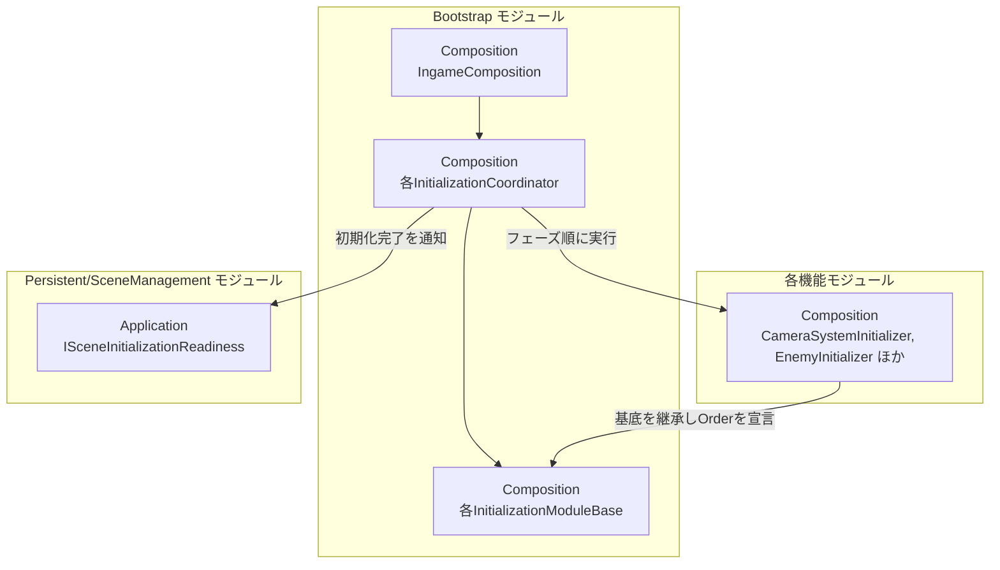
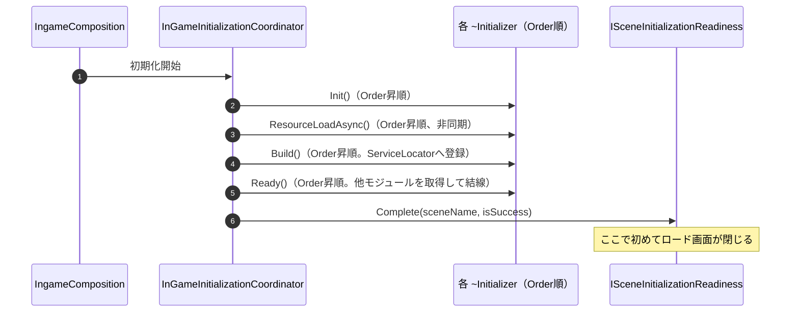
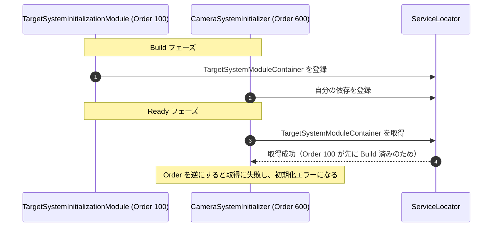

# 概要
> 💡 **モジュール概要**
> 各シーンの初期化ライフサイクルを提供する基盤モジュールである。他モジュールの`~Initializer`はここで定義された基底クラスを継承し、`Order`の順に`Init → ResourceLoadAsync → Build → Ready`の各フェーズを実行される。

| 項目 | 内容 |
| --- | --- |
| **モジュール名** | Bootstrap |
| **カテゴリ** | 共通（InGame / OutGame / Persistent） |
| **ステータス** | 実装済み |
| **最終更新日** | 2026-08-17 |

---

## 🏗️ クラス

| クラス名 | レイヤー | 役割・機能 |
| --- | --- | --- |
| **`IInGameInitializationModule`** / **`IOutGameInitializationModule`** / **`IPersistentInitializationModule`** | Composition | 各シーンの初期化モジュールの共通契約 |
| **`InGameInitializationModuleBase`** | Composition | インゲームの初期化モジュール基底。他モジュールの`~Initializer`はこれを継承する |
| **`OutGameInitializationModuleBase`** / **`PersistentInitializationModuleBase`** | Composition | アウトゲーム・常駐シーンの初期化モジュール基底 |
| **`InGameInitializationCoordinator`** / **`OutGameInitializationCoordinator`** / **`PersistentInitializationCoordinator`** | Composition | 各シーンの初期化モジュールをフェーズ順に実行する |
| **`IngameComposition`** | Composition | インゲームの初期化ライフサイクルを実行する入口 |
| **`SceneDependencyInitializationModule`** / **`SceneDependencyModuleContainer`** | Composition | シーン依存サービスの待機と公開 |

### 🔁 初期化フェーズ

基底クラスが定義する仮想メソッドを、Coordinatorが`Order`の昇順で呼ぶ。

| フェーズ | 役割 |
| --- | --- |
| **`Init`** | 自分の中で完結する初期化。他モジュールへ触らない |
| **`ResourceLoadAsync`** | Addressables等の非同期読み込み。`Awaitable`を返す |
| **`Build`** | 自分のオブジェクトを組み立て、ServiceLocatorへ登録する |
| **`Ready`** | 他モジュールをServiceLocatorから取得して結線する |
| **`Shutdown`** | 破棄処理 |

`Order`はモジュール間の依存の向きを表す。取得したい相手より大きい値を持たせる。実例として、Targetが100、Result 400、Skill 450、Player 500、Camera 600、Mission 600、Enemy 700、Stage 800、Sequence 1000である。

### 🧩 Composition初期化情報

| 項目 | 内容 |
| --- | --- |
| **Initializerクラス** | `IngameComposition`（インゲーム）と、各シーンのCoordinator |
| **公開する ModuleContainer / ServiceLocator登録型** | `SceneDependencyModuleContainer` |

---

## 🔗 モジュール結合

### 📥 依存しているもの

* **`Persistent/SceneManagement`**
  * *依存箇所*: `ISceneInitializationReadiness`
  * *詳細*: シーンの初期化が完了したことを通知する。通知が来るまで、遷移を要求した側のロード画面は表示され続ける

### 📤 依存されているもの

* **ほぼ全てのモジュール**
  * *参照箇所*: `InGameInitializationModuleBase`, `OutGameInitializationModuleBase`, `PersistentInitializationModuleBase`
  * *詳細*: 各モジュールの`~Initializer`がこれらを継承し、`ModuleName`と`Order`を宣言して各フェーズを実装する

---

# 詳細

## 🧅レイヤー情報

### ① Domain
当モジュールでは使用していない。
### ② Application
当モジュールでは使用していない。
### ③ Adaptor
当モジュールでは使用していない。
### ④ View
当モジュールでは使用していない。
### ⑤ Infrastructure
当モジュールでは使用していない。
### ⑥ Composition
初期化の契約・基底クラス・Coordinatorをシーン種別ごとに持つ。Coordinatorは共通の`InitializationCoordinator<T>`を継承し、シーンごとの差分は型引数と名前だけである。

## 🔌 拡張ポイント

| 拡張したいこと | 実装する場所 | 追加登録の要否 |
| --- | --- | --- |
| 新しいモジュールを初期化に載せたい | 対象シーンの`~InitializationModuleBase`を継承し、`ModuleName`と`Order`を宣言して必要なフェーズを`override`する | 不要（シーン上に配置されていればCoordinatorが拾う）。ただし`Order`の設定を誤ると、`Ready`で取得したい相手がまだ登録されていない |
| 初期化フェーズを増やしたい | 契約と基底クラス、`InitializationCoordinator<T>`の実行順を変更する | 必要（全シーン分の基底へ影響する） |

## 🔄処理フロー

主要な処理フローは、それぞれ子ページに分けている。

### ① シーン初期化のフェーズ実行フロー

同じフェーズを全モジュールで終えてから、次のフェーズへ進む。

### ② Order によるモジュール間の依存解決

`Build`で登録し`Ready`で取得するため、取得したい相手より大きい`Order`が必要になる。

