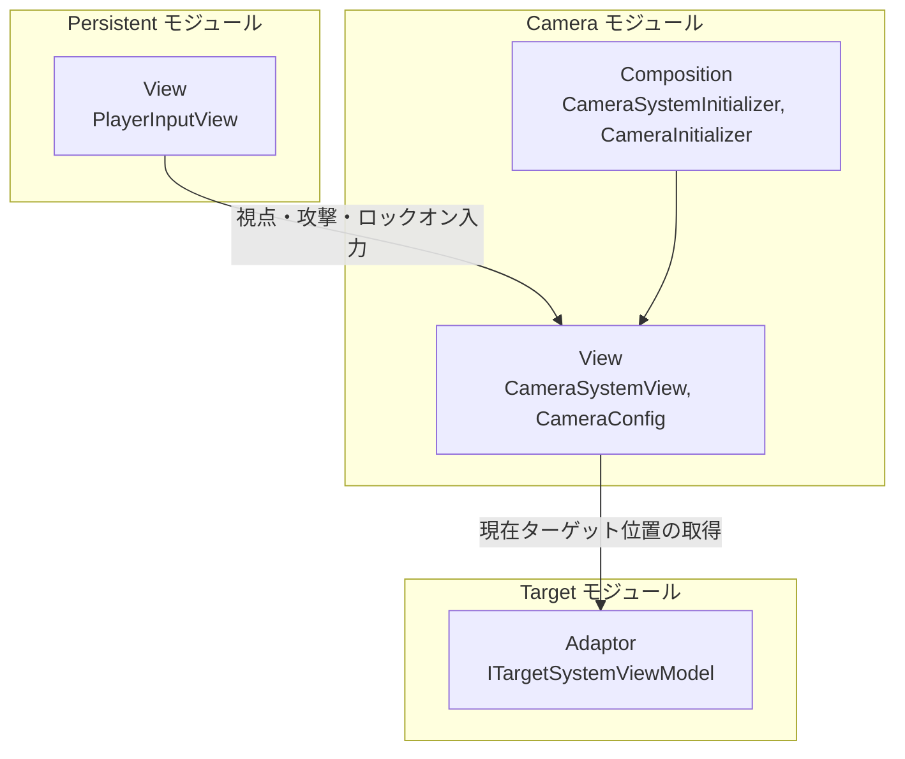
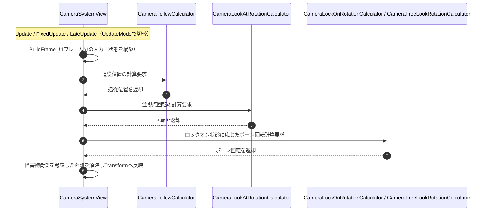
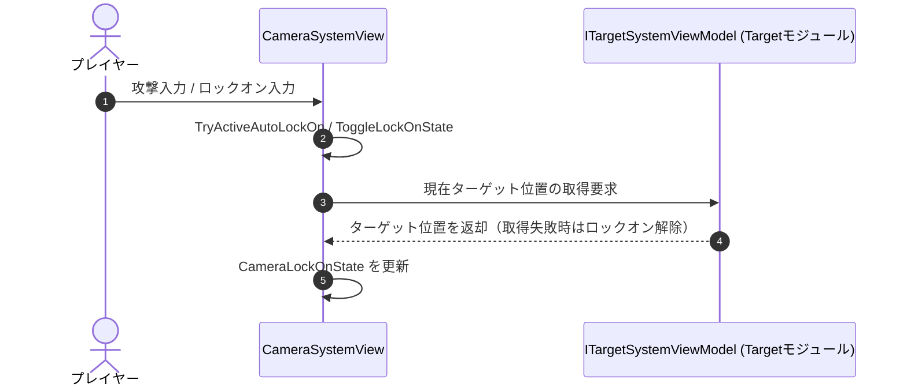

# 概要
> 💡 **モジュール概要**
> インゲーム中のカメラ追従・視点操作・ロックオン演出を司るモジュールです。ロックオン対象の選択・管理そのものは、別モジュール「Target」に分離されています。

| 項目 | 内容 |
| --- | --- |
| **モジュール名** | Camera |
| **カテゴリ** | InGame / Persistent |
| **アーキテクチャ** | クリーンアーキテクチャ（現状はView・Composition層のみで構成） |
| **ステータス** | 実装済み |
| **最終更新日** | 2026-07-15 |

---

## 🏗️ クラス

| クラス名 | レイヤー | 役割・機能 |
| --- | --- | --- |
| **`CameraConfig`** | View | カメラの各種パラメータを保持するScriptableObject（旧`CameraSystemParameter`の後継） |
| **`CameraSystemView`** | View | 入力購読・毎フレームの追従／回転計算・Transform反映まで一括して行うMonoBehaviour |
| **`CameraUpdateContext`** | View | 1フレーム分の入力データを表すreadonly struct |
| **`CameraUpdateFrame`** | View | 1フレーム分の計算状態を表すreadonly struct |
| **`CameraFollowCalculator`** | View | 追従位置の計算 |
| **`CameraFollowVelocityTracker`** | View | 追従対象の速度計算（struct） |
| **`CameraFreeLookRotationCalculator`** | View | 非ロックオン時のフリールック回転計算 |
| **`CameraLockOnRotationCalculator`** | View | ロックオン時のボーン回転計算 |
| **`CameraLookAtRotationCalculator`** | View | カメラ自体の注視点回転計算 |
| **`CameraSystemInitializer`** | Composition (InGame) | Calculatorクラス群の生成、`PlayerInputView`・Targetモジュールとの結線 |
| **`CameraInitializer`** | Composition (Persistent) | `ICameraTransform`を実装し、常駐カメラを初期化 |
| **`ICameraTransform`** | Composition (Persistent) | カメラの座標/向きを他モジュールへ公開する抽象 |

> 旧設計にあった Domain/Application/Adaptor 各層のカメラ専用クラス（`CameraSystemApplication`、`CameraFollowApplication`、`ILockOnTarget`、`TargetSelector`、`CameraSystemController`、`CameraSystemPresenter`等）は、リファクタリングにより計算ロジックがView層へ統合され、ロックオン対象選択が「Target」モジュールへ分離されたことで、現在は存在しません。

### 🧩 Composition初期化情報

| 項目 | 内容 |
| --- | --- |
| **Initializerクラス** | `CameraSystemInitializer`（InGame）／`CameraInitializer`（Persistent） |
| **公開する ModuleContainer / ServiceLocator登録型** | `CameraInitializer`が`ICameraTransform`として登録される |

---

## 🔗 モジュール結合

### 📥 依存しているもの

* **`Persistent`**
  * *依存箇所*: `PlayerInputView`
  * *詳細*: 視点移動・ロックオン・攻撃などの入力イベントを購読します。
* **`InGame/Target`**
  * *依存箇所*: `TargetSystemModuleContainer`, `ITargetSystemViewModel`
  * *詳細*: ロックオン対象の選択・現在ターゲット位置の取得をTargetモジュールへ委譲します。ロックオン対象の具体的な管理（登録・選択ロジック）はCameraモジュールの外にあります。

### 📤 依存されているもの

* なし
  * *詳細*: `CameraSystemView`はプレイヤー入力を購読して自律的に動作するため、他モジュールから直接参照されることはありません。`ICameraTransform`のみ、Persistent Composition層の抽象として他モジュールから参照される可能性があります。

---

# 詳細

## 🧅レイヤー情報

### ① Domain
当モジュールでは使用していません。
### ② Application
当モジュールでは使用していません。
### ③ Adaptor
当モジュールでは使用していません。
### ④ View
`CameraConfig`によるパラメータ管理、`CameraSystemView`による入力購読とTransform反映、および追従・回転計算を担当する`CameraFollowCalculator`等のCalculatorクラス群を持ちます。旧Application/Adaptor層の計算・伝達ロジックがすべてこのレイヤーに統合されています。
### ⑤ Infrastructure
当モジュールでは使用していません。
### ⑥ Composition
InGameシーンの`CameraSystemInitializer`がCalculatorクラス群の生成とTarget/Inputモジュールとの結線を行い、Persistentシーンの`CameraInitializer`が`ICameraTransform`として常駐カメラを公開します。

## 🔌 拡張ポイント

> 現状、ポリモーフィックな拡張ポイント（`SubclassSelector`等）はありません。新しいカメラ挙動（例: 新しい視点モード）を追加する場合は、`CameraSystemView.Tick()`内の分岐、または新しいCalculatorクラスの追加という形になります。

## 🔄処理フロー

主要な処理フローごとに分けて記述します。

### ① 通常追従・回転フロー（毎フレーム）
プレイヤーの移動に追従し、ロックオン状態に応じて注視点・ボーン回転を計算し、カメラのTransformへ反映します。

### ② ロックオン切り替えフロー（入力イベント時）
プレイヤーの攻撃入力またはロックオン入力を受け、Targetモジュールへ問い合わせてロックオン状態を切り替えます。

