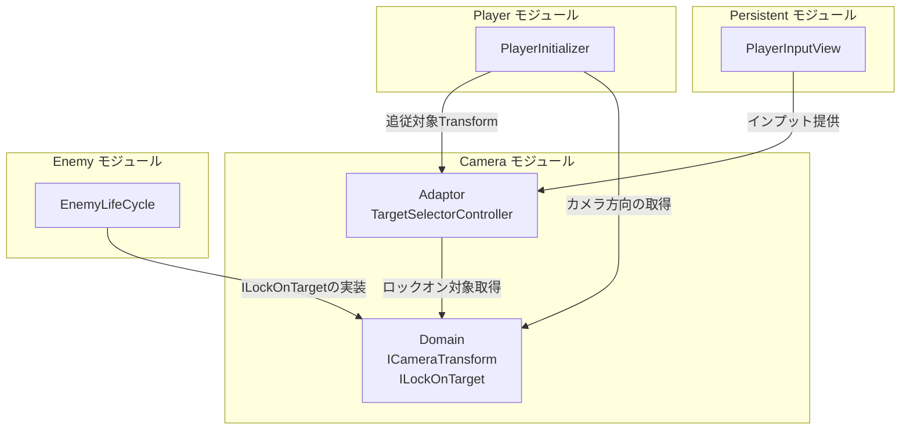
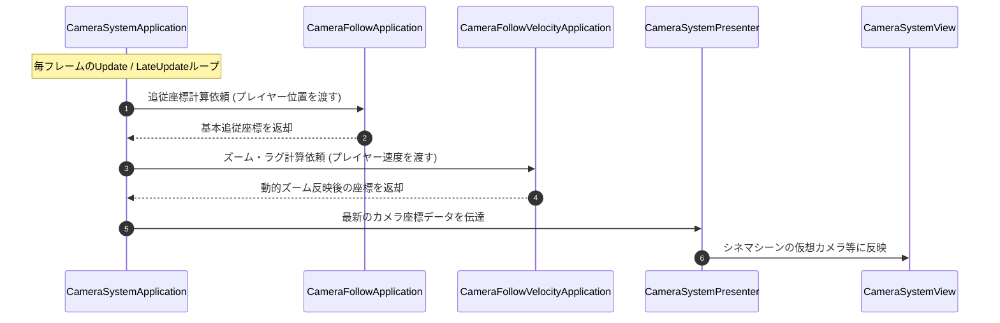
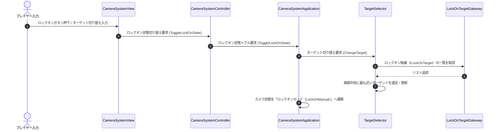
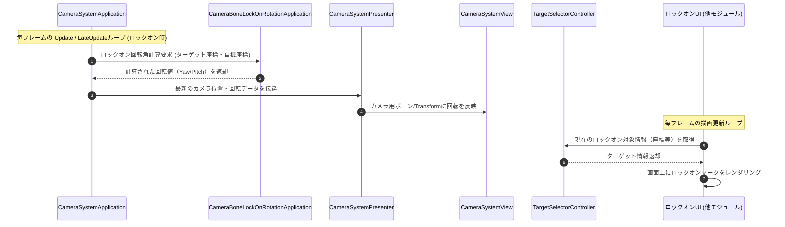

---

# 📌 基本情報
インゲーム中のカメラシステム（プレイヤーの追従、フリーカメラ操作、および敵のロックオン・ターゲット選択システム）を司るモジュールです。
| 項目 | 内容 |
| --- | --- |
| **モジュール名** | Camera |
| **カテゴリ** | InGame / System |
| **アーキテクチャ** | クリーンアーキテクチャ (Domain, Application, Adaptor, View, Composition) |

---

## 🏗️ クラス（レイヤー構成）

| クラス名 | レイヤー | 役割・機能 |
| --- | --- | --- |
| **`ICameraTransform`** | Composition (Persistent) | カメラの座標/向きを提供する抽象インターフェース（常駐シーンの CameraInitializer.cs 内に定義） |
| **`CameraSystemParameter`** | Domain | カメラ動作の設定用SOなどに対となるピュアデータ |
| **`ILockOnTarget`** | Domain | ロックオン対象が実装すべきインターフェース |
| **`CameraSystemApplication`** | Application | カメラシステム全体を束ねるロジック |
| **`CameraFollowApplication`** | Application | プレイヤーへの追従制御 |
| **`CameraFollowVelocityApplication`** | Application | 速度に基づく動的追従ズーム等（※実際は struct） |
| **`CameraRotationApplication`** | Application | カメラの向き回転 |
| **`CameraBoneFreeLookRotationApplication`** | Application | フリー視点時のボーン回転制御 |
| **`CameraBoneLockOnRotationApplication`** | Application | ロックオン時のボーン追従回転制御 |
| **`TargetSelector`** | Application | ロックオン候補となるターゲットの検索・判定と選択管理を行うロジッククラス |
| **`CameraSystemController`** | Adaptor | 入力やステートに応じた操作伝達をアプリケーション層へ仲介する |
| **`CameraSystemPresenter`** | Adaptor | ビュー側への表示パラメータ伝達 |
| **`TargetSelectorController`** | Adaptor | 他モジュール（バトル・スキル等）が現在のターゲット情報を取得するためのアダプター窓口 |
| **`LockOnTargetGateway`** | Adaptor | ターゲット選択の実装仲介 |
| **`CameraSystemView`** | View | 実際のUnityシネマシーンやカメラコンポーネントおよびプレイヤー入力の受け口 |
| **`CameraSystemInitializer`** | Composition | インプットとカメラコンポーネントのDI（依存注入） |

---

## 🔗 モジュール間依存関係

カメラモジュールは、他のモジュール（Persistent, Player, Enemy）と疎結合で連携します（外部と接続のない内部レイヤーは省略）。

### 📥 依存しているもの（外部 → Camera）

* **`Persistent`**
  * *依存箇所*: `PlayerInputView`
  * *詳細*: カメラの視点移動操作（右スティック/マウス）のために、常駐シーンのインプットビューからインプット情報を受け取ります。
* **`InGame/Player`**
  * *依存箇所*: `PlayerInitializer`
  * *詳細*: 追従対象としてプレイヤーの `transform` を必要とします。
* **`InGame/Enemy`**
  * *依存箇所*: `ITarget` / `ILockOnTarget`
  * *詳細*: ロックオン対象となる敵を取得します。Domain層に用意した抽象インターフェース `ILockOnTarget` を通じて弱結合で参照しています。

### 📤 依存されているもの（Camera → 外部）

* **`InGame/Player`**
  * *参照箇所*: `ICameraTransform`, `TargetSelectorController`
  * *詳細*: プレイヤーはカメラの正面方向を基準に移動方向を決定するため、カメラの Transform 情報に依存します。また、スキル発動時の自動ターゲット選択のために `TargetSelectorController` を参照します。
* **`InGame/Enemy`**
  * *参照箇所*: `ILockOnTarget`
  * *詳細*: 敵キャラクターはカメラからロックオンされ得る対象として `ILockOnTarget` インターフェースを実装します。

---

# 🔄 処理の流れ（シークエンス図）

主要な処理フローごとに分けて記述します。

### ① カメラの通常追従フロー（毎フレーム）
プレイヤーの移動に追従し、プレイヤーの移動速度に基づいて動的にズーム距離を計算・反映します。

### ② ターゲットロックオン & 切り替えフロー（入力イベント時）
プレイヤーがロックオンボタンを押すか、スティック操作等によってロックオン対象を切り替える際の処理フローです。

### ③ ロックオン中の注視回転 & UI表示フロー（毎フレーム）
ロックオンモード中にターゲットを自動的に画面中央付近に捉え続け、ターゲットUIを描画するための情報を他モジュールへ連携する処理フローです。

