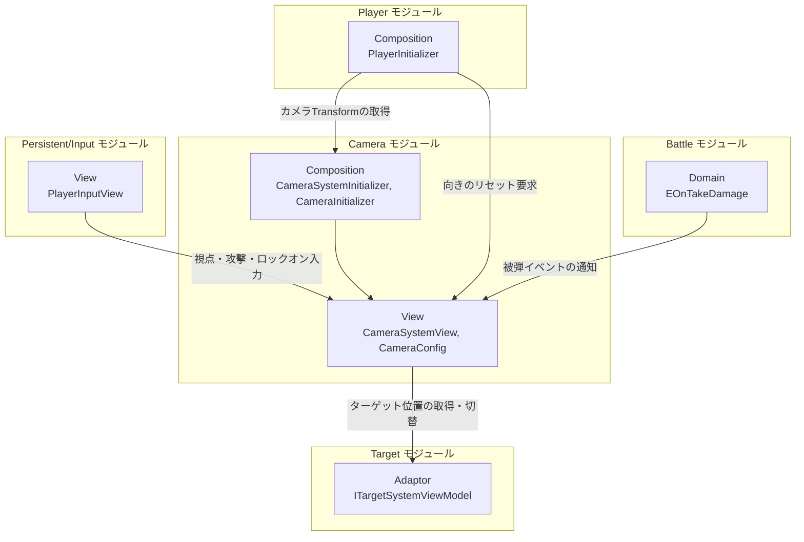
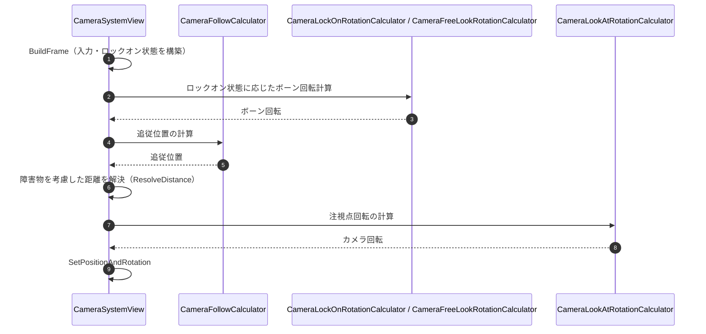
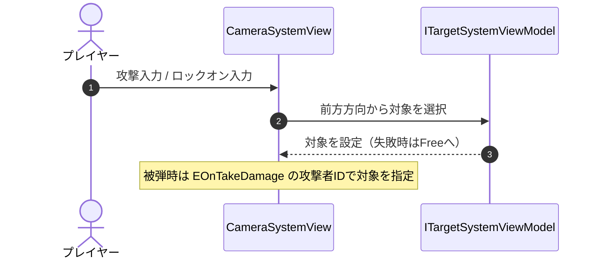

# 概要
> 💡 **モジュール概要**
> インゲーム中のカメラ追従・視点操作・ロックオン演出を司るモジュールである。ロックオン対象の選択・管理そのものは、別モジュール「Target」に分離されている。

| 項目 | 内容 |
| --- | --- |
| **モジュール名** | Camera |
| **カテゴリ** | InGame / Persistent |
| **ステータス** | 実装済み |
| **最終更新日** | 2026-09-09 |

---

## 🏗️ クラス

| クラス名 | レイヤー | 役割・機能 |
| --- | --- | --- |
| **`CameraConfig`** | View | カメラの各種パラメータを保持するScriptableObject（旧`CameraSystemParameter`の後継） |
| **`CameraSystemView`** | View | 入力購読・毎フレームの追従／回転計算・Transform反映まで一括して行うMonoBehaviour。`ResolveDistance()`による壁避け（`Physics.SphereCast`）も内包する |
| **`CameraUpdateContext`** | View | 1フレーム分の入力データを表すreadonly struct |
| **`CameraUpdateFrame`** | View | 1フレーム分の計算状態を表すreadonly struct |
| **`CameraFollowCalculator`** | View | 追従位置の計算 |
| **`CameraFollowVelocityTracker`** | View | 追従対象の速度計算（struct） |
| **`CameraFreeLookRotationCalculator`** | View | 非ロックオン時のフリールック回転計算 |
| **`CameraLockOnRotationCalculator`** | View | ロックオン時のボーン回転計算 |
| **`CameraLookAtRotationCalculator`** | View | カメラ自体の注視点回転計算 |
| **`CameraLockOnRangeChecker`** | View | ロックオン対象がビューポート内にあるかの判定 |
| **`CameraLockOnBreakTracker`** | View | 視点入力の蓄積によるオートロックオン解除の判定 |
| **`CameraSystemInitializer`** | Composition (InGame) | Calculatorクラス群の生成、`PlayerInputView`・Targetモジュールとの結線 |
| **`CameraInitializer`** | Composition (Persistent) | `ICameraTransform`を実装し、常駐カメラを初期化 |
| **`ICameraTransform`** | Composition (Persistent) | カメラの座標/向きを他モジュールへ公開する抽象 |

計算系クラスは `View/InGame/Camera/Calculation/` 配下にまとまっている。

### 🧩 Composition初期化情報

| 項目 | 内容 |
| --- | --- |
| **Initializerクラス** | `CameraSystemInitializer`（InGame）／`CameraInitializer`（Persistent） |
| **Order** | 600（InGame）／40（Persistent） |
| **公開する ServiceLocator登録型** | `CameraInitializer`が`ICameraTransform`として登録（`LocateTypeEnum.Locator`） |

`CameraSystemInitializer.Ready()`は`TargetSystemModuleContainer`をServiceLocatorから取得する。取得できない場合は初期化を失敗として扱うため、Targetモジュールより後に初期化される必要がある。

---

## 🔗 モジュール結合

### 📥 依存しているもの

* **`Persistent/Input`**
  * *依存箇所*: `PlayerInputView`、`MobileInput`（Androidのみ）
  * *詳細*: 視点移動・移動・ロックオン・攻撃の各入力イベントを購読する。Android実行時は`CameraSystemInitializer`が`MobileInput`と`PlayerInputView`を結線する
* **`InGame/Target`**
  * *依存箇所*: `TargetSystemModuleContainer`、`ITargetSystemViewModel`
  * *詳細*: ロックオン対象の選択・切替・現在位置の取得をTargetモジュールへ委譲する。対象の登録・選択ロジックはCameraモジュールの外にある
* **`InGame/Battle`**
  * *依存箇所*: `EOnTakeDamage`
  * *詳細*: 被弾イベントを購読し、攻撃してきた相手へオートロックオンを向け直す

### 📤 依存されているもの

* **`InGame/Player`**
  * *参照箇所*: `PlayerInitializer`
  * *詳細*: リスポーンや初期配置の際に`CameraSystemView.ResetOrientation()`でカメラの向きを揃える。また`ICameraTransform`を取得してカメラ基準の移動方向を求める

---

# 詳細

## 🧅レイヤー情報

### ① Domain
当モジュールでは使用していない。
### ② Application
当モジュールでは使用していない。
### ③ Adaptor
当モジュールでは使用していない。
### ④ View
`CameraConfig`によるパラメータ管理、`CameraSystemView`による入力購読とTransform反映、`Calculation/`配下の計算クラス群を持つ。`CameraSystemView.ResolveDistance()`は、追従位置からカメラ方向へ`_viewSettings.CollisionRadius`を半径とする`Physics.SphereCast`を`_viewSettings.CollisionMask`レイヤーに対して飛ばし、壁等に当たった場合はその距離まで、当たらない場合は通常距離（`Distance`）までカメラを寄せる。ヒット距離が近すぎる場合でも`MIN_CAMERA_DISTANCE`（0.1）を下回らないようクランプする。
### ⑤ Infrastructure
当モジュールでは使用していない。
### ⑥ Composition
InGameシーンの`CameraSystemInitializer`が計算クラス群の生成とTarget/Inputモジュールとの結線を行い、Persistentシーンの`CameraInitializer`が`ICameraTransform`として常駐カメラを公開する。

## 🔌 拡張ポイント

ポリモーフィックな拡張点（`SubclassSelector`等）はない。新しい視点モードを追加する場合は、計算クラスを`Calculation/`へ追加し、`CameraSystemView.Tick()`から呼び出す形になる。パラメータの追加は`CameraConfig`へのフィールド追加で完結する。

## 🎚️ パラメータ（`CameraConfig`）

各パラメータの調整目的や上げ下げの効果については、プランナー向けの別ページ「カメラシステムパラメータ」を参照。ここでは`CameraConfig`が公開する全フィールドの一覧を記載する。

| パラメータ名 | 概要 |
| --- | --- |
| `_cameraOffset` | 追従先を中心としたカメラの基本オフセット位置 |
| `_characterCenterOffset` | キャラクターモデルの中心オフセット |
| `_distance` | 追従先からカメラまでの通常時距離。壁がある場合は`ResolveDistance()`でこれより短く解決される |
| `_followOffsetPower` | プレイヤー移動中の追従オフセットの強さ |
| `_followLerpSpeed` | 追従オフセットへの補間速度 |
| `_boneRotateSpeed` | ロックオン時のカメラボーン回転速度 |
| `_lockOnRotationMinSpeed` | ロックオン時のボーン回転速度の下限値 |
| `_lockOnRotationSpeedAngleRange` | ロックオン時、ボーン回転速度が最大へ到達するまでの角度差 |
| `_lockOnAngleMargin` | ロックオン時、プレイヤーを画面に収めるための敵方向からの角度許容範囲 |
| `_followRotationSpeed` | 非ロックオン（フリールック）時の回転速度 |
| `_moveFollowRotationSpeed` | 非ロックオン時、移動入力のx成分でカメラyawを回転させる速度 |
| `_moveFollowIdleLookThreshold` | 視点入力中に、移動入力によるyaw回転を無効化するしきい値 |
| `_lockOnLookAtRatio` | ロックオン時、プレイヤー位置とターゲット位置のどちらを注視するかの補間比率 |
| `_lockOnRotationSpeed` | ロックオン時のカメラ自体の回転速度 |
| `_lockOnViewportMargin` | 自動ロックオンを維持できるビューポート内側マージン |
| `_lockOnBreakWindow` | 強い視点操作によるオートロックオン解除を判定する時間幅 |
| `_lockOnBreakThreshold` | オートロックオン解除の判定に使う視点操作量のしきい値 |
| `_autoLockOnReleaseDelay` | 対象へ働きかけがないままオートロックオンを解除するまでの秒数 |
| `_autoLockOnViewportGraceDuration` | 画面外の敵へ自動ロックオンした直後、視野外判定による解除を猶予する秒数 |
| `_collisionRadius` | `ResolveDistance()`の壁避けSphereCastに使う球の半径 |
| `_collisionMask` | `ResolveDistance()`の壁避けSphereCastが衝突判定の対象とするレイヤーマスク |
| `_pitchRange` | カメラのピッチ角度（上下）の可動範囲 |
| `_invertVertical` | 垂直方向の視点入力を反転するか |
| `_invertHorizontal` | 水平方向の視点入力を反転するか |

## 🔄処理フロー

主要な処理フローは、それぞれ子ページに分けている。

### ① 通常追従・回転フロー（毎フレーム）

`UpdateModeEnum`で選んだタイミング（Update / FixedUpdate / LateUpdate）で1フレーム分の状態を組み立て、Transformへ反映する。

### ② ロックオン開始フロー（入力・被弾時）

攻撃入力ではオートロックオン、ロックオン入力ではマニュアルロックオンへ遷移する。マニュアル中はオートによる上書きが起きない。

### ③ オートロックオン解除フロー

オートロックオンは次の3条件のいずれかで解除される。マニュアルロックオンはこの判定の対象外である。

| 条件 | 判定 |
| --- | --- |
| 一定時間ターゲットへ働きかけがない | `AutoLockOnReleaseDelay`を超えた |
| 対象が画面外へ出た | 猶予時間（`AutoLockOnViewportGraceDuration`）経過後に`CameraLockOnRangeChecker`が範囲外と判定 |
| 強い視点操作が入った | `CameraLockOnBreakTracker`が蓄積量のしきい値超えを検出 |
