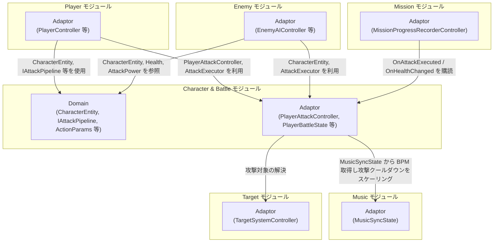
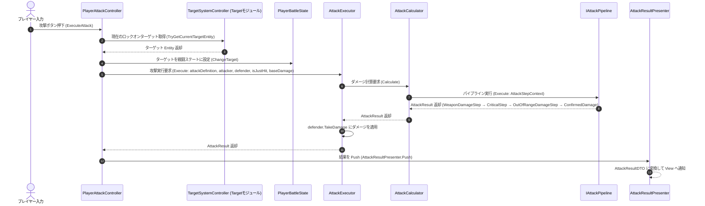
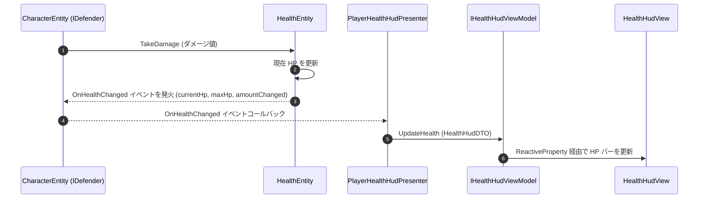
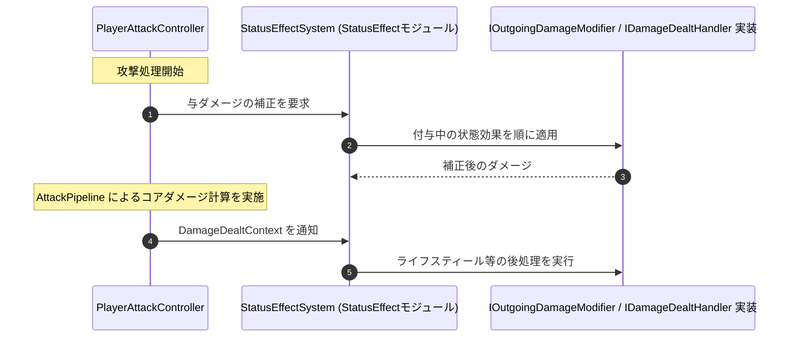

# 概要
> 💡 **モジュール概要**
> インゲーム中のキャラクターパラメータ管理、戦闘時の攻撃力・防御力・クリティカル計算、ダメージパイプライン、およびバフ（ステータス効果）システムを司るモジュールである。

| 項目 | 内容 |
| --- | --- |
| **モジュール名** | Character & Battle |
| **カテゴリ** | InGame / Core |
| **ステータス** | 実装済み |
| **最終更新日** | 2026-08-17 |

---

## 🏗️ クラス

| クラス名 | レイヤー | 役割・機能 |
| --- | --- | --- |
| **`CharacterEntity`** | Domain | キャラクター（プレイヤー/敵共通）の基底Entity。`IAttacker`/`IDefender`を実装し、HPや攻撃力などのコアデータを保持 |
| **`HealthEntity`** / **`Health`** | Domain | HP変化の状態管理と、HP値を表すValueObject。`OnHealthChanged`で変化を通知 |
| **`BarrierEntity`** | Domain | キャラクターが保持するバリア |
| **`CharacterCombatSpec`** | Domain | そのキャラクターが使用できる攻撃定義を管理する |
| **`CharacterDefinitionId`** / **`CharacterName`** | Domain | キャラクター定義の識別子と表示名 |
| **`AttackPower`** / **`CriticalChance`** / **`CriticalMultiplier`** | Domain | 攻撃力・クリティカル率・クリティカル倍率のValueObject |
| **`AttackCooldown`** / **`AttackRangeMin`** / **`AttackRangeMax`** / **`AttackRotationSpeed`** | Domain | 攻撃の間隔・射程・旋回速度のValueObject |
| **`MoveSpeed`** / **`DodgeSpeed`** / **`DodgeDuration`** / **`DodgeCooldown`** | Domain | 移動と回避のValueObject |
| **`AttackDefinition`** / **`AttackSpec`** | Domain | 攻撃定義と、攻撃に使うパラメータをまとめた構造体 |
| **`AttackInterval`** / **`AttackIntervalEntity`** | Domain | 攻撃間隔の値と、その進行を管理するEntity |
| **`AttackResult`** / **`Damage`** | Domain | 攻撃計算の結果と、ダメージ値 |
| **`AttackStepContext`** | Domain | 各パイプラインステップへ渡すコンテキストのreadonly ref struct |
| **`DamageDealtContext`** / **`DamageTakenContext`** | Domain | ダメージを与えた側・受けた側それぞれの情報 |
| **`AttackTarget`** / **`BattleActionType`** | Domain | 攻撃対象の指定と、バトルアクションの種別 |
| **`IAttacker`** / **`IDefender`** / **`IBarrierHolder`** | Domain | 攻撃側・防御側・バリア保持者の契約 |
| **`IAttackPipeline`** / **`IAttackController`** | Domain | ダメージ計算パイプラインと、攻撃制御の契約 |
| **`AttackPipeline`** | Application | 複数の攻撃処理ステップを順番に実行する |
| **`AttackCalculator`** / **`AttackExecutor`** / **`DamageExecutor`** | Application | 計算・適用を担うピュアクラス群 |
| **`IAttackStep`** | Application | パイプラインの1ステップを表す契約 |
| **`ConfirmedDamage`** / **`CriticalStep`** / **`WeaponDamageStep`** / **`OutOfRangeDamageStep`** | Application | ダメージ確定・クリティカル抽選・武器倍率・射程外減衰の各ステップ |
| **`AttackIntervalEvaluator`** | Application | 攻撃開始からの硬直時間を計測し、攻撃中フラグを管理する |
| **`PendingAttackEffectService`** | Application | 次の通常攻撃へ付与する追加効果を管理する |
| **`IAttackHitEffect`** | Application | 命中時の追加効果の契約 |
| **`PlayerAttackController`** | Adaptor | プレイヤーの攻撃を制御し、`OnAttackExecuted`を公開する。実体はPlayerモジュールの`PlayerModuleContainer`が保持する |
| **`PlayerBattleState`** | Adaptor | プレイヤーの戦闘中の状態を保持する |
| **`IDamageable`** | Adaptor | ダメージを受けられるオブジェクトの契約 |
| **`AttackResultPresenter`** / **`AttackResultDTO`** / **`IAttackResultViewModel`** | Adaptor | 攻撃結果をViewへ通知する経路 |
| **`AttackResultView`** / **`AttackResultViewModel`** | View | 攻撃結果（ダメージ数値・クリティカル演出）の表示 |
| **`IOneShotVisualEffect`** | View | ワンショット演出の再生契約 |
| **`ParticleSystemPoolView`** / **`ParticleSystemRingBufferView`** / **`ReusableParticleSystemView`** | View | ParticleSystemのワンショット再生をプール・リングバッファで管理する |
| **`ParticleSystemOneShotVisualEffect`** / **`PooledParticleSystemOneShotVisualEffect`** / **`VisualEffectGraphOneShotVisualEffect`** / **`SoundEffectOneShotVisualEffect`** | View | `IOneShotVisualEffect`の各実装 |
| **`FootStepView`** | View | 足音演出の再生 |
| **`CharacterDefinitionAsset`** / **`CharacterDefinitionRepository`** / **`CharacterFactory`** | Infrastructure | キャラクター定義アセットの保持・ID検索と、そこからの`CharacterEntity`生成 |
| **`AttackDefinitionAsset`** / **`AttackDefinitionFactory`** / **`AttackSpecAsset`** / **`AttackPilpelineAsset`** | Infrastructure | 攻撃定義・攻撃パラメータ・パイプラインのScriptableObjectと生成 |

> `PlayerHealthHudPresenter` / `EnemyHealthHudPresenter` / `IHealthHudViewModel` / `HealthHudDTO` は、実体が`InGame/UI`モジュール（namespace `Adaptor.InGame.UI`）に属するため、本表からは除外している。HP変化通知（`CharacterEntity.OnHealthChanged`）の連携先として、処理フロー②で参照する。

---

## 🔗 モジュール結合

### 📥 依存しているもの

* **`Music`**
  * *依存箇所*: `MusicSyncState`
  * *詳細*: `PlayerAttackController`が攻撃クールダウンの時間をBPMに基づいてスケーリングするために参照する。ジャスト入力ボーナスは`BeatStep`が`AttackDefinition.JustDamageMultiplier`で計算しており、バフの持続時間計算とは無関係である
* **`Target`**
  * *依存箇所*: `TargetSystemController`, `ITargetableViewModel`
  * *詳細*: `PlayerAttackController`が攻撃対象の解決にTargetモジュールを利用する

### 📤 依存されているもの

* **`InGame/Player`**
  * *参照箇所*: `CharacterEntity`, `PlayerAttackController`, `AttackExecutor`
  * *詳細*: プレイヤーキャラクターのHP・ステータス情報を `CharacterEntity` として保持し、攻撃アクションのトリガーとして `PlayerAttackController` および `AttackExecutor` を介してダメージフローを実行する
* **`InGame/Enemy`**
  * *参照箇所*: `CharacterEntity`, `AttackExecutor`, `IDamageable`
  * *詳細*: 敵キャラクターがパラメータを`CharacterEntity`で表現し、AIの攻撃契機や被弾処理で攻撃実行と`IDamageable`を使用する。敵側の戦闘状態を持つ`EnemyBattleState`はEnemyモジュールに属する
* **`InGame/Mission`**
  * *参照箇所*: `CharacterEntity.OnHealthChanged`, `PlayerAttackController.OnAttackExecuted`
  * *詳細*: `MissionProgressRecorderController`がこれらのイベントを購読し、被ダメージ量・使用武器種・コンボ数をミッション評価条件として記録する（新規）

---

# 詳細

<h2>🧅レイヤー情報</h2>

### ① Domain
> キャラクターの基本戦闘能力（HP、攻撃力、クリティカル率など）を保持するEntityや、ダメージ計算パイプラインのインターフェース（`IAttackPipeline`）、コンテキストを定義する純粋なドメインルール層である。

### ② Application
> 攻撃計算の実行（`AttackPipeline`, `AttackCalculator`, `AttackExecutor`, `DamageExecutor`）と、その構成要素であるステップ（`CriticalStep`, `ConfirmedDamage`, `WeaponDamageStep`, `OutOfRangeDamageStep`）を実装する。攻撃の硬直管理（`AttackIntervalEvaluator`）と、次の通常攻撃への追加効果（`PendingAttackEffectService`）もここに属する。バフ・デバフの実体はStatusEffectモジュールとBuffモジュールにある。

### ③ Adaptor
> 攻撃コマンドを実行する`PlayerAttackController`、プレイヤーの戦闘状態を持つ`PlayerBattleState`、ダメージを受けられる対象の契約`IDamageable`、および結果をUI側へ中継する`AttackResultPresenter`を定義する。

### ④ View
> Presenterが配信したDTOを受け取って、画面にダメージ数値をポップアップ描画したり、HPバーを滑らかに変動させたりするUnityの描画・UIコンポーネントを担当する。

### ⑤ Infrastructure
> 当モジュールでは使用していない。

### ⑥ Composition
> 当モジュールのクラスの依存解決（DI）は、呼び出し側となる Player または Enemy モジュールの初期化コンポーネント内で行われる。

## 🔄処理フロー

主要な処理フローは、それぞれ子ページに分けている。

### ① プレイヤー攻撃実行フロー（入力イベント時）
プレイヤーが攻撃ボタンを押した際、ターゲット取得・バフ適用・パイプライン計算・ダメージ反映までの一連の処理である。

### ② HP 変化とHUDへの反映フロー（ダメージ被弾時）
ダメージを受けた際に Entity の HP が変化し、HUD（HPバー）へ即時反映される処理フローである。

### ③ 状態効果の適用フロー（攻撃前後）
バフ・デバフは状態効果（StatusEffect）として実装され、ダメージの授受に合わせて呼び出される。効果の実体はStatusEffectモジュールとBuffモジュールにあり、当モジュールは呼び出し口とコンテキストを提供する。

