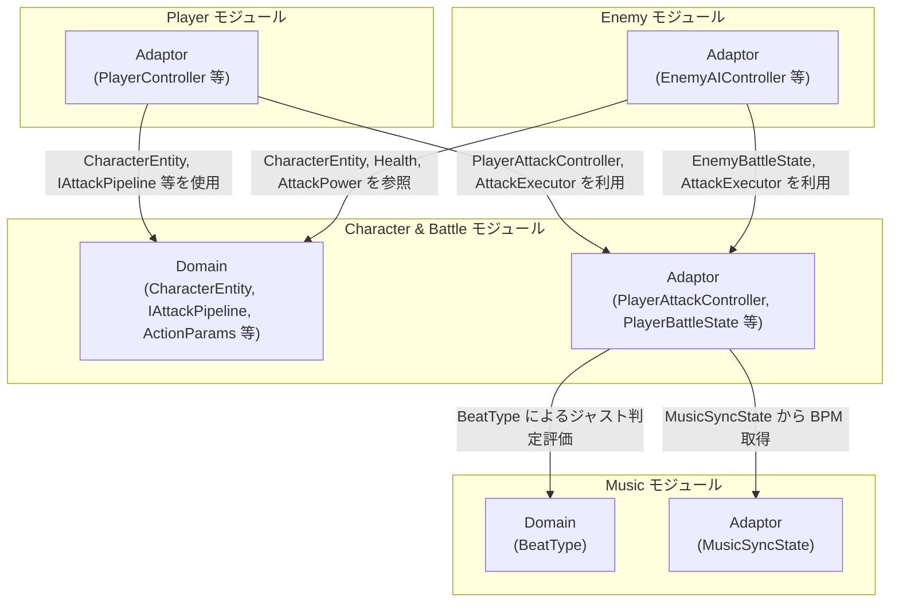
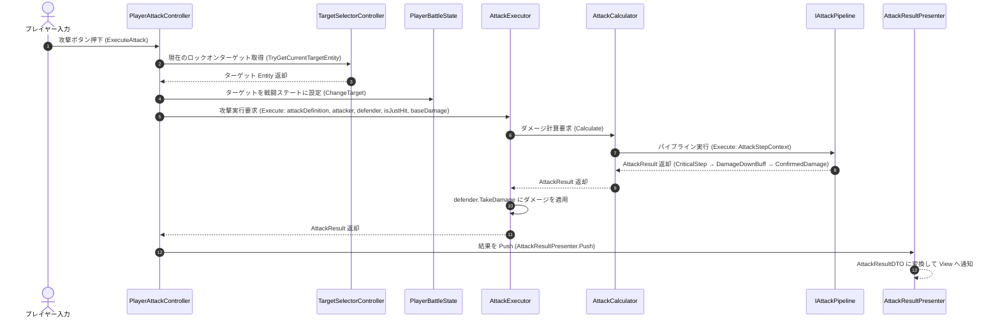
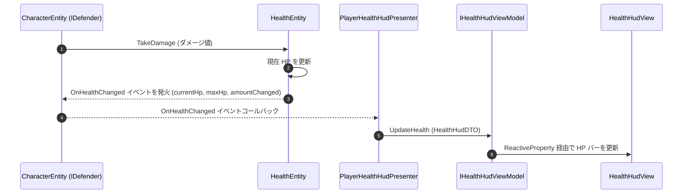
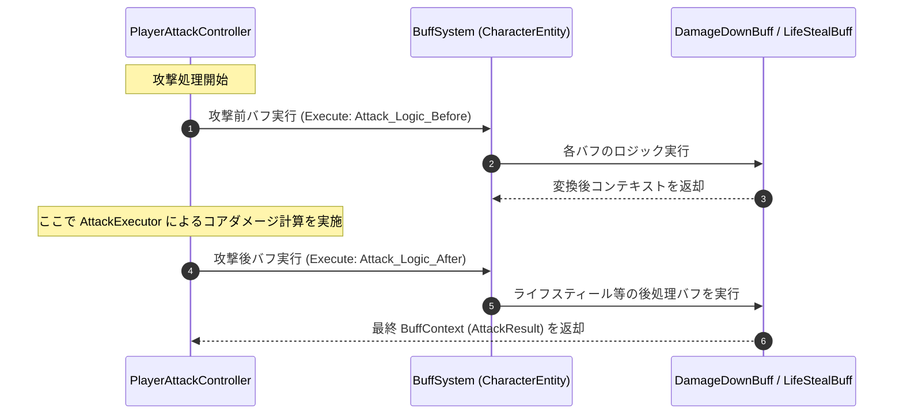

# 概要
> 💡 **モジュール概要**
> インゲーム中のキャラクターパラメータ管理、戦闘時の攻撃力・防御力・クリティカル計算、ダメージパイプライン、およびバフ（ステータス効果）システムを司るモジュールです。

| 項目 | 内容 |
| --- | --- |
| **モジュール名** | Character & Battle |
| **カテゴリ** | InGame / Core |
| **アーキテクチャ** | クリーンアーキテクチャ (Domain, Application, Adaptor, View) |

---

## 🏗️ クラス

| クラス名 | レイヤー | 役割・機能 |
| --- | --- | --- |
| **`CharacterEntity`** | Domain | キャラクター（プレイヤー/敵共通）の基底 Entity。`IAttacker` / `IDefender` を実装し HP や攻撃力などのコアデータを保持 |
| **`HealthEntity`** | Domain | HP 変化の状態管理クラス。`OnHealthChanged` イベントを発行して変化を通知 |
| **`Health`** | Domain | HP 値を表す readonly struct（ValueObject） |
| **`AttackPower`** | Domain | 攻撃力を表す readonly struct（ValueObject） |
| **`CriticalChance`** | Domain | クリティカル確率を表す readonly struct（ValueObject） |
| **`ActionParams`** | Domain | ダメージ計算に必要なパラメータをまとめた readonly struct |
| **`AttackDefinition`** | Domain | 攻撃定義クラス。`IAttackPipeline` を保持し、ステップの構成を管理 |
| **`AttackResult`** | Domain | 攻撃計算の結果（最終ダメージ・クリティカル有無）を保持する readonly struct |
| **`AttackStepContext`** | Domain | 各パイプラインステップに渡されるコンテキスト（攻撃者/防御者/定義/isJustHit等）の readonly ref struct |
| **`IAttackPipeline`** | Domain | ダメージ計算ステップのパイプラインを定義するインターフェース |
| **`AttackCalculator`** | Application | `IAttackPipeline.Execute` を呼び出し `AttackResult` を返すピュア静的クラス |
| **`AttackExecutor`** | Application | `AttackCalculator` を通じて計算し、`IDefender.TakeDamage` でダメージを適用するピュア静的クラス |
| **`IAttackStep`** | Application | パイプラインの1ステップを表すインターフェース |
| **`ConfirmedDamage`** | Application | 最終ダメージを確定するパイプラインステップ（`IAttackStep` を実装） |
| **`CriticalStep`** | Application | クリティカル発生を抽選するパイプラインステップ（`IAttackStep` を実装） |
| **`BuffBase`** | Application | バフの基底クラス（`IBuff` を実装）。`DamageDownBuff` / `LifeStealBuff` がこれを継承 |
| **`DamageDownBuff`** | Application | 防御バフの適用ロジック（`BuffBase` を継承） |
| **`LifeStealBuff`** | Application | 与ダメージ回復バフの適用ロジック（`BuffBase` を継承） |
| **`PlayerAttackController`** | Adaptor | プレイヤーの攻撃アクションを制御する Adaptor。`AttackExecutor` を呼び出してダメージを適用し、`AttackResultPresenter` へ結果を送る |
| **`PlayerBattleState`** | Adaptor | プレイヤーの戦闘中のバフ・ステータスを保持する状態クラス |
| **`EnemyBattleState`** | Adaptor | 敵の戦闘中のバフ・ステータスを保持する状態クラス |
| **`AttackResultPresenter`** | Adaptor | 攻撃結果（ダメージ・クリティカル）を View に通知する Presenter |
| **`AttackResultDTO`** | Adaptor | ダメージ通知・クリティカル発生などを View へ伝えるための readonly struct DTO |
| **`PlayerHealthHudPresenter`** | Adaptor | `IDefender.OnHealthChanged` イベントを購読し、HP 変化を `IHealthHudViewModel` へ伝達する Presenter |
| **`EnemyHealthHudPresenter`** | Adaptor | 敵の HP 変化を `IHealthHudViewModel` へ伝達する Presenter |
| **`IHealthHudViewModel`** | Adaptor | HP バーの表示バインド用インターフェース |
| **`HealthHudDTO`** | Adaptor | HP バー更新用のデータを保持する readonly struct DTO |
| **`AttackResultView`** | View | 攻撃結果（ダメージ数値・クリティカルエフェクト等）を画面に表示する MonoBehaviour |
| **`AttackResultViewModel`** | View | 攻撃結果の表示状態を保持する ViewModel（`IAttackResultViewModel` を実装） |

---

## 🔗 モジュール結合

### 📥 依存しているもの

* **`Music`**
  * *依存箇所*: `BeatType`, `MusicSyncState`
  * *詳細*: 攻撃ヒット時のタイミングに応じたジャスト判定（BeatType）や、現在のBPM情報に連動した処理（MusicSyncState）を行うためにMusicモジュールに依存します。

### 📤 依存されているもの

* **`InGame/Player`**
  * *参照箇所*: `CharacterEntity`, `PlayerAttackController`, `AttackExecutor`
  * *詳細*: プレイヤーキャラクターのHP・ステータス情報を `CharacterEntity` として保持し、攻撃アクションのトリガーとして `PlayerAttackController` および `AttackExecutor` を介してダメージフローを実行します。
* **`InGame/Enemy`**
  * *参照箇所*: `CharacterEntity`, `EnemyBattleState`, `AttackExecutor`
  * *詳細*: 敵キャラクターがパラメータを `CharacterEntity` で表現し、被弾時の状態維持やAIの攻撃契機などで `EnemyBattleState` や `AttackExecutor` を使用します。

---

# 詳細

<h2>🧅レイヤー情報</h2>

### ① Domain
> キャラクターの基本戦闘能力（HP、攻撃力、クリティカル率など）を保持するEntityや、ダメージ計算パイプラインのインターフェース（`IAttackPipeline`）、コンテキストを定義する純粋なドメインルール層です。

### ② Application
> 各種計算処理の抽象化（`AttackCalculator`, `AttackExecutor`）や、ダメージ計算における個別ロジック（`CriticalStep`, `ConfirmedDamage`）、バフシステム（`DamageDownBuff`, `LifeStealBuff`）などのビジネスロジックを実装します。

### ③ Adaptor
> 攻撃コマンドを実行する `PlayerAttackController`、戦闘中のバフ状態等を管理する `PlayerBattleState` や `EnemyBattleState`、および計算・変動したデータをUI側へ中継する各種Presenter（`AttackResultPresenter`, `PlayerHealthHudPresenter`）を定義します。

### ④ View
> Presenterが配信したDTOを受け取って、画面にダメージ数値をポップアップ描画したり、HPバーを滑らかに変動させたりするUnityの描画・UIコンポーネントを担当します。

### ⑤ Infrastructure
> 当モジュールでは使用していません。

### ⑥ Composition
> 当モジュールのクラスの依存解決（DI）は、呼び出し側となる Player または Enemy モジュールの初期化コンポーネント内で行われます。

## 🔄処理フロー

主要な処理フローごとに分けて記述します。

### ① プレイヤー攻撃実行フロー（入力イベント時）
プレイヤーが攻撃ボタンを押した際、ターゲット取得・バフ適用・パイプライン計算・ダメージ反映までの一連の処理です。

### ② HP 変化とHUDへの反映フロー（ダメージ被弾時）
ダメージを受けた際に Entity の HP が変化し、HUD（HPバー）へ即時反映される処理フローです。

### ③ バフ適用フロー（攻撃前後タイミング）
攻撃実行の前後でバフシステムが起動し、ダメージ増幅やライフスティールを処理する流れです。

