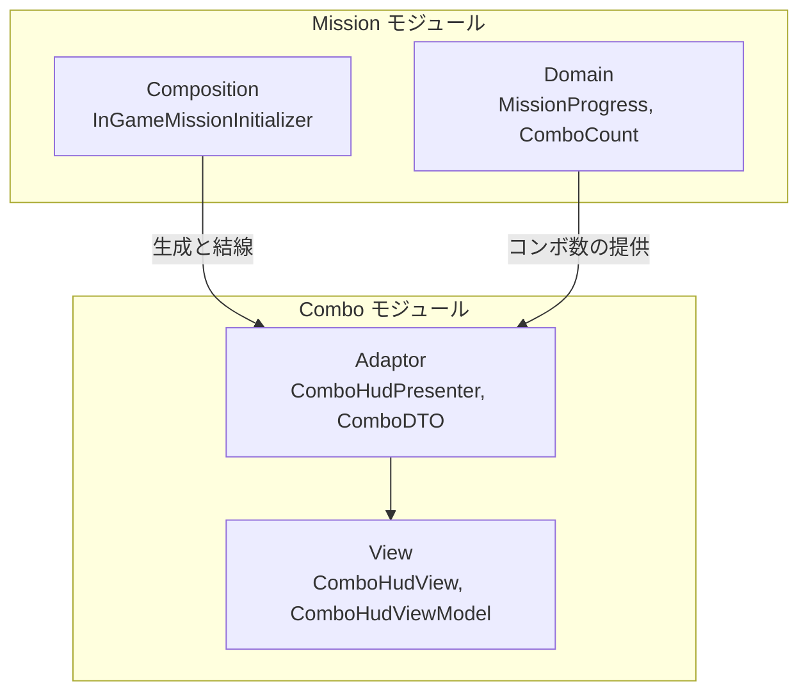
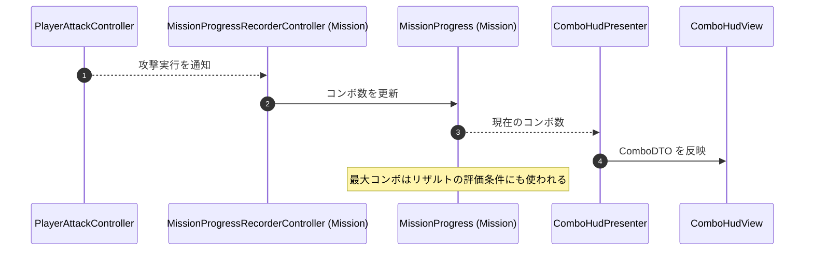

# 概要
> 💡 **モジュール概要**
> コンボ数のHUD表示を司るモジュールである。表示のみを担当し、コンボの計測と保持はMissionモジュールの`MissionProgress`が行う。

| 項目 | 内容 |
| --- | --- |
| **モジュール名** | Combo |
| **カテゴリ** | インゲーム |
| **ステータス** | 実装済み |
| **最終更新日** | 2026-08-17 |

---

## 🏗️ クラス

| クラス名 | レイヤー | 役割・機能 |
| --- | --- | --- |
| **`ComboDTO`** | Adaptor | コンボ表示用のデータ |
| **`ComboHudPresenter`** | Adaptor | コンボHUDの表示内容を更新する |
| **`IComboHudViewModel`** | Adaptor | ViewModelの契約 |
| **`ComboHudViewModel`** | View | 表示内容を保持する |
| **`ComboHudView`** | View | コンボ数を画面へ表示する |

### 🧩 Composition初期化情報

| 項目 | 内容 |
| --- | --- |
| **Initializerクラス** | なし（Missionモジュールの`InGameMissionInitializer`が構築する） |
| **公開する ModuleContainer / ServiceLocator登録型** | なし |

コンボ数はミッションの評価条件にも使われるため、計測はMissionモジュールが持ち、当モジュールはその表示だけを引き受ける。

---

## 🔗 モジュール結合

### 📥 依存しているもの

* **`Mission`**
  * *依存箇所*: `MissionProgress`, `ComboCount`
  * *詳細*: コンボ数は`MissionProgressRecorderController`が攻撃実行を購読して記録しており、当モジュールはその値を表示する

### 📤 依存されているもの

* なし
  * *詳細*: 他モジュールから参照されない表示専用のモジュールである

---

# 詳細

## 🧅レイヤー情報

### ① Domain
当モジュールでは使用していない。コンボの値はMissionモジュールのDomainが持つ。
### ② Application
当モジュールでは使用していない。
### ③ Adaptor
`ComboHudPresenter`がコンボ数を`ComboDTO`へ詰めてViewModelへ渡す。
### ④ View
`ComboHudViewModel`が表示内容を保持し、`ComboHudView`が画面へ表示する。
### ⑤ Infrastructure
当モジュールでは使用していない。
### ⑥ Composition
専用のInitializerは持たない。`InGameMissionInitializer`（Order 600）が生成と結線を行う。

## 🔌 拡張ポイント

| 拡張したいこと | 実装する場所 | 追加登録の要否 |
| --- | --- | --- |
| 表示項目を増やしたい | `ComboDTO`へフィールドを追加し、`ComboHudPresenter`で値を設定して`ComboHudView`へ反映先を足す | 不要 |

## 🔄処理フロー

主要な処理フローは、それぞれ子ページに分けている。

### ① コンボ表示の更新フロー

計測はMission側で行われ、当モジュールはその結果を受けて表示する。

