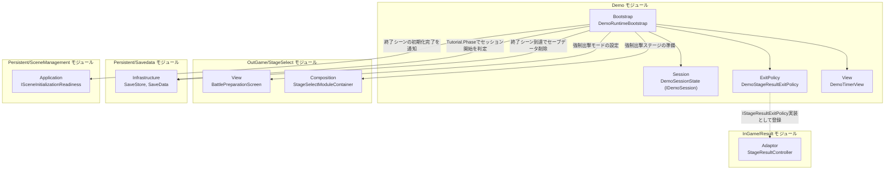
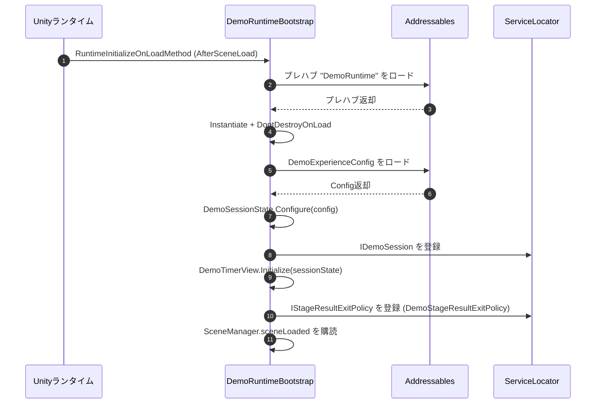
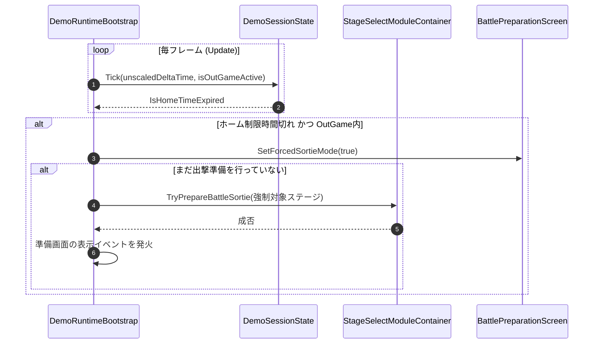
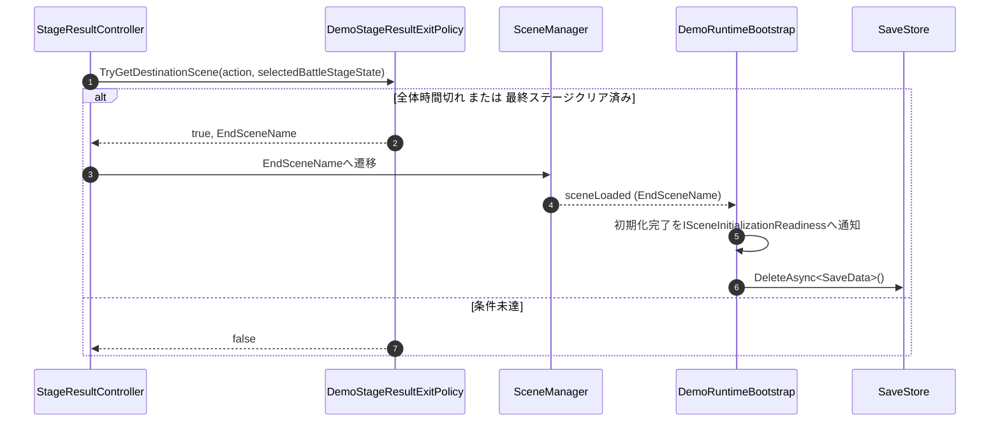

# 概要
> 💡 **モジュール概要**
> 体験版（Demo）ビルド専用のランタイムを常駐させ、ホーム滞在時間・体験版全体時間の二つのタイマー管理、時間切れ時の強制出撃、専用終了画面への遷移、終了時のセーブデータ削除を司るモジュールである。`KillChord.Demo`という独立アセンブリで構成され、`KILLCHORD_DEMO`スクリプティング定義シンボルが有効な場合のみコンパイルされる。

| 項目 | 内容 |
| --- | --- |
| **モジュール名** | Demo |
| **カテゴリ** | OutGame / Persistent 横断 |
| **ステータス** | 実装済み |
| **最終更新日** | 2026-09-09 |

---

## 🏗️ クラス

| クラス名 | 役割 | 役割・機能 |
| --- | --- | --- |
| **`DemoRuntimeBootstrap`** | Bootstrap | `RuntimeInitializeOnLoadMethod`で自身をシーンへ常駐生成し、設定ロード・各種登録・毎フレーム進行・終了時処理までを一括して担うMonoBehaviour |
| **`DemoExperienceConfig`** | Config | ホーム制限時間・全体制限時間・強制出撃先ステージID・最終ステージID・終了シーン名を保持するScriptableObject |
| **`DemoSessionState`** | Session | `IDemoSession`を実装し、タイマーの経過・期限切れ判定を保持する状態クラス |
| **`IDemoSession`** | Session | タイマー状態を読み取り専用で公開する契約 |
| **`DemoTimerView`** | View | ホームタイマー・全体タイマーの残り時間をCanvas上のTMP_Textへ反映するMonoBehaviour |
| **`DemoStageResultExitPolicy`** | ExitPolicy | `IStageResultExitPolicy`（Result モジュール所有の拡張点）を実装し、体験版固有の終了条件でリザルト遷移先を差し替える |

### 🧩 Composition初期化情報

> `DemoRuntimeBootstrap`は他モジュールのような`~Initializer`＋`Order`によるComposition層のパターンを採らない。`[RuntimeInitializeOnLoadMethod(RuntimeInitializeLoadType.AfterSceneLoad)]`が付与された静的メソッド`CreateInstance()`自体がエントリポイントであり、シーン初期化フローの外側から独立して起動する。

| 項目 | 内容 |
| --- | --- |
| **エントリポイント** | `DemoRuntimeBootstrap.CreateInstance()`（`RuntimeInitializeOnLoadMethod`、`AfterSceneLoad`） |
| **生成方法** | Addressablesアドレス`"DemoRuntime"`のプレハブをロードし、`Instantiate`後に`DontDestroyOnLoad`で常駐化する |
| **アセンブリ制約** | `KillChord.Demo.asmdef`の`defineConstraints`に`KILLCHORD_DEMO`を指定しており、当該シンボルが有効なビルドでのみアセンブリごとコンパイルされる |
| **公開する ServiceLocator登録型** | `DemoRuntimeBootstrap.Start()`が`IDemoSession`（`DemoSessionState`本体）と`IStageResultExitPolicy`（`DemoStageResultExitPolicy`）の2つを登録する |

---

## 🔗 モジュール結合

### 📥 依存しているもの

* **`OutGame/StageSelect`**
  * *依存箇所*: `BattlePreparationScreen.SetForcedSortieMode`/`IsForcedSortieMode`、`StageSelectModuleContainer`（`StageTree`、`SelectionService.TryPrepareBattleSortie`、`ReturnSceneName`）
  * *詳細*: ホーム制限時間切れを検知すると、強制対象ステージ（`DemoExperienceConfig.ForcedStageId`）の出撃を準備し、準備画面を戻る・スキル編成不可の強制出撃モードへ切り替える
* **`InGame/Result`**
  * *依存箇所*: `IStageResultExitPolicy`（拡張点となる抽象で、詳細はResultモジュール側の文書を参照）
  * *詳細*: `DemoStageResultExitPolicy`がこの抽象を実装し、体験版全体時間切れ、または最終ステージ（`DemoExperienceConfig.FinalStageId`）クリア時に、通常のリザルト遷移先を体験版終了シーンへ差し替える
* **`Persistent/Savedata`**
  * *依存箇所*: `SaveStore`、`SaveData.Tutorial.Phase`、`SaveData.StageProgress`
  * *詳細*: チュートリアル戦闘完了（`TutorialPhase.BattleCompleted`）以降にOutGameへ到達した時点でタイマーを開始し、最終ステージのクリア判定にも`SaveData`を参照する。体験版終了シーン到達時には`SaveStore.DeleteAsync<SaveData>()`でセーブデータを削除する
* **`Persistent/SceneManagement`**
  * *依存箇所*: `ISceneInitializationReadiness`
  * *詳細*: 体験版終了シーン（`DemoExperienceConfig.EndSceneName`）がロードされた際に初期化完了を通知する
* **`Persistent/Addressables基盤`**
  * *依存箇所*: `KillChord.Runtime.InfraStructure.Addressables`の拡張メソッド、`UnityEngine.AddressableAssets.Addressables`
  * *詳細*: 自身のプレハブ（アドレス`"DemoRuntime"`）と`DemoExperienceConfig`（アドレス`nameof(DemoExperienceConfig)`）をAddressables経由でロードする

### 📤 依存されているもの

* **`InGame/Result`**
  * *参照箇所*: `StageResultInitializationModule.Ready()`（Order 400）が`ServiceLocator.TryGetInstance<IStageResultExitPolicy>`で任意解決し、`StageResultController`のコンストラクタへ渡す
  * *詳細*: 体験版ビルドで`DemoRuntimeBootstrap`が`IStageResultExitPolicy`を登録済みの場合のみ、Resultモジュール側の遷移先解決に体験版固有の分岐が加わる。未登録（非体験版ビルド）の場合は`null`のまま扱われ、通常の遷移ロジックにフォールバックする

---

# 詳細

## 🧅レイヤー情報

`KillChord.Demo`は独立アセンブリであり、既存の6層（Domain / Application / Adaptor / View / Infrastructure / Composition）へ厳密には分割されていない。実態に近い区分として以下の役割で構成される。

### ① Domain
当モジュールでは使用していない。
### ② Application
当モジュールでは使用していない。
### ③ Adaptor
当モジュールでは使用していない。`DemoStageResultExitPolicy`はResultモジュール所有の`IStageResultExitPolicy`（Adaptor層の抽象）を実装するが、実装クラス自体はDemoモジュール内では層分けせず配置されている。
### ④ View
`DemoTimerView`がホームタイマー・全体タイマーの残り時間表示を担う。Canvasの表示切り替え（`_session.IsStarted`でオンオフ）も含む。
### ⑤ Infrastructure
当モジュールでは使用していない。プレハブ・設定アセットのロードにはRuntime側の`Addressables`基盤を利用するのみで、独自のInfrastructure層は持たない。
### ⑥ Composition
`DemoRuntimeBootstrap`単体が、常駐生成・設定ロード・`IDemoSession`/`IStageResultExitPolicy`の登録・毎フレーム進行・シーン遷移監視・セーブデータ削除までを一手に担う。

## 🔄処理フロー

主要な処理フローごとに分けて記述する。

### ① 起動時のブートストラップ

シーンロード後に自動生成され、設定ロードと各種サービスの登録を行う。

### ② ホームタイマー切れ時の強制出撃

OutGame滞在中にホーム制限時間を超えると、強制対象ステージへの出撃準備画面へ固定する。

### ③ 体験版終了時のセーブデータ削除

制限時間切れ、または最終ステージクリアで遷移する専用終了シーンの到達を検知し、セーブデータを削除する。

