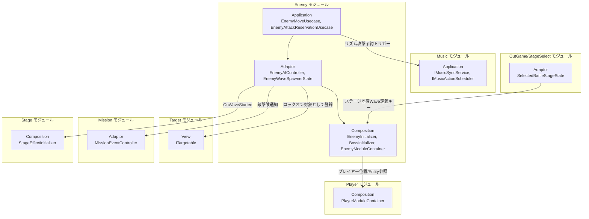
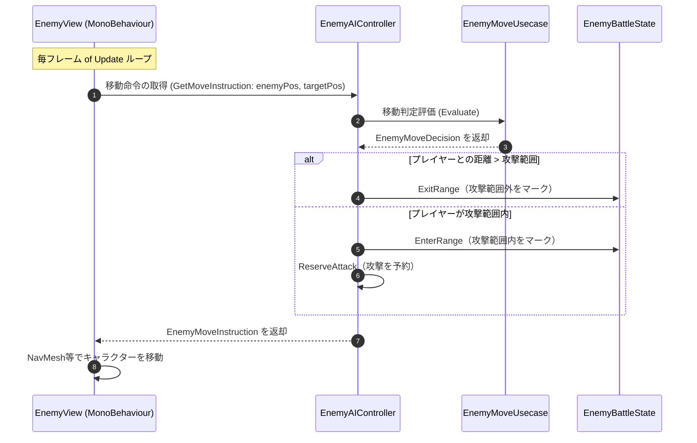
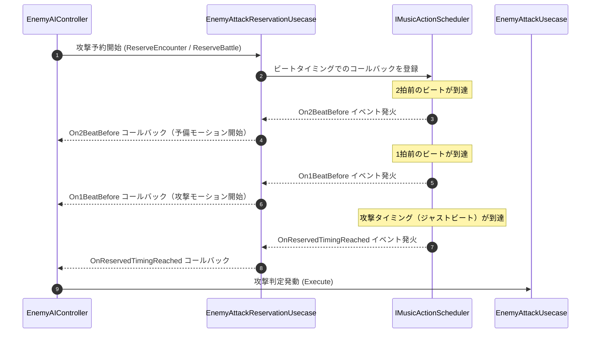
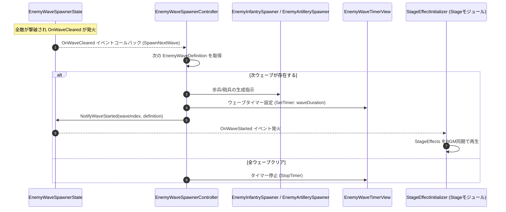

# 概要
> 💡 **モジュール概要**
> インゲーム中の敵キャラクター（雑魚敵からボスまで）のAI意思決定、移動制御、攻撃予約（リズム同期）、およびスポナー（出現制御）を司るモジュールです。ステージごとに異なるWave定義をAddressables経由でロードし、Wave開始をイベントで他モジュールへ通知します。

| 項目 | 内容 |
| --- | --- |
| **モジュール名** | Enemy |
| **カテゴリ** | InGame / Character |
| **アーキテクチャ** | クリーンアーキテクチャ (Domain, Application, Adaptor, View, Composition) |
| **ステータス** | 実装済み（`BossInitializer`はテスト専用ドライバとして残存、本実装への統合は未完了） |
| **最終更新日** | 2026-07-15 |

---

## 🏗️ クラス

| クラス名 | レイヤー | 役割・機能 |
| --- | --- | --- |
| **`EnemyType`** | Domain | 敵のクラス分け（歩兵・砲兵等）。ファイル名は`EnemyTypeEnum.cs`だが型名は`EnemyType` |
| **`EnemyWaveDefinition`** | Domain | 1ウェーブ分のデータ構成（敵種類・数・継続時間・`StageEffects`） |
| **`EnemyWaves`** | Domain | `EnemyWaveDefinition[]`をラップし、ループ設定・次ウェーブ取得・最終ウェーブ判定を提供 |
| **`EnemyMoveDecision`** | Domain | 移動AIが次フレームに取るべき行動を保持するreadonly struct |
| **`EnemyMoveUsecase`** | Application | 移動方向の算出やレイキャストによる衝突回避ロジック |
| **`EnemyAttackUsecase`** | Application | 攻撃判定の発動と適用ロジック |
| **`EnemyAttackReservationUsecase`** | Application | ビートに同期した非同期攻撃予約システム |
| **`EnemyRaycastDetectService`** | Application | 索敵・壁検知レイキャストロジック |
| **`NearestAttackPositionSearchService`** | Application | プレイヤーへ接近する際の最適な攻撃座標を探索 |
| **`EnemyAIController`** | Adaptor | AIの状態管理と`EnemyMoveUsecase`/`EnemyAttackReservationUsecase`への仲介 |
| **`EnemyBattleState`** | Adaptor | 敵の戦闘中のバフ・ステータスを保持 |
| **`EnemyWaveSpawnerState`** | Adaptor | 現在の出現フェーズを保持。`OnWaveStarted(int, EnemyWaveDefinition)`イベントを公開 |
| **`EnemyWaveSpawnerController`** | Adaptor | `OnWaveCleared`購読による次ウェーブ生成指示、`NotifyWaveStarted`の発火。歩兵・砲兵の2スポナーを扱う |
| **`DamageNumberDTO`** | Adaptor | 被ダメージの数値表示通知用 readonly struct DTO |
| **`IRaycastDetectView`** | Adaptor | 索敵データの伝達インターフェース |
| **`EnemyWaveTimerView`** | View | ウェーブの残り時間を UI に表示する MonoBehaviour |
| **`EnemyModuleContainer`** | Composition | `EnemyWaveSpawnerState`等をServiceLocatorへ公開するContainer（Stageモジュール等が参照） |
| **`EnemyInitializer`** | Composition | 一般敵のセットアップ。ステージ固有のWave定義をAddressablesロード |
| **`BossInitializer`** | Composition | ボス戦闘のセットアップ（テスト専用ドライバ、本実装統合は未完了） |
| **`EnemyInfantrySpawner`** | Composition | オブジェクトプールを使った歩兵の動的生成管理 |
| **`EnemyPools`** | Composition | 敵プレハブのプール管理クラス |

### 🧩 Composition初期化情報

| 項目 | 内容 |
| --- | --- |
| **Initializerクラス** | `EnemyInitializer` |
| **Order** | 700 |
| **公開する ModuleContainer / ServiceLocator登録型** | `EnemyModuleContainer`（`EnemyWaveSpawnerState`等を保持。`StageEffectInitializer`(Order 800)が参照する） |

---

## 🔗 モジュール結合

### 📥 依存しているもの

* **`Player`**
  * *依存箇所*: `PlayerModuleContainer` (Composition), `PlayerEntity` (Domain)
  * *詳細*: AI移動において追従ターゲットとするためにプレイヤーの座標や`PlayerEntity`情報を参照します。`EnemyInitializer`・`BossInitializer`双方が`ServiceLocator.GetInstance<PlayerModuleContainer>()`で直接取得しており、強い結合が残っています。
* **`Music`**
  * *依存箇所*: `IMusicSyncService`, `IMusicActionScheduler` (Adaptor)
  * *詳細*: ビート同期攻撃を予約・実行するためにMusicモジュールの非同期アクション予約システムを利用します。
* **`Target`**
  * *依存箇所*: `ITargetable`実装の登録
  * *詳細*: 敵がプレイヤーやカメラのロックオン対象として扱われるよう、自身をTargetモジュールへ登録します。
* **`OutGame/StageSelect`**
  * *依存箇所*: `SelectedBattleStageState`, `StageDefinition.EnemyWaveDefinitionAssetKey`
  * *詳細*: 選択中ステージに紐づくWave定義のAddressablesキーを取得し、ステージごとに異なる敵Wave構成をロードします。

### 📤 依存されているもの

* **`Mission`**
  * *参照箇所*: `MissionEventController` (Adaptor)
  * *詳細*: 敵が撃破された際のイベントをミッションモジュールに通知し、ステージクリアの条件判定等に利用されます。
* **`Stage`**
  * *参照箇所*: `EnemyWaveSpawnerState.OnWaveStarted`（`EnemyModuleContainer`経由）
  * *詳細*: `StageEffectInitializer`がWave開始イベントを購読し、`EnemyWaveDefinition.StageEffects`に基づく演出をBGM同期で再生します。

---

# 詳細

## 🧅レイヤー情報

### ① Domain
出現敵とウェーブ数の対応データ（`EnemyWaveDefinition`）、ウェーブ全体のループ・進行管理（`EnemyWaves`）、および毎フレームAIが移動すべき情報（`EnemyMoveDecision`）といった基本行動データ定義を保持します。
### ② Application
索敵、最適な攻撃立ち位置の探索、移動意思決定（`EnemyMoveUsecase`）、およびビートと同期させて2拍前・1拍前・攻撃のタイミングをコールバック処理する「攻撃予約」（`EnemyAttackReservationUsecase`）などのビジネスロジックを実装します。
### ③ Adaptor
AIの主要な状態管理とユースケースの連携を担う`EnemyAIController`、戦闘中フラグ（`EnemyBattleState`）、ウェーブ撃破検知と次ウェーブ生成指示・`OnWaveStarted`通知を行う`EnemyWaveSpawnerController`/`EnemyWaveSpawnerState`などのアダプターを提供します。
### ④ View
ウェーブの制限時間を画面上に描画・表示制御する`EnemyWaveTimerView`などを担当します。
### ⑤ Infrastructure
`EnemyWaveDefinitionAsset`が敵Wave構成・`StageEffects`をScriptableObjectとして保持し、Addressables経由でステージごとにロードされます。
### ⑥ Composition
一般敵の`EnemyInitializer`、ボスの`BossInitializer`（テスト専用）、オブジェクトプールにより大量の敵歩兵を動的に管理する`EnemyInfantrySpawner`などの生成・依存注入、ライフサイクル管理を担当します。`EnemyModuleContainer`が他モジュールへの公開窓口です。

## 🔌 拡張ポイント

| 拡張したいこと | 実装する場所 | 追加登録の要否 |
| --- | --- | --- |
| Wave開始時の新しい演出を追加したい | `IStageEffectDefinition`（Domain, Stageモジュール）を実装し、`StageEffectAssetBase`（Infrastructure, Stageモジュール）を継承したAssetクラスを作成し、`EnemyWaveDefinitionAsset`の`StageEffects`に設定する | 不要（`[SerializeReference, SubclassSelector]`によりInspectorへ自動的に出現） |
| 新しい敵種別を追加したい | `EnemyType` Enumに値を追加し、対応するスポナー・AI分岐に追記する | 必要（追記漏れの場合、既定値または未対応として無視される） |

## 🔄処理フロー

主要な処理フローごとに分けて記述します。

### ① AI 移動制御フロー（毎フレーム）
敵がプレイヤーを追尾・接近し、攻撃範囲に入った際に攻撃を予約する処理フローです。

### ② リズム同期攻撃予約フロー（非同期・イベント駆動）
敵の攻撃は「2拍前・1拍前・攻撃本番」と3段階で非同期に予約・実行されます。

### ③ ウェーブスポナー & Wave開始通知フロー（ウェーブクリア／開始時）
ウェーブ内の全敵が撃破されると次ウェーブが生成され、Wave開始が他モジュールへ通知されます。

