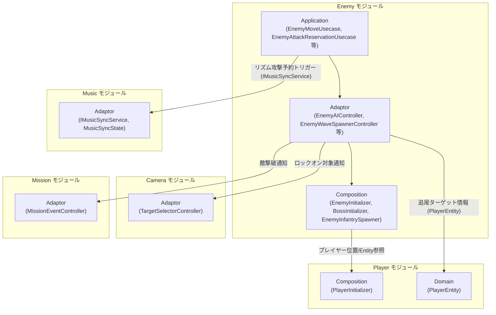
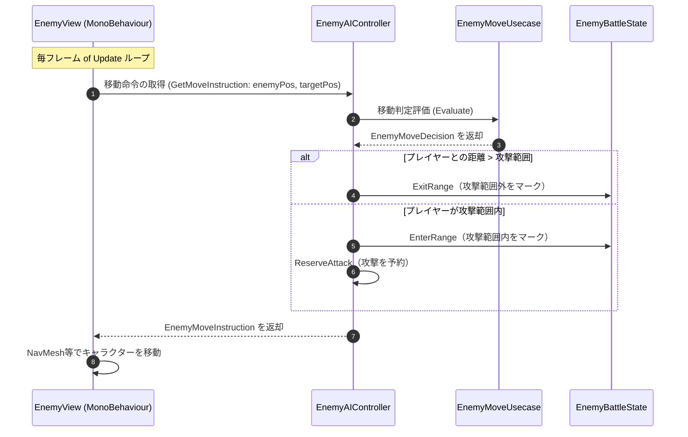
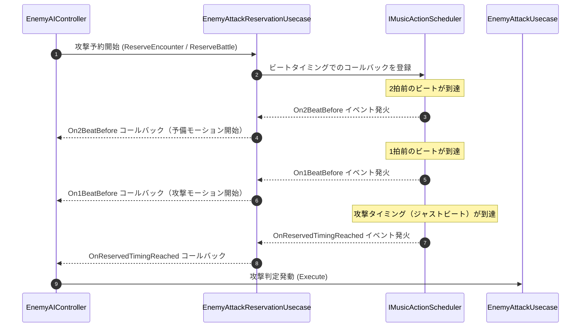
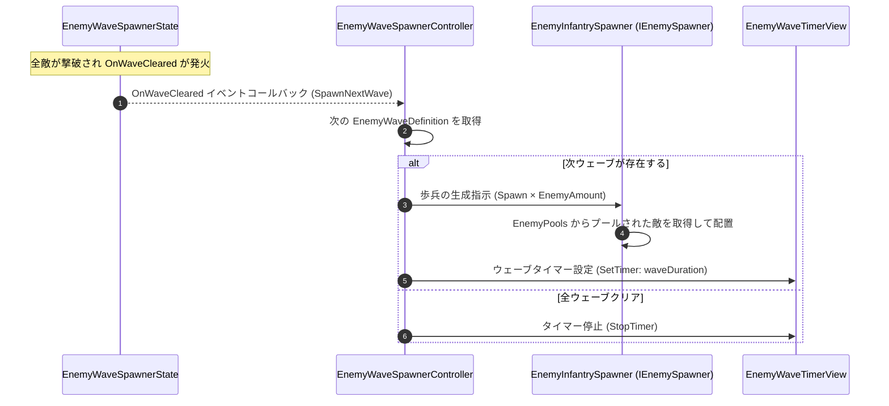

# 概要
> 💡 **モジュール概要**
> インゲーム中の敵キャラクター（雑魚敵からボスまで）のAI意思決定、移動制御、攻撃予約（リズム同期）、およびスポナー（出現制御）を司るモジュールです。

| 項目 | 内容 |
| --- | --- |
| **モジュール名** | Enemy |
| **カテゴリ** | InGame / Character |
| **アーキテクチャ** | クリーンアーキテクチャ (Domain, Application, Adaptor, View, Composition) |

---

## 🏗️ クラス

| クラス名 | レイヤー | 役割・機能 |
| --- | --- | --- |
| **`EnemyWaveDefinition`** | Domain | 出現ウェーブのデータ構成クラス（何体のどの種類の敵を出すかを定義） |
| **`EnemyMoveDecision`** | Domain | 移動AIが次フレームに取るべき行動（移動方向・速度・目標地点）を保持する readonly struct |
| **`EnemyMoveUsecase`** | Application | 移動方向の算出やレイキャストによる衝突回避ロジック。`EnemyMoveDecision` を返す |
| **`EnemyAttackUsecase`** | Application | 攻撃判定の発動と適用ロジック |
| **`EnemyAttackReservationUsecase`** | Application | ビートに同期した非同期攻撃予約システム。`IMusicActionScheduler` を通じて「2拍前」「1拍前」「攻撃タイミング」のイベントを発火 |
| **`EnemyRaycastDetectService`** | Application | 索敵・壁検知レイキャストロジック |
| **`NearestAttackPositionSearchService`** | Application | プレイヤーへ接近する際の最適な攻撃座標を探索するサービス |
| **`EnemyAIController`** | Adaptor | AIの状態管理（移動・攻撃予約の起動）と `EnemyMoveUsecase` / `EnemyAttackReservationUsecase` への仲介。`IDisposable` を実装 |
| **`EnemyBattleState`** | Adaptor | 敵の戦闘中のバフ・ステータス（攻撃範囲内外フラグ・ターゲット等）を保持するクラス |
| **`EnemyWaveSpawnerState`** | Adaptor | 現在の出現フェーズ（クリア済みウェーブ数・最終ウェーブフラグ等）を保持するクラス |
| **`EnemyWaveSpawnerController`** | Adaptor | `EnemyWaveSpawnerState.OnWaveCleared` を購読し、次ウェーブの敵生成を指示するコントローラー。`IDisposable` を実装 |
| **`DamageNumberDTO`** | Adaptor | 被ダメージの数値表示通知用 readonly struct DTO |
| **`IRaycastDetectView`** | Adaptor | 索敵データの伝達インターフェース |
| **`EnemyWaveTimerView`** | View | ウェーブの残り時間を UI に表示する MonoBehaviour（`IEnemyWaveTimerView` を実装） |
| **`EnemyInitializer`** | Composition | 一般敵の依存を解決しセットアップする MonoBehaviour |
| **`BossInitializer`** | Composition | ボス戦闘のセットアップ・プレイヤー参照の紐付けを行う MonoBehaviour |
| **`EnemyInfantrySpawner`** | Composition | オブジェクトプールを使った歩兵の動的生成管理（`IEnemySpawner` を実装） |
| **`EnemyPools`** | Composition | 敵プレハブのプール管理クラス（`IShellPool` を実装） |

---

## 🔗 モジュール結合

### 📥 依存しているもの

* **`Player`**
  * *依存箇所*: `PlayerInitializer` (Composition), `PlayerEntity` (Domain)
  * *詳細*: AI移動において追従ターゲットとするためにプレイヤーの座標や `PlayerEntity` 情報を参照します。
* **`Music`**
  * *依存箇所*: `IMusicSyncService` (Adaptor)
  * *詳細*: ビート同期攻撃を予約・実行するためにMusicモジュールの提供する非同期アクション予約システム（IMusicActionScheduler）等を利用します。

### 📤 依存されているもの

* **`Camera`**
  * *参照箇所*: `TargetSelectorController` (Adaptor)
  * *詳細*: 敵キャラクターがカメラのロックオン対象として検索・登録される際、抽象インターフェース（`ILockOnTarget` 等）を介して接続されます。
* **`Mission`**
  * *参照箇所*: `MissionEventController` (Adaptor)
  * *詳細*: 敵が撃破された際のイベントをミッションモジュールに通知し、ステージクリアの条件判定等に利用されます。

---

# 詳細

## 🧅レイヤー情報

### ① Domain
> 出現敵とウェーブ数の対応データ（`EnemyWaveDefinition`）や、毎フレームAIが移動すべき情報（`EnemyMoveDecision`）といった基本行動データ定義を保持します。

### ② Application
> 索敵、最適な攻撃立ち位置の探索、移動意思決定（`EnemyMoveUsecase`）、およびビートと同期させて2拍前・1拍前・攻撃のタイミングをコールバック処理する「攻撃予約」（`EnemyAttackReservationUsecase`）などのビジネスロジックを実装します。

### ③ Adaptor
> AIの主要な状態管理とユースケースの連携を担う `EnemyAIController`、戦闘中フラグ（`EnemyBattleState`）、およびウェーブ撃破を検知して次の出現指示を送る `EnemyWaveSpawnerController` などのアダプターを提供します。

### ④ View
> ウェーブの制限時間を画面上に描画・表示制御する `EnemyWaveTimerView` などを担当します。

### ⑤ Infrastructure
> 当モジュールでは使用していません。

### ⑥ Composition
> 一般敵の `EnemyInitializer`、ボスの `BossInitializer`、オブジェクトプールにより大量の敵歩兵を動的に管理する `EnemyInfantrySpawner` などの生成・依存注入、ライフサイクル管理を担当します。

## 🔄処理フロー

主要な処理フローごとに分けて記述します。

### ① AI 移動制御フロー（毎フレーム）
敵がプレイヤーを追尾・接近し、攻撃範囲に入った際に攻撃を予約する処理フローです。

### ② リズム同期攻撃予約フロー（非同期・イベント駆動）
敵の攻撃は「2拍前・1拍前・攻撃本番」と3段階で非同期に予約・実行されます。

### ③ ウェーブスポナーフロー（ウェーブクリア時）
ウェーブ内の全敵が撃破されると、次ウェーブの敵が自動的に生成される処理フローです。

