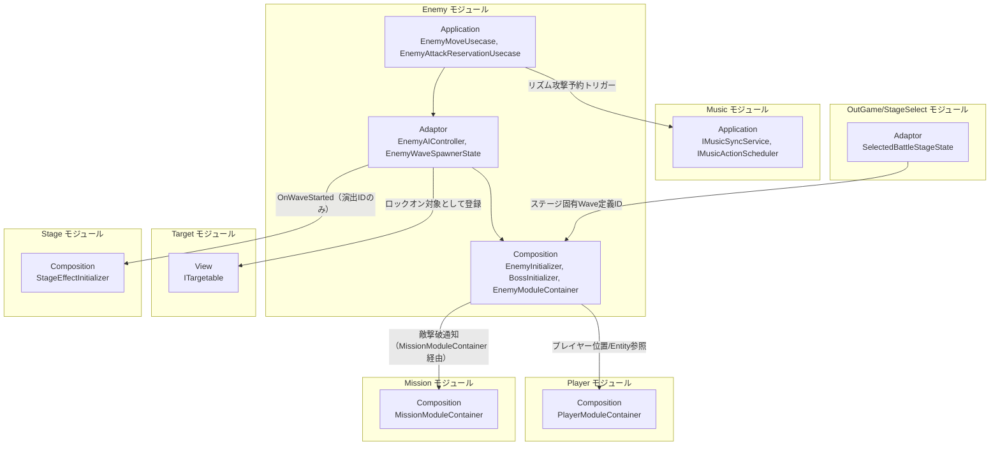
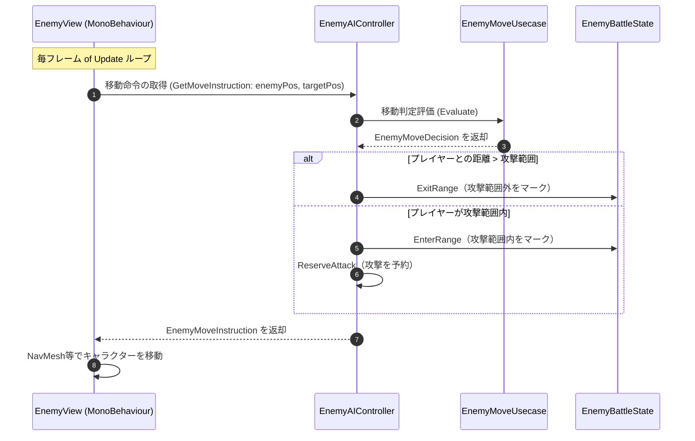
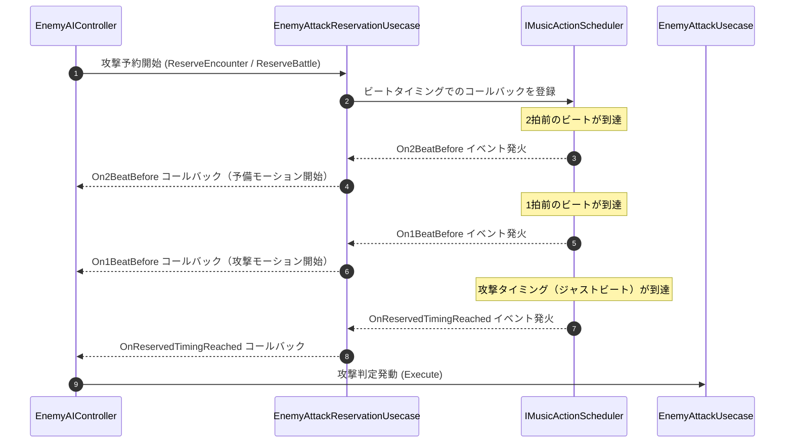
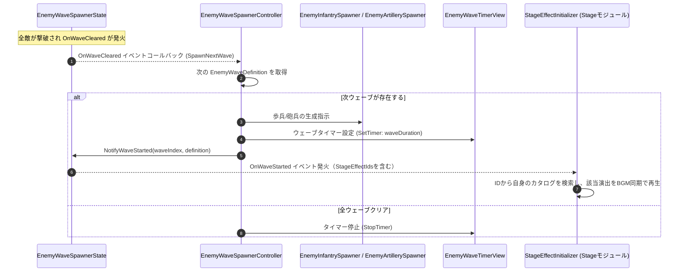

# 概要
> 💡 **モジュール概要**
> インゲーム中の敵キャラクター（雑魚敵からボスまで）のAI意思決定、移動制御、攻撃予約（リズム同期）、およびスポナー（出現制御）を司るモジュールである。Addressables経由で共通のWave定義リポジトリをロードし、選択ステージのIDに対応するWaveを生成して、Wave開始をイベントで他モジュールへ通知する。

| 項目 | 内容 |
| --- | --- |
| **モジュール名** | Enemy |
| **カテゴリ** | InGame / Character |
| **ステータス** | 実装済み（`BossInitializer`はテスト専用ドライバとして残存、本実装への統合は未完了） |
| **最終更新日** | 2026-08-17 |

---

## 🏗️ クラス

| クラス名 | レイヤー | 役割・機能 |
| --- | --- | --- |
| **`EnemyType`** | Domain | 敵のクラス分け（歩兵・砲兵等）。ファイル名は`EnemyTypeEnum.cs`だが型名は`EnemyType` |
| **`EnemyDefinitionId`** | Domain | 敵定義を識別するID |
| **`EnemyWaveDefinition`** / **`EnemyWaveDefinitionId`** / **`EnemyWaveDetail`** | Domain | 1ウェーブ分の構成（敵種類・数・継続時間・演出ID）とその識別子、明細 |
| **`EnemyWaves`** | Domain | `EnemyWaveDefinition[]`をラップし、ループ設定・次ウェーブ取得・最終ウェーブ判定を提供 |
| **`EnemyMoveSpec`** / **`EnemyMoveDecision`** | Domain | 移動パラメータと、移動AIが次フレームに取る行動 |
| **`EnemyAttackMusicSpec`** | Domain | 敵の攻撃に関する音楽同期のタイミング情報 |
| **`ShellEntity`** / **`ShellAttackSpec`** | Domain | 砲弾のEntityと、砲弾固有の攻撃パラメータ |
| **`BossAttackKind`** | Domain | ボスの攻撃種別 |
| **`EnemyMoveUsecase`** | Application | 移動方向の算出とレイキャストによる衝突回避 |
| **`EnemyAttackUsecase`** / **`EnemyAttackReservationUsecase`** | Application | 攻撃の実行と、ビートに同期した攻撃予約 |
| **`ShellAttackUsecase`** / **`ShellReservationUsecase`** | Application | 砲弾の攻撃処理と、爆発の予約 |
| **`BossAttackReservationUsecase`** / **`EnemyTripleShotAttackUsecase`** | Application | ボス専用の攻撃予約と、3方向攻撃 |
| **`EnemyRaycastDetectService`** | Application | 索敵・壁検知のレイキャスト |
| **`NearestAttackPositionSearchService`** | Application | プレイヤーへ接近する際の最適な攻撃座標を探索 |
| **`IEnemyWaveDefinitionRepository`** / **`IEnemyRaycastDetectRepository`** / **`INearestAttackPositionSearchRepository`** | Application | 各種リポジトリ境界 |
| **`EnemyAIController`** | Adaptor | AIの状態管理と、移動・攻撃予約への仲介 |
| **`BossAIController`** / **`BossAttackPattern`** | Adaptor | ボスの行動制御と、攻撃パターン1種の束 |
| **`IEnemySharedFacade`** / **`IEnemyStateFacade`** / **`IEnemyMovementAIFacade`** / **`IEnemyBattleAIFacade`** | Adaptor | BehaviorGraphから敵の情報・状態・移動・戦闘へ触るためのファサード契約 |
| **`IEnemyAttackController`** | Adaptor | 敵の攻撃コントローラーの契約 |
| **`EnemyInfantryAttackController`** / **`EnemyArtilleryAttackController`** / **`EnemyTripleShotAttackController`** | Adaptor | 歩兵・砲兵・3方向攻撃それぞれの攻撃制御 |
| **`ShellController`** / **`ShellSpecPresenter`** | Adaptor | 砲弾の制御と、砲弾パラメータのView伝達 |
| **`EnemyBattleState`** | Adaptor | 敵の戦闘中の状態を保持 |
| **`EnemyWaveSpawnerState`** / **`EnemyWaveSpawnerController`** | Adaptor | 出現フェーズの保持（`OnWaveStarted`を公開）と、次ウェーブの生成指示 |
| **`EnemyRaycastDetectController`** / **`NearestAttackPositionSearchController`** | Adaptor | 索敵と攻撃位置探索の窓口 |
| **`EnemyHealthHudPresenter`** | Adaptor | 敵HPのHUD反映 |
| **`DamageNumberDTO`** / **`DamageNumberType`** / **`IDamageNumber`** | Adaptor | 被ダメージ数値表示の通知 |
| **`IEnemySpawner`** / **`IShellSpawner`** / **`IShellLifeCycle`** / **`IShellView`** | Adaptor | 生成とライフサイクルの契約 |
| **`EnemyBattleAIFacade`** / **`EnemyMovementAIFacade`** / **`EnemyStateFacade`** / **`EnemySharedFacade`** | View | 上記ファサード契約の実装。ボス用も`Boss/AIFacade/`配下に同構成で存在する |
| **`AttackTargetAction`** / **`MoveToAttackAction`** / **`StopMovingAction`** / **`GetStunnedAction`** | View | BehaviorGraphのActionノード。ボス用も`Boss/BehaviorGraphNode/`配下に存在する |
| **`IsTargetInAttackRangeCondition`** / **`IsAimSightClearCondition`** / **`IsAttackingCondition`** / **`IsStunnedCondition`** | View | BehaviorGraphのConditionノード |
| **`EnemyMoveView`** / **`BossMoveView`** | View | 実際のTransform移動 |
| **`EnemyHealthView`** / **`EnemyHealthBillboardView`** | View | 敵HPバーの表示と、常にカメラを向く制御 |
| **`DamageNumberView`** / **`DamageNumberStyle`** / **`DamageNumberExitType`** | View | ダメージ数値の表示と、その見た目・消え方の設定 |
| **`EnemyWaveTimerView`** | View | ウェーブの残り時間表示 |
| **`EnemyRaycastDetectView`** / **`TripleShotRaycastDetectView`** / **`NearestAttackPositionSearchView`** | View | 索敵と攻撃位置探索のUnity側実装 |
| **`EnemySpawnPositionSearcher`** / **`SpawnPositionPair`** | View | 敵の生成位置の探索 |
| **`ShellView`** / **`ShellSpawner`** / **`IShellPool`** / **`IShellInitializer`** | View | 砲弾の表示・生成・プール |
| **`FootstepSoundConfig`** / **`WarningDisplayState`** | View | 足音設定と、警告表示の状態 |
| **`EnemyDefinitionAsset`** / **`EnemyDefinitionRepository`** / **`EnemyFactory`** | Infrastructure | 敵定義アセットの保持・検索と、そこからのDomain生成 |
| **`EnemyWaveDefinitionAsset`** / **`EnemyWaveDefinitionRepository`** | Infrastructure | Wave定義アセットとID検索 |
| **`EnemyMoveSpecAsset`** / **`EnemyMusicSpecAsset`** / **`ShellAttackSpecAsset`** / **`ShellFactory`** | Infrastructure | 移動・音楽同期・砲弾パラメータのアセットと生成 |
| **`BossAttackEntryAsset`** / **`BossAttackEntryRepo`** | Infrastructure | ボスの攻撃定義アセットとその集合 |
| **`EnemyInitializer`** / **`EnemyModuleContainer`** | Composition | 敵まわりの構築とServiceLocatorへの公開（Order 700） |
| **`EnemyLifeCycle`** / **`BossLifeCycle`** / **`ShellLifeCycle`** | Composition | 敵・ボス・砲弾それぞれの依存構築とライフサイクル管理 |
| **`EnemySpawnerRouter`** | Composition | 敵定義から処理種別を解決し、対応するスポナーへ生成を委譲する |
| **`EnemyInfantrySpawner`** / **`EnemyArtillerySpawner`** / **`EnemyPools`** | Composition | 歩兵・砲兵の生成と、プレハブのプール管理 |
| **`IEnemyAttackControllerGenerator`** / **各Generator** / **`EnemyAttackControllerContext`** | Composition | 敵種別ごとの攻撃コントローラー生成と、その生成コンテキスト |
| **`BossInitializer`** | Composition | ボス戦闘のセットアップ |

### 🧩 Composition初期化情報

| 項目 | 内容 |
| --- | --- |
| **Initializerクラス** | `EnemyInitializer` |
| **Order** | 700 |
| **公開する ModuleContainer / ServiceLocator登録型** | `EnemyModuleContainer`（`EnemyWaveSpawnerState`・`StageEffectCatalog`等を保持。`StageEffectInitializer`(Order 800)が参照する） |

---

## 🔗 モジュール結合

### 📥 依存しているもの

* **`Player`**
  * *依存箇所*: `PlayerModuleContainer` (Composition), `PlayerEntity` (Domain)
  * *詳細*: AI移動において追従ターゲットとするためにプレイヤーの座標や`PlayerEntity`情報を参照する。`EnemyInitializer`・`BossInitializer`双方が`ServiceLocator.GetInstance<PlayerModuleContainer>()`で直接取得しており、強い結合が残っている
* **`Music`**
  * *依存箇所*: `IMusicSyncService`, `IMusicActionScheduler` (Adaptor)
  * *詳細*: ビート同期攻撃を予約・実行するためにMusicモジュールの非同期アクション予約システムを利用する
* **`Target`**
  * *依存箇所*: `ITargetable`実装の登録
  * *詳細*: 敵がプレイヤーやカメラのロックオン対象として扱われるよう、自身をTargetモジュールへ登録する
* **`OutGame/StageSelect`**
  * *依存箇所*: `SelectedBattleStageState`, `BattleStageDefinition.EnemyWaveDefinitionId`
  * *詳細*: 選択中ステージに紐づくWave定義IDを取得し、Addressablesロード済みの共通リポジトリからステージごとに異なる敵Wave構成を生成する

### 📤 依存されているもの

* **`Mission`**
  * *参照箇所*: `MissionModuleContainer.MissionEventController`（`EnemyLifeCycle`/`BossLifeCycle`がServiceLocatorから`MissionModuleContainer`を取得して参照）
  * *詳細*: 敵が撃破された際のイベントをミッションモジュールに通知し、ステージクリアの条件判定等に利用される。以前は`ServiceLocator.GetInstance<MissionEventController>()`による直接取得だったが、`MissionModuleContainer`経由に統一されました
* **`Stage`**
  * *参照箇所*: `EnemyWaveSpawnerState.OnWaveStarted`（`EnemyModuleContainer`経由）
  * *詳細*: `StageEffectInitializer`がWave開始イベントを購読し、`EnemyWaveDefinition.StageEffectIds`（演出IDのリスト）を受け取る。以前は`IStageEffectDefinition`（Stage側のDomain型）をEnemyのDomain層が直接保持していましたが、2026-07-16の疎結合化でIDのみのやり取りに変更され、EnemyのDomain層からStageのDomain型への参照は無くなりました（詳細は`Assets/Docs/Enemy-Stageモジュール結合改善計画書.md`参照）。ただし`EnemyModuleContainer.StageEffectCatalog`（`EnemyWaveDefinitionAsset.CreateStageEffectCatalog()`が生成）が、`StageEffectInitializer`側で独自のカタログ（`_stageEffectCatalogAssets`）が未設定の場合の互換フォールバックとして残っており、この経路ではEnemyのInfrastructure層が`IStageEffectDefinition`を引き続き参照している。現状は全シーンでこのフォールバックが使われている状態である

---

# 詳細

## 🧅レイヤー情報

### ① Domain
出現敵とウェーブ構成（`EnemyWaveDefinition`）、ウェーブ全体のループ・進行管理（`EnemyWaves`）、移動の意思決定（`EnemyMoveDecision`）を保持する。あわせて敵定義の識別子（`EnemyDefinitionId`）、音楽同期のタイミング（`EnemyAttackMusicSpec`）、砲弾のEntityとパラメータ（`ShellEntity`, `ShellAttackSpec`）も持つ。
### ② Application
索敵、最適な攻撃立ち位置の探索、移動意思決定（`EnemyMoveUsecase`）、およびビートと同期させて2拍前・1拍前・攻撃のタイミングをコールバック処理する「攻撃予約」（`EnemyAttackReservationUsecase`）を実装する。砲弾の攻撃と爆発予約（`ShellAttackUsecase`, `ShellReservationUsecase`）、ボス専用の攻撃予約と3方向攻撃も同層にある。
### ③ Adaptor
AIの状態管理とユースケース連携を担う`EnemyAIController`とボス用の`BossAIController`、戦闘状態（`EnemyBattleState`）、ウェーブ撃破検知と次ウェーブ生成指示を行う`EnemyWaveSpawnerController`/`EnemyWaveSpawnerState`を提供する。BehaviorGraphから敵へ触るための4種のファサード契約（共通・状態・移動・戦闘）と、敵種別ごとの攻撃コントローラーもここに属する。
### ④ View
ウェーブの制限時間表示（`EnemyWaveTimerView`）、敵HPバーとそのビルボード制御、ダメージ数値の表示、砲弾の表示とプール、生成位置の探索を担当する。BehaviorGraphのActionノードとConditionノード、および前述のファサード実装も同層に置かれている。
### ⑤ Infrastructure
`EnemyWaveDefinitionAsset`が敵Wave構成・Wave毎の`StageEffectAssetBase`一覧を個別に保持し、`EnemyWaveDefinitionRepository`が複数アセットをID検索できるよう集約する。Addressables対象は共通リポジトリであり、`EnemyInitializer`が選択ステージのIDに対応する定義を取得する。Domain変換（`ToDefinition()`）では各`StageEffectAssetBase`の`EffectId`のみを抽出して`EnemyWaveDefinition.StageEffectIds`に渡し、Stage側のDomain型は生成しない。別途`CreateStageEffectCatalog()`が、Stage側の独自カタログが未設定の場合の互換フォールバック用に`IStageEffectDefinition`のカタログを生成する（📤依存されているもの→Stage参照）。
### ⑥ Composition
`EnemyInitializer`（Order 700）が敵まわりを構築し、`EnemyModuleContainer`として公開する。`EnemySpawnerRouter`が敵定義の`EnemyType`から歩兵・砲兵のスポナーへ生成を振り分け、`EnemyLifeCycle`/`BossLifeCycle`/`ShellLifeCycle`がそれぞれの依存構築とライフサイクルを管理する。

## 🔌 拡張ポイント

| 拡張したいこと | 実装する場所 | 追加登録の要否 |
| --- | --- | --- |
| Wave開始時の新しい演出を追加したい | `IStageEffectDefinition`（Domain, Stageモジュール）を実装し、`StageEffectAssetBase`（Infrastructure, Stageモジュール）を継承したAssetクラスを作成し、`EnemyWaveDefinitionAsset`の該当Waveへ追加する。あわせて`StageEffectInitializer`側の`_stageEffectCatalogAssets`にも同じAssetを追加すると、Enemy側の互換フォールバックに頼らずStage単独でカタログを解決できる | 不要（`[SerializeReference, SubclassSelector]`によりInspectorへ自動的に出現）。ただし`StageEffectInitializer`側への追加を忘れると、Enemy側の互換カタログのみに依存した状態が続く |
| 新しい敵種別を追加したい | `EnemyType` Enumに値を追加し、`EnemySpawnerRouter`の`switch`へ対応するスポナーを追記する。攻撃の生成は`IEnemyAttackControllerGenerator`の実装を足す | 必要（`EnemySpawnerRouter`は未対応の種別でエラーログを出して生成を中止する） |

## 🔄処理フロー

主要な処理フローは、それぞれ子ページに分けている。

### ① AI 移動制御フロー（毎フレーム）
敵がプレイヤーを追尾・接近し、攻撃範囲に入った際に攻撃を予約する処理フローである。

### ② リズム同期攻撃予約フロー（非同期・イベント駆動）
敵の攻撃は「2拍前・1拍前・攻撃本番」と3段階で非同期に予約・実行される。

### ③ ウェーブスポナー & Wave開始通知フロー（ウェーブクリア／開始時）
ウェーブ内の全敵が撃破されると次ウェーブが生成され、Wave開始が他モジュールへ通知される。

