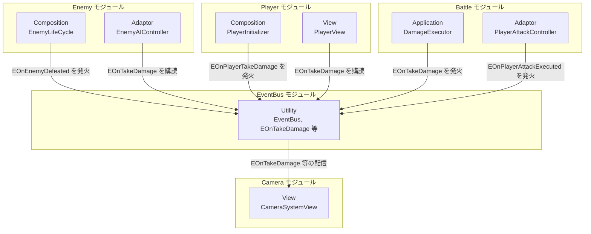

# 概要
> 💡 **モジュール概要**
> 戦闘中の演出通知（被弾・撃破・攻撃実行・スキル発動）を、発生元と購読先を疎結合にしたまま伝搬させる、横断的な静的イベントバス基盤である。特定のモジュールに属さず、`0.Utility` 配下からInGameの多数のモジュールに利用される。

| 項目 | 内容 |
| --- | --- |
| **モジュール名** | EventBus |
| **カテゴリ** | Utility / Persistent（横断基盤） |
| **ステータス** | 実装済み |
| **最終更新日** | 2026-09-09 |

---

## 🏗️ クラス

| クラス名 | レイヤー | 役割・機能 |
| --- | --- | --- |
| **`EventBus<T>`** | Utility（横断） | `T`（`IEvent`制約）ごとに独立した静的購読リストを持ち、`Register` / `Unregister` / `Raise` / `Clear` を提供するジェネリック静的クラス |
| **`IEvent`** | Utility（横断） | イベント構造体に付与する、中身のないマーカーインターフェース |
| **`EventBusResetRegistry`** | Utility（横断） | 各`EventBus<T>`の静的コンストラクタから登録されたリセット処理を、`RuntimeInitializeOnLoadMethod`でまとめて呼び出す非ジェネリックな受け皿 |
| **`EOnTakeDamage`** | Utility（イベント定義） | 被弾通知（ダメージ量・クリティカル有無・被弾者ID・攻撃種別）。発火元は攻撃処理側のみのため、実質的に敵側の被弾通知として使われる |
| **`EOnPlayerTakeDamage`** | Utility（イベント定義） | プレイヤー被弾時の演出通知（ダメージ量）。HP減少時のみ発火し、回復・無敵回避時は発火しない |
| **`EOnEnemyDefeated`** | Utility（イベント定義） | 敵撃破通知（撃破された敵のID）。通常敵・ボスの双方で死亡確定時に発火する |
| **`EOnPlayerAttackExecuted`** | Utility（イベント定義） | プレイヤー攻撃実行通知。中身なし。命中の有無に関わらず攻撃成立時点で発火する |
| **`EOnSkillExecuted`** | Utility（イベント定義） | スキル発動通知（発動したスキルのID）。対象の有無は問わない |
| **`DamageAttackType`** | Utility（イベント定義） | ダメージの発生要因を表すEnum（`Normal` / `Skill` / `Infection`） |

`EventBus<T>`本体は `Assets/Scripts/Runtime/0.Utility/Persistent/EventBus.cs`、リセット機構は同フォルダの `EventBusResetRegistry.cs` にある。イベント定義構造体（`EOn~`）も同じ `0.Utility/Persistent/` に配置されている。

---

## 🔗 モジュール結合

EventBusは特定モジュールへの依存を持たない横断基盤であり、多数のモジュールから一方的に参照される。代表的な利用元として、Enemy・Player・Camera・Battleの4モジュールを図示する（全利用箇所は「詳細」章末を参照）。



### 📥 依存しているもの

* なし
  * *詳細*: `EventBus<T>`・`IEvent`・イベント定義構造体は、いずれも他モジュールの型を参照しない。Unity標準の`Debug`・`RuntimeInitializeOnLoadMethod`のみに依存する

### 📤 依存されているもの

* **`InGame/Enemy`（`EnemyLifeCycle`・`EnemyAIController`・`EnemyHealthHudPresenter`）**
  * *参照箇所*: `EventBus<EOnEnemyDefeated>.Raise`（`EnemyLifeCycle.cs`）、`EventBus<EOnTakeDamage>.Register/Unregister`（`EnemyAIController.cs`・`EnemyHealthHudPresenter.cs`）
  * *詳細*: 敵の死亡確定時に撃破通知を発火し、被弾時のAI反応・HUD更新のために被弾通知を購読する
* **`InGame/Enemy/Boss`（`BossLifeCycle`・`BossAIController`）**
  * *参照箇所*: `EventBus<EOnEnemyDefeated>.Raise`（`BossLifeCycle.cs`）、`EventBus<EOnTakeDamage>.Register/Unregister`（`BossAIController.cs`）
  * *詳細*: 通常敵と同じ仕組みをボス側でも利用する
* **`InGame/Battle`（`DamageExecutor`・`PlayerAttackController`）**
  * *参照箇所*: `EventBus<EOnTakeDamage>.Raise`（`DamageExecutor.cs`）、`EventBus<EOnPlayerAttackExecuted>.Raise`（`PlayerAttackController.cs`）
  * *詳細*: ダメージ確定処理・プレイヤー攻撃確定処理の末尾で、演出用にイベントを発火する発火元となっている
* **`InGame/Skill`（`SkillExecutionController`・`CriticalBranchSkillEffectPresentation`）**
  * *参照箇所*: `EventBus<EOnSkillExecuted>.Raise`（`SkillExecutionController.cs`）、`EventBus<EOnTakeDamage>.Register/Unregister`（`CriticalBranchSkillEffectPresentation.cs`）
  * *詳細*: スキル発動を通知し、クリティカル演出は再生ウィンドウ中だけ被弾通知を一時購読して分岐判定に使う
* **`InGame/Camera`（`CameraSystemView`）**
  * *参照箇所*: `EventBus<EOnTakeDamage>.Register`、`EventBus<EOnEnemyDefeated>.Register`、`EventBus<EOnPlayerAttackExecuted>.Register`、`EventBus<EOnPlayerTakeDamage>.Register`、`EventBus<EOnSkillExecuted>.Register`
  * *詳細*: 5種類すべてのイベントを購読し、オートロックオンの向け直しやカメラシェイクなどの演出トリガーに使う
* **`InGame/Player`（`PlayerInitializer`・`PlayerView`）**
  * *参照箇所*: `EventBus<EOnPlayerTakeDamage>.Raise`（`PlayerInitializer.cs`）、`EventBus<EOnTakeDamage>.Register/Unregister`（`PlayerView.cs`）
  * *詳細*: プレイヤーのHP変化を演出用イベントへ変換して発火し、被弾時の演出フィードバックのために被弾通知を購読する

---

# 詳細

## 🧅レイヤー情報

> 0.Utility横断基盤のため通常の6層構造に対応しない。EventBus自体は特定レイヤーの責務（入力・演出・永続化等）を持たず、モジュール間の通知経路そのものを提供する存在である。以下では便宜上、各層に相当する要素の有無を記す。

### ① Domain
当モジュールでは使用していない。イベント定義構造体（`EOnTakeDamage`等）はドメインモデルではなく、モジュール間の通知用DTOという位置づけである。
### ② Application
当モジュールでは使用していない。
### ③ Adaptor
当モジュールでは使用していない。
### ④ View
当モジュールでは使用していない。
### ⑤ Infrastructure
当モジュールでは使用していない。
### ⑥ Composition
当モジュールにComposition層のクラスは存在しない。`EventBus<T>`は静的クラスであり、`ServiceLocator`への登録やInitializerによる明示的な初期化を必要とせず、利用側コードが直接`EventBus<T>.Register`等を呼び出すことで結合する。

`EventBusResetRegistry.ResetAll()`は`[RuntimeInitializeOnLoadMethod(RuntimeInitializeLoadType.SubsystemRegistration)]`により、ゲーム起動時、およびUnity Editor上でPlay Modeへ入った際に一度だけ実行され、その時点までに静的コンストラクタを通じて登録済みの全`EventBus<T>`の購読リストを`null`へ戻す。これは「7月β大改修リファクタリング/疑問点.md」で指摘されている、静的イベントの解除漏れによるライフサイクル・メモリリーク問題への対策として導入されたものである。ただし`SubsystemRegistration`はプレイセッションの開始時に一度だけ発火するタイミングであり、**同一プレイセッション内でのシーン再読み込み（ステージ再挑戦・タイトルへ戻ってから再度インゲームへ入る、等）ではリセットされない**。そのため、上記の依存されているものの一覧にある各利用箇所が`OnDisable`/`OnDestroy`/`Deactivate`等で確実に`Unregister`を呼ぶことが前提の設計になっており、これを怠ると、破棄済みオブジェクトへの参照が静的購読リストに残り続けるメモリリークや、`Raise`時に破棄済みオブジェクトのハンドラを呼び出してしまう`MissingReferenceException`を引き起こす。実際、`EnemyAIController`は`Deactivate()`と`Dispose()`の両方で`Unregister`を呼んでおり、片方の呼び出し漏れに備えた二重解除の形になっている。

## 🔌 拡張ポイント

| 拡張したいこと | 実装する場所 | 追加登録の要否 |
| --- | --- | --- |
| 新しいイベント型を追加したい | `IEvent`を実装した`readonly struct`を`0.Utility/Persistent/`配下に追加する（例: `EOnNewEvent`） | 不要（`EventBus<T>`はジェネリックであり、新しい`T`を指定した時点で`EventBus<EOnNewEvent>`という新しい静的クラスがJITにより自動生成される。`EventBusResetRegistry`への登録も、初回アクセス時に静的コンストラクタが自動的に行うため手動登録は不要） |
| イベントを発火したい | 発火元のコードから`EventBus<T>.Raise(new T(...))`を呼び出す | 不要（呼び出すだけでよい） |
| イベントを購読したい | 購読側のコードで`EventBus<T>.Register(handler)`を呼び、対応する破棄タイミング（`OnDestroy`・`OnDisable`・`Deactivate`等）で必ず`EventBus<T>.Unregister(handler)`を呼ぶ | 必要（`Unregister`を怠ると上記のメモリリーク・例外リスクにつながるため、実質的に対の実装が必須） |

## 🔄処理フロー

主要な処理フローを、①購読登録、②発火から複数リスナーへの配信、③シーンロード時のリスナー解除、の3つに分けて記述する。

### ① イベント購読の登録タイミング

購読側は自身の初期化・有効化のタイミングで`Register`を呼ぶ。`EventBus<T>`は初回アクセス時に静的コンストラクタが走り、`EventBusResetRegistry`へ自身のリセット処理を登録する。

```mermaid
sequenceDiagram
    autonumber
    participant Listener as 購読側（例: CameraSystemView）
    participant Bus as EventBus&lt;T&gt;
    participant Registry as EventBusResetRegistry

    Note over Bus: 型ごとに初回アクセス時のみ発生
    Listener ->> Bus: EventBus&lt;T&gt;.Register(handler) 呼び出し
    Bus ->> Bus: 静的コンストラクタが未実行なら実行
    Bus ->> Registry: Register(Reset) でリセット処理を登録
    Bus ->> Bus: _onEvent += handler
```

### ② イベント発火から複数リスナーへの配信

発火元は`Raise`を呼ぶだけでよく、購読者の存在や数を意識しない。`Raise`は購読リストのスナップショットを取り、1件ずつ`try/catch`で呼び出すため、あるハンドラで例外が起きても後続のハンドラ呼び出しは継続される。

```mermaid
sequenceDiagram
    autonumber
    participant Raiser as 発火元（例: DamageExecutor）
    participant Bus as EventBus&lt;EOnTakeDamage&gt;
    participant L1 as リスナー1（例: CameraSystemView）
    participant L2 as リスナー2（例: EnemyAIController）
    participant L3 as リスナー3（例: EnemyHealthHudPresenter）

    Raiser ->> Bus: Raise(new EOnTakeDamage(...))
    Bus ->> Bus: _onEvent をローカル変数へ退避
    loop 登録済みハンドラを順に実行
        Bus ->> L1: handler(eventData)
        Bus ->> L2: handler(eventData)
        Bus ->> L3: handler(eventData)
    end
    Note over Bus: いずれかのhandlerが例外を投げても<br/>Debug.LogExceptionのみで処理を継続する
```

### ③ シーンロード時のリスナー解除（プレイセッション開始時）

```mermaid
sequenceDiagram
    autonumber
    participant Unity as Unityランタイム
    participant Registry as EventBusResetRegistry
    participant BusA as EventBus&lt;EOnTakeDamage&gt;
    participant BusB as EventBus&lt;EOnEnemyDefeated&gt;

    Note over Unity: ゲーム起動時 / Editorで Play Mode へ入った時
    Unity ->> Registry: [RuntimeInitializeOnLoadMethod(SubsystemRegistration)] ResetAll()
    loop 登録済みの各EventBus&lt;T&gt;
        Registry ->> BusA: Reset() 実行
        BusA ->> BusA: _onEvent = null
        Registry ->> BusB: Reset() 実行
        BusB ->> BusB: _onEvent = null
    end
    Note over BusA,BusB: 同一プレイセッション内でのシーン再読み込みでは再実行されない
```
