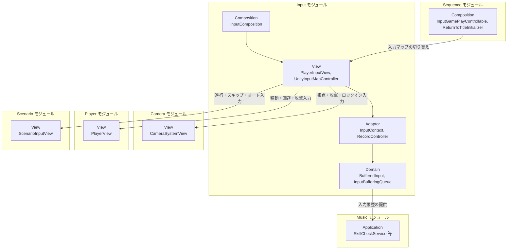
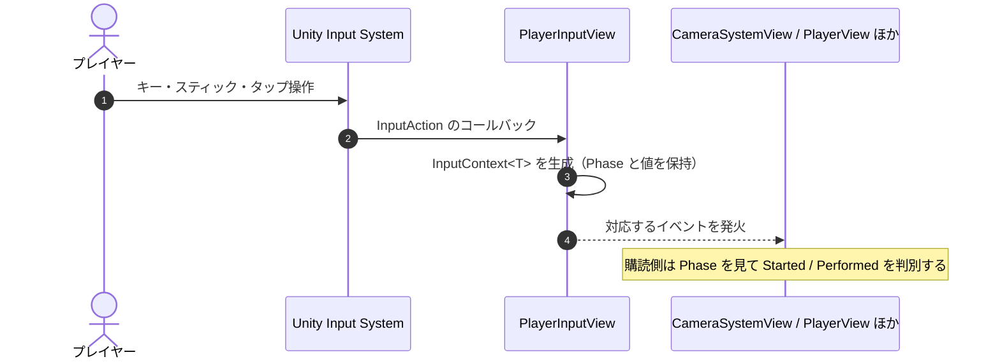
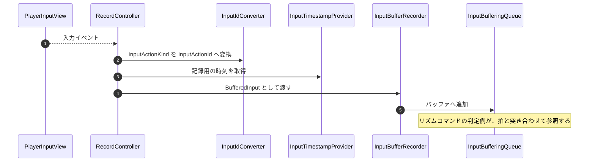

# 概要
> 💡 **モジュール概要**
> Unity Input Systemを包み、ゲーム内の入力を`InputContext`として各モジュールへ配る常駐モジュールである。入力マップの切り替えと、リズム判定用の入力履歴の記録も担当する。

| 項目 | 内容 |
| --- | --- |
| **モジュール名** | Input |
| **カテゴリ** | Persistent |
| **ステータス** | 実装済み |
| **最終更新日** | 2026-08-17 |

---

## 🏗️ クラス

| クラス名 | レイヤー | 役割・機能 |
| --- | --- | --- |
| **`InputActionId`** | Domain | 入力アクションを識別するID |
| **`BufferedInput`** | Domain | 履歴に保存される入力データ |
| **`InputBufferingQueue`** | Domain | 入力をバッファリングする |
| **`InputBufferRecorder`** | Application | 入力を`BufferedInput`へ変換してバッファへ記録する |
| **`InputContext`** | Adaptor | 入力1件分の共通データ。値の型ごとにジェネリックで扱う |
| **`InputActionKind`** | Adaptor | 入力の種類を表す列挙型 |
| **`InputIdConverter`** | Adaptor | `InputActionKind`を`InputActionId`へ変換する |
| **`InputTimestampProvider`** | Adaptor | 入力履歴用の時刻取得 |
| **`RecordController`** | Adaptor | 入力を履歴保存用に変換して`InputBufferRecorder`へ渡す |
| **`PlayerInputView`** | View | 入力イベントを受け取り`InputContext`を生成して外部へ通知する。当モジュールの主要な窓口 |
| **`UnityInputMapController`** | View | Unity Input Systemの`InputActionMap`を制御する |
| **`InputMapNames`** | View | 入力マップ名を定数で管理する |
| **`MobileInput`** | View | モバイルの視点操作領域からドラッグとフリック入力を通知する |
| **`MobileStickFlickInput`** / **`MobileStickFlickInputConfig`** | View | 仮想スティック上のポインター軌跡からフリック方向を通知する |
| **`InputComposition`** | Composition | 入力まわりの初期化（Order 50） |

`PlayerInputView`が公開する入力イベントは、移動・視点（マウス／ゲームパッド／モバイル）・攻撃・回避・ロックオン・ロックオン対象切替・決定・キャンセル・オプション・位置リセット・タイトル復帰である。値の型は`float`か`Vector2`で、いずれも`InputContext<T>`として渡す。

### 🧩 Composition初期化情報

| 項目 | 内容 |
| --- | --- |
| **Initializerクラス** | `InputComposition` |
| **Order** | 50（Persistentシーン内。カメラ(40)の後、多くのInGameモジュールより前） |
| **公開する ModuleContainer / ServiceLocator登録型** | `PlayerInputView`をServiceLocatorへ登録する |

---

## 🔗 モジュール結合

### 📥 依存しているもの

* なし
  * *詳細*: 他モジュールのDomain/Application型に依存しない、独立した基盤モジュールである

### 📤 依存されているもの

* **`Camera`**
  * *参照箇所*: `PlayerInputView`, `MobileInput`
  * *詳細*: 視点移動・ロックオン・攻撃の各入力を購読する。Android実行時は`MobileInput`と結線する
* **`Player`**
  * *参照箇所*: `PlayerInputView`
  * *詳細*: 移動・回避・攻撃の入力を購読する
* **`Scenario`**
  * *参照箇所*: `PlayerInputView`
  * *詳細*: `ScenarioInputView`が進行・早送り・一時停止・スキップ・オート・UI非表示へ変換する
* **`Sequence`**
  * *参照箇所*: `UnityInputMapController`, `PlayerInputView`
  * *詳細*: `InputGamePlayControllable`が入力マップを`InGame`と`Common`の間で切り替える。`ReturnToTitleInitializer`はESC長押しを購読する
* **`Music` / `Skill`**
  * *参照箇所*: 入力履歴
  * *詳細*: リズムコマンドの判定に、拍と入力のタイミングを突き合わせる

---

# 詳細

## 🧅レイヤー情報

### ① Domain
入力アクションの識別子と、履歴として保存する入力データ、そのバッファリングを保持する。
### ② Application
`InputBufferRecorder`が入力を履歴用の形へ変換して記録する。
### ③ Adaptor
`InputContext`が入力1件分の共通データを表し、`InputActionKind`と`InputActionId`の変換、履歴用の時刻取得、記録の仲介を担当する。
### ④ View
`PlayerInputView`がUnity Input Systemのイベントを受け、`InputContext`として外部へ通知する。入力マップの制御と、モバイル固有の操作（視点ドラッグ、仮想スティックのフリック）も同層にある。
### ⑤ Infrastructure
当モジュールでは使用していない。
### ⑥ Composition
`InputComposition`（Order 50）が入力まわりを構築し、`PlayerInputView`を公開する。

## 🔌 拡張ポイント

| 拡張したいこと | 実装する場所 | 追加登録の要否 |
| --- | --- | --- |
| 新しい入力アクションを追加したい | Unity Input Systemのアセットへアクションを追加し、`PlayerInputView`へイベントと通知処理を足す。履歴に残す場合は`InputActionKind`と`InputIdConverter`も更新する | 必要（`InputIdConverter`への追記を忘れると、入力は通知されるが履歴に残らない） |
| 入力マップを増やしたい | `InputMapNames`へ定数を追加し、`UnityInputMapController`で切り替える | 必要（定数の追加漏れは文字列指定の取り違えにつながる） |

## 🔄処理フロー

主要な処理フローは、それぞれ子ページに分けている。

### ① 入力の通知フロー

Unity Input Systemのイベントを`InputContext`へ包み、購読側へ配る。

### ② 入力履歴の記録フロー

リズム判定のため、入力を時刻付きでバッファへ残す。

