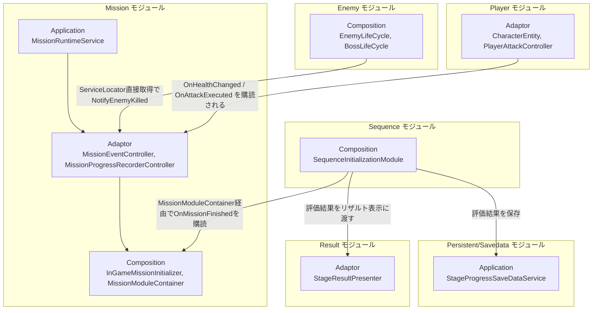
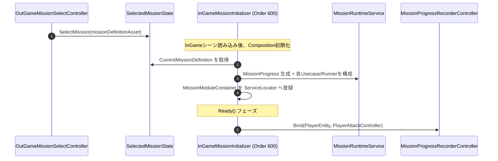
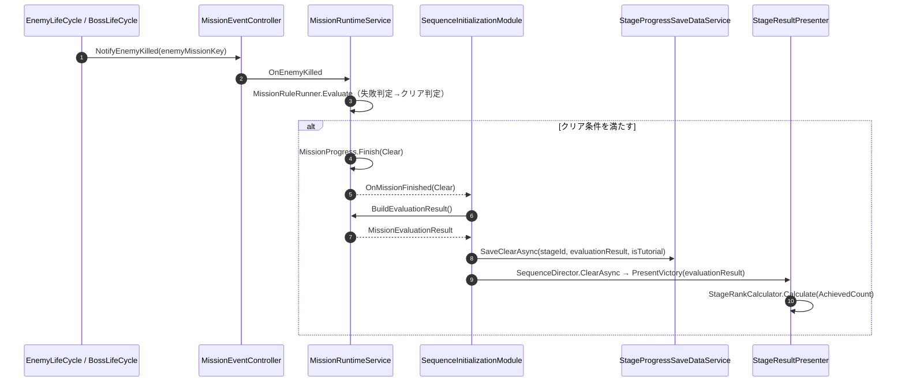

# 概要
> 💡 **モジュール概要**
> ステージのクリア条件・失敗条件・サブミッション（評価条件）の判定、進行状況の記録、クリア時のランク算出を司るモジュールである。リザルト画面（Result）は別モジュールであるが、`MissionEvaluationResult`を介して密接に連携する。

| 項目 | 内容 |
| --- | --- |
| **モジュール名** | Mission |
| **カテゴリ** | InGame |
| **ステータス** | 実装済み |
| **最終更新日** | 2026-07-15 |

---

## 🏗️ クラス

| クラス名 | レイヤー | 役割・機能 |
| --- | --- | --- |
| **`MissionDefinition`** | Domain | ミッションの不変定義（クリア条件・失敗条件・評価条件群・テキスト）を保持 |
| **`MissionProgress`** | Domain | 実行中の進行状態（経過時間・被ダメージ・最大コンボ・使用武器種・撃破記録・終了理由）を保持する可変Entity |
| **`EnemyKillRecord`** | Domain | 敵種別（`EnemyMissionKey`）ごとの撃破数カウンターEntity |
| **`MissionEvaluationResult`** | Domain | 評価条件の達成状況一覧（`MissionEvaluationProgress[]`）と達成数を集約 |
| **`MissionEvaluationProgress`** | Domain | 1評価条件の進捗を表すreadonly struct（達成状況の表示状態を含む） |
| **`MissionId` / `EnemyMissionKey` / `MissionEvaluationId`** | Domain | 文字列ベースの識別子ValueObject群 |
| **`MissionElapsedTime` / `MissionCombo` / `MissionDamageTaken` / `MissionWeaponVariety`** | Domain | 経過時間・コンボ数・被ダメージ量・使用武器種数を表す不変ValueObject群 |
| **`IMissionClearCondition`** | Domain | クリア条件の抽象。`ElapsedTimeClearCondition`（生存時間）、`EnemyKillCountClearCondition`（撃破数）、`AndClearConditionGroup`/`OrClearConditionGroup`（複合条件）が実装 |
| **`IMissionFailCondition`** | Domain | 失敗条件の抽象。`ElapsedTimeFailCondition`（制限時間超過）、`PlayerDeadFailCondition`（プレイヤー死亡）、`AndFailConditionGroup`/`OrFailConditionGroup`（複合条件）が実装 |
| **`IMissionEvaluationCondition`** | Domain | サブミッション（評価条件）の抽象。`ClearTimeEvaluationCondition`・`DamageTakenEvaluationCondition`・`ComboEvaluationCondition`・`WeaponVarietyEvaluationCondition`の4種が実装 |
| **`StageRank`** | Domain | ランクを表すenum（C=0, B=1, A=2, S=3） |
| **`StageRankCalculator`** | Domain | 達成数からランクを算出する静的クラス（0→C, 1→B, 2→A, 3以上→S） |
| **`MissionRuntimeService`** | Application | ミッション進行の中心オーケストレーター。`Tick`/`OnEnemyKilled`/`OnPlayerDead`/`BuildEvaluationResult()`を公開し、`OnMissionFinished(MissionEndReason)`イベントを発火する。コンストラクタDIのみで構成され、ServiceLocatorに依存しない |
| **`MissionRuleRunner`** | Application | 失敗条件→クリア条件の順で評価し、`MissionProgress.Finish()`を呼ぶ |
| **`MissionEvaluationRunner`** | Application | 全評価条件を実行し`MissionEvaluationResult`を構築。表示状態（未達成/挑戦中/達成済み）の状態遷移も担う |
| **`MissionEnemyKilledUsecase` / `MissionPlayerDeadUsecase` / `MissionTimeAdvanceUsecase`** | Application | `MissionProgress`を更新する単機能ユースケース群 |
| **`MissionFactory`** | Application | `MissionProgress`の生成 |
| **`MissionEventController`** | Adaptor | Compositionからの通知窓口。`Tick`/`NotifyEnemyKilled`/`NotifyPlayerDead`を公開し`MissionRuntimeService`へ委譲、HUD更新もトリガーする |
| **`MissionProgressRecorderController`** | Adaptor | `CharacterEntity.OnHealthChanged`・`PlayerAttackController.OnAttackExecuted`を購読し、被ダメージ・武器使用・コンボを`MissionProgress`へ記録する（`IDisposable`） |
| **`MissionHudPresenter`** | Adaptor | `MissionRuntimeService`の状態から`MissionHudDTO`を構築しHUDへ送る |
| **`IMissionHudViewModel` / `MissionHudDTO` / `MissionEvaluationItemDTO` / `MissionEvaluationDisplayState`** | Adaptor | HUD向けのViewModel契約・DTO群 |
| **`OutGameMissionSelectController`** | Adaptor | アウトゲームでのミッション選択エントリポイント |
| **`SelectedMissionState`** | Adaptor | OutGame→InGameで選択中の`MissionDefinition`を保持するクロスシーン状態 |
| **`MissionDefinitionAsset`** | Infrastructure | ミッション定義のScriptableObject。`[SerializeReference, SubclassSelector]`で条件群を保持し`Create()`でDomainへ変換 |
| **`MissionClearConditionAssetBase` / `MissionFailConditionAssetBase` / `MissionEvaluationConditionAssetBase`** | Infrastructure | 各条件の抽象Assetベース。`ISerializationCallbackReceiver`でインスペクタ表示用サマリーを自動生成 |
| **`InGameMissionInitializer`** | Composition | ミッション関連オブジェクトの構築・登録・破棄を担当 |
| **`MissionModuleContainer`** | Composition | `MissionRuntimeService`/`MissionEventController`/`MissionProgressRecorderController`をServiceLocatorへ公開するContainer |

> リザルト画面（`StageResultController`/`StageResultPresenter`/`StageResultDTO`/`StageRankCalculator`呼び出し）は別モジュール「Result」に属するが、`MissionEvaluationResult`を直接消費するため本ページでも参照する。

### 🧩 Composition初期化情報

| 項目 | 内容 |
| --- | --- |
| **Initializerクラス** | `InGameMissionInitializer` |
| **Order** | 600 |
| **公開する ModuleContainer / ServiceLocator登録型** | `MissionModuleContainer`（`MissionRuntimeService`, `MissionEventController`, `MissionProgressRecorderController`を保持）。ただし`MissionRuntimeService`/`MissionEventController`は現状Containerとは別に生の型としても`ServiceLocator`へ二重登録されている |

---

## 🔗 モジュール結合



### 📥 依存しているもの

* **`Player`**
  * *依存箇所*: `CharacterEntity.OnHealthChanged`, `PlayerAttackController.OnAttackExecuted`
  * *詳細*: `MissionProgressRecorderController`がこれらのイベントを購読し、被ダメージ量・使用武器種・コンボ数をサブミッション評価条件の記録に使う

### 📤 依存されているもの

* **`Enemy`**
  * *参照箇所*: `MissionEventController.NotifyEnemyKilled`
  * *詳細*: `EnemyLifeCycle`/`BossLifeCycle`が敵撃破時に呼び出す。ただし`ServiceLocator.GetInstance<MissionEventController>()`による直接取得であり、`MissionModuleContainer`を介していない
* **`Sequence`**
  * *参照箇所*: `MissionModuleContainer.MissionRuntimeService`, `MissionEvaluationResult`
  * *詳細*: `SequenceInitializationModule`が`MissionRuntimeService.OnMissionFinished`を購読し、クリア時に評価結果を生成してセーブ・リザルト表示へ橋渡しする（Order 1000、Missionの600より後に初期化）
* **`Persistent/Savedata`**
  * *参照箇所*: `MissionEvaluationResult`（`StageProgressSaveDataService.SaveClearAsync`の引数）
  * *詳細*: クリア時の評価結果からステージクリア状態・達成サブミッションIDを永続化する
* **`Result`**
  * *参照箇所*: `MissionEvaluationResult`, `StageRankCalculator`
  * *詳細*: `StageResultPresenter.PresentVictory`が評価結果を受け取り`StageRankCalculator.Calculate`でランクを算出し表示す

---

# 詳細

## 🧅レイヤー情報

### ① Domain
ミッション定義（`MissionDefinition`）、進行状態（`MissionProgress`）、クリア/失敗/評価条件の抽象と具象実装、ランク算出（`StageRankCalculator`）といった、ミッションシステムの中核データ・ルールを保持する。
### ② Application
`MissionRuntimeService`を中心に、条件判定（`MissionRuleRunner`）・評価結果構築（`MissionEvaluationRunner`）・進行更新の各ユースケースを実装する。ServiceLocatorに一切依存しない、コンストラクタ注入のみのピュアな構成である。
### ③ Adaptor
Compositionからの通知窓口`MissionEventController`、Player側イベントを購読して実績を記録する`MissionProgressRecorderController`、HUDへのデータ橋渡しを行う`MissionHudPresenter`、およびOutGame側のミッション選択状態を保持する。
### ④ View
`MissionLoopView`が毎フレーム`MissionEventController.Tick`を駆動し、`MissionHudView`/`MissionHudViewModel`がHUD表示のMVVMチェーンを構成する。
### ⑤ Infrastructure
`MissionDefinitionAsset`が`[SerializeReference, SubclassSelector]`でクリア/失敗/評価条件をインスペクタから多態的に構成できるようにし、`Create()`でDomainオブジェクトへ変換する。
### ⑥ Composition
`InGameMissionInitializer`（Order 600）がミッション関連オブジェクトを構築し、`Ready()`で`PlayerModuleContainer`から`PlayerEntity`/`PlayerAttackController`を取得して`MissionProgressRecorderController`を紐付ける。

## 🔌 拡張ポイント

| 拡張したいこと | 実装する場所 | 追加登録の要否 |
| --- | --- | --- |
| 新しいサブミッション（評価条件）を追加したい | `IMissionEvaluationCondition`（Domain）を実装し、`MissionEvaluationConditionAssetBase`（Infrastructure）を継承したAssetクラスを作成する | 不要（`[SerializeReference, SubclassSelector]`によりInspectorへ自動的に出現） |
| 新しいクリア条件・失敗条件を追加したい | `IMissionClearCondition`/`IMissionFailCondition`（Domain）を実装し、対応する`MissionClearConditionAssetBase`/`MissionFailConditionAssetBase`（Infrastructure）派生を作成する | 不要（同上）。`And`/`Or`の複合条件Assetと組み合わせて複雑な条件も表現可能 |

## 🔄処理フロー

主要な処理フローごとに分けて記述する。

### ① ミッション開始フロー（ステージ読み込み時）
アウトゲームで選択したミッションが、インゲーム側で構築される。



### ② 敵撃破→クリア判定→保存→リザルト表示フロー
敵を撃破しクリア条件が満たされると、評価結果が生成・保存され、リザルト画面へ反映される。



### ③ サブミッション進捗のHUD表示フロー（毎フレーム／イベント時）
プレイ中、達成済み・挑戦中・未達成の状態がリアルタイムでHUDに反映される（保存はされない、表示専用の再計算）。

```mermaid
sequenceDiagram
    autonumber
    participant Loop as MissionLoopView
    participant EventCtrl as MissionEventController
    participant Runtime as MissionRuntimeService
    participant EvalRunner as MissionEvaluationRunner
    participant Presenter as MissionHudPresenter
    participant HudVM as IMissionHudViewModel

    Note over Loop: 毎フレーム Update
    Loop ->> EventCtrl: Tick(deltaTime)
    EventCtrl ->> Runtime: Tick
    EventCtrl ->> Presenter: Present()
    Presenter ->> Runtime: BuildEvaluationResult()
    Runtime ->> EvalRunner: Run（未達成/挑戦中/達成済みを判定）
    EvalRunner -->> Runtime: MissionEvaluationResult
    Runtime -->> Presenter: MissionEvaluationResult
    Presenter ->> HudVM: MissionHudDTO を反映
```