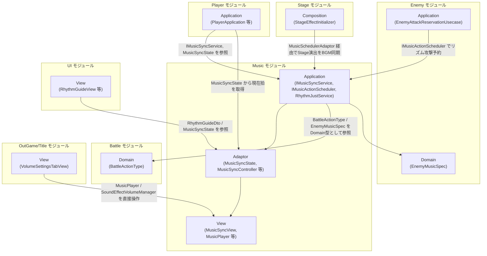
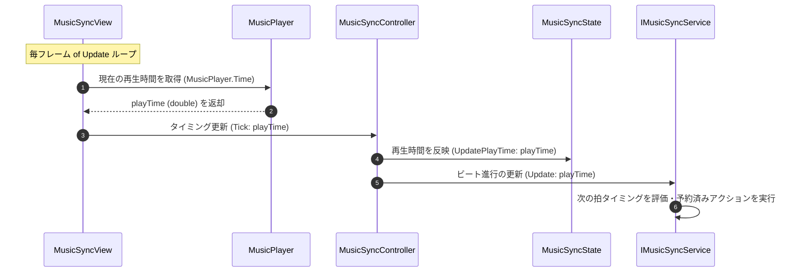
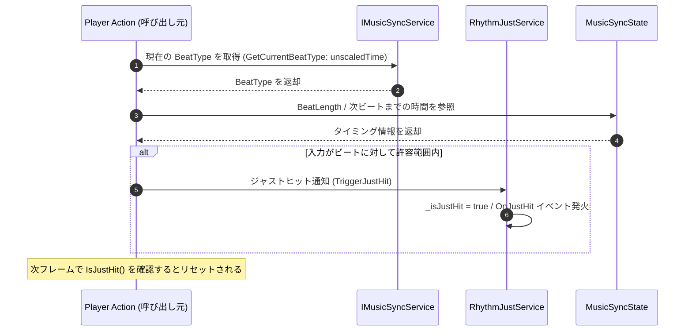
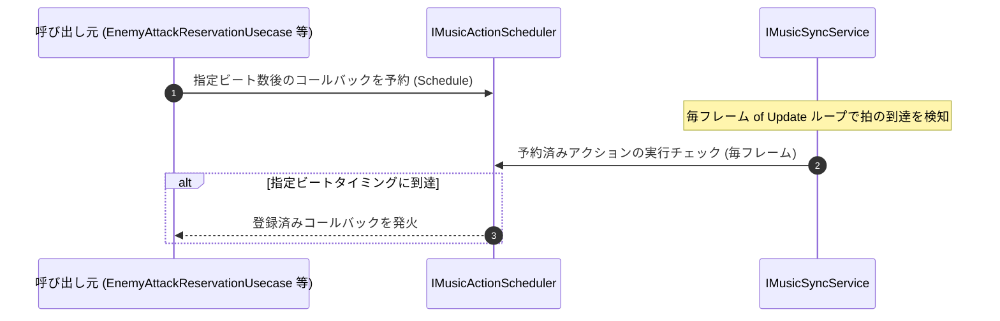

# 概要
> 💡 **モジュール概要**
> ゲームの根幹である「BPM・ビート情報（拍）・リズム同期判定（ジャスト入力等）・音量管理・BGM/SE/Voice ソースの音響制御」を司る、プロジェクト全体の中核となるモジュールです。

| 項目 | 内容 |
| --- | --- |
| **モジュール名** | Music |
| **カテゴリ** | InGame + Persistent / Core System |
| **アーキテクチャ** | クリーンアーキテクチャ (Domain, Application, Adaptor, View, Composition) |
| **ステータス** | 実装済み |
| **最終更新日** | 2026-07-15 |

---

## 🏗️ クラス

| クラス名 | レイヤー | 役割・機能 |
| --- | --- | --- |
| **`BeatType`** | Domain | 一拍・四拍・裏拍などの拍の種類を表す `enum` |
| **`IMusicSyncService`** | Application | 再生タイムに基づくビート更新・アクション予約・拍履歴取得などを定義するサービスインターフェース |
| **`IMusicActionScheduler`** | Application | ビートタイミングでコールバックを予約・実行するスケジューラーのインターフェース |
| **`RhythmJustService`** | Application | ジャストタイミング発生の通知と判定状態の管理を行うシングルトンサービス（`IDisposable` を実装） |
| **`MusicSyncController`** | Adaptor | 毎フレーム `MusicSyncState.UpdatePlayTime` と `IMusicSyncService.Update` を呼び出すコントローラー |
| **`MusicSyncState`** | Adaptor | 現在の BPM・再生時間・次の拍までのカウントなどのリズム状態を保持するクラス |
| **`MusicSchedulerAdaptor`** | Adaptor | `IMusicActionScheduler` の実装。`EnemyMusicSpec` を `ExecuteRequestTiming` に変換し `IMusicSyncService.RegisterAction` を呼ぶ。Enemy/Stageモジュールから利用される |
| **`RhythmGuideDto`** | Adaptor | リズムインジケータ（UI）へ送る readonly ref struct DTO |
| **`RhythmGuideZoneDto`** | Adaptor | ガイド表示エリアの描画データを保持する readonly struct DTO |
| **`MusicSyncView`** | View | Unity の `AudioSource` と連携して BGM を再生し、毎フレーム `MusicSyncController.Tick` を呼び出して再生タイムスタンプを更新する MonoBehaviour |
| **`MusicPlayer`** | View | BGM/SE/Voice の音源管理およびボリュームマネージャーとの仲介を担う MonoBehaviour（`IVolumeManager` を実装） |
| **`MusicViewModel`** | View | 楽曲情報の表示状態を保持する ViewModel（`IMusicViewModel` を実装） |
| **`MusicSyncInitializer`** | Composition (InGame) | 楽曲とタイミング制御エンジンの結びつけ・ServiceLocator への登録 |
| **`RhythmGuideInitializer`** | Composition (InGame) | リズムガイド UI の紐付け初期化 |
| **`MusicPlayerInitializer`** | Composition (Persistent) | `MusicPlayer` を常駐シーンでセットアップする初期化クラス |

---

## 🔗 モジュール結合

### 📥 依存しているもの

* **`InGame/Battle`（Domain型のみ）**
  * *依存箇所*: `BattleActionType`
  * *詳細*: `IMusicSyncService`が`GetActionHistory()`/`RegisterBattleActionHistory(BattleActionType, ...)`という形でBattleモジュールのDomain型を直接扱います。「他モジュールに依存しない完全独立モジュール」という記載は誤りでした。
* **`InGame/Enemy`（Domain型のみ）**
  * *依存箇所*: `EnemyMusicSpec`
  * *詳細*: `IMusicActionScheduler.Schedule(in EnemyMusicSpec, ...)`がEnemyモジュールのDomain型を直接引数に取ります。

### 📤 依存されているもの

* **`InGame/Player`**
  * *参照箇所*: `IMusicSyncService`, `MusicSyncState`
  * *詳細*: プレイヤーはジャスト入力判定（ジャストヒットイベント等）や、BPM情報に基づく移動・アニメーション・拍管理を行うために参照します。
* **`InGame/Enemy`**
  * *参照箇所*: `IMusicActionScheduler`
  * *詳細*: 敵キャラクターが特定のビートタイミング（2拍前・1拍前・ジャスト拍）に攻撃予約を登録し、リズムに同期したAI攻撃制御を行うために利用されます。
* **`InGame/Stage`**
  * *参照箇所*: `MusicSchedulerAdaptor`, `IMusicSyncService.RegisterAction`
  * *詳細*: `StageEffectInitializer`がWave開始時の演出（爆発・建物倒壊等）をBGM同期で再生するために利用します（新規）。
* **`InGame/UI`**
  * *参照箇所*: `RhythmGuideDto`, `MusicSyncState`
  * *詳細*: 画面上のビートインジケータ（リズムガイドUI）の描画タイミングを正確に同期させるために参照します。
* **`OutGame/Title`**
  * *参照箇所*: `MusicPlayer`, `SoundEffectVolumeManager`（具象クラスを直接参照。`IVolumeManager`のようなインターフェース経由ではない）
  * *詳細*: `VolumeSettingsTabView`がタイトル/設定タブからBGM・SE音量を変更するために、これらの具象クラスの`GetVolume()`/`SetVolume()`を直接呼び出します（旧ドキュメントは「Setting」モジュールが`IVolumeManager`を参照すると記載していましたが、実際のモジュール・参照方法は異なります）。

---

# 詳細

## 🧅レイヤー情報

### ① Domain
> 拍（ビート）の種類を表現する `BeatType` などの、タイミング制御・ジャスト同期に必須のデータ定義を保持します。

### ② Application
> 再生時間に基づくビート更新（`IMusicSyncService`）、指定ビート後への非同期コールバック管理（`IMusicActionScheduler`）、およびタイミング判定・ジャスト検知（`RhythmJustService`）などの核心的なビジネスロジックを実装します。`IMusicSyncService`/`IMusicActionScheduler`のAPI設計上、`BattleActionType`（Battleモジュール）や`EnemyMusicSpec`（Enemyモジュール）というDomain型を直接扱うため、厳密には他モジュールへの依存が存在します。

### ③ Adaptor
> 毎フレームのリズム同期処理を回す `MusicSyncController`、現在のBPM情報や拍数データを格納する `MusicSyncState`、およびUI層へと送る `RhythmGuideDto` などのデータブリッジを定義します。

### ④ View
> Unityの `AudioSource` と直接対話して再生時間を監視する `MusicSyncView`、BGM/SE/Voiceソースのマネジメントを担う `MusicPlayer`（音量変更の窓口インターフェースを含む）などのUnity依存制御を担当します。

### ⑤ Infrastructure
> 当モジュールでは使用していません。

### ⑥ Composition
> ゲーム内BGMとタイミング同期システムをリンクさせる `MusicSyncInitializer`、UI側のタイミング連動を行う `RhythmGuideInitializer`、常駐シーンの `MusicPlayerInitializer` など、アプリ全域へのDIセットアップを担当します。

## 🔄処理フロー

主要な処理フローごとに分けて記述します。

### ① BGM 再生とリズム同期の更新フロー（毎フレーム）
AudioSource の再生タイムを元に、毎フレーム BPM・拍情報が更新される処理フローです。

### ② プレイヤー入力に対するジャスト判定フロー
プレイヤーが攻撃/スキル等のアクションを実行した際に、現在のビートタイミングと照合してジャストかどうかを判定するフローです。

### ③ リズムアクション予約フロー（Enemy 等の外部モジュールから）
Enemy などの外部モジュールが `IMusicActionScheduler` を使って、指定ビート後にコールバックを登録する処理フローです。

## 📝 アーキテクチャ上の特徴・既知の課題

### ✅ 設計上の見どころ
* **中核APIは`IMusicSyncService`/`IMusicActionScheduler`**: `MusicSyncState`/`RhythmJustService`は状態保持・ジャスト判定という一部の役割に過ぎず、他モジュールが実際に利用する主要な窓口は`IMusicSyncService.RegisterAction`（任意のビートタイミングでコールバックを予約する汎用API）と、それを敵専用にラップした`IMusicActionScheduler`/`MusicSchedulerAdaptor`です。
* **高性能・低遅延の入力評価 (`RhythmJustService`)**: 入力時の絶対時間をキャッシュし、AudioSourceの正確な再生サンプル数から逆算してタイミング誤差をミリ秒単位で割り出す純粋演算サービスであり、Unityエンジンのオーディオ遅延に左右されにくい安定したジャスト判定を実現しています。

### ⚠️ 既知の課題・改善ポイント
* **「完全独立モジュール」ではない**: `IMusicSyncService`が`BattleActionType`（Battleモジュール）を、`IMusicActionScheduler`が`EnemyMusicSpec`（Enemyモジュール）を直接引数・戻り値に持つため、厳密には他モジュールのDomain型に依存しています。ドキュメント上「他モジュールに一切依存しない」と誤って記載されていた時期がありました。
