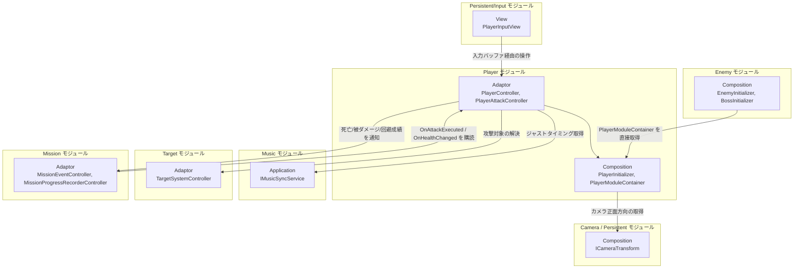
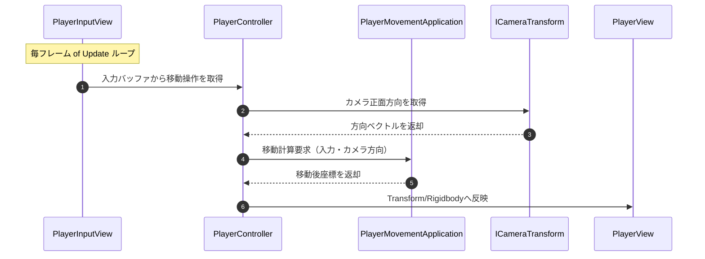
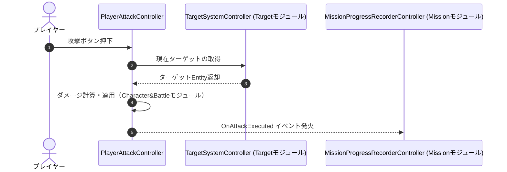

# 概要
> 💡 **モジュール概要**
> インゲーム中のプレイヤーキャラクターの移動（通常移動・回避）、入力制御（インプットバッファリング）、および攻撃・戦闘の実行制御（`PlayerAttackController`）を司るモジュールです。

| 項目 | 内容 |
| --- | --- |
| **モジュール名** | Player |
| **カテゴリ** | InGame |
| **アーキテクチャ** | クリーンアーキテクチャ (Domain, Application, Adaptor, View, Composition) |
| **ステータス** | 実装済み |
| **最終更新日** | 2026-07-15 |

---

## 🏗️ クラス

| クラス名 | レイヤー | 役割・機能 |
| --- | --- | --- |
| **`PlayerMoveSpec`** | Domain | 移動速度や回避距離などの設定値を保持するピュアクラス |
| **`PlayerApplication`** | Application | プレイヤーの状態・挙動を総括するメインユースケース |
| **`PlayerMovementApplication`** | Application | 通常移動時の物理演算・補間 |
| **`PlayerDodgeMovementApplication`** | Application | 回避アクションのタイムラインと無敵時間処理 |
| **`PlayerController`** | Adaptor | 入力バッファから操作を取り出してApplicationに委譲するコントローラー（`IPlayerController`実装） |
| **`PlayerAttackController`** | Adaptor | プレイヤーの攻撃実行を制御。`OnAttackExecuted`イベントを公開し、Missionモジュール等から購読される（namespace上は`Adaptor.InGame.Battle`） |
| **`PlayerView`** | View | 実際のRigidbodyやTransformを操作するMonoBehaviour |
| **`PlayerInitializer`** | Composition | インプット、カメラ、HUD、攻撃制御などのシステムをプレイヤー具象にDIする |
| **`PlayerModuleContainer`** | Composition | `PlayerInitializer`/`PlayerView`/`PlayerEntity`/`PlayerAttackController`をServiceLocatorへ公開するContainer。Enemy/Bossモジュールが参照する |

### 🧩 Composition初期化情報

| 項目 | 内容 |
| --- | --- |
| **Initializerクラス** | `PlayerInitializer` |
| **Order** | 500 |
| **公開する ModuleContainer / ServiceLocator登録型** | `PlayerModuleContainer`（`PlayerInitializer`, `PlayerView`, `PlayerEntity`（`CharacterEntity`）, `PlayerAttackController`を保持） |

---

## 🔗 モジュール結合

### 📥 依存しているもの

* **`Persistent/Input`**
  * *依存箇所*: `PlayerInputView`, `InputBufferingQueue`
  * *詳細*: プレイヤーの入力デバイスからの入力を「入力バッファリングキュー」経由で受け取り、遅延フレームのない滑らかな先行入力を実現します。
* **`Music`**
  * *依存箇所*: `IMusicSyncService`, `MusicSyncState`
  * *詳細*: 回避（Dodge）のリズム同期判定や、アクション時のジャストタイミングの取得で使用します。
* **`Camera` / `Persistent`**
  * *依存箇所*: `ICameraTransform`（Persistent Composition層の抽象）
  * *詳細*: プレイヤーが移動する際、カメラの現在の正面方向を基準にして進行方向を計算するために使用します。
* **`Target`**
  * *依存箇所*: `TargetSystemController`, `ITargetableViewModel`
  * *詳細*: `PlayerAttackController`の攻撃対象解決やスキル発動時のターゲット補正で使用します。
* **`InGame/UI & HUD`**
  * *依存箇所*: `InGameHudInitializer`, `SkillInputProgressUIInitializer`
  * *詳細*: プレイヤー自身のHPやスキルのクールダウン、スキル発動のリズム入力進捗を画面に反映するため、各UI初期化に依存（取得してセットアップ）します。
* **`Mission`**
  * *依存箇所*: `MissionEventController`
  * *詳細*: プレイヤーの死亡や被ダメージ、回避成功実績などのイベントをミッションシステムへ通知します。

### 📤 依存されているもの

* **`Enemy`**
  * *参照箇所*: `PlayerModuleContainer`（Compositionでの直接結合）, `CharacterEntity`
  * *詳細*: 敵のAI（移動目標・攻撃先）として、プレイヤーのTransformやEntity情報を提供します。
* **`Camera`**
  * *参照箇所*: `PlayerInputView`
  * *詳細*: カメラが回転操作を受け取るための入力ソースとして、プレイヤーインプットを参照します。
* **`Mission`**
  * *参照箇所*: `PlayerAttackController.OnAttackExecuted`, `CharacterEntity.OnHealthChanged`
  * *詳細*: `MissionProgressRecorderController`がこれらのイベントを購読し、被ダメージ量・使用武器種・コンボ数をミッション評価条件として記録します。

---

# 詳細

## 🧅レイヤー情報

### ① Domain
移動速度や回避距離などの設定値をまとめた`PlayerMoveSpec`を保持します。
### ② Application
プレイヤーの状態・挙動を総括する`PlayerApplication`、通常移動の物理演算・補間を担う`PlayerMovementApplication`、回避アクションのタイムラインと無敵時間処理を担う`PlayerDodgeMovementApplication`といった、移動・回避に特化したピュアなロジッククラスを実装します。
### ③ Adaptor
入力バッファから操作を取り出してApplicationに委譲する`PlayerController`と、攻撃実行を制御し`OnAttackExecuted`イベントを公開する`PlayerAttackController`（実体は`Adaptor.InGame.Battle`名前空間）を定義します。
### ④ View
実際のRigidbodyやTransformを操作する`PlayerView`が、MonoBehaviourとしての表示・物理制御を担当します。
### ⑤ Infrastructure
当モジュールでは使用していません。
### ⑥ Composition
`PlayerInitializer`（Order 500）がインプット・カメラ・HUD・攻撃制御などのシステムをプレイヤー具象にDIし、`PlayerModuleContainer`として他モジュールへ公開します。

## 🔌 拡張ポイント

> 現状、ポリモーフィックな拡張ポイント（`SubclassSelector`等）はありません。新しい移動・回避挙動を追加する場合は、対応するApplicationクラスの追加、または既存クラスへの分岐追加という形になります。

## 🔄処理フロー

主要な処理フローごとに分けて記述します。

### ① 通常移動フロー（毎フレーム）
入力バッファから取り出した移動操作を、カメラ正面方向を基準に補正して反映します。

### ② 攻撃実行フロー（入力イベント時）
攻撃入力を受け、ターゲット解決からダメージ適用・イベント通知までを実行します。

## 📝 アーキテクチャ上の特徴・既知の課題

### ✅ 設計上の見どころ
* **入力バッファキューによるアクション分離**: `PlayerInputView`から生の入力を受け取るのではなく、`InputBufferingQueue`によってバッファ（キュー）に蓄積された操作を`PlayerController`が自身のペースで読み出して処理するため、入力フレームレートに依存しない安定したゲームプレイが実現されています。
* **移動挙動のピュアクラス化**: `PlayerMovementApplication`および`PlayerDodgeMovementApplication`という、移動や回避に特化したピュアなロジッククラスに切り出されており、ゲーム内バランス調整（パラメータ変更）やテストが行いやすい構成です。

### ⚠️ 既知の課題・改善ポイント
* **Enemy/Bossからの直接結合**: `EnemyInitializer`/`BossInitializer`が`PlayerModuleContainer`を`ServiceLocator`経由で直接取得しています（Enemyページの既知の課題を参照）。Player側から見ると、自身のComposition層の公開範囲を制御する術がありません。
