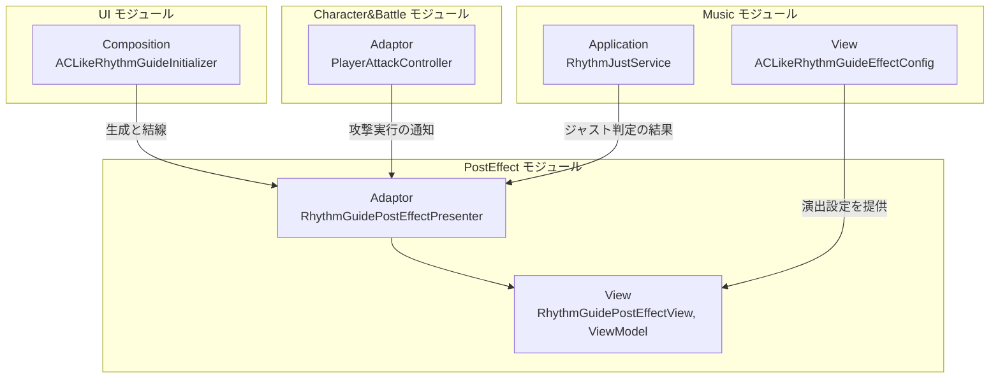
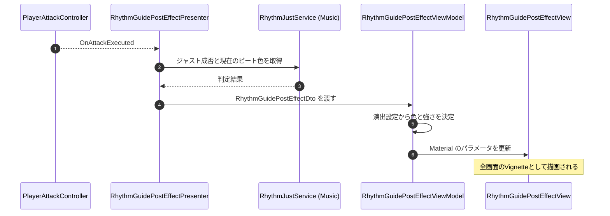

# 概要
> 💡 **モジュール概要**
> リズムガイドの全画面演出を司るモジュールである。攻撃実行時のジャスト成否と、そのときのビート色をVignetteとして画面全体へ反映する。

| 項目 | 内容 |
| --- | --- |
| **モジュール名** | PostEffect |
| **カテゴリ** | インゲーム |
| **ステータス** | 実装済み |
| **最終更新日** | 2026-08-17 |

---

## 🏗️ クラス

| クラス名 | レイヤー | 役割・機能 |
| --- | --- | --- |
| **`IRhythmGuideBeatViewModel`** | Adaptor | リズムガイド上の現在のビート状態を公開する契約 |
| **`IRhythmGuidePostEffectViewModel`** | Adaptor | 全画面演出の再生指示を受け取る契約 |
| **`RhythmGuidePostEffectDto`** | Adaptor | 演出1回分の表示データ |
| **`RhythmGuidePostEffectPresenter`** | Adaptor | 攻撃実行の通知を受け、ジャスト成否とビート色をViewModelへ伝える |
| **`RhythmGuidePostEffectViewModel`** | View | 演出設定を参照して表示内容を決め、Viewへ反映する |
| **`RhythmGuidePostEffectView`** | View | 全画面演出のMaterialを操作する |

### 🧩 Composition初期化情報

| 項目 | 内容 |
| --- | --- |
| **Initializerクラス** | なし（UIモジュールの`ACLikeRhythmGuideInitializer`が構築する） |
| **公開する ModuleContainer / ServiceLocator登録型** | なし |

Presenterとその依存はAC風リズムガイドの初期化と一体で生成される。演出設定（`ACLikeRhythmGuideEffectConfig`）はMusicモジュールのView層にあり、Inspectorから調整する。

---

## 🔗 モジュール結合

### 📥 依存しているもの

* **`Music`**
  * *依存箇所*: `RhythmJustService`, `ACLikeRhythmGuideEffectConfig`, ビート色
  * *詳細*: ジャスト成否と現在のビート状態を受け取り、演出設定に従って見た目を決める
* **`Character&Battle`**
  * *依存箇所*: `PlayerAttackController.OnAttackExecuted`
  * *詳細*: 攻撃実行を演出の起点にする

### 📤 依存されているもの

* **`UI`**
  * *参照箇所*: `ACLikeRhythmGuideInitializer`
  * *詳細*: AC風リズムガイドの初期化が、当モジュールのPresenter・ViewModel・Viewを生成して結線する。当モジュール側に専用のInitializerは無い

---

# 詳細

## 🧅レイヤー情報

### ① Domain
当モジュールでは使用していない。
### ② Application
当モジュールでは使用していない。ジャスト判定はMusicモジュールが持つ。
### ③ Adaptor
`RhythmGuidePostEffectPresenter`が攻撃実行の通知を受け、ジャスト成否とビート色を`RhythmGuidePostEffectDto`へ詰めてViewModelへ渡す。
### ④ View
`RhythmGuidePostEffectViewModel`が演出設定を参照して表示内容を決め、`RhythmGuidePostEffectView`がMaterialを操作して全画面のVignetteを描く。
### ⑤ Infrastructure
当モジュールでは使用していない。
### ⑥ Composition
専用のInitializerは持たない。UIモジュールの`ACLikeRhythmGuideInitializer`が生成と結線を行う。

## 🔌 拡張ポイント

| 拡張したいこと | 実装する場所 | 追加登録の要否 |
| --- | --- | --- |
| 演出の色や強さを変えたい | `ACLikeRhythmGuideEffectConfig`（Musicモジュール） | 不要（コード変更なし） |
| 別の全画面演出を追加したい | `IRhythmGuidePostEffectViewModel`を実装したViewModelとViewを作り、`ACLikeRhythmGuideInitializer`で差し替える | 必要（Initializerでの結線が要る） |

## 🔄処理フロー

主要な処理フローは、それぞれ子ページに分けている。

### ① 攻撃時の全画面演出フロー

攻撃のたびに、ジャストできたかどうかを画面全体で返す。

