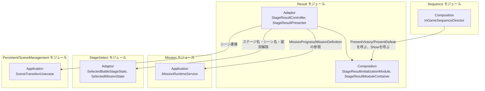
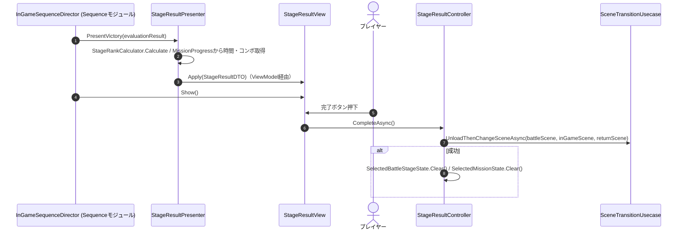
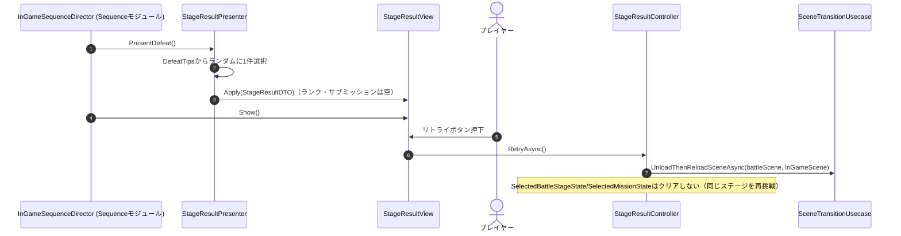

# 概要
> 💡 **モジュール概要**
> ステージクリア／ゲームオーバー時のリザルト画面表示と、そこからOutGameへの帰還・InGameの再挑戦（リトライ）を司るモジュールです。Sequenceモジュールから呼び出され、Mission・StageSelectの情報を集約して表示します。

| 項目 | 内容 |
| --- | --- |
| **モジュール名** | Result |
| **カテゴリ** | InGame |
| **ステータス** | 実装済み |
| **最終更新日** | 2026-08-17 |

---

## 🏗️ クラス

| クラス名 | レイヤー | 役割・機能 |
| --- | --- | --- |
| **`StageResultController`** | Adaptor | `CompleteAsync`（OutGameへ帰還）/`RetryAsync`（InGame再読込）のシーン遷移を実行 |
| **`StageResultPresenter`** | Adaptor | `PresentVictory(MissionEvaluationResult)`/`PresentDefeat()`で`StageResultDTO`を構築しViewModelへ反映 |
| **`StageResultDTO`** | Adaptor | 表示用データ一式（ランク・サブミッション一覧・最大コンボ・戦闘時間・Tips等）を保持するreadonly ref struct |
| **`StageResultMissionItemDTO`** | Adaptor | サブミッション1件分の説明・達成有無を表すreadonly struct |
| **`StageResultType`** | Adaptor | `Victory`/`Defeat`を表すenum |
| **`IStageResultViewModel`** | Adaptor | Adaptor→View境界の抽象（`Apply(in StageResultDTO)`） |
| **`StageResultView`** | View | ボタン押下ハンドリング、勝敗UIの出し分け、サブミッション行の生成を行うMonoBehaviour |
| **`StageResultViewModel`** | View | `IStageResultViewModel`実装。R3の`ReactiveProperty`で各表示項目を保持 |
| **`StageResultMissionItemView` / `StageResultMissionItemViewModel`** | View | サブミッション1行分の表示 |
| **`ResultTextSlideIn`** | View | UI要素を左から右へスライドインさせる共通演出。LitMotionで位置とalphaを同時に動かす静的クラス |
| **`ResultTextSlideInSetting`** | View | スライドイン演出の設定（有効・遅延・時間など）を持つSerializableクラス |
| **`ResultCountUpSetting`** | View | 数値のカウントアップ演出の設定を持つSerializableクラス |
| **`StageResultInitializationModule`** | Composition | Presenter/Controllerの構築とView初期化 |
| **`StageResultModuleContainer`** | Composition | `View`/`Presenter`/`Controller`をServiceLocatorへ公開するContainer。Sequenceモジュールが参照する |

### 🧩 Composition初期化情報

| 項目 | 内容 |
| --- | --- |
| **Initializerクラス** | `StageResultInitializationModule` |
| **Order** | 400（Mission(600)より前、Sequence(1000)より大幅に前 — SequenceがPresenterを取得する前に完了している必要がある） |
| **公開する ModuleContainer / ServiceLocator登録型** | `StageResultModuleContainer`（`View`, `Presenter`, `Controller`を保持） |

---

## 🔗 モジュール結合

### 📥 依存しているもの

* **`Mission`**
  * *依存箇所*: `MissionRuntimeService`（`MissionModuleContainer`経由）, `MissionEvaluationResult`, `StageRankCalculator`
  * *詳細*: `MaxComboText`/`BattleTimeText`は`MissionRuntimeService.MissionProgress`から、ランクは`StageRankCalculator.Calculate(evaluationResult.AchievedCount)`から算出します。
* **`StageSelect`**
  * *依存箇所*: `SelectedBattleStageState`, `SelectedMissionState`
  * *詳細*: ステージ名・遷移先シーン名の取得、および`CompleteAsync`成功時の選択状態クリアに使用します。
* **`Persistent/SceneManagement`**
  * *依存箇所*: `SceneTransitionUsecase`
  * *詳細*: `CompleteAsync`は`UnloadThenChangeSceneAsync`、`RetryAsync`は`UnloadThenReloadSceneAsync`を呼びます。

### 📤 依存されているもの

* **`Sequence`**
  * *参照箇所*: `StageResultModuleContainer.Presenter`, 自らFindする`StageResultView`
  * *詳細*: `InGameSequenceDirector`がクリア/ゲームオーバー演出の最後に`PresentVictory`/`PresentDefeat`を呼び、`StageResultView.Show()`でリザルト画面へ切り替えます。ResultのOrder(400)はSequence(1000)より確実に早く完了します。

---

# 詳細

## 🧅レイヤー情報

### ① Domain
当モジュールでは使用していません（`MissionEvaluationResult`等はMissionモジュールのDomain型を利用します）。
### ② Application
当モジュールでは使用していません。
### ③ Adaptor
`StageResultController`がシーン遷移を、`StageResultPresenter`が評価結果からDTOへの変換を担当します。
### ④ View
`StageResultView`が勝敗UIの出し分け・ボタン処理・サブミッション行生成を行い、`StageResultViewModel`がリアクティブなデータバインドを担います。表示演出は`ResultTextSlideIn`とその設定クラス群へ切り出され、Inspectorから有効・無効と時間を調整できます。
### ⑤ Infrastructure
当モジュールでは使用していません。
### ⑥ Composition
`StageResultInitializationModule`（Order 400）がPresenter/Controllerを構築し、`StageResultModuleContainer`として公開します。

## 🔌 拡張ポイント

ポリモーフィックな拡張点（`SubclassSelector`等）はありません。

| 拡張したいこと | 実装する場所 | 追加登録の要否 |
| --- | --- | --- |
| 表示項目を追加したい | `StageResultDTO`へフィールドを追加し、`StageResultPresenter`で値を設定、`StageResultViewModel`と`StageResultView`へ反映先を足す | 不要 |
| 演出の時間や有無を変えたい | `StageResultView`のInspectorにある`ResultTextSlideInSetting` / `ResultCountUpSetting` | 不要（コード変更なし） |

## 🔄処理フロー

主要な処理フローは、それぞれ子ページに分けています。

### ① クリア → 完了ボタン → OutGame帰還フロー

### ② ゲームオーバー → リトライボタン → InGame再読込フロー

