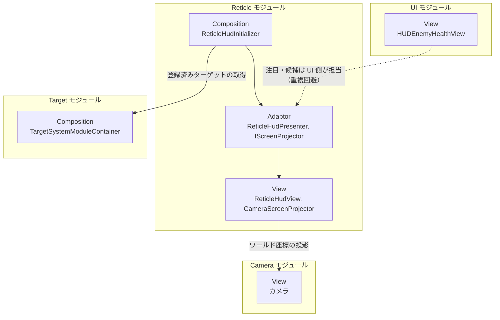
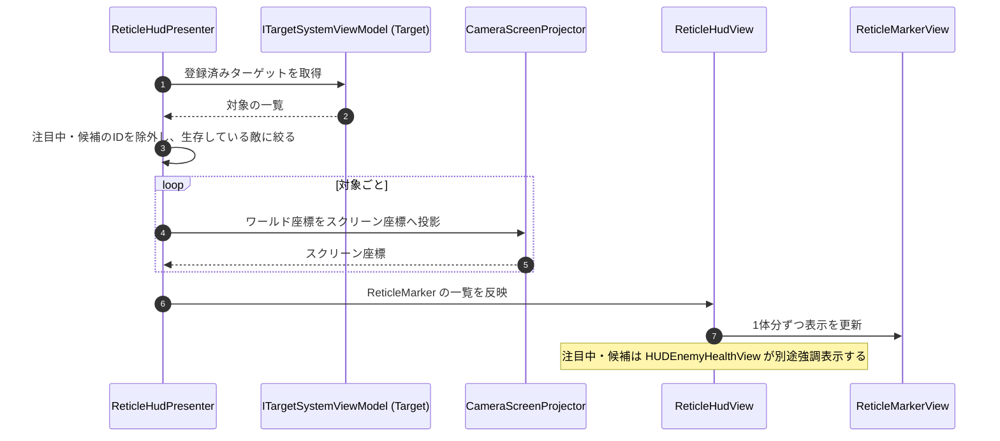

# 概要
> 💡 **モジュール概要**
> 画面内の敵にレティクル（照準マーカー）を重ねて表示するモジュールである。注目中・候補の敵はUIモジュールの体力ウィジェットが強調表示するため、当モジュールはそれ以外の生存敵だけを扱う。

| 項目 | 内容 |
| --- | --- |
| **モジュール名** | Reticle |
| **カテゴリ** | InGame |
| **ステータス** | 実装済み |
| **最終更新日** | 2026-08-17 |

---

## 🏗️ クラス

| クラス名 | レイヤー | 役割・機能 |
| --- | --- | --- |
| **`IScreenProjector`** | Adaptor | ワールド座標をスクリーン座標へ投影する処理の抽象 |
| **`ReticleHudPresenter`** | Adaptor | 登録済みの敵から、注目・候補を除いた生存敵のレティクル表示情報を算出する |
| **`ReticleMarker`** | Adaptor | 1体分のレティクル表示情報 |
| **`CameraScreenProjector`** | View | `IScreenProjector`実装。Cameraを用いて投影する |
| **`ReticleHudView`** | View | 対象全体のレティクルをScreen Space GUI上に表示する |
| **`ReticleMarkerView`** | View | 1体分のマーカーを表すコンポーネント |
| **`ReticleHudInitializer`** | Composition | レティクル表示まわりの生成と依存解決（Order 660） |

### 🧩 Composition初期化情報

| 項目 | 内容 |
| --- | --- |
| **Initializerクラス** | `ReticleHudInitializer` |
| **Order** | 660（Target(100)とEnemy(700)の間。`TargetSystemModuleContainer`を取得するためTargetより後に置く） |
| **公開する ModuleContainer / ServiceLocator登録型** | なし |

---

## 🔗 モジュール結合

### 📥 依存しているもの

* **`Target`**
  * *依存箇所*: `TargetSystemModuleContainer`, `ITargetSystemViewModel`
  * *詳細*: 登録済みのターゲットから、注目中と候補のIDを除いた生存敵を取り出す
* **`Camera`**
  * *依存箇所*: カメラ
  * *詳細*: `CameraScreenProjector`がワールド座標をスクリーン座標へ投影する

### 📤 依存されているもの

* なし
  * *詳細*: 他モジュールから参照されない表示専用のモジュールである

---

# 詳細

## 🧅レイヤー情報

### ① Domain
当モジュールでは使用していない。
### ② Application
当モジュールでは使用していない。
### ③ Adaptor
`ReticleHudPresenter`が表示対象を決める。注目中と候補の敵は`HUDEnemyHealthView`（UIモジュール）が強調表示するため、両IDを除外して重複を避ける。座標変換は`IScreenProjector`の先へ追い出しており、Presenter自体はUnityのCameraに依存しない。
### ④ View
`ReticleHudView`がScreen Space GUI上へマーカーを並べ、`ReticleMarkerView`が1体分を表す。`CameraScreenProjector`が投影を担当する。
### ⑤ Infrastructure
当モジュールでは使用していない。
### ⑥ Composition
`ReticleHudInitializer`（Order 660）が構築する。`TargetSystemModuleContainer`をServiceLocatorから取得するため、Targetモジュールより後に初期化される必要がある。

## 🔌 拡張ポイント

| 拡張したいこと | 実装する場所 | 追加登録の要否 |
| --- | --- | --- |
| 投影方法を差し替えたい | `IScreenProjector`（Adaptor）を実装したクラスを作り、`ReticleHudInitializer`で差し替える | 必要（Initializerでの差し替えが要る） |
| 表示対象の条件を変えたい | `ReticleHudPresenter`の除外条件を変更する。現在は注目中と候補のIDを除外している | 不要 |

## 🔄処理フロー

主要な処理フローは、それぞれ子ページに分けている。

### ① レティクル表示フロー（毎フレーム）

登録済みの敵から表示対象を絞り、スクリーン座標へ投影して並べる。

