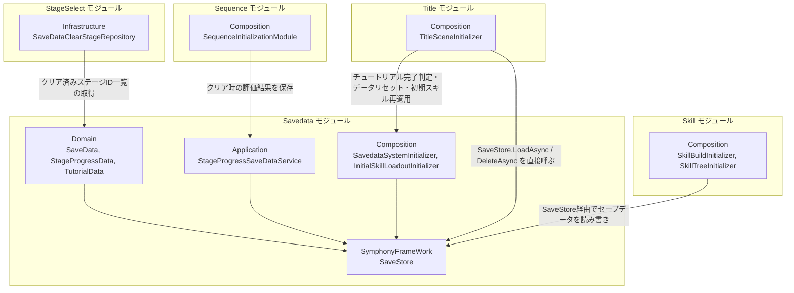
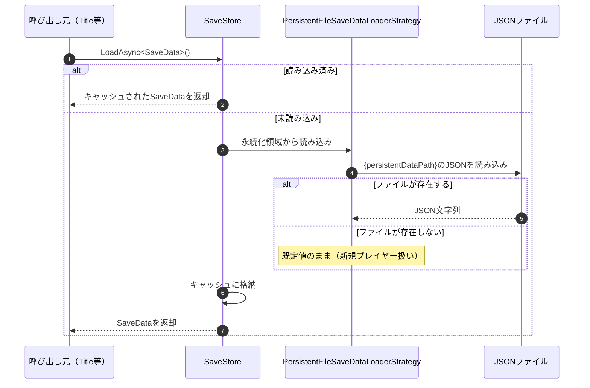
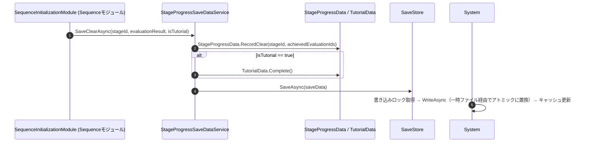

# 概要
> 💡 **モジュール概要**
> プレイヤーのセーブデータ（スキル解放・装備構成・ステージ進行・チュートリアル完了状態）の読み込み・保存・キャッシュを司る常駐モジュールである。JSONファイルへの永続化と、型ごとのキャッシュ・排他制御を担う。

| 項目 | 内容 |
| --- | --- |
| **モジュール名** | Savedata |
| **カテゴリ** | Persistent |
| **ステータス** | 実装済み |
| **最終更新日** | 2026-08-17 |

---

## 🏗️ クラス

| クラス名 | レイヤー | 役割・機能 |
| --- | --- | --- |
| **`SaveData`** | Domain | セーブデータのルート集約。`SkillUnlock`/`SkillBuild`/`StageProgress`/`Tutorial`の4つのデータを束ねる |
| **`SkillUnlockData`** | Domain | 研究ポイント、解放済みスキルツリーノードID、解放済みスキルIDを保持 |
| **`SkillBuildData`** | Domain | 装備中スキルIDリスト、スキルレベルアップポイントを保持 |
| **`StageProgressData`** | Domain | 全ステージのクリア記録（`StageClearData`のリスト）を保持。`RecordClear`/`IsStageCleared` |
| **`StageClearData`** | Domain | 1ステージ分のクリア記録（StageId＋達成済み評価条件IDリスト、複数プレイ分を和集合でマージ） |
| **`TutorialData`** | Domain | チュートリアル完了フラグ（`IsTutorialCompleted`）。`Complete()`で確定 |
| **`SaveStore`** | SymphonyFrameWork | 型ごとのロード・保存・削除・キャッシュを行うフレームワーク側のAPI。旧`SaveBase`/`SavedataSystem`はこれへ統合され、当リポジトリからは削除済み |
| **`PersistentFileSaveDataLoaderStrategy`** | Infrastructure | セーブデータを永続化領域のJSONファイルへ読み書きするローダー |
| **`StageProgressSaveDataService`** | Application | ステージクリア時の評価結果を`StageProgressData`へ記録し保存する窓口。チュートリアル完了もあわせて記録 |
| **`InitialSkillLoadoutService`** | Application | セーブデータへ初期解放・初期装備スキルを補完する。起動時とセーブデータリセット後の双方で使う |
| **`SavedataSystemInitializer`** | Composition | セーブ機構の初期化とServiceLocatorへの登録（Order 10） |
| **`InitialSkillLoadoutInitializer`** | Composition | `InitialSkillLoadoutService`の構築と初期スキルの補完（Order 20） |
| **`LegacyDataIdMigration`** | Composition | ID統一前の連番IDを現在のハッシュIDへ移行する内部クラス |

### 🧩 Composition初期化情報

| 項目 | 内容 |
| --- | --- |
| **Initializerクラス** | `SavedataSystemInitializer`（保存機構）／`InitialSkillLoadoutInitializer`（初期スキル補完） |
| **Order** | 10（保存機構。Persistentシーン内でほぼ最初期）／20（初期スキル補完） |
| **公開する ModuleContainer / ServiceLocator登録型** | 専用の`ModuleContainer`は無し。`InitialSkillLoadoutService`をServiceLocatorへ登録し、保存の入口はSymphonyFrameWorkの`SaveStore`（静的API）を直接使う |

---

## 🔗 モジュール結合

### 📥 依存しているもの

* なし
  * *詳細*: 本モジュールは他モジュールのDomain/Application型に一切依存しない、独立した基盤モジュールである

### 📤 依存されているもの

* **`Sequence`**
  * *参照箇所*: `StageProgressSaveDataService.SaveClearAsync`
  * *詳細*: ミッションクリア確定時に評価結果・チュートリアル完了状態を保存する
* **`StageSelect`**
  * *参照箇所*: `SaveDataClearStageRepository`（`IStageClearRepository`実装）
  * *詳細*: クリア済みステージ一覧をステージマップの解放判定に使用する
* **`Title`**
  * *参照箇所*: `SaveStore.LoadAsync<SaveData>()` / `SaveStore.DeleteAsync<SaveData>()`, `InitialSkillLoadoutService`
  * *詳細*: 初回起動判定（`TutorialData.IsTutorialCompleted`）とセーブデータリセットで使用する。リセット後は初期スキルの再補完も呼ぶ
* **`Skill`**
  * *参照箇所*: `SaveStore`
  * *詳細*: `SkillBuildInitializer`/`SkillTreeInitializer`がスキル解放・装備状態の読み書きに使用する

---

# 詳細

## 🧅レイヤー情報

### ① Domain
`SaveData`を頂点に、`SkillUnlockData`/`SkillBuildData`/`StageProgressData`/`TutorialData`という4つのサブデータを保持する。いずれも「公開プロパティは読み取り専用、変更は意図が伝わるメソッド経由」という設計規約（`Architecture.txt`参照）に従っている。
### ② Application
`StageProgressSaveDataService`が、ステージクリア時の評価結果を`StageProgressData.RecordClear`へ変換して保存する橋渡しを行う。`InitialSkillLoadoutService`が初期解放・初期装備スキルの補完を担当する。
### ③ Adaptor
当モジュールでは使用していない。
### ④ View
当モジュールでは使用していない。
### ⑤ Infrastructure
`PersistentFileSaveDataLoaderStrategy`が、永続化領域のJSONファイルへの読み書きを担当する。クリア済みステージ情報を提供する`SaveDataClearStageRepository`はStageSelectモジュール側にある。
### ⑥ Composition
`SavedataSystemInitializer`（Order 10）が保存機構を初期化し、`InitialSkillLoadoutInitializer`（Order 20）が初期解放・初期装備スキルを補完する。`LegacyDataIdMigration`がID統一前の連番IDをハッシュIDへ移行する。

## 🔌 拡張ポイント

> 現状、ポリモーフィックな拡張ポイント（`SubclassSelector`等）はない。保存する項目を増やす場合は`SaveData`（`SaveDataContent`を継承）へフィールドを追加する。独立した型として保存したい場合は`SaveDataContent`を継承したクラスを作り、`SaveStore.LoadAsync<T>()`/`SaveAsync<T>()`で扱う。

## 🔄処理フロー

主要な処理フローは、それぞれ子ページに分けている。

### ① セーブデータ読み込みフロー（初回アクセス時）

### ② クリア時の保存フロー

