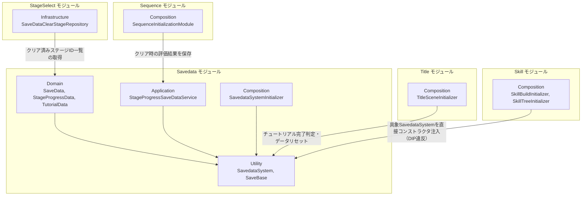
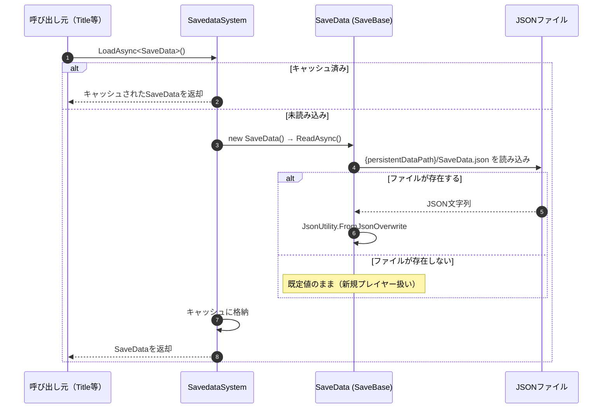
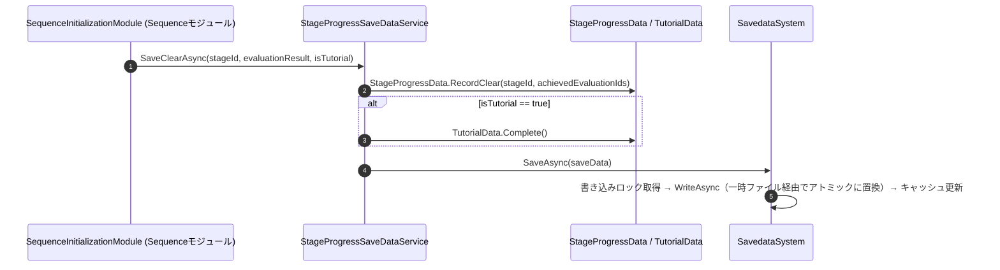

# 概要
> 💡 **モジュール概要**
> プレイヤーのセーブデータ（スキル解放・装備構成・ステージ進行・チュートリアル完了状態）の読み込み・保存・キャッシュを司る常駐モジュールです。JSONファイルへの永続化と、型ごとのキャッシュ・排他制御を担います。

| 項目 | 内容 |
| --- | --- |
| **モジュール名** | Savedata |
| **カテゴリ** | Persistent |
| **ステータス** | 実装済み |
| **最終更新日** | 2026-07-15 |

---

## 🏗️ クラス

| クラス名 | レイヤー | 役割・機能 |
| --- | --- | --- |
| **`SaveData`** | Domain | セーブデータのルート集約。`SkillUnlock`/`SkillBuild`/`StageProgress`/`Tutorial`の4つのデータを束ねる |
| **`SkillUnlockData`** | Domain | 研究ポイント、解放済みスキルツリーノードID、解放済みスキルIDを保持 |
| **`SkillBuildData`** | Domain | 装備中スキルIDリスト、スキルレベルアップポイントを保持 |
| **`StageProgressData`** | Domain | 全ステージのクリア記録（`StageClearData`のリスト）を保持。`RecordClear`/`IsStageCleared` |
| **`StageClearData`** | Domain | 1ステージ分のクリア記録（StageId＋達成済み評価条件IDリスト、複数プレイ分を和集合でマージ） |
| **`TutorialData`** | Domain | チュートリアル完了フラグ（`IsTutorialCompleted`）。`Complete()`で確定 |
| **`SaveBase`** | Utility | セーブデータの抽象基底。JSON読み書き（`ReadAsync`/`WriteAsync`）、ファイルパス解決を提供 |
| **`SavedataSystem`** | Utility | 型ごとのロード・保存・削除・キャッシュ・排他制御・世代管理を行うランタイムサービス |
| **`StageProgressSaveDataService`** | Application | ステージクリア時の評価結果を`StageProgressData`へ記録し保存する窓口。チュートリアル完了もあわせて記録 |
| **`SaveDataClearStageRepository`** | Infrastructure | `IStageClearRepository`実装。`StageProgressData`からクリア済みステージID一覧を取得（StageSelectモジュールへ提供） |
| **`SavedataSystemInitializer`** | Composition | `SavedataSystem`の生成とServiceLocatorへの登録 |

### 🧩 Composition初期化情報

| 項目 | 内容 |
| --- | --- |
| **Initializerクラス** | `SavedataSystemInitializer` |
| **Order** | 10（Persistentシーン内。ほぼ最初期に初期化される） |
| **公開する ModuleContainer / ServiceLocator登録型** | 専用の`ModuleContainer`は無し。`SavedataSystem`インスタンス自体を直接ServiceLocatorへ登録 |

---

## 🔗 モジュール結合

### 📥 依存しているもの

* なし
  * *詳細*: 本モジュールは他モジュールのDomain/Application型に一切依存しない、独立した基盤モジュールです。

### 📤 依存されているもの

* **`Sequence`**
  * *参照箇所*: `StageProgressSaveDataService.SaveClearAsync`
  * *詳細*: ミッションクリア確定時に評価結果・チュートリアル完了状態を保存します。
* **`StageSelect`**
  * *参照箇所*: `SaveDataClearStageRepository`（`IStageClearRepository`実装）
  * *詳細*: クリア済みステージ一覧をステージマップの解放判定に使用します。
* **`Title`**
  * *参照箇所*: `SavedataSystem.LoadAsync<SaveData>()` / `DeleteSaveDataAsync<SaveData>()`
  * *詳細*: 初回起動判定（`TutorialData.IsTutorialCompleted`）とセーブデータリセット機能で使用します。
* **`Skill`**
  * *参照箇所*: `SavedataSystem`（具象クラス）
  * *詳細*: `SkillBuildInitializer`/`SkillTreeInitializer`が`ServiceLocator`経由で取得し、`SkillBuildUseCase`/`SkillTreeService`へ具象のまま直接コンストラクタ注入しています（DIP違反、Skillモジュールの既知の課題を参照）。

---

# 詳細

## 🧅レイヤー情報

### ① Domain
`SaveData`を頂点に、`SkillUnlockData`/`SkillBuildData`/`StageProgressData`/`TutorialData`という4つのサブデータを保持します。いずれも「公開プロパティは読み取り専用、変更は意図が伝わるメソッド経由」という設計規約（`Architecture.txt`参照）に従っています。
### ② Application
`StageProgressSaveDataService`が、ステージクリア時の評価結果を`StageProgressData.RecordClear`へ変換して保存する橋渡しを行います。
### ③ Adaptor
当モジュールでは使用していません。
### ④ View
当モジュールでは使用していません。
### ⑤ Infrastructure
`SaveDataClearStageRepository`が`IStageClearRepository`を実装し、StageSelectモジュールへクリア済みステージ情報を提供します。
### ⑥ Composition
`SavedataSystemInitializer`（Order 10）が`SavedataSystem`を生成しServiceLocatorへ登録します。

## 🔌 拡張ポイント

> 現状、ポリモーフィックな拡張ポイント（`SubclassSelector`等）はありません。新しい種類のセーブデータを追加する場合は、`SaveBase`を継承した新しいクラスを作成し、`SaveData`のフィールドとして追加するか、独立した型として`SavedataSystem.LoadAsync<T>()`/`SaveAsync<T>()`で扱う形になります（`T : SaveBase, new()`という型制約を満たせば、`SavedataSystem`は特別な登録なしに新しい型を扱えます）。

## 🔄処理フロー

主要な処理フローごとに分けて記述します。

### ① セーブデータ読み込みフロー（初回アクセス時）

### ② クリア時の保存フロー

## 📝 アーキテクチャ上の特徴・既知の課題

### ✅ 設計上の見どころ
* **型ごとのキャッシュ・排他制御・世代管理**: `SavedataSystem`は型ごとに読み込みタスクの重複排除（`Lazy<Task<SaveBase>>`）、書き込み排他（`SemaphoreSlim`）、削除時の世代番号インクリメントによる古い読み込み結果の無効化を実装しており、複数箇所から同時にロード・保存が要求されても安全です。
* **アトミックな書き込み**: `SaveBase.WriteAsync`は一時ファイルへ書き込んでから置換する方式のため、保存途中でのクラッシュによるファイル破損リスクを抑えています。
* **`null`許容な安全設計**: `SaveData.OnAfterDeserialize()`が各サブデータの`null`チェックと初期値補完を行うため、古いセーブデータ形式や欠損データでも例外なく動作します。

### ⚠️ 既知の課題・改善ポイント
* **Skillモジュールからの具象直接依存**: `SkillBuildInitializer`/`SkillTreeInitializer`が`SavedataSystem`を`ServiceLocator`から取得し、抽象を介さず`SkillBuildUseCase`/`SkillTreeService`のコンストラクタへ直接渡しています（Skillモジュールの既知の課題として重複記載）。
* **保存先の固定化**: `SaveBase.FilePath`は`Application.persistentDataPath`固定で、クラウドセーブ等への切り替えは現状のコード構造では考慮されていません（`SaveBase`内のTODOコメントにも記載あり）。
