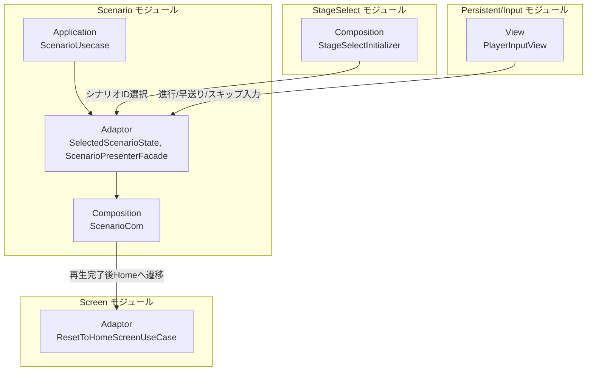
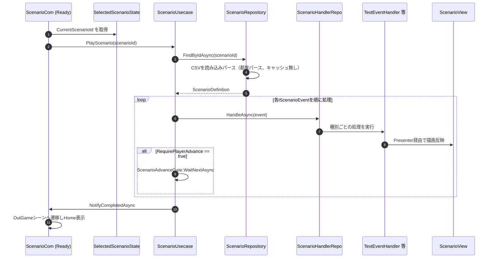

# 概要
> 💡 **モジュール概要**
> CSVで定義された線形の会話・カットシーン（テキスト・背景・立ち絵・アニメーション・フェード・レイヤー順）を再生するモジュールです。プレイヤーの選択による分岐はなく、テキスト表示中に文字位置・キーワードで副次イベントを差し込む「タイミングトリガー」のみを持ちます。

| 項目 | 内容 |
| --- | --- |
| **モジュール名** | Scenario |
| **カテゴリ** | OutGame |
| **ステータス** | 実装済み（パフォーマンス上の既知の課題あり） |
| **最終更新日** | 2026-07-15 |

---

## 🏗️ クラス

| クラス名 | レイヤー | 役割・機能 |
| --- | --- | --- |
| **`IScenarioEvent`** | Domain | シナリオイベントの共通抽象（`RequirePlayerAdvance`） |
| **`TextEvent` / `PortraitEvent` / `BackgroundEvent` / `AnimationEvent` / `FadeEvent` / `LayerEvent`** | Domain | `IScenarioEvent`の具体的な種類（テキスト表示・立ち絵・背景・アニメーション・フェード・レイヤー順変更） |
| **`TextTimingTrigger`** | Domain | テキスト表示中の文字位置/キーワード/接尾辞で副次イベントを発火する仕組み |
| **`LayerTarget` / `PortraitSlot` / `TextTriggerKind`** | Domain | レイヤー種別・立ち絵スロット・トリガー種別を表すenum |
| **`PortraitDefinition` / `BackgroundDefinition` / `AnimationDefinition`** | Domain | ID→アセットキーの対応を表す構造体 |
| **`ScenarioDefinition`** | Domain | `IScenarioEvent`の順序付きリスト。1シナリオ分の全体定義 |
| **`ScenarioUsecase`** | Application | 再生エンジン本体。`IScenarioEventEmitter`/`IScenarioPlaybackControl`/`IScenarioPlaybackState`を実装 |
| **`ScenarioHandlerRepo`** | Application | イベント種別→ハンドラの振り分け辞書 |
| **`IScenarioEventHandler<T>`**| Application | イベント種別ごとの処理契約 |
| **`IScenarioRepository`** | Application | シナリオ定義の取得抽象（実装はInfrastructure層） |
| **`ITextAdvanceWaiter`** | Application | プレイヤーの「次へ」入力待機の抽象 |
| **`*EventHandler`（Text/Background/Animation/Fade/Layer/Portrait）** | Adaptor | イベント種別ごとの実処理。`*Presenter`経由でViewへ通知 |
| **`ScenarioPresenterFacade`** | Adaptor | 全出力ポートを束ねるFacade（`IScenarioCompletionNotifier`も実装） |
| **`ScenarioAdvanceGate`** | Adaptor | ロック＋`TaskCompletionSource`によるプレイヤー入力待機ゲート |
| **`ScenarioInputController`** | Adaptor | 入力を再生制御コマンドへ変換 |
| **`SelectedScenarioState`** | Adaptor | OutGameシーンで選択したシナリオIDを保持するクロスシーン状態 |
| **`ScenarioView`** | View | 実際のUnity描画（TextMeshPro、背景Image、Animationコンポーネント、立ち絵スロット、CanvasGroupフェード） |
| **`ScenarioInputView`** | View | `PlayerInputView`を購読し、進行/早送り/一時停止/スキップ/オート/UI非表示を`ScenarioInputController`へ伝達 |
| **`ScenarioCsvUtility`** | Infrastructure | CSVパースの内部ユーティリティ（既知の課題を参照） |
| **`ScenarioRepository`** | Infrastructure | `IScenarioRepository`実装。CSVファイル/URLからシナリオを読み込みパースする |
| **`InMemoryScenarioRepository`** | Infrastructure | 開発用のハードコードされたテストシナリオ |
| **`AnimationRepository` / `BackgroundRepository` / `PortraitRepository`** | Infrastructure | 各種カタログAssetを背景としたリポジトリ実装 |
| **`ScenarioSettingsAsset`** | Infrastructure | 再生タイミング等の設定値ScriptableObject |
| **`ScenarioCom`** | Composition | シナリオシーンの主要な構成ルート |
| **`OutGameScenarioInitializer`** | Composition | OutGameシーンで`SelectedScenarioState`を登録 |
| **`OutGameScenarioSceneInitializer`** | Composition | シナリオシーン専用の初期化コーディネーター起動役 |

### 🧩 Composition初期化情報

| 項目 | 内容 |
| --- | --- |
| **Initializerクラス** | `ScenarioCom`（シナリオシーン） / `OutGameScenarioInitializer`（OutGameシーン） |
| **Order** | `OutGameScenarioSceneInitializer` = 0 / `ScenarioCom` = 10（シナリオシーン内） / `OutGameScenarioInitializer` = 10（OutGameシーン内） |
| **公開する ModuleContainer / ServiceLocator登録型** | 専用の`ModuleContainer`は無し。`SelectedScenarioState`を個別にServiceLocatorへ登録 |

---

## 🔗 モジュール結合

### 📥 依存しているもの

* **`StageSelect`**
  * *依存箇所*: `SelectedScenarioState`
  * *詳細*: シナリオ種別ステージの出撃時に選択されたシナリオIDを、シナリオシーン側の`ScenarioCom.Ready()`が読み取ります。
* **`Persistent/Input`**
  * *依存箇所*: `PlayerInputView`
  * *詳細*: `ScenarioInputView`が進行・早送り・一時停止・スキップ・オート・UI非表示の各入力を購読します。

### 📤 依存されているもの

* **`Screen`**
  * *参照箇所*: `ResetToHomeScreenUseCase`（`OutGameUIEvent.OnShownHomeScreen`経由）
  * *詳細*: シナリオ再生完了後、OutGameシーンへ戻りHome画面を表示するよう間接的に要求します。

---

# 詳細

## 🧅レイヤー情報

### ① Domain
`IScenarioEvent`とその6種の具象（テキスト・立ち絵・背景・アニメーション・フェード・レイヤー順）、およびテキスト表示中に副次イベントを差し込む`TextTimingTrigger`を保持します。
### ② Application
`ScenarioUsecase`を中心に、シナリオの取得・順次再生・イベントディスパッチ（`ScenarioHandlerRepo`）を実装します。
### ③ Adaptor
イベント種別ごとの`*EventHandler`/`*Presenter`、それらを束ねる`ScenarioPresenterFacade`、プレイヤー入力待機の`ScenarioAdvanceGate`を定義します。
### ④ View
`ScenarioView`（MonoBehaviour）がTextMeshPro・背景Image・Animationコンポーネント・立ち絵スロット・CanvasGroupフェードといった実際のUnity描画を担当し、`ScenarioInputView`が入力購読を担当します。
### ⑤ Infrastructure
`ScenarioRepository`がCSVファイルを読み込みパースし、`AnimationRepository`/`BackgroundRepository`/`PortraitRepository`が各種カタログAssetからアセットキーを解決します。
### ⑥ Composition
`ScenarioCom`がシナリオシーン内の全スタックを手動DIで構築し、`OutGameScenarioInitializer`がOutGameシーン側で`SelectedScenarioState`を登録します。

## 🔌 拡張ポイント

| 拡張したいこと | 実装する場所 | 追加登録の要否 |
| --- | --- | --- |
| 新しいイベント種別を追加したい | `IScenarioEvent`（Domain）の実装クラスを追加し、対応する`IScenarioEventHandler<T>`（Adaptor）を実装する | 必要（`ScenarioHandlerRepo`への型登録を`ScenarioCom.Build()`に追記しないと、CSVにその種別が現れても処理されない） |

## 🔄処理フロー

主要な処理フローごとに分けて記述します。

### ① シナリオ読み込み〜再生フロー
シナリオシーンに遷移してから、CSVを読み込みイベントを順次再生する流れです。

