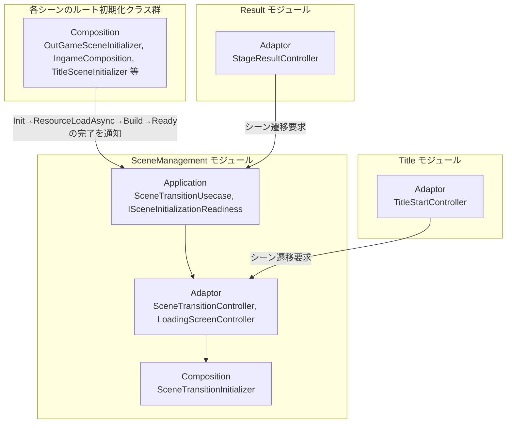
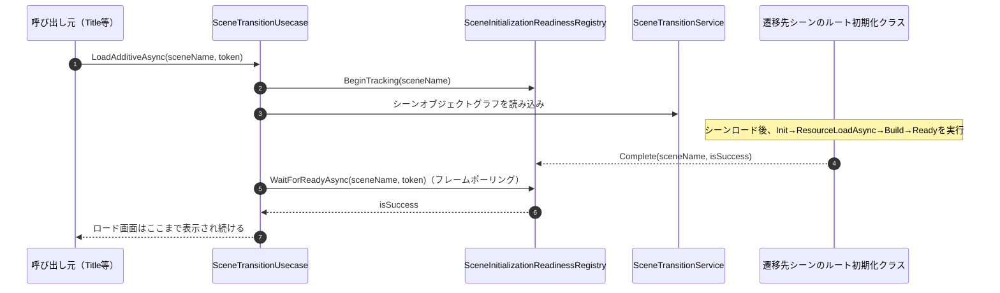
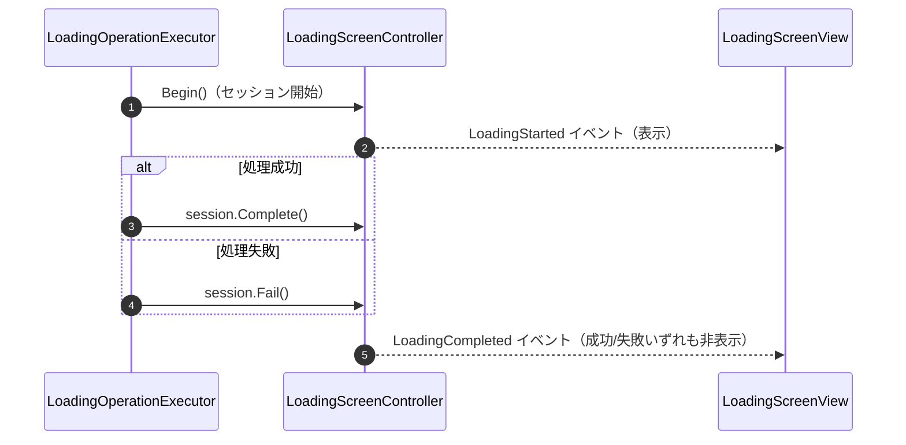

# 概要
> 💡 **モジュール概要**
> シーンの追加ロード・アンロード・切り替えと、ロード画面の表示・非表示を司る常駐モジュールです。単にシーンオブジェクトグラフの読み込みが終わるだけでなく、遷移先シーンの初期化モジュール（`Init→ResourceLoadAsync→Build→Ready`）が完了するまでロード画面を表示し続けます。

| 項目 | 内容 |
| --- | --- |
| **モジュール名** | SceneManagement |
| **カテゴリ** | Persistent |
| **ステータス** | 実装済み |
| **最終更新日** | 2026-07-15 |

---

## 🏗️ クラス

| クラス名 | レイヤー | 役割・機能 |
| --- | --- | --- |
| **`ISceneTransitionService`** | Application | シーンロード処理そのものの抽象（実装はInfrastructure層） |
| **`ISceneInitializationReadiness`** | Application | シーン名をキーに初期化完了を追跡・待機する契約 |
| **`SceneInitializationReadinessRegistry`** | Application | `ISceneInitializationReadiness`実装。シーン名ごとの完了状態を保持し、フレームポーリングで待機する |
| **`SceneTransitionUsecase`** | Application | シーンロードと初期化完了待機を1つの継続的な処理としてまとめるユースケース |
| **`ILoadingOperationExecutor`** | Application | ロード画面付き処理の実行機能の抽象 |
| **`LoadingOperationExecutor`** | Application | ロードセッションの開始〜完了/失敗までを管理する実装 |
| **`ILoadingSession` / `ILoadingSessionFactory`** | Application | ロードセッションの抽象契約 |
| **`LoadingExecutionOptions` / `LoadingProgressRange`** | Application | ロード進捗の範囲・継続オプションを表す値オブジェクト |
| **`SceneTransitionController`** | Adaptor | Viewからのシーン遷移要求を受け取り`SceneTransitionUsecase`へ委譲する薄いパススルー |
| **`LoadingScreenController`** | Adaptor | ロードセッションの開始・成功・失敗を管理し`LoadingStarted`/`LoadingCompleted`イベントを発行 |
| **`SceneTransitionView`** | View | シーン遷移状態のデバッグ表示 |
| **`LoadingScreenView`** | View | ロード画面本体の表示/非表示（`LoadingScreenController`のイベントを購読） |
| **`SceneTransitionService`** | Infrastructure | `ISceneTransitionService`実装。実際に`SceneLoader`（Unity）を呼び出す |
| **`SceneTransitionInitializer`** | Composition | 上記スタック一式の構築・ServiceLocatorへの登録 |

### 🧩 Composition初期化情報

| 項目 | 内容 |
| --- | --- |
| **Initializerクラス** | `SceneTransitionInitializer` |
| **Order** | 0（Persistentシーン内で最初に初期化される） |
| **公開する ModuleContainer / ServiceLocator登録型** | 専用の`ModuleContainer`は無し。`LoadingScreenController`、`ILoadingSessionFactory`、`ILoadingOperationExecutor`、`ISceneTransitionService`、`ISceneInitializationReadiness`、`SceneTransitionUsecase`、`SceneTransitionController`を個別にServiceLocatorへ登録 |

---

## 🔗 モジュール結合

### 📥 依存しているもの

* なし
  * *詳細*: 本モジュールは他モジュールのDomain/Application型に依存しない、独立した基盤モジュールです。

### 📤 依存されているもの

* **各シーンのルート初期化クラス（`OutGameSceneInitializer`、`IngameComposition`、`TitleSceneInitializer`等）**
  * *参照箇所*: `ISceneInitializationReadiness.BeginTracking`/`Complete`
  * *詳細*: 各シーンのComposition初期化が完了した際にこのレジストリへ完了を通知します。通知が来るまで、シーン遷移を要求した側のロード画面は表示され続けます。
* **`Title`**
  * *参照箇所*: `SceneTransitionController.LoadAdditiveAsync`/`UnloadAsync`
  * *詳細*: `TitleStartController.StartGameAsync`がシーン遷移に使用します。
* **`Result`**
  * *参照箇所*: `SceneTransitionUsecase.UnloadThenChangeSceneAsync`/`UnloadThenReloadSceneAsync`
  * *詳細*: `StageResultController`の完了/リトライボタンから使用されます。
* **`StageSelect` / `Scenario`**
  * *参照箇所*: `SceneTransitionUsecase.LoadAdditiveAsync`/`ChangeSceneAsync`
  * *詳細*: 出撃・シナリオ再生開始時のシーン遷移に使用されます。

---

# 詳細

## 🧅レイヤー情報

### ① Domain
当モジュールでは使用していません。
### ② Application
`SceneTransitionUsecase`がシーンロードと初期化完了待機を1つの継続処理として扱い、`ISceneInitializationReadiness`がシーン名ごとの完了状態を管理します。`ILoadingOperationExecutor`/`LoadingOperationExecutor`がロードセッションの実行制御を担います。
### ③ Adaptor
`SceneTransitionController`がViewからの要求を仲介し、`LoadingScreenController`がロードセッションの開始・成功・失敗イベントを発行します。
### ④ View
`LoadingScreenView`がロード画面の表示/非表示を、`SceneTransitionView`がデバッグ表示を担当します。
### ⑤ Infrastructure
`SceneTransitionService`が実際のUnityシーンロード（`SceneLoader`）を呼び出します。
### ⑥ Composition
`SceneTransitionInitializer`（Order 0）が上記スタック全体を構築し、既存インスタンスが無い場合のみ新規登録します（Persistentシーンの再読み込み等での二重登録を防止）。

## 🔌 拡張ポイント

> 現状、ポリモーフィックな拡張ポイント（`SubclassSelector`等）はありません。

## 🔄処理フロー

主要な処理フローごとに分けて記述します。

### ① シーン追加ロード＋初期化完了待機フロー

### ② ロードセッションの成功/失敗通知フロー

## 📝 アーキテクチャ上の特徴・既知の課題

### ✅ 設計上の見どころ
* **モジュール初期化完了を待つロード画面**: 単なるシーンオブジェクトグラフの読み込み完了ではなく、遷移先シーンのComposition初期化（`Init→ResourceLoadAsync→Build→Ready`）が完了するまでロード画面を表示し続けるため、初期化未完了の画面がプレイヤーに見えてしまう問題を防いでいます。この仕組みはInGameの`IngameComposition`で先行して実装されていたパターンを、`SceneInitializationReadinessRegistry`として全シーン共通の仕組みへ一般化したものです。
* **既存登録の再利用**: `SceneTransitionInitializer`は既に`SceneTransitionController`等が登録済みであればそれを再利用し、二重生成を避けます。

### ⚠️ 既知の課題・改善ポイント
* **`PersistentEntryPoint.LoadFirstSceneAsync`の経路**: 初回シーンロードは`SceneTransitionController`を経由しますが、これは内部的に`SceneTransitionUsecase`への薄いパススルーであるため、実際には他の遷移経路と同様にモジュール初期化完了待機の恩恵を受けています。ただし経路が独立して見えるため、変更時は注意してください。
* **タイムアウト値の妥当性**: `SceneInitializationReadinessRegistry`の最大待機フレーム数は固定値です。アセット量が多く初期化に時間がかかるシーンでは、タイムアウトを誤検知しないよう値の調整が必要になる場合があります。
