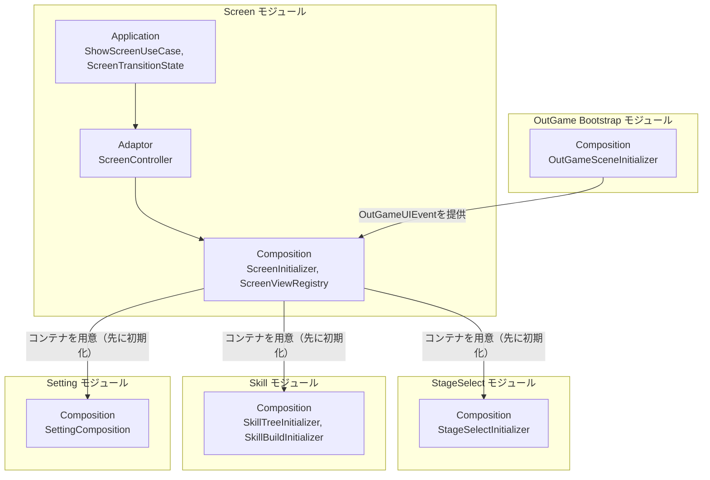
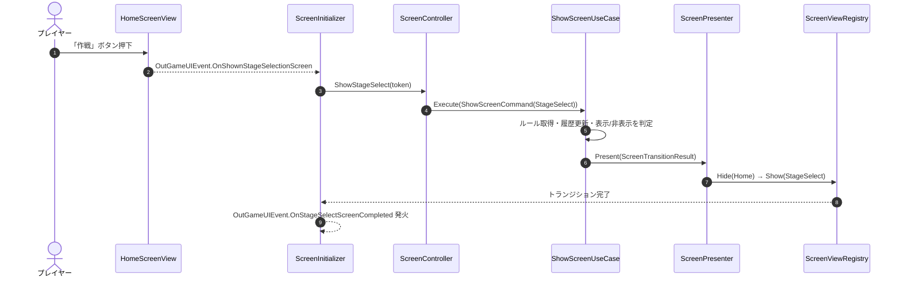

# 概要
> 💡 **モジュール概要**
> アウトゲーム内の画面遷移（Home/StageSelect/SkillTree/SkillBuild/Setting/BattlePreparation）を、ルールベースの履歴スタック（Replace/Overlay/Reset）で管理するナビゲーション基盤モジュールです。各画面のコンテナ（表示/非表示の器）を本モジュールが所有し、中身の構築は各機能モジュール（StageSelect/SkillTree等）が担当します。

| 項目 | 内容 |
| --- | --- |
| **モジュール名** | Screen |
| **カテゴリ** | OutGame |
| **ステータス** | 実装済み |
| **最終更新日** | 2026-07-15 |

---

## 🏗️ クラス

| クラス名 | レイヤー | 役割・機能 |
| --- | --- | --- |
| **`ScreenId`** | Domain | 全画面（OutGame側のHome〜BattlePreparation、Title側のTitle〜Credit）を表すenum |
| **`ScreenTransitionType`** | Domain | `Replace`（前画面を隠す）/`Overlay`（前画面を残す）/`Reset`（履歴クリア）を表すenum |
| **`ScreenTransitionRule`** | Domain | 画面ごとの遷移方針（`ScreenTransitionType`＋履歴保持有無）を表すreadonly struct |
| **`IScreenRuleRepository`** | Application | 画面IDから遷移ルールを取得する抽象 |
| **`IScreenStateRepository`** | Application | 現在の遷移状態（`ScreenTransitionState`）を保持する抽象 |
| **`ScreenTransitionState`** | Application | 現在画面＋履歴スタックを管理。`MoveTo`/`TryGoBack`/`Reset` |
| **`ShowScreenUseCase`** | Application | 画面表示要求を受け、ルール適用・履歴更新・表示/非表示判定を行う |
| **`CloseCurrentScreenUseCase`** | Application | 履歴を1つ戻す（`TryGoBack`） |
| **`ResetToHomeScreenUseCase`** | Application | 履歴をクリアしHome画面へ強制リセット |
| **`IScreenPresenter`** | Application | 画面遷移結果の出力境界 |
| **`ScreenController`** | Adaptor | `ShowHome`/`ShowStageSelect`等、用途別メソッドで3つのUseCaseをラップする窓口 |
| **`ScreenPresenter`** | Adaptor | 遷移結果を`ScreenViewDTO`へ変換し`IScreenTransitionApplicable`へ渡す |
| **`ScreenViewApplicator`** | Adaptor | `IScreenViewRegistry`経由で実際のView表示/非表示を実行 |
| **`IScreenViewRegistry`** | Adaptor | 画面IDと具象View（Composition層で構築）を仲介する抽象 |
| **`OutGameUIEvent`** | View | OutGameシーン全体で共有される約25個のAction/Funcを持つイベントバス。`OutGameSceneInitializer`（Order 0）が最初に登録し、Screen以外の全モジュールからも参照される |
| **`ScreenViewBase`** | View | 表示/非表示・入力ブロック・トランジション終了待機を実装する画面基底クラス |
| **`HomeScreenView` / `SettingScreenView` / `SkillTreeScreenView` / `StageSelectScreenView` / `BattlePreparationScreen`** | View | 各画面のコンテナ・戻るボタン等の薄いシェル（中身は各機能モジュールが構築） |
| **`ScreenRuleData`** | Infrastructure | 画面ごとの遷移ルールを定義するScriptableObject |
| **`ScreenRuleRepository`** | Infrastructure | `ScreenRuleData`から`Dictionary<ScreenId, ScreenTransitionRule>`を構築 |
| **`ScreenStateRepository`** | Infrastructure | `ScreenTransitionState`の単純な保持実装 |
| **`ScreenInitializer`** | Composition | 画面コンテナ・遷移スタック一式を構築し、UI Toolkitの名前付きコンテナへ紐付ける |
| **`ScreenViewRegistry`** | Composition | 画面IDと`ScreenViewBase`の対応表 |

> `SkillBuildScreenView`はこのフォルダ（`4.View/OutGame/Screen/`）に物理的に置かれていますが、内容的にはSkillモジュールに属する大きなView（約380行）です。StageSelect/SkillTreeの詳細な中身（`StageDetailScreenView`等）は、Screenモジュールが用意したコンテナへ、それぞれのモジュールが個別に構築・配置します。

### 🧩 Composition初期化情報

| 項目 | 内容 |
| --- | --- |
| **Initializerクラス** | `ScreenInitializer` |
| **Order** | 100（`OutGameSceneInitializer`(0)の後、`StageSelectInitializer`(110)より前 — 他モジュールがコンテナへ内容を配置する前に、コンテナ自体を用意する） |
| **公開する ModuleContainer / ServiceLocator登録型** | 専用の`ModuleContainer`は無し。`SkillBuildScreenView`を個別にServiceLocatorへ登録（`SkillBuildInitializer`が取得するため） |

---

## 🔗 モジュール結合

### 📥 依存しているもの

* **`OutGame Bootstrap`**
  * *依存箇所*: `OutGameUIEvent`
  * *詳細*: `OutGameSceneInitializer`（Order 0）が最初に登録するイベントバスを、画面遷移要求の受信・完了通知に使用します。

### 📤 依存されているもの

* **`StageSelect` / `Skill` / `Setting`**
  * *参照箇所*: `ScreenInitializer`が構築するコンテナ（`StageSelectContainer`、`SkillTreeContainer`、`SkillBuildContainer`、`SettingContainer`等）
  * *詳細*: 各モジュールの初期化（Order 110以降）はScreenモジュール（Order 100）が用意したコンテナへ中身を構築します。初期化順序が逆転すると対象コンテナが存在せず失敗します。

---

# 詳細

## 🧅レイヤー情報

### ① Domain
画面ID（`ScreenId`）と、画面ごとの遷移方針（`ScreenTransitionType`/`ScreenTransitionRule`）という、Unity非依存の純粋な定義を保持します。
### ② Application
表示・戻る・ホームリセットの3つのUseCaseと、履歴スタックを管理する`ScreenTransitionState`を実装します。
### ③ Adaptor
`ScreenController`が用途別メソッドでUseCase群をラップし、`ScreenPresenter`/`ScreenViewApplicator`が遷移結果を実際のView表示/非表示へ変換します。
### ④ View
画面基底クラス`ScreenViewBase`と、各画面の薄いコンテナ・戻るボタンを担当します。`OutGameUIEvent`もこの層に属し、OutGameシーン全体のイベントハブとして機能します。
### ⑤ Infrastructure
`ScreenRuleData`（ScriptableObject）が画面ごとの遷移ルールをデザイナー向けに公開し、`ScreenRuleRepository`が実行時の辞書に変換します。
### ⑥ Composition
`ScreenInitializer`（Order 100）が7つの名前付きUI Toolkitコンテナを解決し、全画面のView・Adaptor・Application・Infrastructureスタックを手動DIで一括構築します。

## 🔌 拡張ポイント

> 現状、ポリモーフィックな拡張ポイント（`SubclassSelector`等）はありません。新しい画面を追加する場合は、`ScreenId`への値追加、`ScreenRuleData`アセットへのルール追加、`ScreenViewRegistry`への登録が必要です（Enum+データ追加、コード側の登録漏れは起動時に検知されにくいため注意）。

## 🔄処理フロー

主要な処理フローごとに分けて記述します。

### ① 画面遷移フロー（ボタン押下→新画面表示）
Home画面からStageSelect画面への遷移を例にした標準的な流れです。

