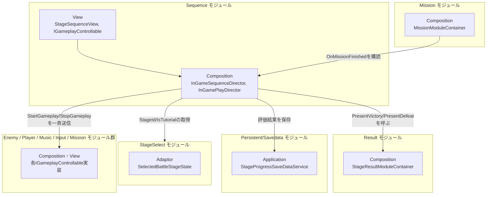
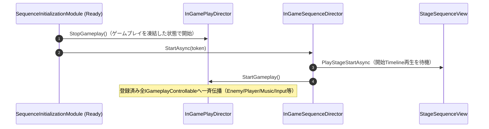
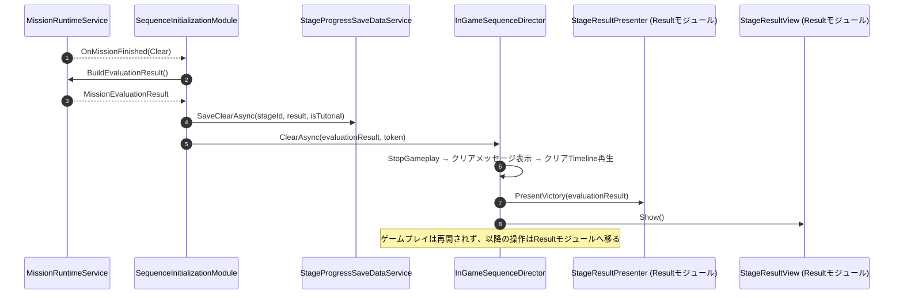

# 概要
> 💡 **モジュール概要**
> ステージ開始演出→ゲームプレイ開始、およびミッション終了（クリア/ゲームオーバー）時の演出→リザルト表示という、InGame全体の進行を統括するオーケストレーターモジュールです。自身はドメイン状態を持たず、`IGameplayControllable`という共通契約を介してEnemy/Player/Music/Input等の毎フレーム処理を一斉に開始・停止させます。

| 項目 | 内容 |
| --- | --- |
| **モジュール名** | Sequence |
| **カテゴリ** | InGame |
| **ステータス** | 実装済み |
| **最終更新日** | 2026-07-15 |

---

## 🏗️ クラス

| クラス名 | レイヤー | 役割・機能 |
| --- | --- | --- |
| **`IGameplayControllable`** | View | `StartGameplay()`/`StopGameplay()`の2メソッドのみを持つ契約。Enemy/Player/Music/Input/Mission等、多数のクラスがこれを実装する |
| **`StageSequenceView`** | View | 開始/クリア/ゲームオーバーの3つの`PlayableDirector`（Timeline）を保持し、再生完了を待機する |
| **`StageSequenceMessageView`** | View | 「Mission Start!」「Stage Clear!」「Game Over!」等の一時的なメッセージ表示を担当 |
| **`InGamePlayDirector`** | Composition | Inspectorで手動登録された`IGameplayControllable`群へ`StartGameplay`/`StopGameplay`を一斉に伝播するファンアウト役。自身も`IGameplayControllable`を実装する |
| **`InGameSequenceDirector`** | Composition | 演出＋ゲームプレイ制御＋リザルト表示までを統括する実際のオーケストレーター（プレーンC#クラス） |
| **`InputGamePlayControllable`** | Composition | `IGameplayControllable`実装。入力マップを`InGame`/`Common`間で切り替える |
| **`SequenceInitializationModule`** | Composition | 上記全ての構築・結線、およびミッション終了イベントの購読を行う |
| **`SequenceModuleContainer`** | Composition | `InGameSequenceDirector`をServiceLocatorへ公開するContainer（現状、参照する他モジュールは無い） |

### 🧩 Composition初期化情報

| 項目 | 内容 |
| --- | --- |
| **Initializerクラス** | `SequenceInitializationModule` |
| **Order** | 1000（InGame内で最も遅い。Mission(600)・Result(400)が確実に完了した後に実行される） |
| **公開する ModuleContainer / ServiceLocator登録型** | `SequenceModuleContainer`（`SequenceDirector`を保持。現状これを参照する他モジュールは無い） |

---

## 🔗 モジュール結合

### 📥 依存しているもの

* **`Mission`**
  * *依存箇所*: `MissionModuleContainer.MissionRuntimeService`, `MissionRuntimeService.OnMissionFinished`
  * *詳細*: ミッション終了イベントを購読し、`BuildEvaluationResult()`で評価結果を取得します。
* **`Result`**
  * *依存箇所*: `StageResultModuleContainer.Presenter`, 自ら`FindFirstObjectByType`する`StageResultView`
  * *詳細*: クリア/ゲームオーバー演出の最後に`PresentVictory`/`PresentDefeat`を呼び、`StageResultView.Show()`でリザルト画面へ切り替えます。
* **`Persistent/Savedata`**
  * *依存箇所*: `SavedataSystem`, `StageProgressSaveDataService`
  * *詳細*: クリア確定時に評価結果を保存します（保存はリザルト表示より前に行われます）。
* **`StageSelect`**
  * *依存箇所*: `SelectedBattleStageState`
  * *詳細*: `CurrentStageDefinition.StageId`/`IsTutorial`を保存呼び出しに使用します。

### 📤 依存されているもの

* **多数のInGameモジュール（間接的）**
  * *参照箇所*: `IGameplayControllable`
  * *詳細*: `InGamePlayDirector`がInspectorで手動登録された対象へ`StartGameplay`/`StopGameplay`を一斉送信します。ServiceLocator経由ではなくシーン内の直接参照（Inspectorドラッグ）であるため、モジュール結合図上の依存としては見えにくい点に注意してください。`SequenceModuleContainer`自体を参照する他モジュールは現状ありません。

---

# 詳細

## 🧅レイヤー情報

### ① Domain
当モジュールでは使用していません。
### ② Application
当モジュールでは使用していません。
### ③ Adaptor
当モジュールでは使用していません。
### ④ View
`IGameplayControllable`という共通契約、演出再生（`StageSequenceView`）とメッセージ表示（`StageSequenceMessageView`）を担当します。
### ⑤ Infrastructure
当モジュールでは使用していません。
### ⑥ Composition
`SequenceInitializationModule`（Order 1000）が全体を構築し、`InGameSequenceDirector`（実際のオーケストレーター）・`InGamePlayDirector`（ゲームプレイ一斉制御）・`InputGamePlayControllable`（入力マップ切替）を結線します。

## 🔌 拡張ポイント

> 新しい「毎フレーム処理をステージ進行に合わせて開始/停止したいシステム」を追加する場合は、対象クラスに`IGameplayControllable`を実装させ、シーン内の`InGamePlayDirector`のInspectorへ手動でドラッグ登録します。**自動検出ではありません**。登録を忘れても起動時エラーにはならず、単にそのシステムがステージ開始演出中も動き続けてしまう（サイレントな不具合）ため注意してください。

## 🔄処理フロー

主要な処理フローごとに分けて記述します。

### ① ステージ開始演出フロー
InGameシーン起動直後、開始演出を再生してからゲームプレイを開放します。

### ② クリア→保存→リザルト表示フロー
ミッションクリア確定から、評価結果の保存・クリア演出・リザルト表示までの流れです。

