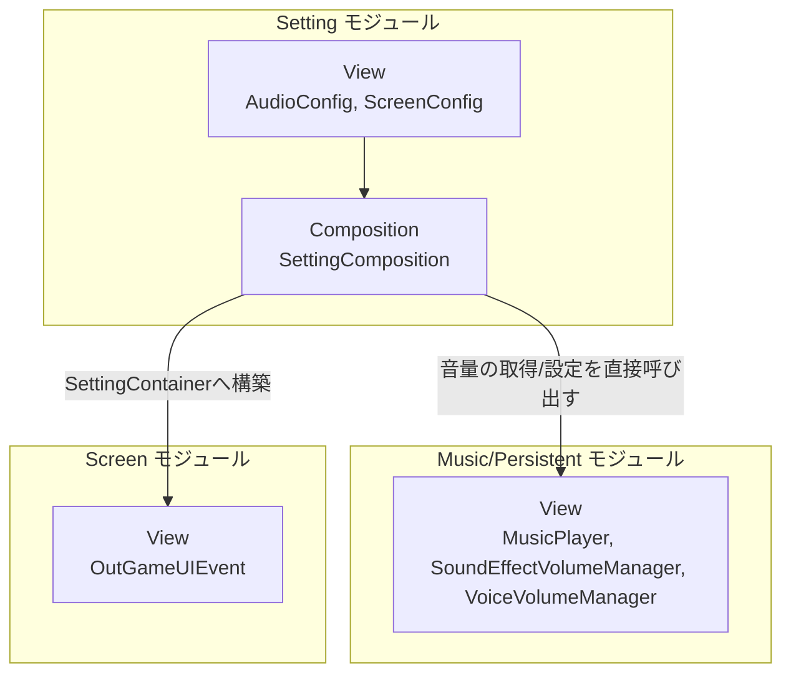
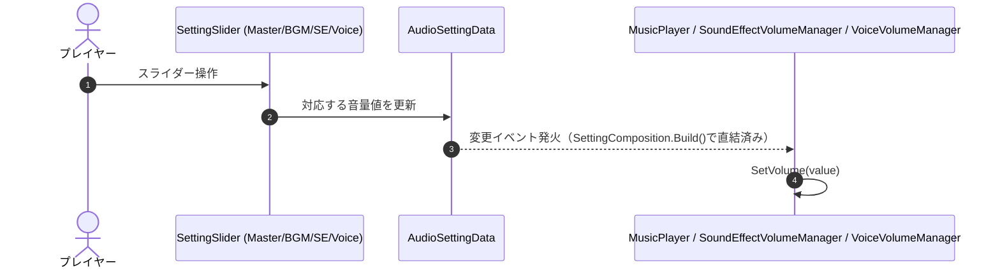

# 概要
> 💡 **モジュール概要**
> アウトゲームの設定画面（音声・画面・キー設定タブ）を構築するモジュールである。ドメインロジックを持たない薄いUI構築層で、既存の音量管理クラス（Music/Persistentモジュール）へ直接バインドする。Titleシーンにも独立した音量設定UI（`VolumeSettingsTabView`）が別途存在し、本モジュールとは重複した実装になっている。

| 項目 | 内容 |
| --- | --- |
| **モジュール名** | Setting |
| **カテゴリ** | OutGame |
| **ステータス** | 実装済み（画面設定タブは未完成） |
| **最終更新日** | 2026-08-17 |

---

## 🏗️ クラス

| クラス名 | レイヤー | 役割・機能 |
| --- | --- | --- |
| **`Category`** | View | 設定タブ種別を表すenum（`Audio`/`Screen`/`Key`。Keyタブは値のみで未実装） |
| **`SettingBase`** | View | タブ切り替え・コンテナ解決・プレハブ生成を行う抽象基底MonoBehaviour |
| **`SettingSlider` / `SettingToggle` / `SettingDropDown`** | View | `SettingBase`を継承した汎用バインド可能UIコントロール（`Bind(getter, setter)`） |
| **`AudioSettingData`** | View | Master/BGM/SE/Voiceの4音量値と、それぞれの変更通知イベントを保持するプレーンモデル |
| **`AudioConfig`** | View | 音声設定タブのUI一式（スライダー群）を構築するScriptableObject |
| **`ScreenSettingData`** | View | 解像度インデックス・画面モード・VSync有無を保持する構造体 |
| **`ScreenConfig`** | View | 画面設定タブのUI一式（解像度/画面モードドロップダウン・VSyncトグル）を構築するScriptableObject |
| **`SettingComposition`** | Composition | `ServiceLocator`から音量管理クラスを取得し、`AudioConfig`/`ScreenConfig`を構築する唯一のComposition層クラス |

### 🧩 Composition初期化情報

| 項目 | 内容 |
| --- | --- |
| **Initializerクラス** | `SettingComposition` |
| **Order** | 140（OutGame初期化ライフサイクルの最後） |
| **公開する ModuleContainer / ServiceLocator登録型** | 無し。`Build()`のみを実装し、他モジュールへの公開は行わない |

---

## 🔗 モジュール結合

### 📥 依存しているもの

* **`Music` / `Persistent`**
  * *依存箇所*: `MusicPlayer`, `SoundEffectVolumeManager`, `VoiceVolumeManager`（いずれも具象クラス）
  * *詳細*: `SettingComposition.Build()`がこれらを`ServiceLocator`から取得し、現在の音量を`AudioSettingData`の初期値として読み込み、変更イベントを各Managerの`SetVolume`へ直結する
* **`Screen`**
  * *依存箇所*: `OutGameUIEvent`, `ScreenInitializer`が構築する`SettingContainer`
  * *詳細*: Screenモジュールが用意したコンテナへ設定UIを構築する（Order 140、Screenの100より後）

### 📤 依存されているもの

* なし

---

# 詳細

## 🧅レイヤー情報

### ① Domain
当モジュールでは使用していない。
### ② Application
当モジュールでは使用していない。
### ③ Adaptor
当モジュールでは使用していない。
### ④ View
`SettingBase`派生の汎用バインド可能コントロール（Slider/Toggle/DropDown）と、それらを組み立てる`AudioConfig`/`ScreenConfig`というScriptableObjectビルダーを実装する。
### ⑤ Infrastructure
当モジュールでは使用していない。
### ⑥ Composition
`SettingComposition`（Order 140）が音量管理クラス群を`ServiceLocator`から取得し、`AudioConfig`/`ScreenConfig`のUI構築を呼び出す。

## 🔌 拡張ポイント

> 現状、ポリモーフィックな拡張ポイント（`SubclassSelector`等）はない。新しい設定タブを追加する場合は`Category` Enumへ値を追加し、対応する`Config`クラス（`SettingBase`派生）を実装、`SettingComposition`から呼び出す形になる。

## 🔄処理フロー

主要な処理フローは、それぞれ子ページに分けている。

### ① 音量設定変更フロー
設定画面のスライダー操作が、直接音量管理クラスへ反映される。

