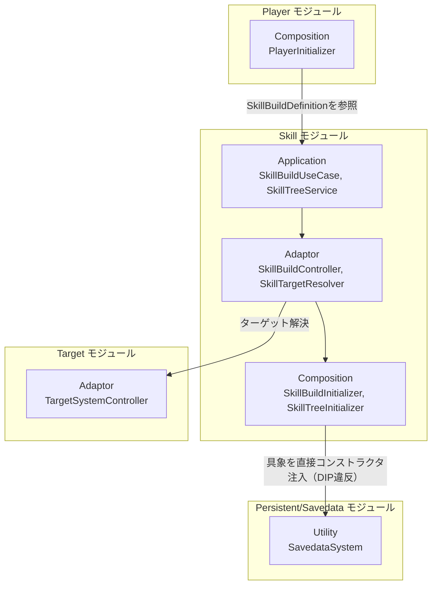
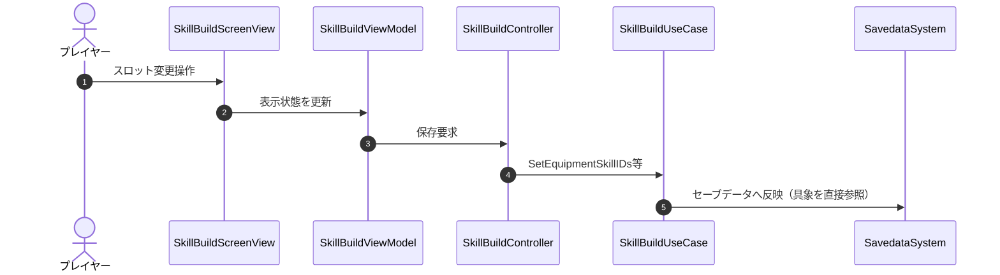
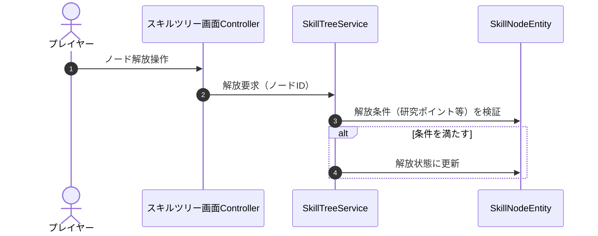

# 概要
> 💡 **モジュール概要**
> 装備スキルの編成（改造画面）、スキルツリーの解放（進行管理）、および戦闘中でのスキル発動メカニズム・リズムコマンドの入力判定を司る、アウトゲームとインゲームを繋ぐモジュールです。

| 項目 | 内容 |
| --- | --- |
| **モジュール名** | Skill |
| **カテゴリ** | OutGame / InGame |
| **アーキテクチャ** | クリーンアーキテクチャ (Domain, Application, Adaptor, View, Composition) |
| **ステータス** | 実装済み（既知の課題を参照） |
| **最終更新日** | 2026-07-15 |

---

## 🏗️ クラス

| クラス名 | レイヤー | 役割・機能 |
| --- | --- | --- |
| **`SkillBuildDefinition`** | Domain | 装備しているスキルの状態を管理するドメインモデル（可変Entity） |
| **`SkillRhythmState`** | Domain | スキル発動時のリズム入力コマンドシーケンス |
| **`SkillNodeEntity`** | Domain | スキルツリー上の各ノード情報 |
| **`PlayerStatusEntity`** | Domain | ツリー解放による永続的なステータスアップEntity |
| **`SkillTemplate`** | Domain | プレイヤーが扱えるスキルの定義データ |
| **`ISkillEffectExecutor`** | Application | プレイヤーが実行できるスキルの振る舞いの抽象（`SkillBase`が実装） |
| **`SkillBuildUseCase`** | Application | スキルの装備・スロット操作、セーブ・ロード処理 |
| **`SkillTreeService`** | Application | スキルツリー解放ロジック |
| **`SkillCheckService`** | Application | インゲーム中のリズムコマンド入力の正誤判定サービス |
| **`ISkillBuildRepository`** | Application | セーブデータからのスキル取得を抽象化するリポジトリ契約（実装は`SkillBuildRepository`、Infrastructure層） |
| **`SkillBuildPresenter`** | Adaptor | 編成状態をView用のref struct DTOに変換して伝達 |
| **`SkillBuildController`** | Adaptor | ViewModelの保存要求を受け取り、UseCaseに伝える |
| **`SkillBuildViewDTO` / `SkillBuildSlotDTO`** | Adaptor | ViewModelへ送るDTO群 |
| **`SkillTargetResolver`** | Adaptor | スキル発動時のターゲット解決（Targetモジュールを利用） |
| **`SkillBuildViewModel`** | View | UI表示状態の保持、イベントバインド |
| **`SkillBuildScreenView`** | View | 改造画面のUI Elements/UI表示実体 |
| **`SkillBuildInitializer`** | Composition | 装備スキルリポジトリ等をAddressables経由でロードし依存を解決 |
| **`SkillTreeInitializer`** | Composition | スキルツリー画面の初期化 |

### 🧩 Composition初期化情報

| 項目 | 内容 |
| --- | --- |
| **Initializerクラス** | `SkillBuildInitializer` / `SkillTreeInitializer` |
| **Order** | `SkillBuildInitializer` = 130 / `SkillTreeInitializer` = 120（いずれもOutGame初期化ライフサイクル） |
| **公開する ModuleContainer / ServiceLocator登録型** | 現状専用の`ModuleContainer`は無く、`SkillBuildDefinition`等を個別に`ServiceLocator`へ登録している |

---

## 🔗 モジュール結合

### 📥 依存しているもの

* **`Persistent/Savedata`**
  * *依存箇所*: `SaveData`, `SavedataSystem`
  * *詳細*: プレイヤーが解放したスキルや装備中のスキルスロットをJSONデータへ永続化・ロードするため、セーブシステムに依存します。`SkillBuildUseCase`（Application）のコンストラクタは抽象（`ISkillBuildRepository`）ではなく`SavedataSystem`の具象クラスをそのまま受け取ります。`SkillBuildInitializer`（Composition）が`ServiceLocator.TryGetInstance<SavedataSystem>()`で取得した具象インスタンスをそのままコンストラクタ注入しているため、抽象を挟まない依存になっています（DIP違反、既知の課題を参照）。
* **`InGame/Player`**
  * *依存箇所*: `SkillTemplate`, `SkillRepository`
  * *詳細*: プレイヤーキャラクターが扱えるスキルのアセット（ScriptableObject）や、現在入手済みのスキルデータを参照します。
* **`Target`**
  * *依存箇所*: `TargetSystemController`
  * *詳細*: `SkillTargetResolver`がスキル発動時のターゲット解決に使用します。

### 📤 依存されているもの

* **`InGame/Player`**
  * *参照箇所*: `SkillBuildDefinition`
  * *詳細*: プレイヤーは戦闘開始時に、セーブデータから取得して本モジュールに格納されている「装備中スキル一覧」を参照して、対応するインゲーム用スキルのインスタンスをセットアップします。

---

# 詳細

## 🧅レイヤー情報

### ① Domain
装備スキル構成（`SkillBuildDefinition`）、リズムコマンドシーケンス（`SkillRhythmState`）、スキルツリーノード（`SkillNodeEntity`）、永続ステータス（`PlayerStatusEntity`）といったドメインモデルを保持します。
### ② Application
スキルの装備・保存（`SkillBuildUseCase`）、ツリー解放（`SkillTreeService`）、リズムコマンド判定（`SkillCheckService`）、スキル効果実行の抽象（`ISkillEffectExecutor`）を実装します。
### ③ Adaptor
編成状態をViewへ変換する`SkillBuildPresenter`、保存要求を仲介する`SkillBuildController`、ターゲット解決を行う`SkillTargetResolver`を定義します。
### ④ View
改造画面のUI表示（`SkillBuildScreenView`）とその状態保持（`SkillBuildViewModel`）を担当します。
### ⑤ Infrastructure
`SkillBuildRepository`（`ISkillBuildRepository`実装）がAddressables経由でロードされますが、後述の通り`SkillBuildUseCase`へは渡されていません。
### ⑥ Composition
`SkillBuildInitializer`（Order 130）と`SkillTreeInitializer`（Order 120）が、それぞれ改造画面・スキルツリー画面の依存解決を行います。

## 🔌 拡張ポイント

> 現状、ポリモーフィックな拡張ポイント（`SubclassSelector`等）は確認できていません。新しいスキル効果を追加する場合は`ISkillEffectExecutor`の実装クラスを追加する形になりますが、登録方法（自動検出か手動登録か）は要調査です。

## 🔄処理フロー

主要な処理フローごとに分けて記述します。

### ① スキル装備・保存フロー（改造画面）
プレイヤーが改造画面でスキルスロットを変更し、保存する流れです。

### ② スキルツリー解放フロー
研究ポイントを消費してスキルツリーのノードを解放する流れです。

## 📝 アーキテクチャ上の特徴・既知の課題

### ✅ 設計上の見どころ
* **アウトゲーム/インゲームの情報の橋渡し**: セーブデータに保存されるスキルのID構成（ドメイン）が、`SkillBuildUseCase`を通じて管理されており、そのデータ構造がインゲームの`PlayerInitializer`で対応するスキル実体にスムーズにバインドされる構造になっています。

### ⚠️ 既知の課題・改善ポイント
* **`SkillBuildUseCase`のDIP違反（未解消）**: `SkillBuildUseCase`（Application層）のコンストラクタは`SavedataSystem`（Utility/具象）をそのまま受け取ります。`ISkillBuildRepository`という抽象・実装（`SkillBuildRepository`、Addressables経由でロード）は既に存在しますが、現状`SkillBuildInitializer`がView初期化用データの取得にのみ使っており、`SkillBuildUseCase`へは渡していません。コンストラクタ引数を`SavedataSystem`から`ISkillBuildRepository`（またはそれに準ずる抽象）へ差し替えることで、セーブ先の切り替えや単体テストが容易になります。
