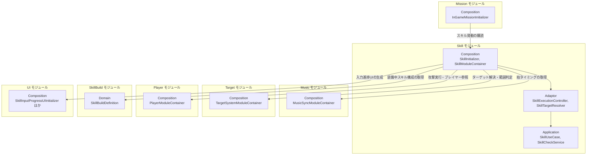
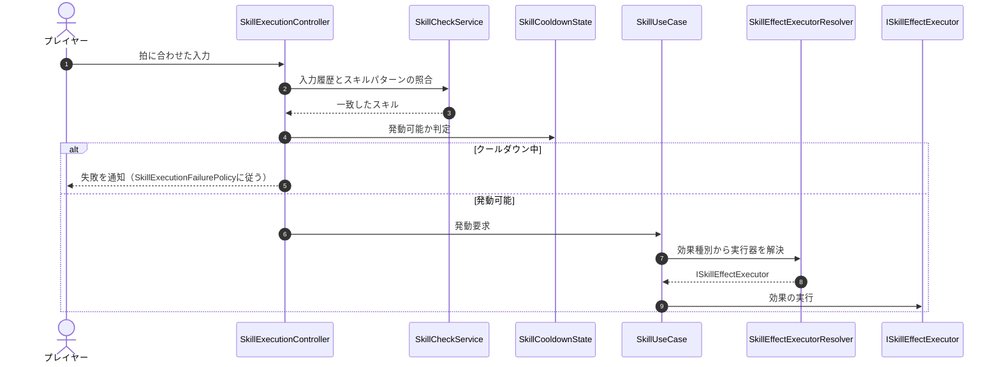
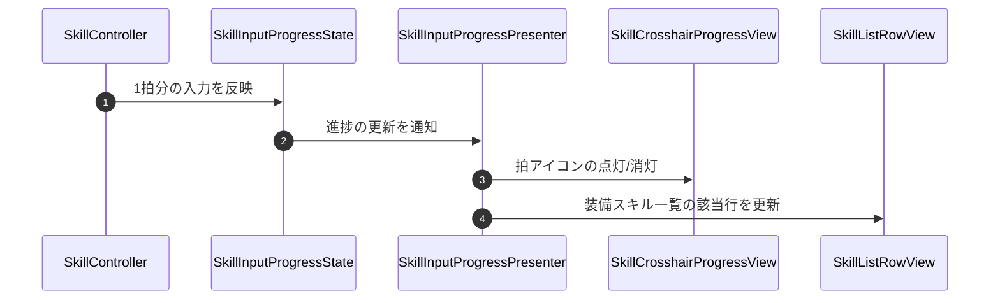

# 概要
> 💡 **モジュール概要**
> 戦闘中のスキル発動を司るモジュールです。リズムコマンドの入力判定、クールダウン管理、効果の実行、発動状況のUI表示までを担当します。装備スキルの編成（SkillBuild）とスキルツリーの解放（SkillTree）は、別モジュールへ分離されました。

| 項目 | 内容 |
| --- | --- |
| **モジュール名** | Skill |
| **カテゴリ** | InGame |
| **ステータス** | 実装済み |
| **最終更新日** | 2026-08-17 |

---

## 🏗️ クラス

| クラス名 | レイヤー | 役割・機能 |
| --- | --- | --- |
| **`SkillDefinition`** | Domain | スキルの定義（発動条件・効果・演出）を保持するドメインクラス |
| **`SkillId`** / **`SkillType`** / **`SkillLevel`** | Domain | スキルの識別子・種別・レベル |
| **`SkillPattern`** | Domain | 発動に必要な入力パターン |
| **`SkillRhythmState`** | Domain | プレイヤーのリズム入力履歴 |
| **`SkillEffectSpec`** / **`SkillEffectType`** / **`SkillEffectParameter`** / **`SkillEffectParameterId`** | Domain | スキル効果の定義データと、そのパラメータ |
| **`SkillTargetingType`** | Domain | 対象の取り方（単体・範囲など） |
| **`SkillCooldownTime`** | Domain | クールダウン時間 |
| **`SkillEffectDisplayMode`** / **`SkillEffectValueFormat`** | Domain | 効果値の表示方法 |
| **`SkillNormalAttackDamagePolicy`** | Domain | 通常攻撃ダメージの扱いを決めるポリシー |
| **`SkillUseCase`** | Application | スキル発動の判定と実行を扱うユースケース |
| **`SkillCheckService`** | Application | リズムコマンド入力の正誤判定 |
| **`ISkillEffectExecutor`** / **`ISkillEffectExecutorResolver`** / **`SkillEffectExecutorResolver`** | Application | 効果の実行器と、効果種別から実行器を引く解決テーブル |
| **`ISkillTargetResolver`** / **`SkillTargetResolveResult`** | Application | ターゲット解決の抽象と結果 |
| **`ISkillRepository`** | Application | スキル定義の取得抽象 |
| **`SkillExecutionController`** | Adaptor | スキルの発動を管理するコントローラー |
| **`SkillController`** | Adaptor | 表示と入力チェックを仲介 |
| **`SkillAttackController`** | Adaptor | スキル専用の攻撃実行アダプター |
| **`SkillCooldownState`** | Adaptor | スキルごとのクールダウン完了時刻を管理し発動可否を判定 |
| **`SkillExecutionResult`** / **`SkillExecutionResultType`** / **`SkillExecutionFailurePolicy`** | Adaptor | 発動結果と、失敗時の扱い |
| **`SkillTargetResolver`** | Adaptor | スキル発動時のターゲット解決（Targetモジュールの`TargetAreaQuery`を利用） |
| **`SkillResultPresenter`** / **`SkillResultDTO`** / **`ISkillResultViewModel`** | Adaptor | 発動結果をViewModel用DTOへ変換して通知 |
| **`SkillInputProgressController`** / **`SkillInputProgressPresenter`** / **`SkillInputProgressState`** | Adaptor (SkillUI) | コマンド入力進捗の管理・表示データ生成 |
| **`SkillCrosshairProgressController`** / **`SkillGuideProgressController`** | Adaptor (SkillUI) | クロスヘア上の進捗表示とガイド表示の制御 |
| **`SkillView`** / **`SkillResultView`** / **`SkillResultViewModel`** | View | スキル発動結果の表示 |
| **`SkillCrosshairProgressView`** / **`SkillCrosshairStepView`** / **`SkillGuideProgressView`** | View (SkillUI) | クロスヘア進捗・ガイドの描画 |
| **`SkillListRowView`** / **`SkillListStepView`** | View (SkillUI) | 装備スキル一覧の行と拍ステップ表示 |
| **`SkillBeatVisualSetting`** / **`SkillInputProgressUIConfig`** ほか設定クラス | View (SkillUI) | 拍アイコンの見た目・アニメーションの設定 |
| **`SkillDisplayTextFormatter`** / **`SkillEffectDescriptionFormatter`** / **`SkillDisplayText`** | Adaptor (OutGame) | スキル説明文の整形。アウトゲームの一覧表示で使用 |
| **`SkillInitializer`** / **`SkillModuleContainer`** | Composition | Skillモジュールの構築とServiceLocatorへの公開（Order 450） |

### 🧩 Composition初期化情報

| 項目 | 内容 |
| --- | --- |
| **Initializerクラス** | `SkillInitializer` |
| **Order** | 450（InGame初期化ライフサイクル。Player(500)より前） |
| **公開する ModuleContainer / ServiceLocator登録型** | `SkillModuleContainer` |

---

## 🔗 モジュール結合

### 📥 依存しているもの

* **`Music`**
  * *依存箇所*: `MusicSyncModuleContainer`
  * *詳細*: リズムコマンドの判定に拍タイミングを使用します。
* **`Target`**
  * *依存箇所*: `TargetSystemModuleContainer`（`TargetAreaQuery`を含む）
  * *詳細*: `SkillTargetResolver`が単体・範囲スキルの対象を解決します。
* **`Player`**
  * *依存箇所*: `PlayerModuleContainer`
  * *詳細*: `SkillAttackController`がスキル由来の攻撃を実行します。
* **`SkillBuild`**
  * *依存箇所*: `SkillBuildDefinition`
  * *詳細*: 装備中のスキル構成を取得し、インゲームで発動可能なスキルを決めます。
* **`UI`**
  * *依存箇所*: `SkillInputProgressUIInitializer`, `SkillCrosshairProgressUIInitializer`, `SkillListUIInitializer`
  * *詳細*: コマンド入力の進捗表示UIを生成します。

### 📤 依存されているもの

* **`Mission`**
  * *参照箇所*: `SkillModuleContainer`
  * *詳細*: `InGameMissionInitializer`がスキル発動を購読し、ミッション条件の達成判定に使用します。
* **`Player`**
  * *参照箇所*: `SkillModuleContainer`
  * *詳細*: `PlayerInitializer`がスキル発動と通常攻撃の結線に使用します。

---

# 詳細

## 🧅レイヤー情報

### ① Domain
スキル定義（`SkillDefinition`）、発動に必要な入力パターン（`SkillPattern`）、入力履歴（`SkillRhythmState`）、効果の定義（`SkillEffectSpec`）とクールダウン時間を保持します。
### ② Application
リズムコマンドの正誤判定（`SkillCheckService`）、発動判定と実行（`SkillUseCase`）、効果種別から実行器を引く解決テーブル（`SkillEffectExecutorResolver`）を実装します。
### ③ Adaptor
発動制御（`SkillExecutionController`）、クールダウン管理（`SkillCooldownState`）、ターゲット解決（`SkillTargetResolver`）、結果通知（`SkillResultPresenter`）を担当します。`SkillUI/`配下に入力進捗の表示制御がまとまっています。
### ④ View
発動結果の表示（`SkillResultView`）と、コマンド入力の進捗表示（クロスヘア進捗・ガイド・装備スキル一覧）を担当します。拍アイコンの見た目は設定クラスでInspectorから調整できます。
### ⑤ Infrastructure
当モジュールでは使用していません。スキル定義のアセットはマスターデータ側から供給されます。
### ⑥ Composition
`SkillInitializer`（Order 450）がスキル発動まわりを構築し、`SkillModuleContainer`として公開します。

## 🔌 拡張ポイント

| 拡張したいこと | 実装する場所 | 追加登録の要否 |
| --- | --- | --- |
| 新しいスキル効果を追加したい | `ISkillEffectExecutor`（Application）を実装したクラスを`Player/SkillEffect`へ追加する | 必要。`SkillEffectType`へ値を足し、`SkillEffectExecutorFactory`へ`resolver.Register(...)`を追記する。自動検出ではないため、登録を忘れると該当スキルが発動しても効果だけ起きない |
| コマンド入力の見た目を変えたい | `SkillInputProgressUIConfig` / `SkillBeatVisualSettingConfig` などの設定アセット | 不要（コード変更なし） |

## 🔄処理フロー

主要な処理フローは、それぞれ子ページに分けています。

### ① スキル発動フロー（リズムコマンド入力）

拍に合わせた入力列がスキルのパターンと一致したとき、クールダウンとターゲットを確認して効果を実行します。

### ② 入力進捗の表示フロー

入力途中の状態を、クロスヘア・ガイド・装備スキル一覧の3か所へ同時に反映します。

