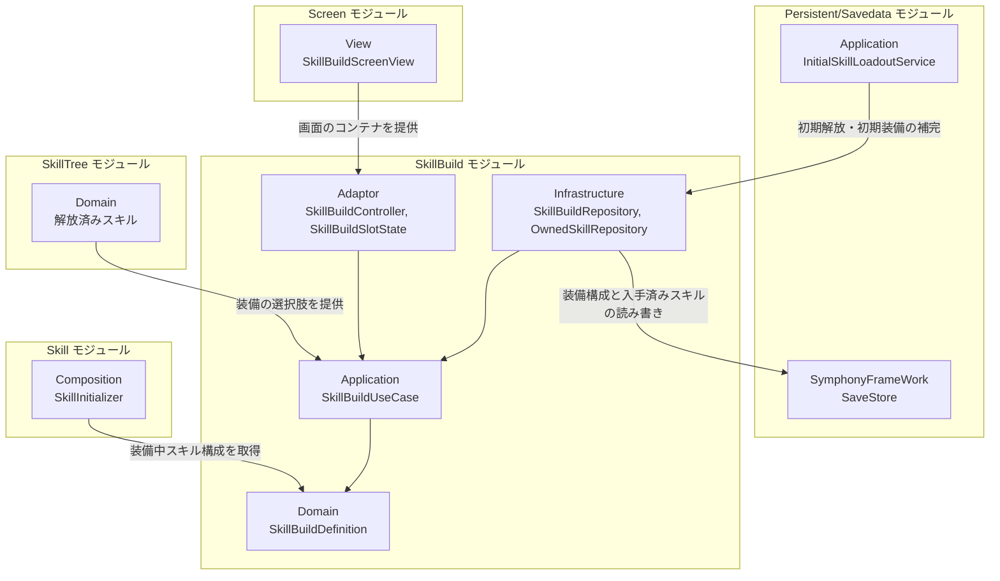
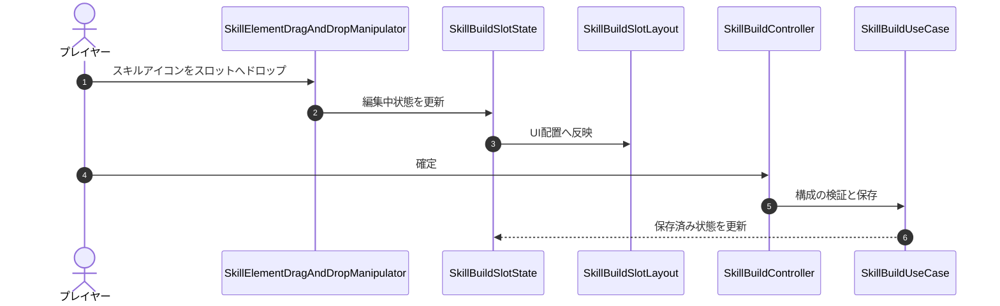
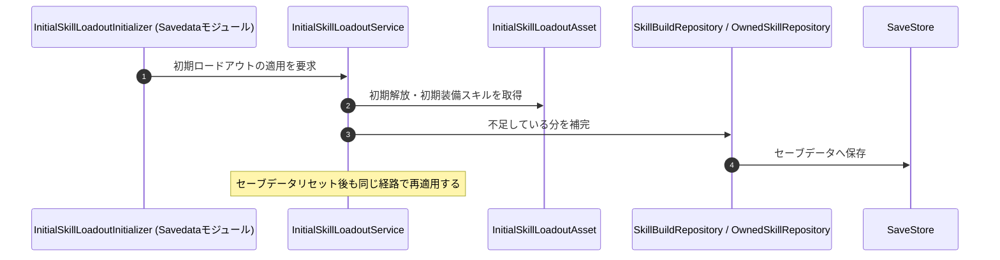

# 概要
> 💡 **モジュール概要**
> 改造画面でのスキル編成を司るモジュールである。入手済みスキルの一覧表示、装備スロットへのドラッグ&ドロップ、構成の検証と保存を担当する。スキルの解放はSkillTree、戦闘中の発動はSkillモジュールが扱う。

| 項目 | 内容 |
| --- | --- |
| **モジュール名** | SkillBuild |
| **カテゴリ** | OutGame |
| **ステータス** | 実装済み |
| **最終更新日** | 2026-08-17 |

---

## 🏗️ クラス

| クラス名 | レイヤー | 役割・機能 |
| --- | --- | --- |
| **`SkillBuildDefinition`** | Domain | プレイヤーが装備しているスキル構成を表す |
| **`EquippedSkill`** | Domain | 所持しているスキル1件を表す値型 |
| **`SkillBuildUseCase`** | Application | 装備構成の検証・保存・確定 |
| **`ISkillBuildRepository`** / **`IOwnedSkillRepository`** | Application | 装備構成と入手済みスキルの永続化境界 |
| **`SkillBuildController`** | Adaptor | 改造画面の保存要求をユースケースへ伝える |
| **`ISkillBuildCommand`** | Adaptor | 編成操作をApplication層へ伝えるコマンド契約 |
| **`SkillBuildSlotState`** | Adaptor | 装備スロットの保存済み状態と編集中状態を保持する |
| **`SkillBuildPresenter`** | Adaptor | 編成状態をViewへ渡すDTOへ変換する |
| **`SkillBuildViewDTO`** / **`SkillBuildSlotData`** / **`SkillViewData`** | Adaptor | 画面・スロット・スキル1件それぞれの表示データ |
| **`ISkillBuildViewModel`** / **`ISkillBuildViewModelWriter`** | Adaptor | ViewModelの読み取り契約と書き込み契約 |
| **`SkillBuildViewModel`** | View | 編成画面の表示状態を保持する |
| **`SkillListView`** | View | 入手済みスキル一覧の表示 |
| **`SkillElementView`** | View | スキルアイコン1件の表示 |
| **`SkillElementDragAndDropManipulator`** / **`SkillElementDragAndDropSetup`** | View | スキルアイコンのドラッグ&ドロップ操作 |
| **`SkillBuildSlotLayout`** | View | 装備スロットの状態をUI配置へ反映する |
| **`SkillDetailView`** | View | スキル詳細の表示 |
| **`SkillDisplayTextFormatter`** / **`SkillEffectDescriptionFormatter`** / **`SkillDisplayText`** | Adaptor（`OutGame/Skill`） | スキル名・効果説明の整形。編成画面と詳細表示で使う |
| **`InitialSkillLoadoutAsset`** | Infrastructure | ゲーム開始時点の初期解放・初期装備スキルを定義するアセット |
| **`SkillBuildRepository`** / **`OwnedSkillRepository`** | Infrastructure | 装備構成と入手済みスキルの実装 |
| **`SkillBuildInitializer`** | Composition | 上記一式の構築とServiceLocatorへの登録 |

### 🧩 Composition初期化情報

| 項目 | 内容 |
| --- | --- |
| **Initializerクラス** | `SkillBuildInitializer` |
| **Order** | 130（`SkillTreeInitializer`(120)の後。解放済みスキルが確定してから編成を組む） |
| **公開する ModuleContainer / ServiceLocator登録型** | 専用の`ModuleContainer`は無く、`SkillBuildDefinition`と`SkillBuildController`をServiceLocatorへ登録する |

---

## 🔗 モジュール結合

### 📥 依存しているもの

* **`Persistent/Savedata`**
  * *依存箇所*: `SaveStore`, `SkillBuildData`, `InitialSkillLoadoutService`
  * *詳細*: 装備構成と入手済みスキルを読み書きする。初回起動時とセーブデータリセット後は`InitialSkillLoadoutService`が`InitialSkillLoadoutAsset`の内容で補完する
* **`SkillTree`**
  * *依存箇所*: 解放済みスキル
  * *詳細*: ツリーで解放したスキルが装備の選択肢になる
* **`Screen`**
  * *依存箇所*: `SkillBuildScreenView`
  * *詳細*: 改造画面のコンテナはScreenモジュールが持ち、その中身を当モジュールが構築する

### 📤 依存されているもの

* **`Skill`**
  * *参照箇所*: `SkillBuildDefinition`
  * *詳細*: `SkillInitializer`（Order 450）が装備中の構成を取得し、インゲームで発動できるスキルを決める

---

# 詳細

## 🧅レイヤー情報

### ① Domain
装備しているスキル構成（`SkillBuildDefinition`）と、所持スキル1件（`EquippedSkill`）を保持する。
### ② Application
`SkillBuildUseCase`が構成の検証・保存・確定を行う。永続化は2つのリポジトリ境界の先にある。
### ③ Adaptor
`SkillBuildController`が保存要求を仲介し、`SkillBuildSlotState`が「保存済み」と「編集中」の2つの状態を持つ。編集途中の内容は確定するまで保存済み状態へ反映されない。
### ④ View
入手済みスキル一覧、スキルアイコン、装備スロットの配置、スキル詳細を担当する。装備の操作はドラッグ&ドロップで行い、`SkillElementDragAndDropManipulator`が扱う。
### ⑤ Infrastructure
装備構成と入手済みスキルの実装を持つ。初期状態は`InitialSkillLoadoutAsset`が定義する。
### ⑥ Composition
`SkillBuildInitializer`（Order 130）が一式を構築する。SkillTree（120）の後に走るため、解放済みスキルが確定した状態で編成を組める。

## 🔌 拡張ポイント

| 拡張したいこと | 実装する場所 | 追加登録の要否 |
| --- | --- | --- |
| 初期解放・初期装備スキルを変えたい | `InitialSkillLoadoutAsset` | 不要（コード変更なし） |
| 編成操作を増やしたい | `ISkillBuildCommand`（Adaptor）へ操作を追加し、`SkillBuildUseCase`で処理する | 必要（ViewからCommandを呼ぶ経路も繋ぐ） |

## 🔄処理フロー

主要な処理フローは、それぞれ子ページに分けている。

### ① スキル装備フロー（ドラッグ&ドロップ）

編集中の状態を先に更新し、確定時にまとめて検証・保存する。

### ② 初期スキルの補完フロー（初回起動・リセット後）

セーブデータに装備構成が無い場合、初期ロードアウトで補完する。

