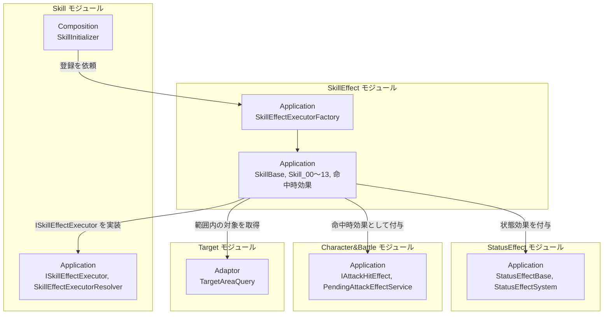
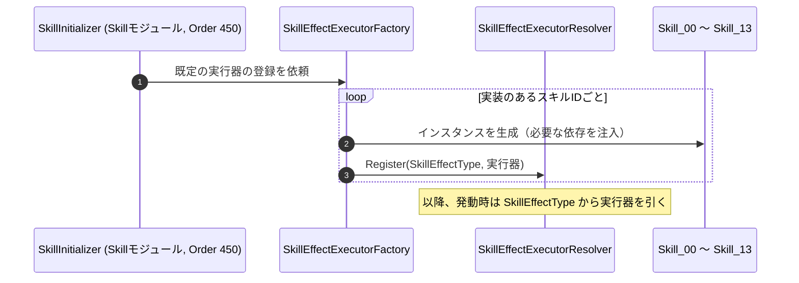
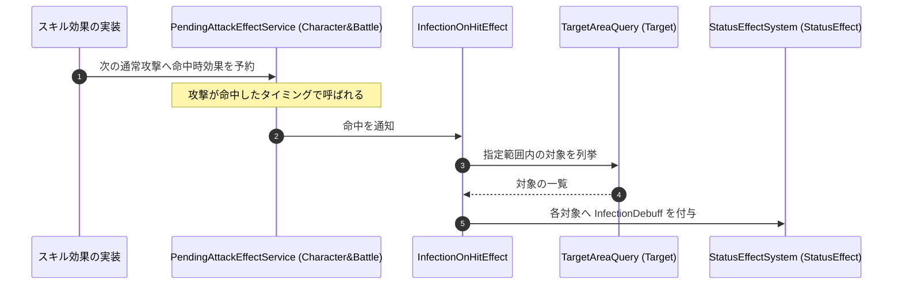

# 概要
> 💡 **モジュール概要**
> スキル1つ1つの効果を実装するモジュールである。Skillモジュールが定義した`ISkillEffectExecutor`の実装が並び、`SkillEffectExecutorFactory`が`SkillEffectType`と対応付けて登録する。

| 項目 | 内容 |
| --- | --- |
| **モジュール名** | SkillEffect |
| **カテゴリ** | InGame |
| **ステータス** | 実装済み |
| **最終更新日** | 2026-08-17 |

---

## 🏗️ クラス

| クラス名 | レイヤー | 役割・機能 |
| --- | --- | --- |
| **`SkillBase`** | Application | `ISkillEffectExecutor`を実装するスキル効果の基盤クラス |
| **`SkillEffectExecutorFactory`** | Application | 既定のスキル効果実行器を`SkillEffectExecutorResolver`へ登録する |
| **`Skill_00`〜`Skill_10`, `Skill_13`** | Application | スキルIDごとの効果実装。置き場は`Player/SkillEffect/` |
| **`InfectionDebuff`** | Application | 伝染状態を表す状態効果 |
| **`InfectionGroup`** | Application | 伝染ダメージのグループ |
| **`InfectionOnHitEffect`** | Application | 命中時に、指定範囲内の対象へ伝染デバフを付与する |
| **`DamageTakenIncreaseOnHitEffect`** | Application | 命中時に、対象の受けるダメージを増加させる状態効果を付与する |

`Skill_11`と`Skill_12`は存在しない。IDは連番だが、実装のある番号だけが登録される。

命中時効果（`InfectionOnHitEffect`・`DamageTakenIncreaseOnHitEffect`）は`Skill_*`とは別に`InGame/SkillEffect/`にあり、`IAttackHitEffect`（Character&Battleモジュール）として攻撃へ付与される。

### 🧩 Composition初期化情報

| 項目 | 内容 |
| --- | --- |
| **Initializerクラス** | なし |
| **公開する ModuleContainer / ServiceLocator登録型** | なし。`SkillEffectExecutorFactory`をSkillモジュールの`SkillInitializer`（Order 450）が呼び、解決テーブルへ登録する |

---

## 🔗 モジュール結合

### 📥 依存しているもの

* **`Skill`**
  * *依存箇所*: `ISkillEffectExecutor`, `SkillEffectType`, `SkillEffectExecutorResolver`
  * *詳細*: 実行器の契約と、効果種別を識別する列挙型を利用する
* **`StatusEffect`**
  * *依存箇所*: `StatusEffectBase`, `IStatusEffectSystem`
  * *詳細*: 継続的な効果は状態効果として対象へ付与する
* **`Character&Battle`**
  * *依存箇所*: `IAttackHitEffect`, `PendingAttackEffectService`, `CharacterEntity`
  * *詳細*: 命中時に発動する効果を、次の攻撃へ付与する形で登録する
* **`Target`**
  * *依存箇所*: `TargetAreaQuery`
  * *詳細*: 伝染など範囲を持つ効果が、対象の列挙に使用する

### 📤 依存されているもの

* **`Skill`**
  * *参照箇所*: `SkillEffectExecutorFactory`
  * *詳細*: `SkillInitializer`が呼び、スキル種別と実行器の対応を解決テーブルへ登録する

---

# 詳細

## 🧅レイヤー情報

### ① Domain
当モジュールでは使用していない。効果が扱うデータはSkill・StatusEffect・Character&BattleのDomainを参照する。
### ② Application
スキル効果の実装が並ぶ。`SkillBase`が共通の土台を提供し、個々の`Skill_*`が固有の処理を持つ。命中時に働く効果は別ファイル群として`InGame/SkillEffect/`にある。
### ③ Adaptor
当モジュールでは使用していない。
### ④ View
当モジュールでは使用していない。演出はSkillモジュールとCharacter&Battleモジュールが担当する。
### ⑤ Infrastructure
当モジュールでは使用していない。
### ⑥ Composition
専用のInitializerは持たない。登録はSkillモジュールの初期化から呼ばれる。

## 🔌 拡張ポイント

| 拡張したいこと | 実装する場所 | 追加登録の要否 |
| --- | --- | --- |
| 新しいスキル効果を追加したい | `SkillBase`を継承した`Skill_XX`を`Player/SkillEffect/`へ追加する | 必要。`SkillEffectType`（Skillモジュール）へ値を足し、`SkillEffectExecutorFactory`へ`resolver.Register(...)`を追記する。**自動検出ではないため、登録を忘れるとスキルは発動しても効果だけ起きない** |
| 命中時に働く効果を追加したい | `IAttackHitEffect`（Character&Battle）を実装したクラスを`InGame/SkillEffect/`へ追加し、`PendingAttackEffectService`経由で次の攻撃へ付与する | 必要（付与する側のスキル実装から呼ぶ） |

## 🔄処理フロー

主要な処理フローは、それぞれ子ページに分けている。

### ① 実行器の登録フロー（初期化時）

スキル種別と実行器の対応は、初期化時に手動で登録される。

### ② 命中時効果の付与フロー（伝染の例）

命中をきっかけに、範囲内の対象へ状態効果を広げる。

