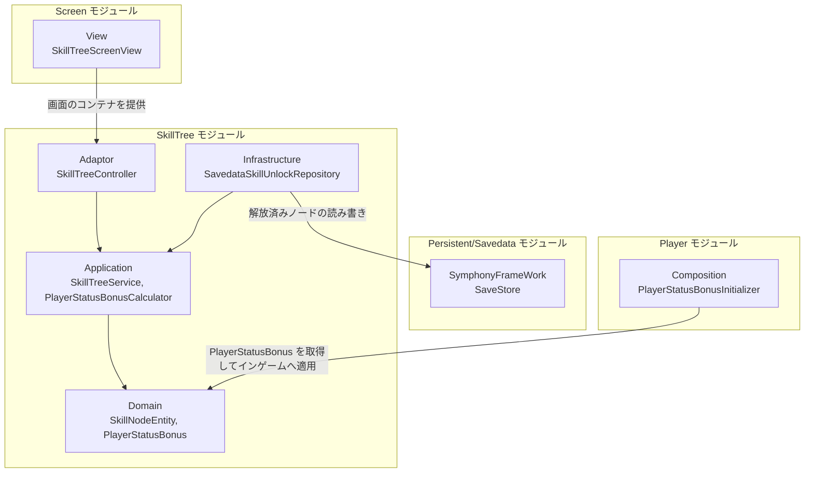
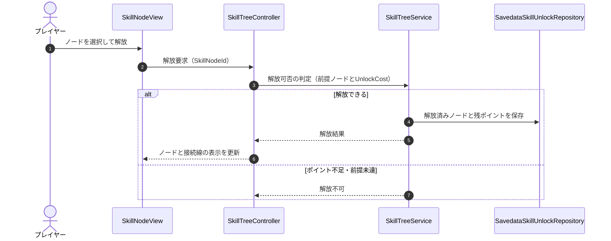
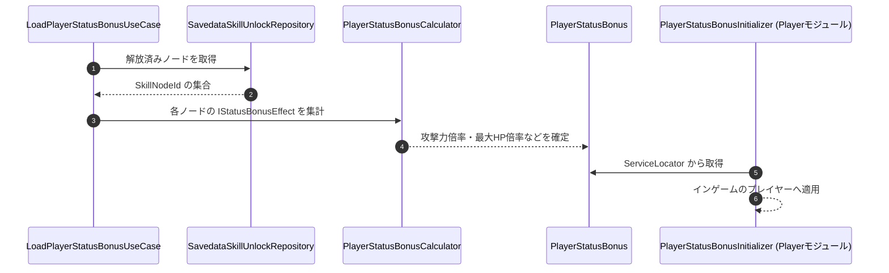

# 概要
> 💡 **モジュール概要**
> スキルツリーの解放と、解放済みノードから得られるプレイヤーステータスボーナスの算出を司るモジュールである。解放したスキルそのものの装備はSkillBuildモジュールが扱う。

| 項目 | 内容 |
| --- | --- |
| **モジュール名** | SkillTree |
| **カテゴリ** | OutGame |
| **ステータス** | 実装済み |
| **最終更新日** | 2026-08-17 |

---

## 🏗️ クラス

| クラス名 | レイヤー | 役割・機能 |
| --- | --- | --- |
| **`SkillNodeEntity`** | Domain | スキルツリー上の1ノードを表すEntity |
| **`SkillNodeId`** / **`UnlockCost`** / **`UnlockPoint`** | Domain | ノードの識別子と、解放に必要なコスト・保有ポイントのValueObject |
| **`PlayerStatusEntity`** / **`SkillTreeStatusEntity`** | Domain | プレイヤーステータスとスキルツリー情報を保持するEntity。いずれも要約に【一時】と付いており、恒久的な置き場は未決 |
| **`IStatusBonusEffect`** | Domain | ノード解放時に得られるステータスボーナス効果の抽象 |
| **`AttackPowerMultiplierEffect`** / **`MaxHealthMultiplierEffect`** / **`CriticalChanceAdditionEffect`** / **`CriticalDamageMultiplierAdditionEffect`** / **`AreaAttackRangeAdditionEffect`** | Domain | 攻撃力倍率・最大HP倍率・クリティカル率加算・クリティカル倍率加算・範囲攻撃射程加算の各効果 |
| **`PlayerStatusBonus`** / **`PlayerStatusBonusBuilder`** | Domain | 解放済みノードから得られるボーナスの集約と、その組み立て |
| **`SkillTreeService`** | Application | スキルツリーの探索と解放判定 |
| **`PlayerStatusBonusCalculator`** | Application | 解放済みノードからボーナスを集計する |
| **`LoadPlayerStatusBonusUseCase`** | Application | 解放済みノードを読み込んでボーナスを構築する |
| **`SkillTreeResetResult`** | Application | ツリーのリセット結果 |
| **`ISkillNodeRepository`** / **`ISkillUnlockRepository`** | Application | ノード定義と解放状態の取得境界 |
| **`SkillTreeController`** | Adaptor | スキルツリー画面の窓口。ノード解放とリセットを仲介する |
| **`SkillDetailPresenter`** / **`SkillDetailDTO`** / **`ISkillDetailViewModel`** / **`ISkillDetailShowable`** | Adaptor | ノード詳細の表示データ構築と、View側の契約 |
| **`PlayerStatusPresenter`** / **`PlayerStatusDTO`** / **`IPlayerStatusViewModel`** / **`IPlayerStatusShowable`** | Adaptor | ステータス画面の表示データ構築と、View側の契約 |
| **`ISKillNodeViewModel`** / **`ISkillNodeConnViewModel`** | Adaptor | ノードと接続線のViewModel契約 |
| **`IPreviewVideoScreenViewModel`** / **`IPreviewVideoScreenViewShowable`** | Adaptor | スキルのプレビュー動画表示の契約 |
| **`SkillNodeView`** / **`SkillNodeConnView`** | View | ノード1件と、ノード間の接続線の表示 |
| **`SkillDetailScreenView`** / **`PlayerStatusScreenView`** | View | ノード詳細画面とステータス画面 |
| **`PreviewVideoScreenView`** | View | スキルのプレビュー動画の再生 |
| **`SkillTreeResetDialogView`** | View | ツリーリセットの確認ダイアログ |
| **`SkillNodeData`** / **`SkillNodeDataRepo`** | Infrastructure | ノード定義アセットとその集合 |
| **`SkillNodeBindData`** / **`SkillNodeBindRepo`** | Infrastructure | ノード間の接続定義とその集合 |
| **`SkillNodePhaseBindData`** / **`SkillNodePhaseBindDataRepo`** | Infrastructure | 解放段階と、各段階で必要になるノードの紐づき |
| **`SavedataSkillUnlockRepository`** | Infrastructure | `ISkillUnlockRepository`実装。セーブデータから解放済みノードを取得する |
| **`SkillTreeInitializer`** | Composition | 上記一式の構築とServiceLocatorへの登録 |

### 🧩 Composition初期化情報

| 項目 | 内容 |
| --- | --- |
| **Initializerクラス** | `SkillTreeInitializer` |
| **Order** | 120（`ScreenInitializer`(100)・`StageSelectInitializer`(110)の後） |
| **公開する ModuleContainer / ServiceLocator登録型** | 専用の`ModuleContainer`は無く、`SkillTreeController`と`PlayerStatusBonus`をServiceLocatorへ登録する |

---

## 🔗 モジュール結合

### 📥 依存しているもの

* **`Persistent/Savedata`**
  * *依存箇所*: `SaveStore`, `SkillUnlockData`
  * *詳細*: `SavedataSkillUnlockRepository`が解放済みノードと解放ポイントを読み書きする
* **`Screen`**
  * *依存箇所*: `SkillTreeScreenView`
  * *詳細*: スキルツリー画面のコンテナはScreenモジュールが持ち、その中身を当モジュールが構築する

### 📤 依存されているもの

* **`Player`**
  * *参照箇所*: `PlayerStatusBonus`
  * *詳細*: `PlayerStatusBonusInitializer`（Order 490）が取得し、インゲームのプレイヤーへステータス補正として適用する
* **`SkillBuild`**
  * *参照箇所*: 解放済みスキル
  * *詳細*: ツリーで解放したスキルが、装備の選択肢になる

---

# 詳細

## 🧅レイヤー情報

### ① Domain
ノードのEntityと識別子、解放コスト、およびノード解放で得られるステータスボーナス効果を保持する。効果は`IStatusBonusEffect`の実装として5種類あり、集約結果を`PlayerStatusBonus`が表す。
### ② Application
ツリーの探索と解放判定（`SkillTreeService`）、ボーナスの集計（`PlayerStatusBonusCalculator`）、解放済みノードの読み込み（`LoadPlayerStatusBonusUseCase`）を実装する。
### ③ Adaptor
`SkillTreeController`が画面からの操作を受け、ノード詳細とステータス表示のPresenterがDTOを構築する。
### ④ View
ノードと接続線の描画、ノード詳細画面、ステータス画面、プレビュー動画、リセット確認ダイアログを担当する。
### ⑤ Infrastructure
ノード定義・接続定義・解放段階の各アセットとリポジトリを持つ。解放状態はセーブデータから取得する。
### ⑥ Composition
`SkillTreeInitializer`（Order 120）が一式を構築し、`SkillTreeController`と`PlayerStatusBonus`を公開する。

## 🔌 拡張ポイント

| 拡張したいこと | 実装する場所 | 追加登録の要否 |
| --- | --- | --- |
| 新しいステータスボーナス効果を追加したい | `IStatusBonusEffect`（Domain）を実装し、`PlayerStatusBonusBuilder`で集計できるようにする | 必要（ビルダーへの反映を忘れると、ノードは解放できるが効果が乗らない） |
| ノードや接続を増やしたい | `SkillNodeData` / `SkillNodeBindData` のアセットを追加し、対応するRepoへ登録する | 必要（Repoへの登録漏れはツリー上に現れない） |

## 🔄処理フロー

主要な処理フローは、それぞれ子ページに分けている。

### ① ノード解放フロー

解放ポイントが足りている場合にノードを解放し、セーブデータへ反映する。

### ② ステータスボーナスの適用フロー

解放済みノードを集計し、インゲームのプレイヤーへ補正として渡す。

