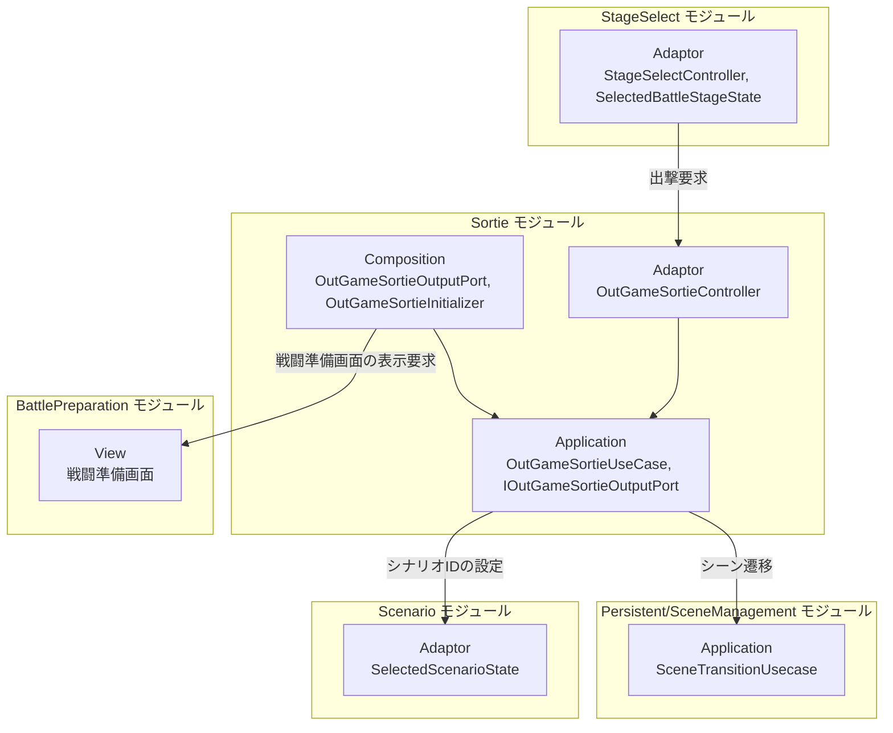
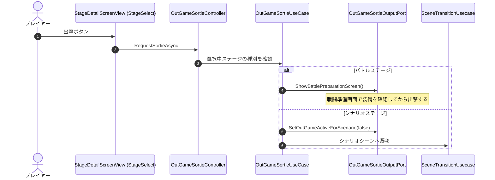
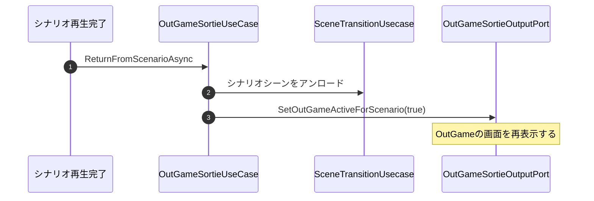

# 概要
> 💡 **モジュール概要**
> アウトゲームから各ステージへ出撃する流れを制御するモジュールである。ステージ種別に応じて、戦闘準備画面を挟むか、即時に出撃するか、シナリオ再生へ切り替えるかを振り分ける。

| 項目 | 内容 |
| --- | --- |
| **モジュール名** | Sortie |
| **カテゴリ** | OutGame |
| **ステータス** | 実装済み |
| **最終更新日** | 2026-08-17 |

---

## 🏗️ クラス

| クラス名 | レイヤー | 役割・機能 |
| --- | --- | --- |
| **`OutGameSortieUseCase`** | Application | 出撃の流れを制御する。バトルは戦闘準備画面へ、シナリオはシーン切り替えへ振り分ける |
| **`IOutGameSortieOutputPort`** | Application | 出撃処理の出力ポート。戦闘準備画面の表示と、シナリオ用のOutGame表示切り替えを要求する |
| **`OutGameSortieController`** | Adaptor | 出撃要求をユースケースへ伝える薄いパススルー |
| **`OutGameSortieOutputPort`** | Composition | `IOutGameSortieOutputPort`実装。`OutGameUIEvent`と入力の両方に依存するためComposition層へ置く |
| **`OutGameSortieInitializer`** | Composition | 出撃機能の初期化（Order 20） |

`OutGameSortieUseCase`が公開する操作は3つである。

| 操作 | 用途 |
| --- | --- |
| **`RequestSortieAsync`** | ステージ選択からの通常の出撃。バトルなら戦闘準備画面、シナリオならシーン切り替え |
| **`RequestImmediateBattleSortie`** | 戦闘準備画面を挟まず直接出撃する。チュートリアルで使う |
| **`ReturnFromScenarioAsync`** | シナリオ再生から戻り、OutGameの表示を復帰させる |

### 🧩 Composition初期化情報

| 項目 | 内容 |
| --- | --- |
| **Initializerクラス** | `OutGameSortieInitializer` |
| **Order** | 20（OutGameシーン内。`ScreenInitializer`(100)より前） |
| **公開する ModuleContainer / ServiceLocator登録型** | 専用の`ModuleContainer`は無く、`OutGameSortieController`をServiceLocatorへ登録する |

出力ポートの実装をComposition層へ置いているのは、`OutGameUIEvent`と入力側の両方に依存するためである。Application層は`IOutGameSortieOutputPort`だけを知る。

---

## 🔗 モジュール結合

### 📥 依存しているもの

* **`StageSelect`**
  * *依存箇所*: `SelectedBattleStageState`, `StageDefinition`
  * *詳細*: 選択されたステージの種別と遷移先シーン名を参照して、出撃の分岐を決める
* **`Scenario`**
  * *依存箇所*: `SelectedScenarioState`
  * *詳細*: シナリオステージの場合、再生するシナリオIDを設定する
* **`Persistent/SceneManagement`**
  * *依存箇所*: `SceneTransitionUsecase`
  * *詳細*: シナリオ再生や出撃に伴うシーン遷移に使用する

### 📤 依存されているもの

* **`StageSelect`**
  * *参照箇所*: `OutGameSortieController`
  * *詳細*: ステージ詳細画面の出撃ボタンから呼ばれる
* **`Title`**
  * *参照箇所*: 即時出撃の経路
  * *詳細*: チュートリアル未完了時は戦闘準備画面を挟まず出撃する

---

# 詳細

## 🧅レイヤー情報

### ① Domain
当モジュールでは使用していない。ステージの定義はStageSelectモジュールのDomainを参照する。
### ② Application
`OutGameSortieUseCase`が出撃の分岐を持つ。UI操作と入力への依存は`IOutGameSortieOutputPort`の先へ追い出している。
### ③ Adaptor
`OutGameSortieController`が出撃要求をユースケースへ渡す。
### ④ View
当モジュールでは使用していない。画面はBattlePreparationとScreenの各モジュールが持つ。
### ⑤ Infrastructure
当モジュールでは使用していない。
### ⑥ Composition
`OutGameSortieInitializer`（Order 20）が構築し、`OutGameSortieOutputPort`が出力ポートの実装を担う。

## 🔌 拡張ポイント

| 拡張したいこと | 実装する場所 | 追加登録の要否 |
| --- | --- | --- |
| 新しいステージ種別の出撃を追加したい | `StageType`（StageSelectモジュールのDomain）へ値を追加し、`OutGameSortieUseCase`の分岐と`IOutGameSortieOutputPort`へ対応する出力を足す | 必要（分岐への追記漏れは、出撃ボタンを押しても何も起きない状態になる） |

## 🔄処理フロー

主要な処理フローは、それぞれ子ページに分けている。

### ① 出撃の振り分けフロー

ステージ種別に応じて3通りへ分かれる。

### ② シナリオからの復帰フロー

シナリオ再生が終わったら、OutGameの表示を戻す。

