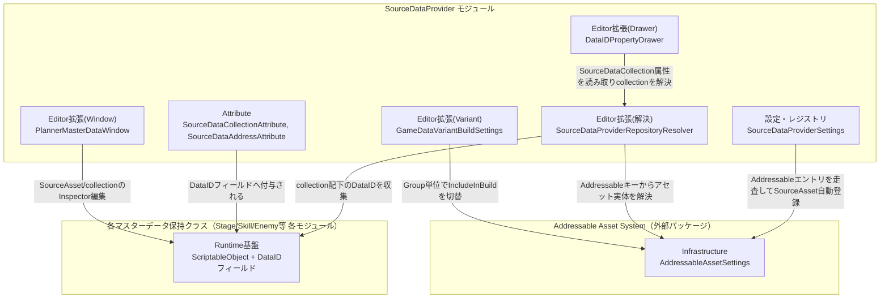
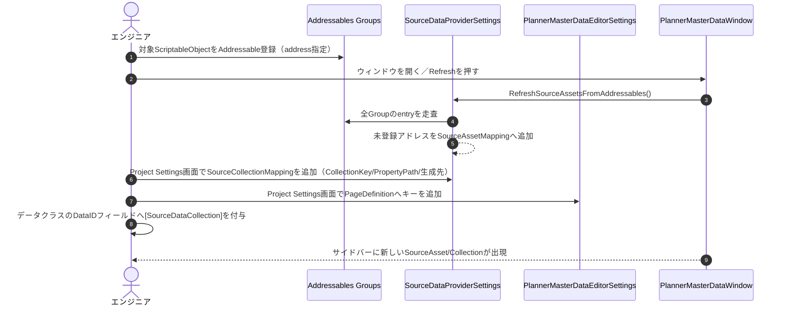
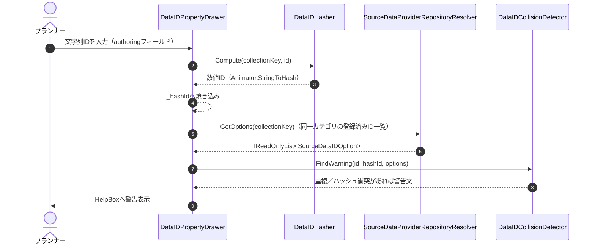
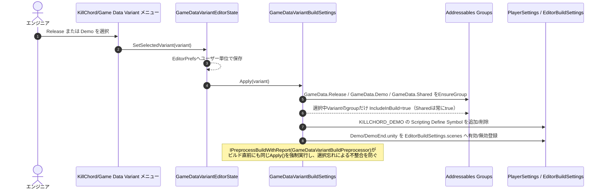

# 概要
> 💡 **モジュール概要**
> プランナーがコードを触らずにマスターデータ（ScriptableObject）を追加・編集できるようにするためのエディタ拡張基盤である。DataIDの採番とハッシュ衝突検出、Addressableアセットの登録レジストリ、Planner Master Data Windowによる編集UI、Release/Demoのマスターデータ出し分け（GameDataVariant）の4つを扱う。「マスターデータ運用ガイド（プランナー向け）」がプランナー向けの操作手順書であるのに対し、本ページは仕組みと拡張方法を扱うエンジニア向け設計書である。

| 項目 | 内容 |
| --- | --- |
| **モジュール名** | SourceDataProvider |
| **カテゴリ** | Editor拡張 / Tooling |
| **ステータス** | 実装済み |
| **最終更新日** | 2026-09-09 |

---

## 🏗️ クラス

Clean Architectureの6層はEditor拡張には厳密対応しないため、実態に即して分類する。

| クラス名 | 分類 | 役割・機能 |
| --- | --- | --- |
| **`DataID`** | Runtime基盤 | プランナーが設定する人間可読な文字列ID（Editorのみ保持）と、実行時に使う焼き込み済み数値ID(`_hashId`)を保持するstruct |
| **`DataIDHasher`** | Runtime基盤 | `CollectionKey + ":" + id` を `Animator.StringToHash` へ渡し、安定した数値IDを生成する |
| **`SourceDataCollectionAttribute`** | Attribute | `DataID`フィールドが属するCollectionKeyを指定する。`isSceneScoped`でSourceDataProviderに登録しないシーン内完結IDを区別する |
| **`SourceDataAddressAttribute`** | Attribute | `string`フィールドに付与し、登録済みAddressableキーのドロップダウン選択にする |
| **`RepositoryAddressSelectorAttribute`** | Attribute | `SourceDataAddressAttribute`への移行前の旧属性。`[Obsolete]`、新規コードでは使用しない |
| **`SourceDataProvider`** | Editor拡張 | 本エディタ機能群の所属を表すだけのマーカー型。ロジックは持たない |
| **`SourceDataProviderSettings`** | 設定・レジストリ | `ProjectSettings/SourceDataProviderSettings.asset`に永続化される`ScriptableSingleton`。SourceAsset一覧・collection一覧・既定マッピング（`CreateDefaultMappings`）を保持し、`RefreshSourceAssetsFromAddressables()`でAddressables側との自動同期を行う |
| **`SourceDataProviderSettingsProvider`** | 設定・レジストリ | Project Settings「KillChord/Source Data Provider」画面。`SourceDataProviderSettings`のSourceAsset設定・collection設定をInspector風に編集する |
| **`SourceDataProviderRepositoryResolver`** | Editor拡張(解決) | Addressableキーからアセット実体を解決し、collectionの要素型取得、指定CollectionKeyへ登録済みの`DataID`列挙（`GetOptions`）、対象フィールドが「生成側（authoring）」か「参照側」かの判定（`IsAuthoringProperty`）を行う中核クラス |
| **`SerializedPropertyFieldResolver`** | Editor拡張(解決) | `SerializedProperty.propertyPath`（`Array.data[n]`表記込み）から、継承元を辿って宣言元`FieldInfo`を逆引きする |
| **`DataIDCollisionDetector`** | Editor拡張(検証) | 同一CollectionKey内でのID重複・異なるIDによるハッシュ衝突を検出する |
| **`SourceDataIDOption`** | Editor拡張(データ) | DataID選択UIに表示する候補（文字列ID・数値ID・登録元オブジェクト）を保持するreadonly struct |
| **`SceneScopedDataIDOptionResolver`** | Editor拡張(解決) | `isSceneScoped`なCollectionKey（現状は`SpawnPositionPair`のスポーン地点ID）専用の候補解決。`BattleSceneDataReader`経由でシーンファイルを直接パースする |
| **`BattleSceneDataReader`** | Editor拡張(解析) | ステージの`.unity`ファイルをテキストとして直接パースし、シーンを開かずにスポーンポイントとNavMeshの三角形メッシュを取得する。結果はキャッシュされる |
| **`DataIDPropertyDrawer`** | Editor拡張(Drawer) | `DataID`型の`CustomPropertyDrawer`。文字列ID入力or登録済みID選択、ハッシュ表示・コピー、Plannerジャンプボタン、警告表示（`DataIDCollisionDetector`/`SourceDataProviderRepositoryResolver`を利用）を行う |
| **`SourceDataAddressSelectorDrawer`** | Editor拡張(Drawer) | `[SourceDataAddress]`が付いた`string`フィールドの`CustomPropertyDrawer`。登録済みAddressableキーのポップアップ・Ping・Plannerジャンプを提供する |
| **`SourceDataRegistrationHeader`** | Editor拡張(Drawer) | `Editor.finishedDefaultHeaderGUI`を購読し、任意ScriptableObjectのInspectorヘッダーへ「どのcollectionに登録/未登録か」を表示し、その場で登録・登録解除できるボタンを追加する |
| **`SpawnPositionPairEditor`** | Editor拡張(Drawer) | `SpawnPositionPair`専用の`CustomEditor`。シーン内完結IDのため、シーン内の他インスタンスとのID重複だけを独自にチェックする |
| **`PlannerMasterDataEditorSettings`** | 設定・レジストリ | `ProjectSettings/PlannerMasterDataEditorSettings.asset`に永続化される`ScriptableSingleton`。Planner Master Data Windowのサイドバー「Page」定義（`PageDefinition`：表示名・SourceAssetキー一覧・CollectionKey一覧）を保持する |
| **`PlannerMasterDataEditorSettingsProvider`** | 設定・レジストリ | Project Settings「KillChord/Planner Master Data」画面。`PageDefinition`の追加・編集を行う |
| **`PlannerMasterDataWindow`** | Editor拡張(Window) | プランナー向け編集画面本体（`EditorWindow`）。Page切り替え、SourceAsset単位／Collection単位のナビゲーション、選択要素のInspector描画、Collectionへの追加・登録解除、専用プレビューの呼び出しを行う |
| **`PlannerCollectionItemCreator`** | Editor拡張(生成) | Collectionへ新規要素を追加する処理。要素型がScriptableObjectなら`AssetCreationDirectory`配下へアセット生成、そうでなければ配列へインライン要素を追加し型の既定値にリセットする |
| **`PlannerEnemyStatusPreview`** | Editor拡張(プレビュー) | 敵ステータスをレーダーグラフ表示する専用プレビュー |
| **`PlannerEnemyWavePreview`** | Editor拡張(プレビュー) | 敵Wave定義リポジトリ・個別Wave定義の概要プレビュー |
| **`PlannerStageTreeGraphRenderer`** | Editor拡張(プレビュー) | `StageTreeAsset`のステージ・Bind構成をグラフ表示する |
| **`PlannerBattleSceneMapRenderer`** | Editor拡張(プレビュー) | `BattleSceneDataReader`の結果を使い、スポーンポイントとNavMeshを2Dマップとして描画する |
| **`DataIDRebuildMenu`** | Editor拡張(一括処理) | プロジェクト内の全ScriptableObject／Prefab／Sceneを走査し、`DataID`のハッシュを`DataIDHasher`で再計算・再焼き込みするメニュー。走査中にハッシュ衝突も検出しログ出力する |
| **`SpawnPositionPairIndexMigrationMenu`** | Editor拡張(一括処理) | ステージシーン配下の`SpawnPositionPair`へGameObject名ベースのIDを一括付与する移行用メニュー |
| **`GameDataVariant`** | Editor拡張(Variant) | Editor上で扱うゲームデータ種別を表す列挙（`Release` / `Demo`） |
| **`GameDataVariantEditorState`** | Editor拡張(Variant) | 選択中の`GameDataVariant`を`EditorPrefs`（ユーザー単位）で保持し、変更時に`GameDataVariantBuildSettings.Apply`を呼び出す |
| **`GameDataVariantBuildSettings`** / **`GameDataVariantBuildPreprocessor`** | Editor拡張(Variant) | 選択中Variantに応じてAddressables Groupの`IncludeInBuild`、体験版用スクリプティングシンボル（`KILLCHORD_DEMO`）、体験版終了シーンのBuild Settings登録可否を一括切り替える。`IPreprocessBuildWithReport`としてビルド直前にも強制再適用する |

---

## 🔗 モジュール結合

### 📥 依存しているもの

* **`Addressable Asset System`（Unityパッケージ）**
  * *依存箇所*: `SourceDataProviderRepositoryResolver.TryResolveAsset`、`SourceDataProviderSettings.SynchronizeSourceAssetsFromAddressables`、`GameDataVariantBuildSettings.EnsureGroup`
  * *詳細*: SourceAssetの実体解決、Addressableエントリの自動検出、Release/Demo/SharedのGroup作成とビルド含有切替をすべてAddressablesのAPI（`AddressableAssetSettingsDefaultObject.Settings`）経由で行う。Addressablesに登録されていないScriptableObjectはPlanner Master Data Windowへ現れない

### 📤 依存されているもの

* **各マスターデータ保持クラス（Stage / Skill / Enemy / Scenario / Character 等の全モジュール）**
  * *参照箇所*: `[SourceDataCollection]`を付与した`DataID`フィールド、`[SourceDataAddress]`を付与した`string`フィールド
  * *詳細*: マスターデータを保持するあらゆるScriptableObject／MonoBehaviourが、ID管理とAddressableキー選択をこのモジュールへ委譲する。新しいマスターデータ種別を追加するたびに、後述の拡張ポイント手順でこのモジュール側へ登録が必要になる

---

# 詳細

## 🧩 構成要素

Editor拡張という性質上、Domain/Application/Adaptor/View/Infrastructure/Compositionの6層区分は当てはまらない。代わりに責務単位で構成を示す。

### Runtime基盤 / Attribute
`DataID`・`DataIDHasher`・`SourceDataCollectionAttribute`・`SourceDataAddressAttribute`は`Assets/Scripts/Runtime/0.Utility/Identity/`に置かれ、実行時にもビルドへ含まれる唯一の層である。`DataID._id`は`#if UNITY_EDITOR`ガードでEditorビルドのみ保持し、実機ビルドには焼き込み済みの`_hashId`のみが残る。

### 設定・レジストリ
`SourceDataProviderSettings`と`PlannerMasterDataEditorSettings`はいずれも`ScriptableSingleton<T>`＋`[FilePath]`で`ProjectSettings/`配下にアセット化され、リポジトリにコミットされる（チーム全員で共有される設定）。前者は「何がSourceAssetで、どの配列がcollectionか」、後者は「Planner Master Data Windowのどのページに何を出すか」を分離して保持する。

### Editor拡張(解決・検証)
`SourceDataProviderRepositoryResolver`が中心で、Addressable解決・collection走査・authoring判定を担う。`SerializedPropertyFieldResolver`はリフレクションで宣言元フィールドを逆引きし、`SourceDataCollectionAttribute`の取得に使われる。`DataIDCollisionDetector`と`SceneScopedDataIDOptionResolver`はそれぞれSourceDataProvider管理下・シーン内完結のID検証を担当する。

### Editor拡張(Drawer / Window)
`DataIDPropertyDrawer`と`SourceDataAddressSelectorDrawer`がInspector上のUIを差し替え、`SourceDataRegistrationHeader`がInspectorヘッダーに登録状態を追加する。`PlannerMasterDataWindow`はこれらとは独立したEditorWindowで、Page単位のナビゲーションと詳細編集・プレビューをまとめて提供する。

### Editor拡張(Variant)
`GameDataVariant`／`GameDataVariantEditorState`／`GameDataVariantBuildSettings`はマスターデータそのものではなく、「どのAddressables GroupをビルドへIncludeするか」を切り替える層である。Planner Master Data Window自体はGroupのIncludeInBuild状態を見ずに全SourceAssetを表示するため、**Variant切替はEditor上の表示を絞り込むものではなく、ビルド成果物からRelease/Demoそれぞれ不要なデータを除外するための機構**である点に注意する。

## 🔌 拡張ポイント

| 拡張したいこと | 実装する場所 | 追加登録の要否 |
| --- | --- | --- |
| 既存Addressable ScriptableObjectを新たにSourceAssetとして表示したい | Addressablesへ address を設定して登録するだけでよい | 不要（`SourceDataProviderSettings.RefreshSourceAssetsFromAddressables()`がWindowの`OnEnable`／Refreshボタン／設定画面`OnActivate`で自動的にSourceAssetMappingへ追加する） |
| 新しいSourceDataCollection（マスターデータ種別）を追加したい | ① 対象ScriptableObjectをAddressable登録 → ② Project Settings「KillChord/Source Data Provider」で`SourceCollectionMapping`（CollectionKey・SourceAsset Addressableキー・配列のプロパティパス・ScriptableObjectならAsset Creation Directory）を追加 → ③ Project Settings「KillChord/Planner Master Data」で対象Pageの`SourceAssetAddressableKeys`/`CollectionCategories`へキーを追加 → ④ データクラスの`DataID`フィールドへ`[SourceDataCollection("YourCollectionKey")]`を付与 | 必要（4箇所すべて手動。①だけ行うとSourceAssetとしては見えるがCollection編集ができず、②③を忘れると`DataIDPropertyDrawer`が「SourceDataProviderにCollectionKeyが登録されていません」警告を出し、Planner Master Data Windowのサイドバーにも出現しない） |
| Addressableキーをコード上で安全に選択したい（typoを防ぎたい） | 対象`string`フィールドへ`[SourceDataAddress]`を付与する | 不要（`SourceDataAddressSelectorDrawer`が`CustomPropertyDrawer(typeof(SourceDataAddressAttribute))`で自動的にポップアップ選択UIへ差し替える） |
| シーン内で完結する（SourceDataProviderへ登録しない）新しいDataID種別を追加したい | `SourceDataCollectionAttribute`のコンストラクタへ`isSceneScoped: true`を指定 | 必要（候補列挙ロジックは自動化されないため、`SceneScopedDataIDOptionResolver.GetOptions`内の分岐へ対象CollectionKeyの解決処理を追記する必要がある。追記を忘れると`DataIDPropertyDrawer`は候補ゼロ扱いとなり手入力のみ可能な状態で警告は出ない） |
| Collection/SourceAsset詳細画面に専用プレビューを追加したい | `PlannerEnemyStatusPreview`等と同じ形の静的クラスを作成し、`PlannerMasterDataWindow.DrawSourceAssetPreview`/`DrawCollectionPreview`/`DrawCollectionObjectReferencePreview`内の分岐へ追記する | 必要（`PlannerMasterDataWindow.cs`は共有ファイルのため、SKILLでも「編集前にユーザーへ確認する」運用になっている。追記を忘れても既定の汎用プレビュー（Inspector的な項目列挙）にフォールバックするため実害はないが、専用表示は出ない） |
| Release/Demo以外の第三のGameDataVariantを追加したい | `GameDataVariant` enumへ値を追加し、`GameDataVariantEditorState`にGroup名定数を追加した上で`GameDataVariantBuildSettings.Apply`のGroup作成・`SetIncludeInBuild`呼び出しを対応する数だけ追記する | 必要（enum追加だけでは`Apply`のGroup切替に反映されず、Groupが常にビルドへ含まれたまま／除外されたままになる） |

## 🔄処理フロー

### ① 新しいマスターデータ種別を登録する手順

### ② DataID採番とハッシュ衝突検出

> 一括再計算が必要な場合（大量リネーム後など）は`DataIDRebuildMenu`（`Tools/Source Data Provider/Rebuild All DataID Hashes`）で全ScriptableObject/Prefab/Sceneを走査し、`DataIDHasher.Compute`との不一致を一括修正する。走査中に検出したハッシュ衝突はDialogではなくConsoleへエラーログ出力される点に注意する。

### ③ GameDataVariant切替でRelease/Demoのデータを出し分ける仕組み

> Planner Master Data Window自体はどちらのVariantでも両方のGroupの中身を等しく表示する（`SourceDataProviderRepositoryResolver`はGroupのIncludeInBuildを見ない）。データそのものをRelease/Demo間で出し分けたい場合は、対象ScriptableObjectの所属Addressables GroupをGameData.Release / GameData.Demo / GameData.Sharedのいずれかへ振り分けることで、ビルド成果物の含有可否を制御する。
