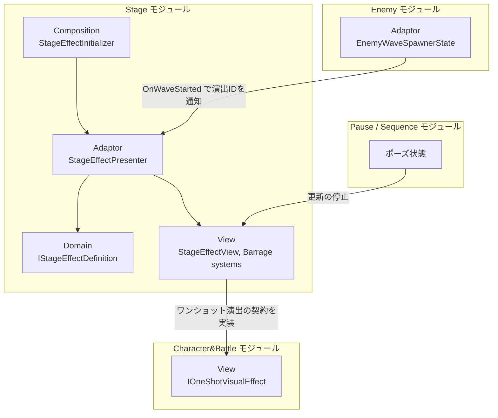
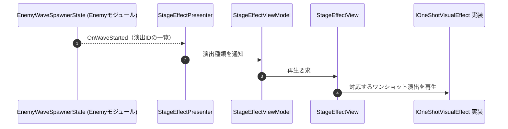
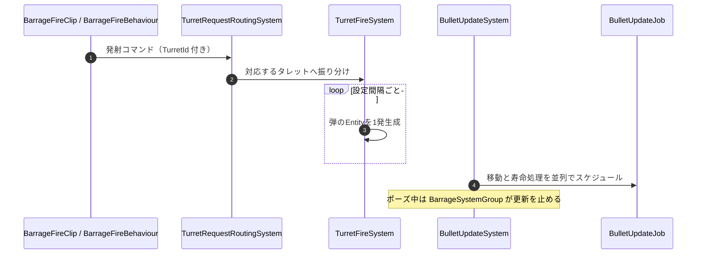

# 概要
> 💡 **モジュール概要**
> ステージ側の演出を司るモジュールである。Wave開始時に予約されるステージ演出（爆発・建物崩壊・障害物）と、Timelineから駆動するECSベースの弾幕システムの2つを持つ。

| 項目 | 内容 |
| --- | --- |
| **モジュール名** | Stage |
| **カテゴリ** | InGame |
| **ステータス** | 実装済み |
| **最終更新日** | 2026-08-17 |

---

## 🏗️ クラス

| クラス名 | レイヤー | 役割・機能 |
| --- | --- | --- |
| **`IStageEffectDefinition`** | Domain | Wave開始時に予約するステージ演出の定義 |
| **`StageEffectDefinition`** | Domain | 上記の実装 |
| **`StageEffectKind`** | Domain | ステージ演出の種類 |
| **`StageEffectPresenter`** | Adaptor | 演出定義をViewModelへ伝達する |
| **`IStageEffectViewModel`** / **`StageEffectViewKind`** | Adaptor | View側の契約と、Viewへ通知する演出種類 |
| **`StageEffectView`** / **`StageEffectViewModel`** | View | 演出IDに対応するワンショット演出の再生 |
| **`AnimatorTriggerOneShotVisualEffect`** / **`GameObjectActivationOneShotVisualEffect`** | View | `IOneShotVisualEffect`（Character&Battleモジュール）の実装。Animatorトリガーと、GameObjectの有効化で演出する |
| **`StageEffectAssetBase`** | Infrastructure | Wave開始時に実行する演出を入力するAsset基底 |
| **`ExplosionStageEffectAsset`** / **`BuildingCollapseStageEffectAsset`** / **`ObstacleStageEffectAsset`** | Infrastructure | 爆発・建物崩壊・障害物の各演出Asset |
| **`StageEffectInitializer`** | Composition | 演出まわりの構築とカタログの登録（Order 800） |

### 🎯 弾幕システム（`View/InGame/Stage/Barrage/`）

Timelineから駆動し、弾の生成と更新をECSで処理する。

| クラス名 | 役割・機能 |
| --- | --- |
| **`BarrageFireClip`** / **`BarrageFireBehaviour`** | 弾幕を発射させる区間を表すTimelineクリップと、その再生区間で指定タレットへコマンドを送る挙動 |
| **`BarrageTrack`** | 上記クリップを並べるTimelineトラック |
| **`BarrageFireCommand`** / **`BarrageCommandKind`** / **`BarrageFireState`** | 発射コマンドとその種別、発射中の状態 |
| **`TurretRequestRoutingSystem`** | Timelineから発行されたコマンドを、IDで対応するタレットへ振り分ける |
| **`TurretFireSystem`** | 発射中のタレットから、設定された間隔で弾を1発ずつ生成する |
| **`BulletUpdateSystem`** / **`BulletUpdateJob`** | 弾の移動と寿命処理を並列ジョブでスケジュールする |
| **`BarrageSystemGroup`** | 弾幕のシステムをまとめ、ポーズ中は更新を停止するグループ |
| **`BarragePauseBridge`** / **`BarragePauseRateManager`** | ポーズ状態を弾幕システムグループとPlayableDirectorへ伝える |
| **`TurretAuthoring`** / **`BulletAuthoring`** | シーン上のタレットと弾をECSのEntityへ変換する |
| **`TurretConfig`** / **`TurretId`** / **`TurretRandom`** / **`TurretRegistered`** | タレットの設定・識別子・乱数・登録状態のComponent |
| **`BulletSpeed`** / **`BulletVelocity`** / **`BulletLifetime`** | 弾の速度・速度ベクトル・寿命のComponent |
| **`BarrageSpread`** | 弾のばらつき |

### 🧩 Composition初期化情報

| 項目 | 内容 |
| --- | --- |
| **Initializerクラス** | `StageEffectInitializer` |
| **Order** | 800（Enemy(700)の後。Wave開始通知を受ける側のため後発でよい） |
| **公開する ModuleContainer / ServiceLocator登録型** | 専用の`ModuleContainer`は無く、演出カタログとPresenterを登録する |

---

## 🔗 モジュール結合

### 📥 依存しているもの

* **`Enemy`**
  * *依存箇所*: `EnemyWaveSpawnerState.OnWaveStarted`, `EnemyWaveDefinition.StageEffectIds`
  * *詳細*: Wave開始の通知と、そのWaveで再生する演出IDを受け取る。演出の実体はStage側が持ち、Enemy側は演出IDのみを保持する
* **`Character&Battle`**
  * *依存箇所*: `IOneShotVisualEffect`
  * *詳細*: ワンショット演出の共通契約を実装し、Animatorトリガーとオブジェクト有効化の2種を提供する

### 📤 依存されているもの

* **`Enemy`**
  * *参照箇所*: `StageEffectAssetBase`
  * *詳細*: `EnemyWaveDefinitionAsset`が各Waveの演出Assetを保持し、Domain変換時に`EffectId`のみを抽出する

---

# 詳細

## 🧅レイヤー情報

### ① Domain
Wave開始時に予約する演出の定義（`IStageEffectDefinition`）と、その種類を保持する。
### ② Application
当モジュールでは使用していない。
### ③ Adaptor
`StageEffectPresenter`が演出定義をViewModelへ伝達する。
### ④ View
演出IDに対応するワンショット演出の再生と、弾幕システム一式を担当する。弾幕はECSのSystemとComponentで構成され、Timelineから発行されたコマンドをタレットへ振り分けて弾を生成し、移動と寿命を並列ジョブで処理する。
### ⑤ Infrastructure
Wave開始時に実行する演出をInspectorから入力するAsset群を持つ。`[SerializeReference, SubclassSelector]`で多態的に構成する。
### ⑥ Composition
`StageEffectInitializer`（Order 800）が演出まわりを構築し、カタログを登録する。

## 🔌 拡張ポイント

| 拡張したいこと | 実装する場所 | 追加登録の要否 |
| --- | --- | --- |
| 新しいステージ演出を追加したい | `StageEffectAssetBase`（Infrastructure）を継承したAssetクラスを作成し、`EnemyWaveDefinitionAsset`の該当Waveへ追加する。あわせて`StageEffectInitializer`のカタログにも登録する | 必要（カタログへの登録を忘れると、Wave開始時に演出IDを解決できない） |
| 新しい演出の見せ方を追加したい | `IOneShotVisualEffect`（Character&Battleモジュール）を実装したクラスを作る。既存例はAnimatorトリガーとGameObjectの有効化 | 不要（`[SerializeReference, SubclassSelector]`によりInspectorへ自動的に出現） |
| 新しい弾幕パターンを追加したい | Timelineへ`BarrageTrack`と`BarrageFireClip`を並べ、`TurretId`で対象タレットを指定する | 不要（コード変更なし。タレット側は`TurretAuthoring`でEntity化しておく） |

## 🔄処理フロー

主要な処理フローは、それぞれ子ページに分けている。

### ① Wave開始時のステージ演出フロー

Enemyモジュールから通知されたWave開始をきっかけに、そのWaveへ設定された演出を再生する。

### ② Timeline駆動の弾幕フロー

Timelineのクリップ区間がタレットへコマンドを送り、ECSが弾の生成と更新を担う。

