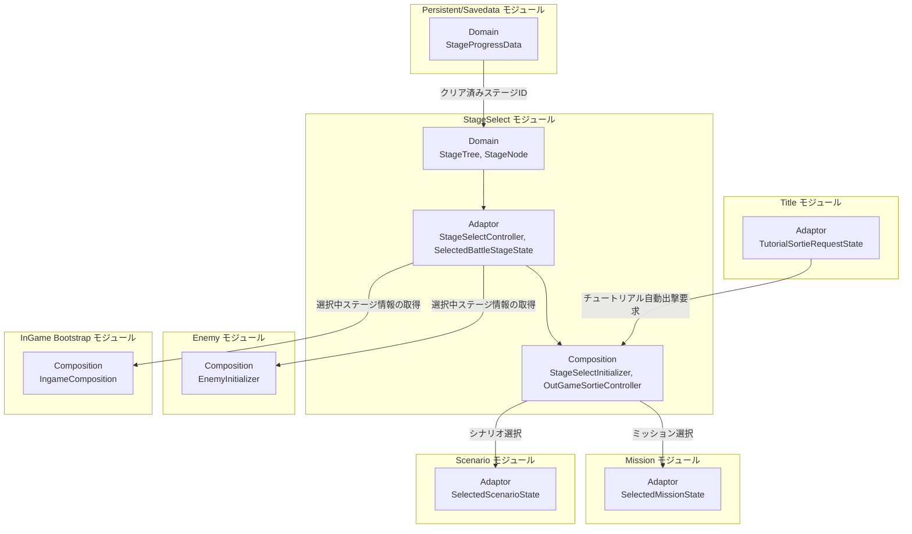
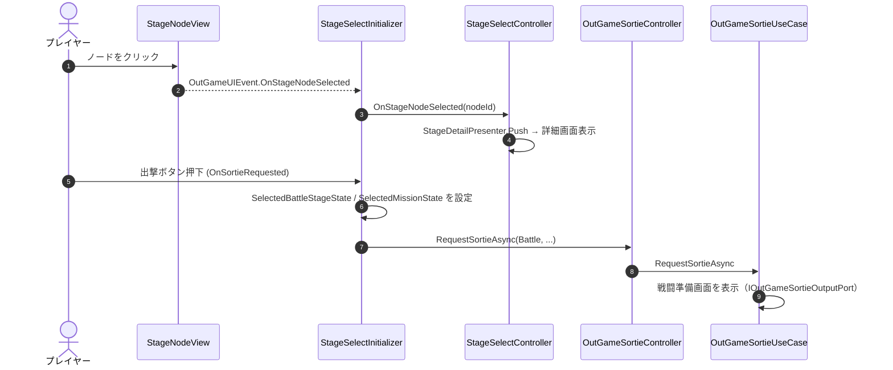
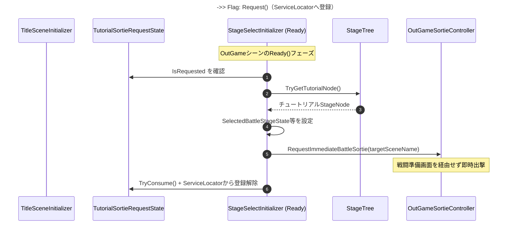

# 概要
> 💡 **モジュール概要**
> ステージマップ（ノードグラフ）の表示・選択、クリア状態に基づくステージ解放、および選択ステージへの出撃（Sortie）を司るアウトゲームモジュールである。バトル出撃・シナリオ出撃・チュートリアル自動出撃という3種類の出撃経路を持つ。

| 項目 | 内容 |
| --- | --- |
| **モジュール名** | StageSelect |
| **カテゴリ** | OutGame |
| **ステータス** | 実装済み（一部TODO残存） |
| **最終更新日** | 2026-07-22 |

---

## 🏗️ クラス

| クラス名 | レイヤー | 役割・機能 |
| --- | --- | --- |
| **`StageId`** | Domain | ステージを識別するreadonly構造体（`int`ラップ） |
| **`StageType`** | Domain | `Battle`/`Scenario`を表すenum。出撃経路の分岐に使う |
| **`StageStatus`** | Domain | `Locked`/`Unlocked`/`Cleared`を表すenum |
| **`StageReward`** | Domain | クリア報酬（スキル構築/解放ポイント）を保持するreadonly struct |
| **`StageAdvanceMode`** | Domain | 接続元完了後に手動選択を待つか、自動遷移するかを表すenum |
| **`StageNodeConnection`** | Domain | ステージ間の前提関係と進行方法を表すreadonly struct |
| **`StageDefinition`** | Domain | ステージの共通メタデータを保持する抽象基底クラス |
| **`BattleStageDefinition`** | Domain | バトルシーン・ミッション・Wave定義・チュートリアル情報を保持する具象定義 |
| **`ScenarioStageDefinition`** | Domain | 再生するシナリオIDを保持する具象定義 |
| **`StageNode`** | Domain | `StageDefinition`+`StageStatus`を保持する可変Entity。`MarkAsCleared()`/`Unlock()`で状態遷移し`OnStatusChanged`を発火 |
| **`IStageClearRepository`** | Domain | クリア済みステージID取得の抽象（実装はInfrastructure層） |
| **`StageTree`** | Domain | 全ステージノードと接続関係を保持する集約。重複StageId・複数チュートリアルノードは`InvalidOperationException` |
| **`StageProgressService`** | Application | ステージクリア時の状態更新（クリアマーク＋次ステージ解放判定） |
| **`StageMapLayoutBuilder`** | Application | Bindをトポロジカル順に解析し、左から右へ並ぶ列・行位置を構築する |
| **`StageMapNodePosition`** | Application | 自動配置されたノードの列・行を保持するreadonly struct |
| **`StageSelectOpenUseCase`** | Application | 画面再オープン時のセーブデータ一括同期・新規クリア差分検出 |
| **`IOutGameSortieOutputPort`** | Application | 出撃結果（戦闘準備画面表示/即時出撃/シナリオUI切替）の出力境界 |
| **`OutGameSortieUseCase`** | Application | 出撃種別に応じた分岐処理（`RequestSortieAsync`/`RequestImmediateBattleSortie`） |
| **`StageDetailPresenter`** | Adaptor | 選択ノードから`StageDetailDTO`を構築 |
| **`StageNodePresenter`** | Adaptor | `StageNode.OnStatusChanged`を購読し、解放時は接続線アニメーションを再生してから状態をViewへ反映 |
| **`StageNodeAnimationSequencer`** | Adaptor | 複数ノード間のアニメーションをFIFOで直列化する共有シーケンサー |
| **`StageSelectController`** | Adaptor | ノード選択・詳細表示・出撃情報の取得を仲介 |
| **`TutorialSortieRequestState`** | Adaptor | Title→StageSelectのクロスシーン一発フラグ（チュートリアル自動出撃要求） |
| **`OutGameSortieController`** | Adaptor | `OutGameSortieUseCase`への薄いパススルー |
| **`SelectedBattleStageState`** | Adaptor | 選択中バトルステージの保持（namespace上は`Adaptor.InGame.StageSelect`。OutGame側が書き込み、InGame側が読み取る） |
| **`StageDetailScreenView`** | View | ステージ詳細画面（UI Toolkit）。出撃ボタン等を提供 |
| **`StageNodeView`** | View | ステージノード1件の見た目・クリック検知 |
| **`StageNodeConnectionView`** | View | ノード間接続線の解放アニメーション |
| **`StageAssetBase`** | Infrastructure | ステージ共通入力を保持し、Domainノードを生成する抽象基底ScriptableObject |
| **`BattleStageAsset`** | Infrastructure | バトル固有入力から`BattleStageDefinition`を生成するScriptableObject |
| **`ScenarioStageAsset`** | Infrastructure | シナリオ固有入力から`ScenarioStageDefinition`を生成するScriptableObject |
| **`StageBindAsset`** | Infrastructure | From/Toステージと`ManualSelection`/`AutoAdvance`を保持するScriptableObject |
| **`StageTreeAsset`** | Infrastructure | ステージとBindを集約し、`OnValidate()`でID・参照・接続重複を検証するScriptableObject |
| **`SaveDataClearStageRepository`** | Infrastructure | `IStageClearRepository`実装。`StageProgressData.ClearDatas`から実データを返す（スタブではない） |
| **`StageSelectInitializer`** | Composition | StageTreeからノード・接続線を動的生成・配置し、出撃要求を仲介する |
| **`OutGameSortieInitializer`** | Composition | `OutGameSortieUseCase`/`OutGameSortieController`の構築・登録 |
| **`OutGameSortieOutputPort`** | Composition | `IOutGameSortieOutputPort`実装。`OutGameUIEvent`と`InputComposition`の両方に依存するためComposition層に配置 |

### 🧩 Composition初期化情報

| 項目 | 内容 |
| --- | --- |
| **Initializerクラス** | `StageSelectInitializer` / `OutGameSortieInitializer` |
| **Order** | `StageSelectInitializer` = 110（`ScreenInitializer`(100)の後、`SkillTreeInitializer`(120)の前） / `OutGameSortieInitializer` = 20 |
| **公開する ModuleContainer / ServiceLocator登録型** | 専用の`ModuleContainer`は無く、`SelectedBattleStageState`・`SelectedMissionState`（個別インスタンス）・`OutGameSortieController`をServiceLocatorへ直接登録 |

---

## 🔗 モジュール結合

### 📥 依存しているもの

* **`Title`**
  * *依存箇所*: `TutorialSortieRequestState`
  * *詳細*: Titleが初回起動時等に登録・リクエストした一発フラグを`StageSelectInitializer.Ready()`が消費し、チュートリアルステージへ自動出撃する
* **`Mission`**
  * *依存箇所*: `SelectedMissionState`, `OutGameMissionSelectController`
  * *詳細*: バトル出撃時に選択ステージの`MissionDefinition`をミッション選択状態へ設定する
* **`Scenario`**
  * *依存箇所*: `SelectedScenarioState`
  * *詳細*: シナリオ種別のステージ出撃時に、選択シナリオIDを設定する
* **`Persistent/Savedata`**
  * *依存箇所*: `StageProgressData`, `SaveData`
  * *詳細*: `SaveDataClearStageRepository`がクリア済みステージ一覧を読み込み、`StageSelectOpenUseCase`が画面表示時に一括反映す

### 📤 依存されているもの

* **`Enemy`**
  * *参照箇所*: `SelectedBattleStageState.CurrentStageDefinition.EnemyWaveDefinitionId`
  * *詳細*: `EnemyInitializer`（Order 700）が共通のWave定義リポジトリからステージ固有の定義をID検索するために参照する。選択が無い場合やIDが未登録の場合は初期化に失敗する
* **`InGame Bootstrap`**
  * *参照箇所*: `SelectedBattleStageState.HasSelectedBattleStage`, `BattleSceneName`
  * *詳細*: `IngameComposition`がInGameシーン起動時にこの状態を読み取り、バトルシーンを追加ロードする。選択が無い場合は初期化が失敗する
* **`Result`**
  * *参照箇所*: `SelectedBattleStageState`
  * *詳細*: リザルト画面がクリアデータの書き戻し等に選択中ステージ情報を参照する

---

# 詳細

## 🧅レイヤー情報

### ① Domain
ステージの識別（`StageId`）、種別（`StageType`）、状態（`StageStatus`）、報酬（`StageReward`）、接続関係（`StageNodeConnection`）、そして全体を束ねる集約`StageTree`を保持する。重複IDや複数チュートリアルノードは構築時に例外で検出する。
### ② Application
ステージクリア時の状態更新（`StageProgressService`）、画面表示時のセーブデータ同期（`StageSelectOpenUseCase`）、および出撃種別に応じた分岐処理（`OutGameSortieUseCase`）を実装する。
### ③ Adaptor
ノード選択・詳細表示を仲介する`StageSelectController`、クロスシーン状態（`SelectedBattleStageState`、`TutorialSortieRequestState`）、出撃要求の薄いパススルー（`OutGameSortieController`）を定義する。
### ④ View
ステージ詳細画面（`StageDetailScreenView`）、ノード（`StageNodeView`）、接続線アニメーション（`StageNodeConnectionView`）というUI Toolkitコンポーネント群を担当する。画面のコンテナ自体（表示/非表示の切り替え）はScreenモジュールが所有し、StageSelectはその中身を構築する。
### ⑤ Infrastructure
`BattleStageAsset`/`ScenarioStageAsset`がステージ内容、`StageBindAsset`が接続と進行方法、`StageTreeAsset`が全体構成を保持する。`SaveDataClearStageRepository`はクリア済みステージIDをセーブデータから取得する。
### ⑥ Composition
`StageSelectInitializer`（Order 110）がステージマップ構築・出撃仲介・チュートリアル自動出撃トリガーを担当し、`OutGameSortieInitializer`（Order 20）が出撃ユースケース一式を構築する。

## 🔌 拡張ポイント

> 新しいバトルまたはシナリオステージは対応する具象Assetを作成し、`StageBindAsset`と`StageTreeAsset`へ登録するデータ追加のみで対応できる。接続元と接続先のステージ種別の組み合わせに制限はない。

## 🔄処理フロー

主要な処理フローごとに分けて記述する。

### ① 通常バトル出撃フロー（ステージ選択→戦闘準備画面）
プレイヤーがステージノードを選択し、出撃ボタンを押すまでの流れである。

### ② チュートリアル自動出撃フロー（初回起動時）
Titleが要求したフラグをStageSelectが消費し、戦闘準備画面を経由せず直接出撃する。

