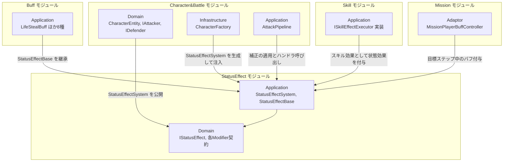
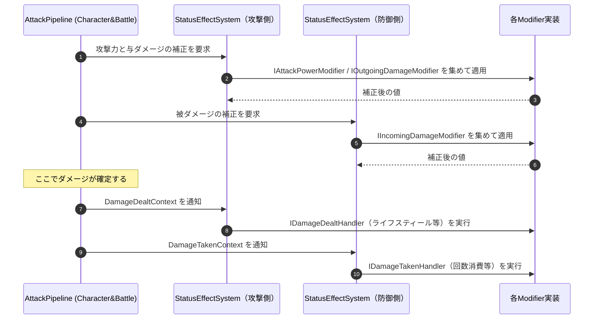
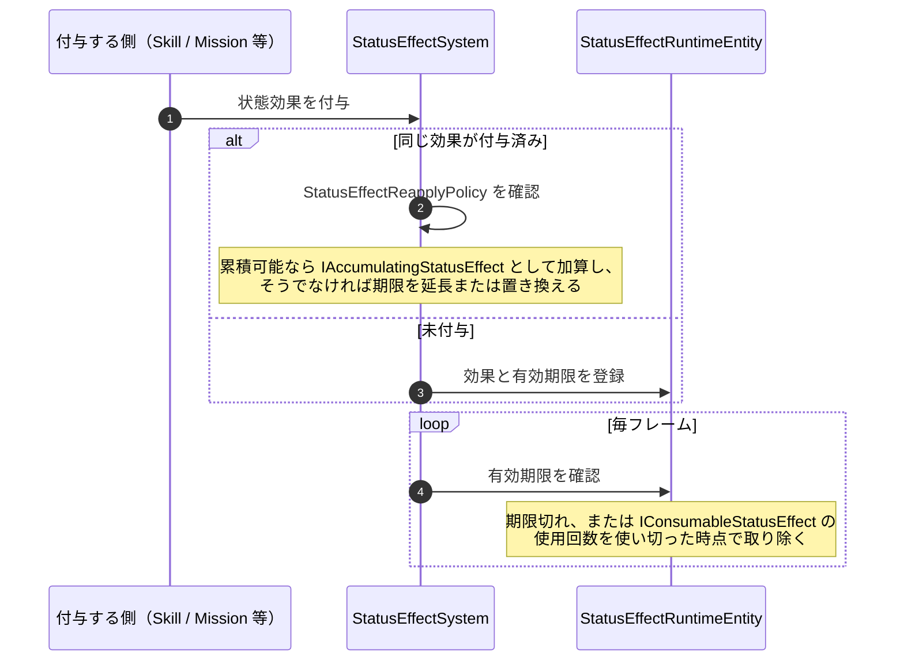

# 概要
> 💡 **モジュール概要**
> バフ・デバフを状態効果として扱う仕組みを提供するモジュールである。`InGame/StatusEffect`が契約と管理システムを、`InGame/Buff`が具体的な効果を持つ。旧`IBuff`/`BuffSystem`はこの仕組みへ置き換えられた。

| 項目 | 内容 |
| --- | --- |
| **モジュール名** | StatusEffect |
| **カテゴリ** | InGame |
| **ステータス** | 実装済み |
| **最終更新日** | 2026-08-17 |

---

## 🏗️ クラス

### 仕組み（`InGame/StatusEffect`）

| クラス名 | レイヤー | 役割・機能 |
| --- | --- | --- |
| **`IStatusEffect`** | Domain | バフ・デバフを含む状態効果の共通契約 |
| **`IStatusEffectSystem`** | Domain | キャラクターが保持する状態効果を管理するシステムの契約 |
| **`StatusEffectRuntimeEntity`** | Domain | 付与中の状態効果と有効期限を保持するEntity |
| **`StatusEffectId`** / **`StatusEffectCategory`** / **`StatusEffectDuration`** | Domain | 識別子・分類・継続時間 |
| **`StatusEffectReapplyPolicy`** | Domain | 同じ状態効果を再付与したときの扱い |
| **`IAccumulatingStatusEffect`** | Domain | 再適用時に効果を累積できることを表す契約 |
| **`IConsumableStatusEffect`** | Domain | 使用回数を消費する状態効果の契約 |
| **`IAttackPowerModifier`** | Domain | 攻撃力を補正する |
| **`IOutgoingDamageModifier`** / **`IIncomingDamageModifier`** | Domain | 与ダメージ・被ダメージを補正する |
| **`ICriticalDamageMultiplierModifier`** | Domain | クリティカルダメージ倍率を補正する |
| **`IDamageDealtHandler`** / **`IDamageTakenHandler`** | Domain | ダメージを与えた／受けた際に処理を行う |
| **`StatusEffectBase`** | Application | 状態効果の共通データを持つ基底クラス |
| **`StatusEffectSystem`** | Application | `IStatusEffectSystem`実装。付与・期限管理・補正の適用を担う |
| **`DamageTakenIncreaseDebuff`** | Application | 被ダメージ増加のデバフ |

### 効果の実装（`InGame/Buff`）

いずれも`StatusEffectBase`を継承し、必要な補正契約を実装する。

| クラス名 | 実装する契約 | 効果 |
| --- | --- | --- |
| **`AttackPowerIncreaseBuff`** | `IAttackPowerModifier` | 攻撃力を一定量増加させる |
| **`AttackPowerReductionDebuff`** | `IAttackPowerModifier` | 攻撃力を減少させる |
| **`AttackPowerMultiplierBuff`** | `IOutgoingDamageModifier` | 与ダメージを一定倍率へ変更し続ける永続バフ |
| **`DamageReductionBuff`** | `IIncomingDamageModifier` | 被ダメージを一定割合軽減し続ける永続バフ |
| **`HitCountDamageReductionBuff`** | `IIncomingDamageModifier`, `IDamageTakenHandler`, `IConsumableStatusEffect` | 指定回数まで被ダメージを軽減する |
| **`CriticalDamageFieldBuff`** | `ICriticalDamageMultiplierModifier` | クリティカルダメージ倍率を一定値に変更する |
| **`LifeStealBuff`** | `IDamageDealtHandler` | 与えたダメージの一部を回復する |
| **`BarrierGainBuff`** | `IDamageDealtHandler` | 与えたダメージに応じてバリアを獲得する |

### 🧩 Composition初期化情報

| 項目 | 内容 |
| --- | --- |
| **Initializerクラス** | なし |
| **公開する ModuleContainer / ServiceLocator登録型** | なし。`StatusEffectSystem`はキャラクター単位で生成され、`CharacterFactory`が`CharacterEntity`のコンストラクタへ渡す |

ServiceLocatorを介さず、`CharacterEntity.StatusEffectSystem`から辿る。`IAttacker`と`IDefender`の双方がこのプロパティを公開しているため、攻撃側・防御側のどちらからでも参照できる。

---

## 🔗 モジュール結合

### 📥 依存しているもの

* **`Character&Battle`**
  * *依存箇所*: `CharacterEntity`, `Damage`, `DamageDealtContext`, `DamageTakenContext`
  * *詳細*: 補正の対象となるダメージ値と、効果の持ち主であるキャラクターを扱う

### 📤 依存されているもの

* **`Character&Battle`**
  * *参照箇所*: `IStatusEffectSystem`
  * *詳細*: `CharacterFactory`が生成して`CharacterEntity`へ注入し、`AttackPipeline`がダメージ計算の前後で補正とハンドラを呼ぶ
* **`Skill`**
  * *参照箇所*: `StatusEffectBase`の派生
  * *詳細*: スキル効果の実行器が対象へ状態効果を付与する
* **`Mission`**
  * *参照箇所*: `StatusEffectBase`の派生
  * *詳細*: `MissionPlayerBuffController`が目標ステップの間だけプレイヤーへ付与する

---

# 詳細

## 🧅レイヤー情報

### ① Domain
状態効果の共通契約と、補正の種類ごとに分かれた契約群を保持する。効果が「何を補正するか」は実装する契約で決まり、`StatusEffectSystem`は契約ごとに対象を集めて適用する。
### ② Application
`StatusEffectSystem`が付与・期限管理・補正の適用を行い、`StatusEffectBase`が継続時間や識別子といった共通データを提供する。具体的な効果は`InGame/Buff`にある。
### ③ Adaptor
当モジュールでは使用していない。
### ④ View
当モジュールでは使用していない。
### ⑤ Infrastructure
当モジュールでは使用していない。効果の生成元は付与する側（Skill・Mission等）が持つ。
### ⑥ Composition
当モジュールでは使用していない。`StatusEffectSystem`はキャラクター単位の生成で、`CharacterFactory`が担う。

## 🔌 拡張ポイント

| 拡張したいこと | 実装する場所 | 追加登録の要否 |
| --- | --- | --- |
| 新しいバフ・デバフを追加したい | `StatusEffectBase`（Application）を継承し、効かせたい補正の契約（`IAttackPowerModifier`・`IIncomingDamageModifier`・`IDamageDealtHandler`等）を実装する。置き場は`InGame/Buff` | 不要（`StatusEffectSystem`が契約ごとに対象を集めるため、実装した契約に応じて自動的に効く） |
| 新しい補正の種類を追加したい | 補正契約（Domain）を追加し、`StatusEffectSystem`と`AttackPipeline`の該当箇所で集計・適用する | 必要（適用側への追記を忘れると、効果は付与されるが数値に反映されない） |
| 再付与時の扱いを変えたい | `StatusEffectReapplyPolicy`を指定する。累積させたい場合は`IAccumulatingStatusEffect`を実装する | 不要 |

## 🔄処理フロー

主要な処理フローは、それぞれ子ページに分けている。

### ① ダメージ計算への補正フロー

攻撃側と防御側それぞれの状態効果が、ダメージ計算の前後で呼ばれる。

### ② 付与と期限切れのフロー

同じ効果を再付与したときの扱いは`StatusEffectReapplyPolicy`で決まる。

