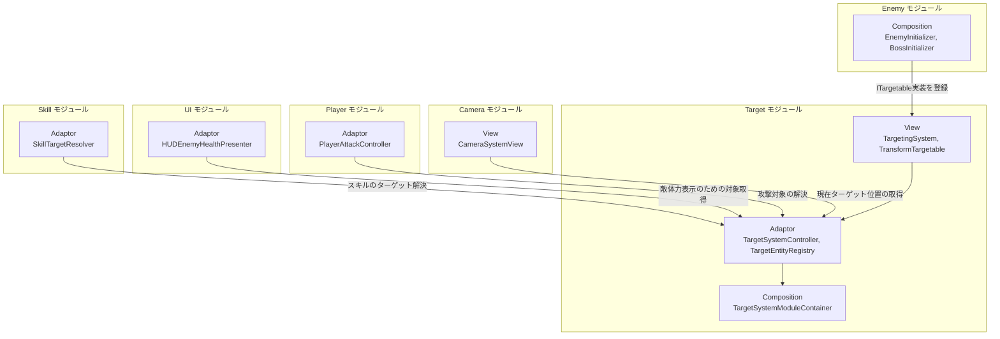
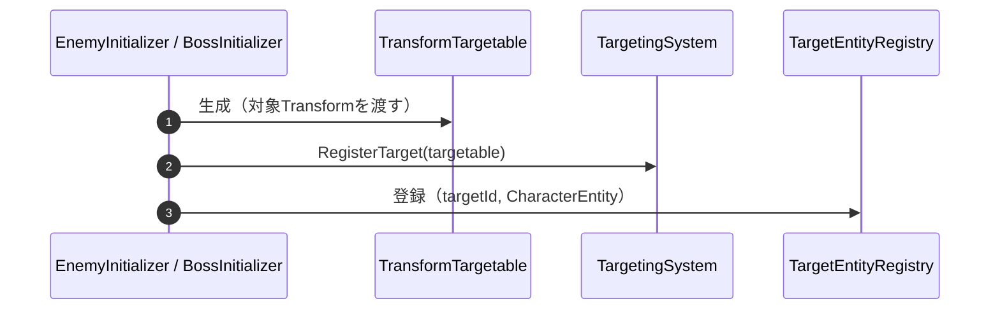
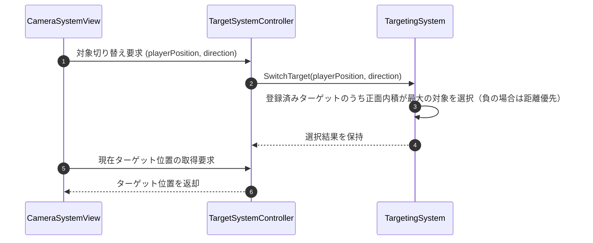
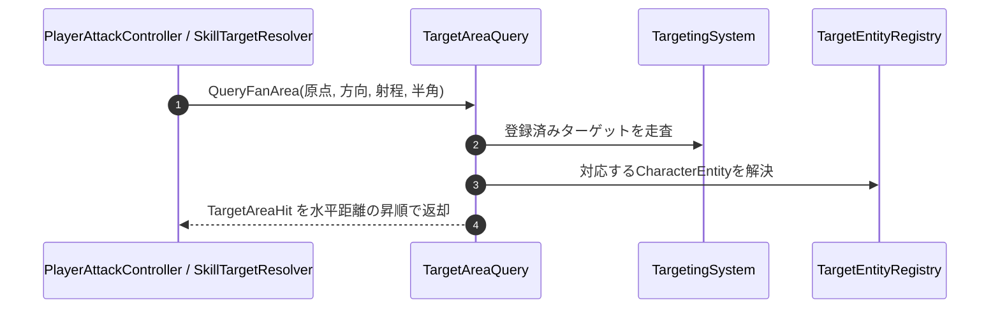

# 概要
> 💡 **モジュール概要**
> ロックオン対象（ターゲット）の登録・選択・現在位置取得を一元管理するモジュールである。旧Cameraモジュールに内包されていたロックオン機能がリファクタリングにより独立し、Camera・Player・Enemy・UI・Skillなど複数モジュールから利用されるハブ的な存在になっている。

| 項目 | 内容 |
| --- | --- |
| **モジュール名** | Target |
| **カテゴリ** | InGame |
| **ステータス** | 実装済み |
| **最終更新日** | 2026-08-17 |

---

## 🏗️ クラス

| クラス名 | レイヤー | 役割・機能 |
| --- | --- | --- |
| **`ITargetableViewModel`** | Adaptor | ターゲットシステムが扱う対象の共通インターフェース |
| **`ITargetBoundsViewModel`** | Adaptor | ターゲットのワールド空間Boundsを公開するインターフェース |
| **`ITargetSystemViewModel`** | Adaptor | ターゲット登録・選択・現在ターゲット取得を仲介するViewModelインターフェース |
| **`TargetSystemController`** | Adaptor | ターゲット選択ViewModelとEntityレジストリを仲介するコントローラー。他モジュールからの主要な窓口 |
| **`TargetEntityRegistry`** | Adaptor | ターゲットIDと`CharacterEntity`の対応を管理するレジストリ |
| **`TargetAreaQuery`** | Adaptor | 登録済みターゲットから扇形範囲に入る対象をXZ平面で検索するクエリ |
| **`TargetAreaHit`** | Adaptor | 範囲クエリの検出結果1件を表すreadonly struct（対象・Entity・水平距離） |
| **`ITargetable`** | View | `ITargetableViewModel`を継承した、ターゲット選択システムが扱う対象の共通インターフェース |
| **`TargetingSystem`** | View | ターゲットの登録・選択・位置取得を一元管理するクラス（`ITargetSystemViewModel`実装）。正面方向の内積を優先し、負の場合は距離を優先して最適対象を選択する |
| **`TransformTargetable`** | View | `Transform`をターゲット選択用の対象として扱うラッパークラス（`ITargetable`実装、`IDisposable`） |
| **`TargetSystemModuleContainer`** | Composition | `TargetSystemController`/`ITargetSystemViewModel`/`TargetEntityRegistry`をServiceLocatorへ公開するContainer |
| **`TargetSystemInitializer`** | Composition | ターゲットシステムの依存解決とサービス登録を行う初期化クラス（`IDisposable`） |
| **`TargetSystemInitializationModule`** | Composition | `TargetSystemInitializer`をInGame初期化ライフサイクルに統合するモジュール |

> 現状、Domain層・Application層・InfraStructure層のクラスはない。ターゲット選択ロジック（内積・距離による優先順位判定）はView層の`TargetingSystem`に実装されている。

### 🧩 Composition初期化情報

| 項目 | 内容 |
| --- | --- |
| **Initializerクラス** | `TargetSystemInitializationModule`（内部で`TargetSystemInitializer`を使用） |
| **Order** | 100 |
| **公開する ModuleContainer / ServiceLocator登録型** | `TargetSystemModuleContainer`（`TargetSystemController`, `ITargetSystemViewModel`, `TargetEntityRegistry`, `TargetAreaQuery`を保持） |

---

## 🔗 モジュール結合

### 📥 依存しているもの

* **`Character&Battle`**
  * *依存箇所*: `CharacterEntity`
  * *詳細*: `TargetEntityRegistry`がターゲットIDと`CharacterEntity`を対応付け、`TargetAreaHit`が範囲判定の結果として`CharacterEntity`を返す

### 📤 依存されているもの

* **`Camera`**
  * *参照箇所*: `ITargetSystemViewModel`
  * *詳細*: ロックオン中の現在ターゲット位置取得や、ロックオン対象の有無判定に使用する
* **`Player`**
  * *参照箇所*: `TargetSystemController`, `ITargetableViewModel`
  * *詳細*: `PlayerAttackController`が攻撃対象の解決に使用する
* **`Enemy`**
  * *参照箇所*: `ITargetable`
  * *詳細*: 敵キャラクターがプレイヤー/カメラからロックオン対象として扱われるよう、自身を`TargetingSystem`へ登録する
* **`UI`**
  * *参照箇所*: `TargetSystemController`
  * *詳細*: `HUDEnemyHealthPresenter`が敵の体力表示のため対象情報を参照する
* **`Skill`**
  * *参照箇所*: `TargetSystemController`, `TargetAreaQuery`
  * *詳細*: `SkillTargetResolver`がスキル発動時のターゲット解決と、範囲スキルの対象列挙に使用する
* **`Battle`**
  * *参照箇所*: `TargetAreaQuery`
  * *詳細*: `PlayerAttackController`が攻撃の当たり判定として扇形範囲の対象を取得する
* **`UI`**
  * *参照箇所*: `ITargetBoundsViewModel`
  * *詳細*: `EnemyDirectionIndicatorPresenter`が画面外の敵を指し示すため、対象のBoundsを参照する

---

# 詳細

## 🧅レイヤー情報

### ① Domain
当モジュールでは使用していない。
### ② Application
当モジュールでは使用していない。
### ③ Adaptor
`TargetSystemController`がターゲット選択ViewModelとEntityレジストリを仲介し、他モジュールからの主要な窓口になる。`TargetEntityRegistry`がターゲットIDと`CharacterEntity`の対応を管理する。`TargetAreaQuery`は登録済みターゲットへの扇形範囲検索を提供し、攻撃判定と範囲スキルの対象列挙に使われる。
### ④ View
`TargetingSystem`がターゲットの登録・選択・位置取得を一元管理し、正面方向の内積優先→距離優先という選択アルゴリズムを実装する。`TransformTargetable`が実際のUnity `Transform`をラップして対象化する。
### ⑤ Infrastructure
当モジュールでは使用していない。
### ⑥ Composition
`TargetSystemInitializationModule`（Order 100、他モジュールより早期に初期化）が`TargetSystemInitializer`経由でターゲットシステムを構築し、`TargetSystemModuleContainer`として公開する。

## 🔌 拡張ポイント

> 現状、ポリモーフィックな拡張ポイント（`SubclassSelector`等）はない。新しい対象種別を追加する場合は`ITargetable`を実装した新しいクラスを作成し、`TargetingSystem`に登録するだけで対応できる（Enumやswitch文への追記は不要）。

## 🔄処理フロー

主要な処理フローは、それぞれ子ページに分けている。

### ① ターゲット登録フロー（敵出現時）
敵がスポーンした際、自身をターゲットシステムへ登録する。

### ② ターゲット選択フロー（ロックオン入力時）
プレイヤーがロックオン入力を行った際、正面方向・距離に基づいて最適な対象を選択する。

### ③ 範囲判定フロー（攻撃・範囲スキル）

攻撃や範囲スキルは、コライダーではなく登録済みターゲットへの扇形クエリで対象を決める。判定はXZ平面で行い、高低差は無視される。

