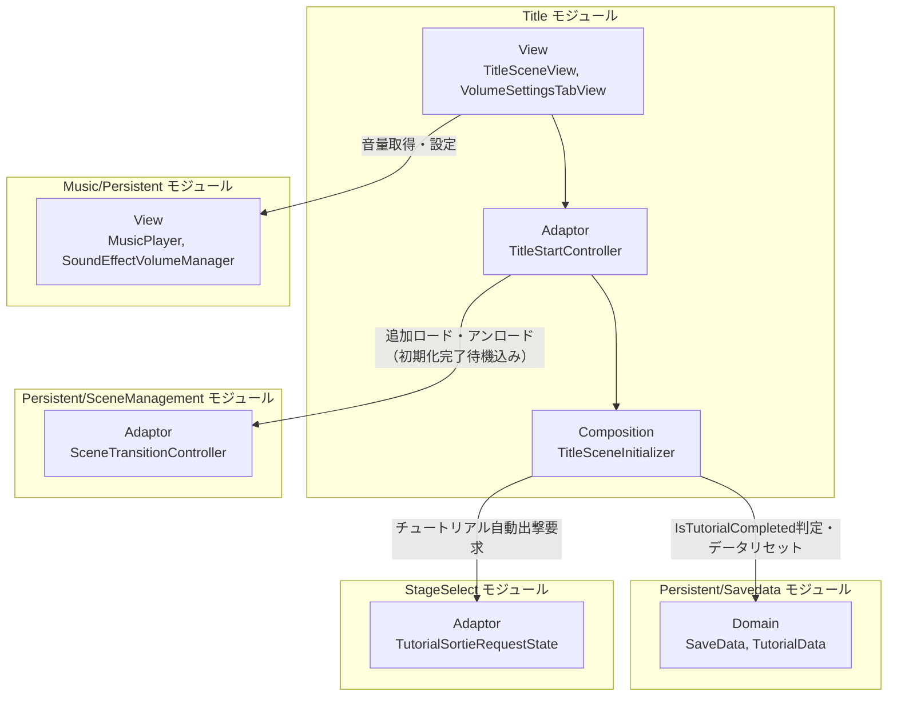
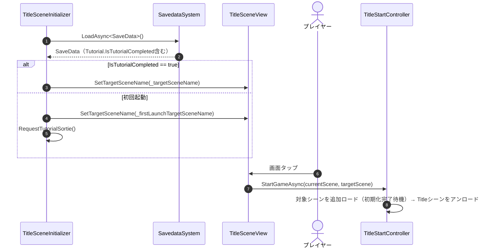
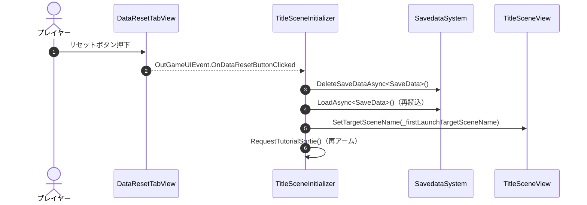

# 概要
> 💡 **モジュール概要**
> タイトル画面の表示、初回起動判定によるチュートリアル自動出撃のトリガー、オプション画面（音量設定・セーブデータリセット）を司るモジュールです。他モジュールから参照されることのない、アプリケーションの入口です。

| 項目 | 内容 |
| --- | --- |
| **モジュール名** | Title |
| **カテゴリ** | OutGame |
| **ステータス** | 実装済み |
| **最終更新日** | 2026-07-15 |

---

## 🏗️ クラス

| クラス名 | レイヤー | 役割・機能 |
| --- | --- | --- |
| **`TitleStartController`** | Adaptor | `StartGameAsync`でシーン遷移を駆動。多重タップを防止する |
| **`TitleSceneView`** | View | タイトル画面本体。タップでゲーム開始、オプションボタンでオプション画面表示 |
| **`MenuScreenView`** | View | メニュー画面（オプション/クレジットへの導線） |
| **`OptionsScreenView`** | View | オプション画面（音量設定タブ・データリセットタブのコンテナ） |
| **`CreditScreenView`** | View | クレジット画面 |
| **`VolumeSettingsTabView`** | View | BGM/SE音量スライダーを`MusicPlayer`/`SoundEffectVolumeManager`（具象クラス）に直接バインド |
| **`DataResetTabView`** | View | セーブデータリセットボタン。押下で`OutGameUIEvent.OnDataResetButtonClicked`を発火 |
| **`TitleSceneInitializer`** | Composition | 初回起動判定、各種View構築、データリセット処理を担当 |
| **`TitleScreenViewRegistry`** | Composition | `ScreenId`（Title/Menu/Options/Credit）と各Viewの対応表 |

> セーブデータリセット処理専用のクラスは存在せず、`TitleSceneInitializer.HandleDataResetButtonClicked`という私有メソッドとして実装されています。

### 🧩 Composition初期化情報

| 項目 | 内容 |
| --- | --- |
| **Initializerクラス** | `TitleSceneInitializer` |
| **Order** | 20（Titleシーン内） |
| **公開する ModuleContainer / ServiceLocator登録型** | 専用の`ModuleContainer`は無し。初回起動/データリセット時に`TutorialSortieRequestState`（StageSelectモジュールの型）を`ServiceLocator`へ登録しリクエストする |

---

## 🔗 モジュール結合

### 📥 依存しているもの

* **`Persistent/Savedata`**
  * *依存箇所*: `SaveData`, `TutorialData`
  * *詳細*: `SaveData.Tutorial.IsTutorialCompleted`で初回起動判定を行い、データリセット時は`SavedataSystem.DeleteSaveDataAsync<SaveData>()`を呼びます。
* **`Music` / `Persistent`**
  * *依存箇所*: `MusicPlayer`, `SoundEffectVolumeManager`（具象クラス）
  * *詳細*: `VolumeSettingsTabView`がBGM/SE音量スライダーを直接バインドします。既存の`IVolumeManager`抽象は使用していません。
* **`Persistent/SceneManagement`**
  * *依存箇所*: `SceneTransitionController`
  * *詳細*: `TitleStartController.StartGameAsync`が追加ロード・アンロードに使用します（`ISceneInitializationReadiness`によるモジュール初期化完了待機の恩恵を受けます）。
* **`StageSelect`**
  * *依存箇所*: `TutorialSortieRequestState`
  * *詳細*: 初回起動時・データリセット後に`RequestTutorialSortie()`がこの状態を登録・リクエストし、遷移先シーンでStageSelectモジュールが消費します。

### 📤 依存されているもの

* なし
  * *詳細*: Titleはアプリケーションの入口であり、他モジュールから直接参照されることはありません。StageSelectが`TutorialSortieRequestState`を経由して間接的にTitleの意図を受け取るのみです。

---

# 詳細

## 🧅レイヤー情報

### ① Domain
当モジュールでは使用していません。
### ② Application
当モジュールでは使用していません（汎用Screenモジュールの`ShowScreenUseCase`等を利用しますが、Title固有のApplication層クラスはありません）。
### ③ Adaptor
`TitleStartController`がシーン遷移を駆動し、多重タップを防止します。
### ④ View
`TitleSceneView`/`MenuScreenView`/`OptionsScreenView`/`CreditScreenView`という画面遷移チェーンと、`VolumeSettingsTabView`/`DataResetTabView`というオプションタブを担当します。
### ⑤ Infrastructure
当モジュールでは使用していません。
### ⑥ Composition
`TitleSceneInitializer`（Order 20）が、初回起動判定・各View構築・イベント購読・データリセット処理を一手に担います。

## 🔌 拡張ポイント

> 現状、ポリモーフィックな拡張ポイント（`SubclassSelector`等）はありません。新しいオプションタブを追加する場合は、`VolumeSettingsTabView`/`DataResetTabView`と同様の`IDisposable`実装クラスを追加し、`TitleSceneInitializer`に組み込む形になります。

## 🔄処理フロー

主要な処理フローごとに分けて記述します。

### ① 通常起動フロー
セーブデータのチュートリアル完了フラグに応じて遷移先を決定します。

### ② セーブデータリセットフロー
オプション画面からセーブデータを削除し、初回起動状態へ戻します。

## 📝 アーキテクチャ上の特徴・既知の課題

### ✅ 設計上の見どころ
* **一発フラグによる疎結合なシーン間ハンドオフ**: Title→StageSelectという直接参照のないシーン間で、`TutorialSortieRequestState`という自己消費型（一度読まれたら`ServiceLocator`から登録解除される）の状態オブジェクトのみで意図を伝達しています。

### ⚠️ 既知の課題・改善ポイント
* **`VolumeSettingsTabView`とOutGame `Setting`モジュールの重複実装**: 音量設定UIが本モジュールの`VolumeSettingsTabView`と、別モジュール「Setting」の`AudioConfig`/`SettingSlider`という**2つの独立した実装**で存在しています。しかも`VolumeSettingsTabView`はVoice音量に対応していません。将来的な統合を検討すべきです。
* **`IVolumeManager`抽象の不使用**: `IVolumeManager`という既存の抽象があるにもかかわらず、`VolumeSettingsTabView`は`MusicPlayer`/`SoundEffectVolumeManager`の具象型をコンストラクタで直接受け取っています。
* **データリセット失敗時のフィードバック不足**: `HandleDataResetButtonClicked`は`DeleteSaveDataAsync`の例外をtry/catchでログ出力するのみで、失敗してもリセット処理を続行し、ユーザーへの失敗通知がありません。
