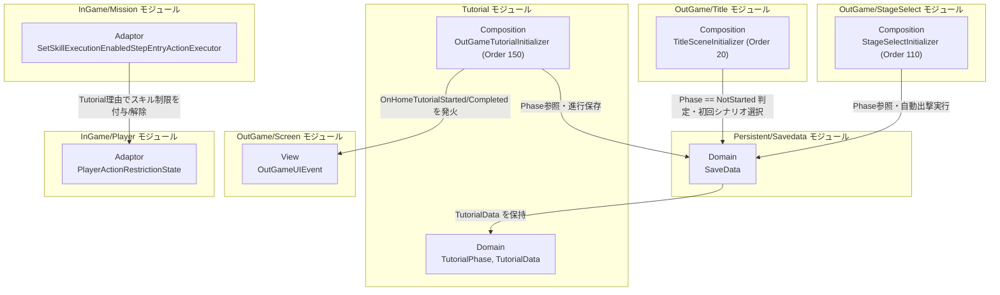
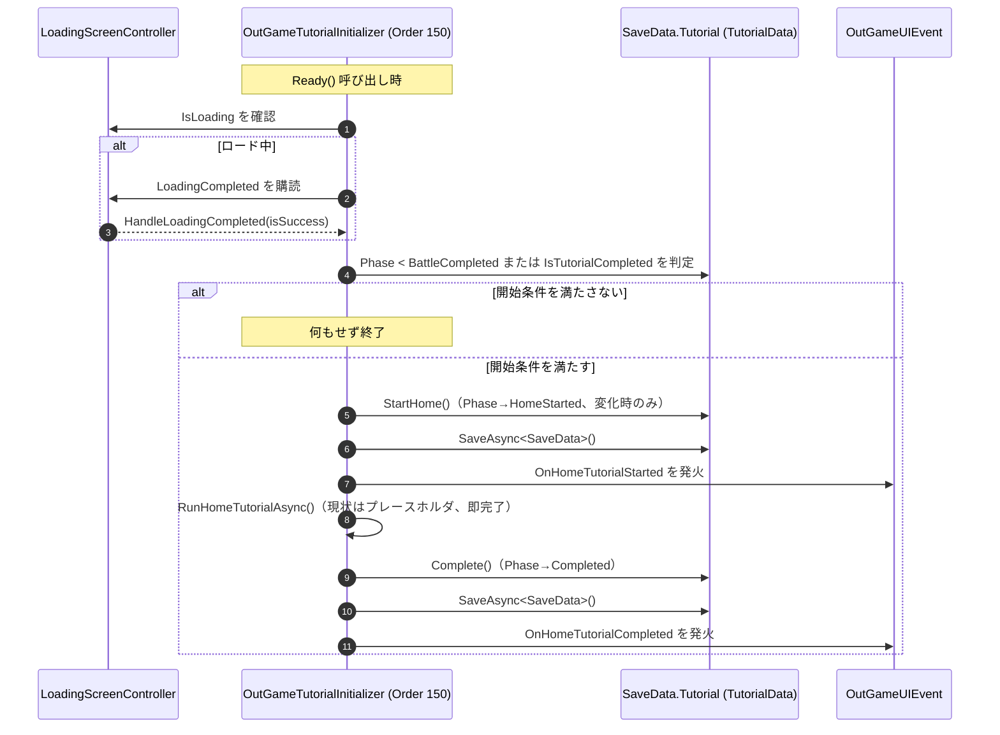
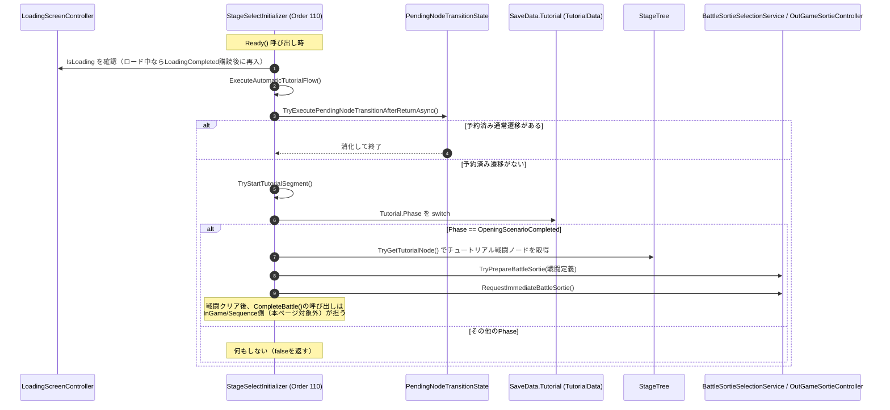

# 概要
> 💡 **モジュール概要**
> シーンを跨いだチュートリアル進行を5段階のフェーズ状態機械（`TutorialPhase`）として管理し、その進行段階に応じてホーム（作戦画面）到達時の自動処理を制御するモジュールである。Title→初回シナリオ、StageSelectの自動出撃（バトルへの直接遷移）は別モジュールの守備範囲であり、本ページは「進行フェーズの前進限定な状態遷移」と「ホームチュートリアル制御（`OutGameTutorialInitializer`）」を中心に扱う。Titleからの初回シナリオ直接遷移、およびStageSelect内の自動出撃連鎖については[② チュートリアル自動出撃フロー（初回起動時）](../../../../../Docs/NotionSpecifications/Symphony%20Kill%20Chord/システム概要/システムリスト/ステージセレクト/②%20チュートリアル自動出撃フロー（初回起動時）.md)を参照。セーブデータ全体の永続化基盤は[セーブシステム](../../../../../Docs/NotionSpecifications/Symphony%20Kill%20Chord/システム概要/システムリスト/セーブシステム.md)を参照。

| 項目 | 内容 |
| --- | --- |
| **モジュール名** | Tutorial |
| **カテゴリ** | OutGame / Persistent |
| **ステータス** | 実装済み（`RunHomeTutorialAsync`はプレースホルダのため、ホームチュートリアルの実処理自体は未実装） |
| **最終更新日** | 2026-09-09 |

---

## 🏗️ クラス

| クラス名 | レイヤー | 役割・機能 |
| --- | --- | --- |
| **`TutorialPhase`** | Domain | シーンを跨ぐチュートリアル進行段階を表すenum。`NotStarted`(0) → `OpeningScenarioCompleted`(1) → `BattleCompleted`(2) → `HomeStarted`(3) → `Completed`(4)の5段階 |
| **`TutorialData`** | Domain | `SaveData`に保持される進行状態。`Phase`と`IsTutorialCompleted`を公開し、`CompleteOpeningScenario`/`CompleteBattle`/`StartHome`/`Complete`の4メソッドで**前進限定**に状態を進める |
| **`PlayerActionRestrictionReason`** | Domain (InGame/Player) | プレイヤー行動制限の理由を表すenum（`None`/`Tutorial`/`Silence`）。本モジュールは`Tutorial`理由でスキル封印に関与する |
| **`SetSkillExecutionEnabledStepEntryAction`** | Domain (InGame/Mission/StepEntryAction) | ミッション目標ステップ進入時にスキル発動可否を切り替える意図を表すデータ（`IsSkillExecutionEnabled`） |
| **`PlayerActionRestrictionState`** | Adaptor (InGame/Player) | スキル発動制限を理由の`HashSet<PlayerActionRestrictionReason>`で管理し、`CanUseSkill`（制限0件で発動可）を公開する |
| **`SetSkillExecutionEnabledStepEntryActionExecutor`** | Adaptor (InGame/Mission) | `SetSkillExecutionEnabledStepEntryAction`を実行し、`PlayerActionRestrictionState`へ`Tutorial`理由の追加/解除を行う |
| **`OutGameTutorialInitializer`** | Composition (OutGame) | Order=150。OutGameロード完了後にホームチュートリアルの開始判定・実行・進行保存を行う |
| **`StageSelectInitializer`**（本モジュールに関わる部分のみ） | Composition (OutGame) | Order=110。`Ready()`から呼ぶ`StartAutomaticTutorialFlowAfterLoading`/`ExecuteAutomaticTutorialFlow`/`TryStartTutorialSegment`で、保存済み`TutorialPhase`に応じた自動出撃を行う |

`OutGameUIEvent`（View/OutGame/Screen）の`OnHomeTutorialStarted`/`OnHomeTutorialCompleted`はホームチュートリアルの開始・終了を他モジュールへ通知するSignalであり、本モジュールが発火元となる。

### 🧩 Composition初期化情報

| 項目 | 内容 |
| --- | --- |
| **Initializerクラス** | `OutGameTutorialInitializer` |
| **Order** | 150（`StageSelectInitializer`の110より後） |
| **公開する ModuleContainer / ServiceLocator登録型** | なし。`ServiceLocator`からは`OutGameUIEvent`と`LoadingScreenController`（任意）を取得するのみで、自身は何も登録しない |

> `StageSelectInitializer`（Order 110）は本モジュール専用のComposition層クラスではないため上表では詳細を割愛するが、`Ready()`内で自動遷移フローを開始する点はTutorialモジュールの状態機械と密接に関わる。詳細は「StageSelect」モジュールページを参照（未作成の場合は本ページの処理フローで代替する）。

---

## 🔗 モジュール結合

### 📥 依存しているもの

* **`Persistent/Savedata`**
  * *依存箇所*: `SaveData.Tutorial`（`TutorialData`）
  * *詳細*: `OutGameTutorialInitializer`と`StageSelectInitializer`はどちらも`SaveStore`経由でロード済みの`SaveData`を取得し、`Tutorial.Phase`を参照・`StartHome()`/`Complete()`で更新後に`SaveStore.SaveAsync<SaveData>()`で永続化する
* **`OutGame/Screen`**
  * *依存箇所*: `OutGameUIEvent`
  * *詳細*: `OutGameTutorialInitializer`が`ServiceLocator`から取得し、`OnHomeTutorialStarted`/`OnHomeTutorialCompleted`を発火する。購読者は現状未実装（プレースホルダの`RunHomeTutorialAsync`と対になる拡張ポイント）

### 📤 依存されているもの

* **`OutGame/StageSelect`**
  * *参照箇所*: `TutorialPhase`, `TutorialData`
  * *詳細*: `StageSelectInitializer.TryStartTutorialSegment()`が`_loadedSaveData.Tutorial.Phase`をswitchし、`OpeningScenarioCompleted`の場合にチュートリアル戦闘へ直接出撃する（詳細は後述の処理フロー②）
* **`OutGame/Title`**
  * *参照箇所*: `TutorialPhase.NotStarted`
  * *詳細*: `TitleSceneInitializer.ApplyStartDestination()`が`Tutorial.Phase != NotStarted`かどうかで、通常のホーム遷移か初回オープニングシナリオへの直接遷移かを分岐する。このシナリオ完了時に`TutorialData.CompleteOpeningScenario()`が呼ばれる想定だが、その呼び出し元（シナリオ再生モジュール側）は本ページの対象外
* **`InGame/Mission`**
  * *参照箇所*: `PlayerActionRestrictionReason.Tutorial`
  * *詳細*: `SetSkillExecutionEnabledStepEntryActionExecutor`がミッション目標ステップ進入時のアクションとして、チュートリアル戦闘中のスキル封印/解除を`PlayerActionRestrictionState`へ委譲する。これはチュートリアルの状態機械（`TutorialPhase`）そのものではなく、チュートリアル**戦闘中**の行動制限という別軸の連携である点に注意

---

# 詳細

## 🧅レイヤー情報

### ① Domain
`TutorialPhase`（5段階enum）と`TutorialData`（`SaveData`配下の`[Serializable]`クラス）を持つ。`TutorialData`は`_phase`と後方互換用の`_isTutorialCompleted`の2フィールドを保持し、`Phase`プロパティは`_isTutorialCompleted`が立っていれば無条件で`Completed`を返す（旧セーブデータとの互換のため）。4つの公開メソッド（`CompleteOpeningScenario`/`CompleteBattle`/`StartHome`/`Complete`）はいずれも内部の`AdvanceTo(TutorialPhase)`を呼び、**指定フェーズが現在値以下なら何もせずfalseを返す**（後退させない・スキップも許容する設計）。`PlayerActionRestrictionReason`（`InGame/Player`）と`SetSkillExecutionEnabledStepEntryAction`（`InGame/Mission/StepEntryAction`）はTutorialモジュール専属ではないDomain型だが、チュートリアル戦闘中のスキル制限に用いられる。
### ② Application
当モジュールでは使用していない。
### ③ Adaptor
`PlayerActionRestrictionState`（`InGame/Player`）が理由付きのスキル制限を`HashSet<PlayerActionRestrictionReason>`で管理し、`CanUseSkill`を`PlayerAttackController.TryExecuteSkill`へ渡す。`SetSkillExecutionEnabledStepEntryActionExecutor`（`InGame/Mission`）は`IMissionStepEntryActionExecutor`を実装し、ミッション目標ステップの進入時アクションとして`Tutorial`理由の追加/削除を行う。
### ④ View
`OutGameUIEvent`（`View/OutGame/Screen`）に`OnHomeTutorialStarted`/`OnHomeTutorialCompleted`の2つのSignalを持つ。いずれも購読者は現状存在しない（`OutGameTutorialInitializer`が発火するのみ）。
### ⑤ Infrastructure
当モジュールでは使用していない。
### ⑥ Composition
`OutGameTutorialInitializer`（Order 150）がホームチュートリアルの開始条件判定・実行・進行保存を担う。`StageSelectInitializer`（Order 110、本来はStageSelectモジュールのComposition）が`Ready()`から呼ぶ自動遷移フローの中で、`TutorialPhase.OpeningScenarioCompleted`時のチュートリアル戦闘自動出撃を担当する。両者はOrderの前後関係（110→150）を利用しており、同一フレームのOutGameロード完了後に順に実行される。

## 🔌 拡張ポイント

| 拡張したいこと | 実装する場所 | 追加登録の要否 |
| --- | --- | --- |
| チュートリアル進行段階を追加したい | `TutorialPhase`（Domain）へ値を追加し、`TutorialData`に対応する`CompleteXxx()`/`StartXxx()`メソッドを追加する | 必要（`AdvanceTo`は数値の大小比較のみで前進判定するため、enum値の並び順＝進行順を厳守する必要がある。`StageSelectInitializer.TryStartTutorialSegment`のswitch文にも新フェーズの分岐追記が必要） |
| ホームチュートリアル本体を実装したい | `OutGameTutorialInitializer.RunHomeTutorialAsync()`（Composition）を実装する。現状は`Task.CompletedTask`を返すだけのプレースホルダである | 不要（既存の呼び出し経路・保存タイミング・Signal発火はそのまま利用できる） |
| ホームチュートリアルの開始/終了に演出やUIを追従させたい | `OutGameUIEvent.OnHomeTutorialStarted`/`OnHomeTutorialCompleted`を購読するControllerを新規作成する | 必要（現状どちらのイベントにも購読者がいないため、購読を追加しない限り何も起きない） |
| チュートリアル戦闘中に別のプレイヤー行動を制限したい | `PlayerActionRestrictionReason`（Domain）へ値を追加し、制限対象のController側で`PlayerActionRestrictionState`の該当APIを呼ぶ | 必要（`PlayerActionRestrictionState`は現状スキルの`AddSkillRestriction`/`RemoveSkillRestriction`のみを持つため、新しい制限種別にはAPI追加が要る） |

## 🔄処理フロー

主要な処理フローを2つに分けて記述する。①はホーム（作戦画面のシーン）到達時にホームチュートリアルが自動開始される流れ、②はStageSelect側で保存済みフェーズに応じてチュートリアル戦闘へ自動出撃する流れである。なお、Titleからの初回シナリオへの直接遷移（`TutorialPhase.NotStarted`時の`TitleSceneInitializer.ApplyStartDestination`）は[② チュートリアル自動出撃フロー（初回起動時）]のページで扱うため、本ページでは前提としてのみ触れる。

### ① ホーム到達時のホームチュートリアル自動開始フロー（`OutGameTutorialInitializer`, Order 150）

`BattleCompleted`以上かつ未完了の場合のみ、ホームチュートリアルが開始される。`RunHomeTutorialAsync`は現状プレースホルダであり、呼び出すと即座に完了する。

### ② StageSelect側の自動出撃フロー（`StageSelectInitializer.Ready()`起点）

`StageSelectInitializer`（Order 110）は`Ready()`で自動遷移フローを起動する。予約済みの通常ノード遷移（`PendingNodeTransitionState`、チュートリアル専用ではない汎用機構）を優先消化した後、`TutorialPhase`に応じたチュートリアル区間の自動開始を判定する。現状のswitch文で処理されるのは`OpeningScenarioCompleted`のみであり、それ以外のフェーズでは`TryStartTutorialSegment`は何もせず`false`を返す。

> `TutorialData.CompleteOpeningScenario()`と`CompleteBattle()`の実際の呼び出し元（シナリオ再生完了時・戦闘クリア時のフック）は、それぞれScenario/Sequenceモジュール側に存在すると推測されるが、本タスクで確認した範囲のファイルには含まれていないため、本ページでは呼び出し先APIの存在のみを明記し、呼び出し元の詳細は対象外とする。
