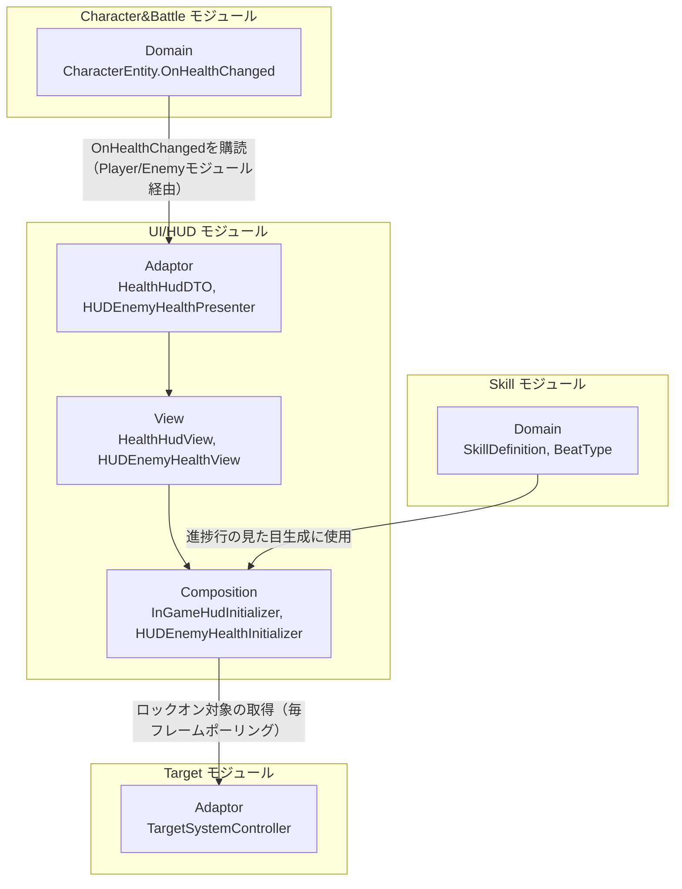
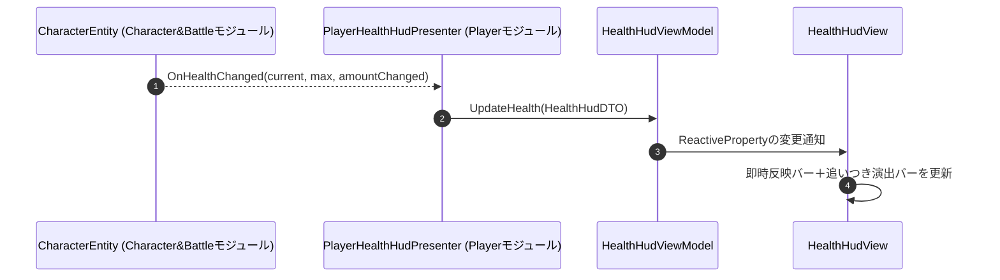
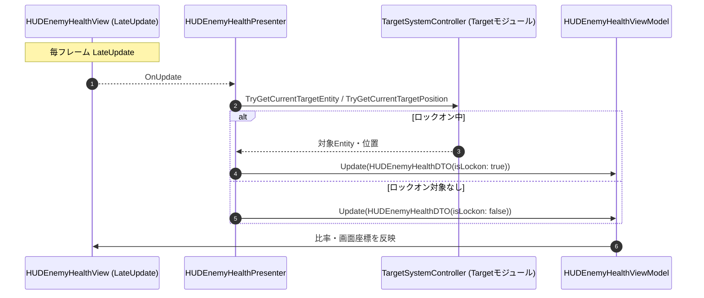

# 概要
> 💡 **モジュール概要**
> インゲームのHUD（プレイヤー体力バー、敵体力バー、ロックオン中の敵体力表示、スキル入力進捗インジケータ）を司るモジュールです。ドメイン・アプリケーション層は持たず、他モジュール（Character&Battle、Target、Skill）のイベント・状態を表示に変換するだけの終端モジュールです。

| 項目 | 内容 |
| --- | --- |
| **モジュール名** | UI / HUD |
| **カテゴリ** | InGame |
| **ステータス** | 実装済み（既知の課題を参照） |
| **最終更新日** | 2026-07-15 |

---

## 🏗️ クラス

| クラス名 | レイヤー | 役割・機能 |
| --- | --- | --- |
| **`HealthHudDTO`** | Adaptor | HPバー更新用データ（現在HP/最大HP）を保持するreadonly struct。プレイヤー・敵で共用 |
| **`IHealthHudViewModel`** | Adaptor | HPバー表示バインド用インターフェース |
| **`IHealthHudPresenter`** | Adaptor | HPバー用Presenterの共通契約（`IDisposable`） |
| **`HUDEnemyHealthDTO`** | Adaptor | ロックオン中の敵体力ウィジェット用データ（ref struct。体力・ロックオン中か・画面上の対象位置） |
| **`HUDEnemyHealthPresenter`** | Adaptor | 毎フレーム`TargetSystemController`をポーリングし、ロックオン中の敵体力を`HUDEnemyHealthDTO`へ変換する（イベント駆動ではない） |
| **`IHUDEnemyHealthViewModel`** | Adaptor | ロックオン中敵体力表示のViewModelインターフェース |
| **`IIngameHudViewModel` / `IngameHudDTO`** | Adaptor | ※死んだコード（既知の課題を参照） |
| **`HealthHudView`** | View | 二層構造（即時反映＋追いつき演出）のHPバーとテキスト表示 |
| **`HealthHudViewModel`** | View | `IHealthHudViewModel`実装 |
| **`HUDEnemyHealthView`** | View | ロックオン中の敵体力を画面空間に表示するウィジェット |
| **`HUDEnemyHealthViewModel`** | View | `HUDEnemyHealthDTO`をリアクティブな比率・画面座標へ変換 |
| **`IngameHudView` / `IngameHudViewModel`** | View | ※死んだコード（既知の課題を参照） |
| **`InGameHudInitializer`** | Composition | プレイヤーHPバーの構築窓口（`InGameInitializationModuleBase`を継承しない、Awake時に自己登録するプレーンMonoBehaviour） |
| **`HUDEnemyHealthInitializer`** | Composition | ロックオン敵体力ウィジェットの構築 |
| **`SkillInputProgressUIInitializer`** | Composition | スキル入力進捗行の生成窓口（実体はSkillモジュールのプレハブ・データを扱う。namespace上も`Composition.InGame.Skill`でありフォルダとの不一致がある） |

> `PlayerHealthHudPresenter`（Player/Adaptorモジュール）・`EnemyHealthHudPresenter`（Enemy/Adaptorモジュール）は本モジュールのクラスではなく、それぞれPlayer/Enemyモジュールが本モジュールの`HealthHudDTO`/`IHealthHudViewModel`契約を利用して実装しています。

### 🧩 Composition初期化情報

| 項目 | 内容 |
| --- | --- |
| **Initializerクラス** | `HUDEnemyHealthInitializer`（ライフサイクル管理下）／`InGameHudInitializer`・`SkillInputProgressUIInitializer`（Unityの`Awake()`のみに依存、`InGameInitializationModuleBase`を継承しない） |
| **Order** | `HUDEnemyHealthInitializer` = 650（`TargetSystemInitializationModule`(100)より後） |
| **公開する ModuleContainer / ServiceLocator登録型** | 専用の`ModuleContainer`は無し。`InGameHudInitializer`・`SkillInputProgressUIInitializer`はそれぞれ自分自身の型をServiceLocatorへ直接登録する |

---

## 🔗 モジュール結合

### 📥 依存しているもの

* **`Character & Battle`**
  * *依存箇所*: `CharacterEntity.OnHealthChanged`（`IDefender`）
  * *詳細*: `PlayerHealthHudPresenter`/`EnemyHealthHudPresenter`（それぞれPlayer/Enemyモジュール側に実装）がこのイベントを購読し、本モジュールの`HealthHudDTO`/`IHealthHudViewModel`へ変換します。
* **`Target`**
  * *依存箇所*: `TargetSystemController.TryGetCurrentTargetEntity`/`TryGetCurrentTargetPosition`
  * *詳細*: `HUDEnemyHealthPresenter`が毎フレームポーリングし、現在ロックオン中の敵の体力・位置を取得します（ロックオン変更イベントは無く、ポーリング方式）。
* **`Skill`**
  * *依存箇所*: `SkillDefinition`, `BeatType`, `SkillBeatVisualSetting`
  * *詳細*: `SkillInputProgressUIInitializer.CreateInputProgressRow`が進捗行の見た目（ステップ数等）を生成するために参照します。実際の入力判定ロジック（`SkillRhythmState`/`SkillCheckService`）はSkillモジュール側が保持します。

### 📤 依存されているもの

* なし
  * *詳細*: 本モジュールは表示の終端であり、`*ModuleContainer`も公開していないため、他モジュールから参照されることはありません。Player/Enemy/Skillの各モジュールが本モジュールの公開クラス・メソッドを一方的に呼び出す構造です。

---

# 詳細

## 🧅レイヤー情報

### ① Domain
当モジュールでは使用していません。
### ② Application
当モジュールでは使用していません。
### ③ Adaptor
`HealthHudDTO`/`IHealthHudViewModel`/`IHealthHudPresenter`というHPバー共通契約と、ロックオン敵体力用の`HUDEnemyHealthPresenter`/`HUDEnemyHealthDTO`を定義します。
### ④ View
二層アニメーション付きのHPバー（`HealthHudView`）、ロックオン敵体力ウィジェット（`HUDEnemyHealthView`）を担当します。
### ⑤ Infrastructure
当モジュールでは使用していません。
### ⑥ Composition
`HUDEnemyHealthInitializer`（Order 650）のみが正式な初期化ライフサイクルに参加し、`InGameHudInitializer`/`SkillInputProgressUIInitializer`はUnityの`Awake()`タイミングのみに依存する素朴な自己登録で動作します。

## 🔌 拡張ポイント

> 現状、ポリモーフィックな拡張ポイント（`SubclassSelector`等）はありません。新しいHUD要素を追加する場合は、対応するDTO/ViewModel/Viewの3点セットを既存パターンに倣って新規作成する形になります。

## 🔄処理フロー

主要な処理フローごとに分けて記述します。

### ① プレイヤーHPバー更新フロー（被ダメージ時）

### ② ロックオン敵体力表示フロー（毎フレーム）

